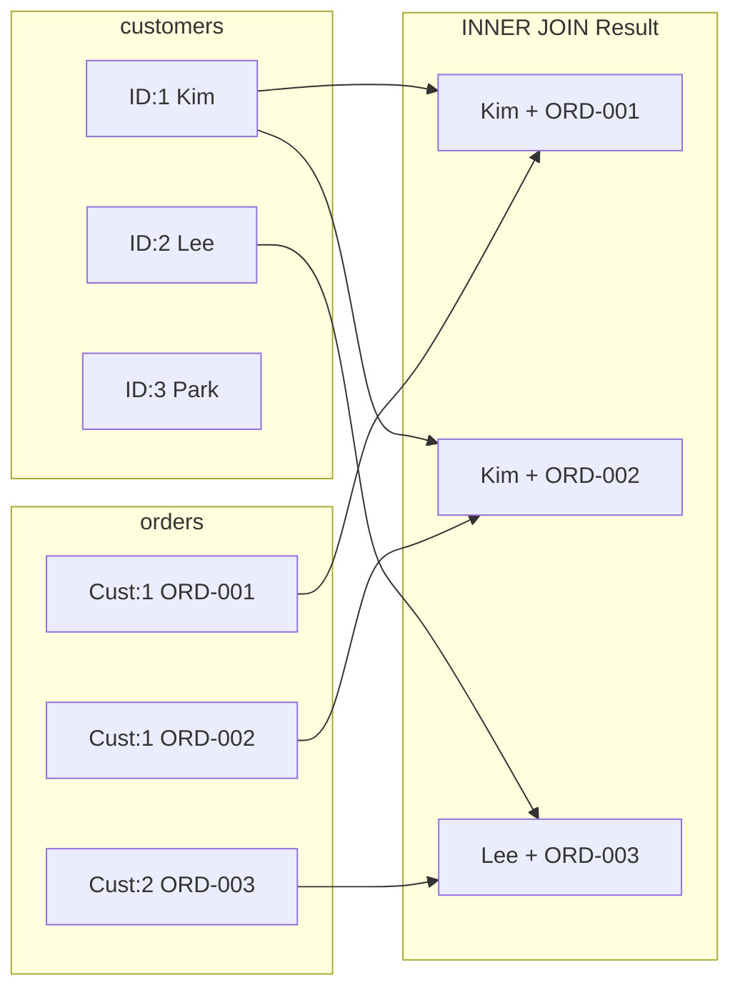

# 7강: INNER JOIN

`JOIN`은 관련 칼럼을 기준으로 두 개 이상의 테이블 행을 합칩니다. `INNER JOIN`은 **양쪽** 테이블에서 모두 일치하는 행만 반환합니다 — 일치하지 않는 행은 결과에서 제외됩니다.



> INNER JOIN은 양쪽 테이블에 모두 매칭되는 행만 반환합니다. Park(ID:3)은 주문이 없어 결과에서 제외됩니다.

{ .off-glb width="300"  }

## 두 테이블 조인하기

문법은 `FROM table_a INNER JOIN table_b ON table_a.key = table_b.key`입니다. `ON` 절에서 일치 조건을 지정합니다.

```sql
-- 고객 이름과 함께 주문 조회
SELECT
    o.order_number,
    c.name        AS customer_name,
    o.status,
    o.total_amount
FROM orders AS o
INNER JOIN customers AS c ON o.customer_id = c.id
ORDER BY o.ordered_at DESC
LIMIT 5;
```

**결과:**

| order_number       | customer_name | status    | total_amount |
| ------------------ | ------------- | --------- | -----------: |
| ORD-20250630-34900 | 김병철           | pending   |      1483000 |
| ORD-20250630-34905 | 홍준서           | pending   |       152600 |
| ORD-20250630-34903 | 심미경           | cancelled |       401800 |
| ORD-20250630-34899 | 이현정           | pending   |       167500 |
| ORD-20250630-34896 | 오현우           | pending   |      1646400 |

> **테이블 별칭(alias)** (`o`, `c`)을 사용하면 쿼리가 짧아지고 `ON` 조건을 읽기 쉬워집니다. 필수는 아니지만 여러 테이블을 조인할 때 강력히 권장합니다.

## INNER JOIN이 불일치 행을 제외하는 이유

주문을 한 번도 하지 않은 고객은 결과에 나타나지 않습니다 — `orders`에 일치하는 행이 없기 때문입니다. 반대로 외래 키 제약 덕분에 주문은 반드시 고객이 있어야 하므로, 모든 주문은 고객과 매칭됩니다.

```sql
-- 확인: 고객 없는 주문이 있는지 검사
SELECT COUNT(*) AS orders_without_customer
FROM orders o
LEFT JOIN customers c ON o.customer_id = c.id
WHERE c.id IS NULL;
```

## 세 개 이상의 테이블 조인

`JOIN` 절을 추가로 연결합니다. 각 절은 이미 결합된 테이블과 연결됩니다.

```sql
-- 주문 항목에 상품명과 카테고리명 포함
SELECT
    oi.id           AS item_id,
    o.order_number,
    p.name          AS product_name,
    cat.name        AS category,
    oi.quantity,
    oi.unit_price
FROM order_items AS oi
INNER JOIN orders     AS o   ON oi.order_id   = o.id
INNER JOIN products   AS p   ON oi.product_id = p.id
INNER JOIN categories AS cat ON p.category_id = cat.id
ORDER BY o.ordered_at DESC
LIMIT 6;
```

**결과:**

| item_id | order_number       | product_name                                     | category | quantity | unit_price |
| ------: | ------------------ | ------------------------------------------------ | -------- | -------: | ---------: |
|   84249 | ORD-20250630-34900 | AMD Ryzen 9 9900X                                | AMD      |        1 |     244800 |
|   84250 | ORD-20250630-34900 | 기가바이트 X870 AORUS ELITE AX 실버                     | AMD 소켓   |        1 |     429700 |
|   84251 | ORD-20250630-34900 | TeamGroup T-Force Delta RGB DDR5 32GB 6000MHz 실버 | DDR5     |        1 |     178800 |
|   84252 | ORD-20250630-34900 | SK하이닉스 Platinum P41 1TB                          | SSD      |        1 |     217400 |
| ...     | ...                | ...                                              | ...      | ...      | ...        |

## 조인 후 집계

조인을 먼저 한 다음 집계합니다. 조인된 테이블에서 그룹화에 필요한 칼럼을 활용할 수 있습니다.

```sql
-- 상품 카테고리별 총 매출
SELECT
    cat.name        AS category,
    COUNT(DISTINCT o.id) AS order_count,
    SUM(oi.quantity)     AS units_sold,
    SUM(oi.quantity * oi.unit_price) AS gross_revenue
FROM order_items AS oi
INNER JOIN orders     AS o   ON oi.order_id   = o.id
INNER JOIN products   AS p   ON oi.product_id = p.id
INNER JOIN categories AS cat ON p.category_id = cat.id
WHERE o.status IN ('delivered', 'confirmed')
GROUP BY cat.name
ORDER BY gross_revenue DESC
LIMIT 8;
```

**결과:**

| category | order_count | units_sold | gross_revenue |
| -------- | ----------: | ---------: | ------------: |
| 게이밍 노트북  |        1526 |       1578 |    5079102000 |
| 게이밍 모니터  |        1986 |       2129 |    2774777100 |
| AMD      |        2976 |       3443 |    2588771300 |
| ...      | ...         | ...        | ...           |

## 조인된 테이블에 필터 적용

조인에 참여한 어떤 테이블에든 `WHERE` 조건을 적용할 수 있습니다.

```sql
-- 2024년 VIP 고객의 100만원 초과 주문
SELECT
    c.name          AS customer_name,
    o.order_number,
    o.total_amount,
    o.ordered_at
FROM orders AS o
INNER JOIN customers AS c ON o.customer_id = c.id
WHERE c.grade = 'VIP'
  AND o.total_amount > 1000
  AND o.ordered_at LIKE '2024%'
ORDER BY o.total_amount DESC;
```

!!! note "레슨 복습 문제"
    이 레슨에서 배운 개념을 바로 확인하는 간단한 문제입니다. 여러 개념을 종합하는 실전 연습은 [연습 문제](../exercises/index.md) 섹션을 참고하세요.

## 연습 문제

### 연습 1
리뷰마다 고객의 `name`과 상품의 `name`을 함께 조회하세요. `review_id`, `customer_name`, `product_name`, `rating`, `created_at`을 반환하고, `rating` 내림차순, `created_at` 내림차순으로 정렬한 뒤 10행으로 제한하세요.

??? success "정답"
    ```sql
    SELECT
        r.id          AS review_id,
        c.name        AS customer_name,
        p.name        AS product_name,
        r.rating,
        r.created_at
    FROM reviews AS r
    INNER JOIN customers AS c ON r.customer_id = c.id
    INNER JOIN products  AS p ON r.product_id  = p.id
    ORDER BY r.rating DESC, r.created_at DESC
    LIMIT 10;
    ```

### 연습 2
결제 수단별로 해당 수단을 사용한 고유 고객 수를 구하세요. `method`와 `unique_customers`를 반환하고, `unique_customers` 내림차순으로 정렬하세요.

??? success "정답"
    ```sql
    SELECT
        p.method,
        COUNT(DISTINCT o.customer_id) AS unique_customers
    FROM payments AS p
    INNER JOIN orders AS o ON p.order_id = o.id
    WHERE p.status = 'completed'
    GROUP BY p.method
    ORDER BY unique_customers DESC;
    ```

### 연습 3
총 구매액(취소·반품 제외 주문의 `total_amount` 합계) 기준 상위 5명의 고객을 구하세요. `customer_name`, `grade`, `order_count`, `total_spent`를 반환하세요.

??? success "정답"
    ```sql
    SELECT
        c.name   AS customer_name,
        c.grade,
        COUNT(o.id)         AS order_count,
        SUM(o.total_amount) AS total_spent
    FROM orders AS o
    INNER JOIN customers AS c ON o.customer_id = c.id
    WHERE o.status NOT IN ('cancelled', 'returned', 'return_requested')
    GROUP BY c.id, c.name, c.grade
    ORDER BY total_spent DESC
    LIMIT 5;
    ```

### 연습 4
주문번호(`order_number`), 고객명(`customer_name`), 주문 상태(`status`)를 조회하되, 주문 상태가 `'shipped'`인 것만 필터링하세요. 주문일(`ordered_at`) 내림차순으로 정렬하고 10행으로 제한하세요.

??? success "정답"
    ```sql
    SELECT
        o.order_number,
        c.name   AS customer_name,
        o.status
    FROM orders AS o
    INNER JOIN customers AS c ON o.customer_id = c.id
    WHERE o.status = 'shipped'
    ORDER BY o.ordered_at DESC
    LIMIT 10;
    ```

### 연습 5
배송(`shipping`) 테이블과 주문(`orders`) 테이블을 조인하여, 배송 완료(`delivered`)된 주문의 `order_number`, `carrier`, `tracking_number`, `delivered_at`을 조회하세요. `delivered_at` 내림차순으로 정렬하고 10행으로 제한하세요.

??? success "정답"
    ```sql
    SELECT
        o.order_number,
        s.carrier,
        s.tracking_number,
        s.delivered_at
    FROM shipping AS s
    INNER JOIN orders AS o ON s.order_id = o.id
    WHERE s.status = 'delivered'
    ORDER BY s.delivered_at DESC
    LIMIT 10;
    ```

### 연습 6
주문 항목(`order_items`)에서 상품명(`products.name`), 공급업체명(`suppliers.company_name`), 수량(`quantity`), 단가(`unit_price`)를 조회하세요. 3개 테이블을 조인하고, 단가 내림차순으로 정렬하여 10행으로 제한하세요.

??? success "정답"
    ```sql
    SELECT
        p.name          AS product_name,
        sup.company_name AS supplier_name,
        oi.quantity,
        oi.unit_price
    FROM order_items AS oi
    INNER JOIN products  AS p   ON oi.product_id  = p.id
    INNER JOIN suppliers AS sup ON p.supplier_id   = sup.id
    ORDER BY oi.unit_price DESC
    LIMIT 10;
    ```

### 연습 7
공급업체별로 해당 업체의 상품이 포함된 총 주문 건수(`order_count`)와 총 판매 수량(`total_qty`)을 구하세요. `company_name`, `order_count`, `total_qty`를 반환하고, `total_qty` 내림차순으로 정렬하세요.

??? success "정답"
    ```sql
    SELECT
        sup.company_name,
        COUNT(DISTINCT oi.order_id) AS order_count,
        SUM(oi.quantity)            AS total_qty
    FROM order_items AS oi
    INNER JOIN products  AS p   ON oi.product_id = p.id
    INNER JOIN suppliers AS sup ON p.supplier_id  = sup.id
    GROUP BY sup.id, sup.company_name
    ORDER BY total_qty DESC;
    ```

### 연습 8
담당 직원(`staff`)별로 처리한 주문 수(`order_count`)와 총 매출(`total_revenue`)을 구하세요. 취소·반품 주문은 제외하고, `staff_name`, `department`, `order_count`, `total_revenue`를 반환하세요. `total_revenue` 내림차순으로 정렬하고 상위 10명만 반환하세요.

??? success "정답"
    ```sql
    SELECT
        st.name        AS staff_name,
        st.department,
        COUNT(o.id)         AS order_count,
        SUM(o.total_amount) AS total_revenue
    FROM orders AS o
    INNER JOIN staff AS st ON o.staff_id = st.id
    WHERE o.status NOT IN ('cancelled', 'returned', 'return_requested')
    GROUP BY st.id, st.name, st.department
    ORDER BY total_revenue DESC
    LIMIT 10;
    ```

---
다음: [8강: LEFT JOIN](08-left-join.md)
