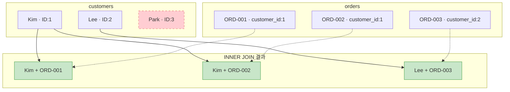
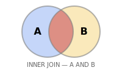

# 8강: INNER JOIN

지금까지는 한 테이블에서만 데이터를 조회했습니다. 하지만 실무에서는 '주문한 고객의 이름'처럼 여러 테이블의 데이터를 합쳐야 합니다. INNER JOIN으로 테이블을 연결하는 방법을 배웁니다.

!!! note "이미 알고 계신다면"
    INNER JOIN, ON 조건, 다중 JOIN에 익숙하다면 [9강: LEFT JOIN](09-left-join.md)으로 건너뛰세요.

`JOIN`은 관련 칼럼을 기준으로 두 개 이상의 테이블 행을 합칩니다. `INNER JOIN`은 **양쪽** 테이블에서 모두 일치하는 행만 반환합니다 — 일치하지 않는 행은 결과에서 제외됩니다.



> **INNER JOIN**은 양쪽 테이블에 모두 매칭되는 행만 반환합니다. Park(ID:3)은 주문이 없어 결과에서 제외됩니다.

{ .off-glb width="300"  }

## 두 테이블 조인하기

문법은 `FROM table_a INNER JOIN table_b ON table_a.key = table_b.key`입니다. `ON` 절에서 일치 조건을 지정합니다.

```sql
-- 고객 이름과 함께 주문 조회
SELECT
    o.order_number,
    c.name        AS customer_name,
    o.status,
    o.total_amount
FROM orders AS o
INNER JOIN customers AS c ON o.customer_id = c.id
ORDER BY o.ordered_at DESC
LIMIT 5;
```

**결과:**

| order_number | customer_name | status | total_amount |
| ---------- | ---------- | ---------- | ----------: |
| ORD-20251211-413965 | 송광수 | pending | 409600.0 |
| ORD-20251226-416837 | 송광수 | pending | 1169700.0 |
| ORD-20251231-417734 | 류미숙 | pending | 2076300.0 |
| ORD-20251231-417696 | 김영미 | return_requested | 814400.0 |
| ORD-20251231-417737 | 이영미 | pending | 550600.0 |
| ... | ... | ... | ... |

> **테이블 별칭(alias)** (`o`, `c`)을 사용하면 쿼리가 짧아지고 `ON` 조건을 읽기 쉬워집니다. 필수는 아니지만 여러 테이블을 조인할 때 강력히 권장합니다.

## INNER JOIN이 불일치 행을 제외하는 이유

주문을 한 번도 하지 않은 고객은 결과에 나타나지 않습니다 — `orders`에 일치하는 행이 없기 때문입니다. 반대로 외래 키 제약 덕분에 주문은 반드시 고객이 있어야 하므로, 모든 주문은 고객과 매칭됩니다.

```sql
-- 확인: 고객 없는 주문이 있는지 검사
SELECT COUNT(*) AS orders_without_customer
FROM orders o
LEFT JOIN customers c ON o.customer_id = c.id
WHERE c.id IS NULL;
```

## 세 개 이상의 테이블 조인

`JOIN` 절을 추가로 연결합니다. 각 절은 이미 결합된 테이블과 연결됩니다.

```sql
-- 주문 항목에 상품명과 카테고리명 포함
SELECT
    oi.id           AS item_id,
    o.order_number,
    p.name          AS product_name,
    cat.name        AS category,
    oi.quantity,
    oi.unit_price
FROM order_items AS oi
INNER JOIN orders     AS o   ON oi.order_id   = o.id
INNER JOIN products   AS p   ON oi.product_id = p.id
INNER JOIN categories AS cat ON p.category_id = cat.id
ORDER BY o.ordered_at DESC
LIMIT 6;
```

**결과:**

| item_id | order_number | product_name | category | quantity | unit_price |
| ----------: | ---------- | ---------- | ---------- | ----------: | ----------: |
| 1005850 | ORD-20251211-413965 | Windows 11 Pro | OS | 1 | 409600.0 |
| 1012839 | ORD-20251226-416837 | MSI Radeon RX 7800 XT GAMING X 실버 | AMD | 1 | 994000.0 |
| 1012840 | ORD-20251226-416837 | Razer Huntsman V3 Pro Mini 화이트 | 기계식 | 1 | 175700.0 |
| 1015035 | ORD-20251231-417734 | NZXT Kraken 240 실버 | 수랭 | 1 | 169800.0 |
| 1015036 | ORD-20251231-417734 | BenQ PD2725U | 전문가용 모니터 | 1 | 1596100.0 |
| 1015037 | ORD-20251231-417734 | Razer Huntsman V3 Pro 실버 | 기계식 | 1 | 251300.0 |
| ... | ... | ... | ... | ... | ... |

## 조인 후 집계

조인을 먼저 한 다음 집계합니다. 조인된 테이블에서 그룹화에 필요한 칼럼을 활용할 수 있습니다.

```sql
-- 상품 카테고리별 총 매출
SELECT
    cat.name        AS category,
    COUNT(DISTINCT o.id) AS order_count,
    SUM(oi.quantity)     AS units_sold,
    SUM(oi.quantity * oi.unit_price) AS gross_revenue
FROM order_items AS oi
INNER JOIN orders     AS o   ON oi.order_id   = o.id
INNER JOIN products   AS p   ON oi.product_id = p.id
INNER JOIN categories AS cat ON p.category_id = cat.id
WHERE o.status IN ('delivered', 'confirmed')
GROUP BY cat.name
ORDER BY gross_revenue DESC
LIMIT 8;
```

**결과:**

| category | order_count | units_sold | gross_revenue |
| ---------- | ----------: | ----------: | ----------: |
| 게이밍 노트북 | 17165 | 17775 | 50574480000.0 |
| NVIDIA | 16987 | 17503 | 38502234300.0 |
| AMD | 36412 | 42099 | 33886162000.0 |
| 일반 노트북 | 17571 | 18400 | 30788049100.0 |
| 게이밍 모니터 | 19005 | 19862 | 23766598100.0 |
| 스피커/헤드셋 | 57394 | 64568 | 15688151400.0 |
| Intel 소켓 | 33557 | 37092 | 14834738600.0 |
| 2in1 | 8739 | 9176 | 14628870400.0 |
| ... | ... | ... | ... |

## 조인된 테이블에 필터 적용

조인에 참여한 어떤 테이블에든 `WHERE` 조건을 적용할 수 있습니다.

```sql
-- 2024년 VIP 고객의 100만원 초과 주문
SELECT
    c.name          AS customer_name,
    o.order_number,
    o.total_amount,
    o.ordered_at
FROM orders AS o
INNER JOIN customers AS c ON o.customer_id = c.id
WHERE c.grade = 'VIP'
  AND o.total_amount > 1000
  AND o.ordered_at LIKE '2024%'
ORDER BY o.total_amount DESC;
```

## 정리

| 개념 | 설명 | 예시 |
|------|------|------

<!-- BEGIN_LESSON_EXERCISES -->

!!! note "레슨 복습 문제"
    이 레슨에서 배운 개념을 바로 확인하는 간단한 문제입니다. 여러 개념을 종합하는 실전 연습은 [연습 문제](../exercises/index.md) 섹션을 참고하세요.

### 문제 1
리뷰마다 고객의 `name`과 상품의 `name`을 함께 조회하세요. `review_id`, `customer_name`, `product_name`, `rating`, `created_at`을 반환하고, `rating` 내림차순, `created_at` 내림차순으로 정렬한 뒤 10행으로 제한하세요.

??? success "정답"
    ```sql
    SELECT
    r.id          AS review_id,
    c.name        AS customer_name,
    p.name        AS product_name,
    r.rating,
    r.created_at
    FROM reviews AS r
    INNER JOIN customers AS c ON r.customer_id = c.id
    INNER JOIN products  AS p ON r.product_id  = p.id
    ORDER BY r.rating DESC, r.created_at DESC
    LIMIT 10;
    ```


    **실행 결과** (총 10행 중 상위 7행)

    | review_id | customer_name | product_name | rating | created_at |
    |---|---|---|---|---|
    | 8535 | 홍서윤 | Norton AntiVirus Plus 실버 | 5 | 2026-01-13 12:09:18 |
    | 8530 | 김우진 | 넷기어 GS308 실버 | 5 | 2026-01-11 21:02:15 |
    | 8541 | 박경수 | Arctic Liquid Freezer III Pro 420 A-R... | 5 | 2026-01-07 20:55:20 |
    | 8517 | 김미정 | ASUS Dual RTX 5070 Ti 실버 | 5 | 2026-01-07 09:24:04 |
    | 8536 | 김은지 | be quiet! Dark Power 13 1000W | 5 | 2026-01-06 21:29:23 |
    | 8502 | 우재호 | TP-Link TL-SG108 | 5 | 2026-01-06 15:27:04 |
    | 8527 | 김명숙 | Microsoft Ergonomic Keyboard 실버 | 5 | 2026-01-04 18:00:26 |

### 문제 2
결제 수단별로 해당 수단을 사용한 고유 고객 수를 구하세요. `method`와 `unique_customers`를 반환하고, `unique_customers` 내림차순으로 정렬하세요.

??? success "정답"
    ```sql
    SELECT
    p.method,
    COUNT(DISTINCT o.customer_id) AS unique_customers
    FROM payments AS p
    INNER JOIN orders AS o ON p.order_id = o.id
    WHERE p.status = 'completed'
    GROUP BY p.method
    ORDER BY unique_customers DESC;
    ```


    **실행 결과** (6행)

    | method | unique_customers |
    |---|---|
    | card | 2316 |
    | kakao_pay | 1777 |
    | naver_pay | 1598 |
    | bank_transfer | 1332 |
    | virtual_account | 923 |
    | point | 892 |

### 문제 3
총 구매액(취소·반품 제외 주문의 `total_amount` 합계) 기준 상위 5명의 고객을 구하세요. `customer_name`, `grade`, `order_count`, `total_spent`를 반환하세요.

??? success "정답"
    ```sql
    SELECT
    c.name   AS customer_name,
    c.grade,
    COUNT(o.id)         AS order_count,
    SUM(o.total_amount) AS total_spent
    FROM orders AS o
    INNER JOIN customers AS c ON o.customer_id = c.id
    WHERE o.status NOT IN ('cancelled', 'returned', 'return_requested')
    GROUP BY c.id, c.name, c.grade
    ORDER BY total_spent DESC
    LIMIT 5;
    ```


    **실행 결과** (5행)

    | customer_name | grade | order_count | total_spent |
    |---|---|---|---|
    | 박정수 | VIP | 303 | 403,448,758.00 |
    | 김병철 | VIP | 342 | 366,385,931.00 |
    | 강명자 | VIP | 249 | 253,180,338.00 |
    | 정유진 | VIP | 223 | 244,604,910.00 |
    | 이미정 | VIP | 219 | 235,775,349.00 |

### 문제 4
주문번호(`order_number`), 고객명(`customer_name`), 주문 상태(`status`)를 조회하되, 주문 상태가 `'shipped'`인 것만 필터링하세요. 주문일(`ordered_at`) 내림차순으로 정렬하고 10행으로 제한하세요.

??? success "정답"
    ```sql
    SELECT
    o.order_number,
    c.name   AS customer_name,
    o.status
    FROM orders AS o
    INNER JOIN customers AS c ON o.customer_id = c.id
    WHERE o.status = 'shipped'
    ORDER BY o.ordered_at DESC
    LIMIT 10;
    ```


    **실행 결과** (총 10행 중 상위 7행)

    | order_number | customer_name | status |
    |---|---|---|
    | ORD-20251225-37416 | 민지현 | shipped |
    | ORD-20251225-37402 | 이옥순 | shipped |
    | ORD-20251225-37410 | 이영환 | shipped |
    | ORD-20251225-37403 | 배정남 | shipped |
    | ORD-20251225-37411 | 최지훈 | shipped |
    | ORD-20251225-37408 | 백영호 | shipped |
    | ORD-20251225-37406 | 양은주 | shipped |

### 문제 5
배송(`shipping`) 테이블과 주문(`orders`) 테이블을 조인하여, 배송 완료(`delivered`)된 주문의 `order_number`, `carrier`, `tracking_number`, `delivered_at`을 조회하세요. `delivered_at` 내림차순으로 정렬하고 10행으로 제한하세요.

??? success "정답"
    ```sql
    SELECT
    o.order_number,
    s.carrier,
    s.tracking_number,
    s.delivered_at
    FROM shipping AS s
    INNER JOIN orders AS o ON s.order_id = o.id
    WHERE s.status = 'delivered'
    ORDER BY s.delivered_at DESC
    LIMIT 10;
    ```


    **실행 결과** (총 10행 중 상위 7행)

    | order_number | carrier | tracking_number | delivered_at |
    |---|---|---|---|
    | ORD-20251225-37399 | 한진택배 | 376080377423 | 2026-01-01 23:36:22 |
    | ORD-20251225-37404 | 한진택배 | 652516112449 | 2026-01-01 22:02:51 |
    | ORD-20251225-37414 | CJ대한통운 | 100421839710 | 2026-01-01 13:49:43 |
    | ORD-20251225-37413 | 우체국택배 | 543173530520 | 2025-12-31 14:25:31 |
    | ORD-20251225-37412 | 우체국택배 | 456720771228 | 2025-12-30 22:50:46 |
    | ORD-20251224-37387 | 우체국택배 | 339128234015 | 2025-12-30 19:29:43 |
    | ORD-20251225-37401 | CJ대한통운 | 187550547718 | 2025-12-30 12:03:50 |

### 문제 6
주문 항목(`order_items`)에서 상품명(`products.name`), 공급업체명(`suppliers.company_name`), 수량(`quantity`), 단가(`unit_price`)를 조회하세요. 3개 테이블을 조인하고, 단가 내림차순으로 정렬하여 10행으로 제한하세요.

??? success "정답"
    ```sql
    SELECT
    p.name          AS product_name,
    sup.company_name AS supplier_name,
    oi.quantity,
    oi.unit_price
    FROM order_items AS oi
    INNER JOIN products  AS p   ON oi.product_id  = p.id
    INNER JOIN suppliers AS sup ON p.supplier_id   = sup.id
    ORDER BY oi.unit_price DESC
    LIMIT 10;
    ```


    **실행 결과** (총 10행 중 상위 7행)

    | product_name | supplier_name | quantity | unit_price |
    |---|---|---|---|
    | MacBook Air 15 M3 실버 | 애플코리아 | 1 | 5,481,100.00 |
    | MacBook Air 15 M3 실버 | 애플코리아 | 1 | 5,481,100.00 |
    | MacBook Air 15 M3 실버 | 애플코리아 | 1 | 5,481,100.00 |
    | MacBook Air 15 M3 실버 | 애플코리아 | 1 | 5,481,100.00 |
    | MacBook Air 15 M3 실버 | 애플코리아 | 1 | 5,481,100.00 |
    | MacBook Air 15 M3 실버 | 애플코리아 | 1 | 5,481,100.00 |
    | MacBook Air 15 M3 실버 | 애플코리아 | 1 | 5,481,100.00 |

### 문제 7
공급업체별로 해당 업체의 상품이 포함된 총 주문 건수(`order_count`)와 총 판매 수량(`total_qty`)을 구하세요. `company_name`, `order_count`, `total_qty`를 반환하고, `total_qty` 내림차순으로 정렬하세요.

??? success "정답"
    ```sql
    SELECT
    sup.company_name,
    COUNT(DISTINCT oi.order_id) AS order_count,
    SUM(oi.quantity)            AS total_qty
    FROM order_items AS oi
    INNER JOIN products  AS p   ON oi.product_id = p.id
    INNER JOIN suppliers AS sup ON p.supplier_id  = sup.id
    GROUP BY sup.id, sup.company_name
    ORDER BY total_qty DESC;
    ```


    **실행 결과** (총 45행 중 상위 7행)

    | company_name | order_count | total_qty |
    |---|---|---|
    | 로지텍코리아 | 7106 | 8580 |
    | 삼성전자 공식 유통 | 7169 | 8557 |
    | 서린시스테크 | 5143 | 6547 |
    | 스틸시리즈코리아 | 5014 | 5772 |
    | 에이수스코리아 | 4945 | 5696 |
    | 비콰이어트코리아 | 3516 | 4325 |
    | MSI코리아 | 3531 | 4055 |

### 문제 8
담당 직원(`staff`)별로 처리한 주문 수(`order_count`)와 총 매출(`total_revenue`)을 구하세요. 취소·반품 주문은 제외하고, `staff_name`, `department`, `order_count`, `total_revenue`를 반환하세요. `total_revenue` 내림차순으로 정렬하고 상위 10명만 반환하세요.

??? success "정답"
    ```sql
    SELECT
    st.name        AS staff_name,
    st.department,
    COUNT(o.id)         AS order_count,
    SUM(o.total_amount) AS total_revenue
    FROM orders AS o
    INNER JOIN staff AS st ON o.staff_id = st.id
    WHERE o.status NOT IN ('cancelled', 'returned', 'return_requested')
    GROUP BY st.id, st.name, st.department
    ORDER BY total_revenue DESC
    LIMIT 10;
    ```

### 문제 9
리뷰(`reviews`)를 작성한 고객의 이름(`customers.name`)과 리뷰 대상 상품명(`products.name`), 평점(`rating`), 리뷰 작성일(`reviews.created_at`)을 조회하세요. 평점이 5인 리뷰만 대상으로 하고, `reviews.created_at` 내림차순으로 정렬하여 10행으로 제한하세요.

??? success "정답"
    ```sql
    SELECT
    c.name        AS customer_name,
    p.name        AS product_name,
    r.rating,
    r.created_at
    FROM reviews AS r
    INNER JOIN customers AS c ON r.customer_id = c.id
    INNER JOIN products  AS p ON r.product_id  = p.id
    WHERE r.rating = 5
    ORDER BY r.created_at DESC
    LIMIT 10;
    ```


    **실행 결과** (총 10행 중 상위 7행)

    | customer_name | product_name | rating | created_at |
    |---|---|---|---|
    | 홍서윤 | Norton AntiVirus Plus 실버 | 5 | 2026-01-13 12:09:18 |
    | 김우진 | 넷기어 GS308 실버 | 5 | 2026-01-11 21:02:15 |
    | 박경수 | Arctic Liquid Freezer III Pro 420 A-R... | 5 | 2026-01-07 20:55:20 |
    | 김미정 | ASUS Dual RTX 5070 Ti 실버 | 5 | 2026-01-07 09:24:04 |
    | 김은지 | be quiet! Dark Power 13 1000W | 5 | 2026-01-06 21:29:23 |
    | 우재호 | TP-Link TL-SG108 | 5 | 2026-01-06 15:27:04 |
    | 김명숙 | Microsoft Ergonomic Keyboard 실버 | 5 | 2026-01-04 18:00:26 |

### 문제 10
카테고리별로 해당 카테고리 상품의 총 주문 금액(`total_revenue`)과 주문 건수(`order_count`)를 구하세요. `categories.name`, `order_count`, `total_revenue`를 반환하고, 최상위 카테고리(`depth = 0`)만 대상으로 합니다. `total_revenue` 내림차순으로 정렬하세요.

??? success "정답"
    ```sql
    SELECT
    cat.name       AS category_name,
    COUNT(DISTINCT o.id) AS order_count,
    SUM(oi.quantity * oi.unit_price) AS total_revenue
    FROM order_items AS oi
    INNER JOIN orders     AS o   ON oi.order_id   = o.id
    INNER JOIN products   AS p   ON oi.product_id = p.id
    INNER JOIN categories AS cat ON p.category_id = cat.id
    WHERE cat.depth = 0
    ORDER BY total_revenue DESC;
    ```


    **실행 결과** (1행)

    | category_name | order_count | total_revenue |
    |---|---|---|
    | 케이스 | 13,903 | 4,541,847,600.00 |

<!-- END_LESSON_EXERCISES -->
