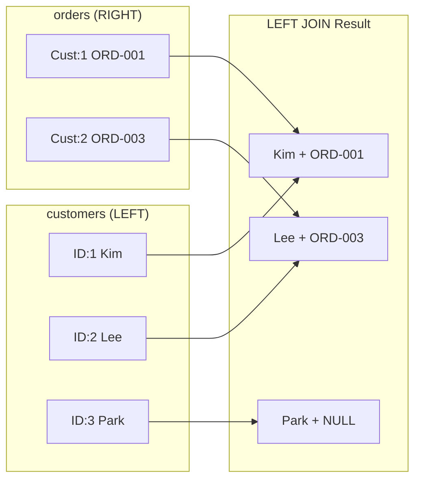
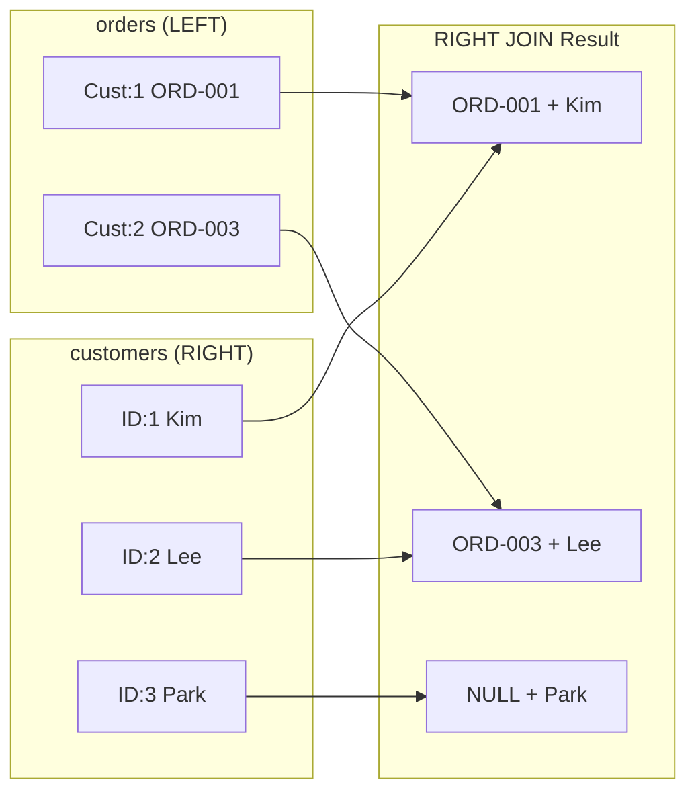
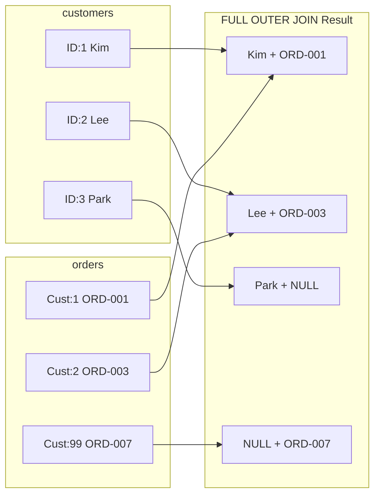

# 8강: LEFT JOIN

`LEFT JOIN`은 **왼쪽 테이블의 모든 행**을 반환하고, 오른쪽 테이블에서 일치하는 행이 있으면 함께 가져옵니다. 일치하는 행이 없으면 오른쪽 칼럼은 `NULL`로 채워집니다. 관련 레코드가 없는 행을 찾을 때 꼭 필요한 기법으로, 실무에서 매우 자주 쓰입니다.



> LEFT JOIN은 왼쪽 테이블의 모든 행을 유지합니다. 오른쪽에 매칭이 없으면 NULL로 채워집니다.

{ .off-glb width="300"  }

## 기본 LEFT JOIN

```sql
-- 리뷰 여부와 관계없이 모든 상품 조회
SELECT
    p.name          AS product_name,
    p.price,
    r.rating,
    r.created_at    AS reviewed_at
FROM products AS p
LEFT JOIN reviews AS r ON p.id = r.product_id
ORDER BY p.name
LIMIT 8;
```

**결과:**

| product_name | price | rating | reviewed_at |
|--------------|------:|--------|-------------|
| ASUS ProArt 32" 4K Monitor | 2199.00 | 5 | 2023-08-14 |
| ASUS ProArt 32" 4K Monitor | 2199.00 | 4 | 2024-01-22 |
| ASUS ROG Gaming Desktop | 1899.00 | 5 | 2022-11-03 |
| ASUS TUF Gaming Laptop | 1099.00 | (NULL) | (NULL) |
| Belkin USB-C Hub | 49.99 | (NULL) | (NULL) |
| ... | | | |

`ASUS TUF Gaming Laptop`과 `Belkin USB-C Hub`는 리뷰가 없으므로 `rating`과 `reviewed_at`이 `NULL`입니다.

## 불일치 행 찾기

{ .off-glb width="300"  }

안티 조인(Anti-join) 패턴: `LEFT JOIN` 후 `WHERE right_table.id IS NULL` 조건을 추가합니다. 오른쪽 테이블에 **대응 행이 없는** 왼쪽 테이블의 행을 찾는 방법입니다.

```sql
-- 한 번도 리뷰를 받지 않은 상품
SELECT
    p.id,
    p.name,
    p.price
FROM products AS p
LEFT JOIN reviews AS r ON p.id = r.product_id
WHERE r.id IS NULL
ORDER BY p.name;
```

**결과:**

| id | name | price |
|---:|------|------:|
| 47 | ASUS TUF Gaming Laptop | 1099.00 |
| 83 | Belkin USB-C Hub | 49.99 |
| 116 | Corsair K60 RGB Keyboard | 89.99 |
| ... | | |

```sql
-- 주문을 한 번도 하지 않은 고객
SELECT
    c.id,
    c.name,
    c.email,
    c.created_at
FROM customers AS c
LEFT JOIN orders AS o ON c.id = o.customer_id
WHERE o.id IS NULL
ORDER BY c.created_at DESC
LIMIT 10;
```

**결과:**

| id | name | email | created_at |
|---:|------|-------|------------|
| 5228 | 한소희 | h.sohi@testmail.kr | 2024-12-28 |
| 5221 | 오준혁 | o.junhyuk@testmail.kr | 2024-12-19 |
| ... | | | |

> 이 고객들은 최근에 가입해서 아직 구매하지 않았을 가능성이 높습니다.

## LEFT JOIN과 집계

일치한 행만 카운트하려면 `COUNT(*)` 대신 `COUNT(right_table.id)`를 사용하세요 — NULL은 카운트에 포함되지 않습니다.

```sql
-- 모든 상품의 리뷰 수와 평균 평점
SELECT
    p.name          AS product_name,
    p.price,
    COUNT(r.id)     AS review_count,
    ROUND(AVG(r.rating), 2) AS avg_rating
FROM products AS p
LEFT JOIN reviews AS r ON p.id = r.product_id
WHERE p.is_active = 1
GROUP BY p.id, p.name, p.price
ORDER BY review_count DESC
LIMIT 10;
```

**결과:**

| product_name | price | review_count | avg_rating |
|--------------|------:|-------------:|-----------:|
| Dell XPS 15 Laptop | 1299.99 | 87 | 4.21 |
| Logitech MX Master 3 | 99.99 | 74 | 4.56 |
| Samsung 27" Monitor | 449.99 | 68 | 4.03 |
| ... | | | |

```sql
-- 주문이 0건인 고객을 포함한 고객별 주문 통계
SELECT
    c.name,
    c.grade,
    COUNT(o.id)         AS order_count,
    COALESCE(SUM(o.total_amount), 0) AS lifetime_value
FROM customers AS c
LEFT JOIN orders AS o ON c.id = o.customer_id
    AND o.status NOT IN ('cancelled', 'returned')
GROUP BY c.id, c.name, c.grade
ORDER BY lifetime_value DESC
LIMIT 8;
```

> 추가 `AND` 조건을 `WHERE` 대신 `ON` 절에 넣은 것에 주목하세요. `WHERE`에 넣으면 주문이 없는 고객이 결과에서 제외됩니다.

**결과:**

| name | grade | order_count | lifetime_value |
|------|-------|------------:|---------------:|
| 김민수 | VIP | 48 | 64291.50 |
| 이지은 | VIP | 41 | 52884.20 |
| ... | | | |

## 여러 LEFT JOIN 연결

```sql
-- 배송 및 결제 정보를 선택적으로 포함한 주문 조회
SELECT
    o.order_number,
    o.status,
    o.total_amount,
    s.carrier,
    s.tracking_number,
    p.method         AS payment_method
FROM orders AS o
LEFT JOIN shipping AS s ON s.order_id = o.id
LEFT JOIN payments AS p ON p.order_id = o.id
WHERE o.ordered_at LIKE '2024-12%'
LIMIT 5;
```

## RIGHT JOIN

{ .off-glb width="300"  }

`RIGHT JOIN`은 LEFT JOIN의 반대입니다. **오른쪽 테이블의 모든 행**을 유지하고, 왼쪽 테이블에서 일치하는 행이 없으면 `NULL`로 채웁니다.



```sql
-- RIGHT JOIN: 주문이 없는 고객도 포함
SELECT
    c.name,
    c.email,
    o.order_number,
    o.total_amount
FROM orders AS o
RIGHT JOIN customers AS c ON c.id = o.customer_id
ORDER BY c.name
LIMIT 10;
```

실무에서는 RIGHT JOIN을 거의 쓰지 않습니다. 테이블 순서를 바꿔서 LEFT JOIN으로 작성하면 동일한 결과를 얻을 수 있기 때문입니다:

```sql
-- LEFT JOIN으로 동일한 결과
SELECT
    c.name,
    c.email,
    o.order_number,
    o.total_amount
FROM customers AS c
LEFT JOIN orders AS o ON c.id = o.customer_id
ORDER BY c.name
LIMIT 10;
```

> 두 쿼리는 같은 결과를 반환합니다. LEFT JOIN이 더 직관적이므로 대부분의 팀에서는 LEFT JOIN을 선호합니다.

## FULL OUTER JOIN

{ .off-glb width="300"  }

`FULL OUTER JOIN`은 **양쪽 테이블의 모든 행**을 유지합니다. 어느 쪽에서든 매칭이 안 되면 `NULL`로 채워집니다. 주문이 없는 고객과 고객 정보가 없는 주문을 동시에 확인할 때 유용합니다.



FULL OUTER JOIN의 지원 여부는 데이터베이스마다 다릅니다:

=== "SQLite"

    SQLite 3.39.0(2022-07-21) 이상에서는 `FULL OUTER JOIN`을 직접 지원합니다:

    ```sql
    -- SQLite 3.39+ : FULL OUTER JOIN 직접 사용
    SELECT
        c.name,
        c.email,
        o.order_number,
        o.total_amount
    FROM customers AS c
    FULL OUTER JOIN orders AS o ON c.id = o.customer_id
    ORDER BY c.name
    LIMIT 15;
    ```

    이전 버전과의 호환이 필요하다면 `LEFT JOIN` + `UNION ALL` 패턴으로 대체할 수 있습니다:

    ```sql
    -- SQLite 3.38 이하 호환: LEFT JOIN UNION ALL
    SELECT
        c.name,
        c.email,
        o.order_number,
        o.total_amount
    FROM customers AS c
    LEFT JOIN orders AS o ON c.id = o.customer_id

    UNION ALL

    SELECT
        NULL    AS name,
        NULL    AS email,
        o.order_number,
        o.total_amount
    FROM orders AS o
    LEFT JOIN customers AS c ON c.id = o.customer_id
    WHERE c.id IS NULL
    ORDER BY name
    LIMIT 15;
    ```

=== "MySQL"

    MySQL은 `FULL OUTER JOIN`을 지원하지 않습니다. `LEFT JOIN`과 `RIGHT JOIN`을 `UNION`으로 결합하여 대체합니다:

    ```sql
    -- MySQL: LEFT JOIN UNION RIGHT JOIN
    SELECT
        c.name,
        c.email,
        o.order_number,
        o.total_amount
    FROM customers AS c
    LEFT JOIN orders AS o ON c.id = o.customer_id

    UNION

    SELECT
        c.name,
        c.email,
        o.order_number,
        o.total_amount
    FROM customers AS c
    RIGHT JOIN orders AS o ON c.id = o.customer_id
    ORDER BY name
    LIMIT 15;
    ```

=== "PostgreSQL"

    PostgreSQL은 `FULL OUTER JOIN`을 직접 지원합니다:

    ```sql
    -- PostgreSQL: FULL OUTER JOIN 직접 지원
    SELECT
        c.name,
        c.email,
        o.order_number,
        o.total_amount
    FROM customers AS c
    FULL OUTER JOIN orders AS o ON c.id = o.customer_id
    ORDER BY c.name
    LIMIT 15;
    ```

!!! note "레슨 복습 문제"
    이 레슨에서 배운 개념을 바로 확인하는 간단한 문제입니다. 여러 개념을 종합하는 실전 연습은 [연습 문제](../exercises/index.md) 섹션을 참고하세요.

## 연습 문제

### 연습 1
위시리스트에 상품을 담았지만 **주문을 한 번도 하지 않은** 고객을 모두 구하세요. `customer_name`, `email`, `wishlist_items`(위시리스트 항목 수)를 반환하고, `wishlist_items` 내림차순으로 정렬하세요.

??? success "정답"
    ```sql
    SELECT
        c.name  AS customer_name,
        c.email,
        COUNT(w.id) AS wishlist_items
    FROM customers AS c
    LEFT JOIN orders    AS o ON c.id = o.customer_id
    INNER JOIN wishlists AS w ON c.id = w.customer_id
    WHERE o.id IS NULL
    GROUP BY c.id, c.name, c.email
    ORDER BY wishlist_items DESC;
    ```

### 연습 2
모든 상품에 대해 상품명, 가격, 총 판매 수량(`SUM(order_items.quantity)`), 해당 상품이 등장한 주문 수를 보여주세요. **한 번도 주문되지 않은 상품도 포함**하고 그 경우 0으로 표시하세요. 판매 수량 내림차순으로 20행까지 반환하세요.

??? success "정답"
    ```sql
    SELECT
        p.name              AS product_name,
        p.price,
        COALESCE(SUM(oi.quantity), 0)    AS units_sold,
        COUNT(DISTINCT oi.order_id)       AS order_appearances
    FROM products AS p
    LEFT JOIN order_items AS oi ON p.id = oi.product_id
    GROUP BY p.id, p.name, p.price
    ORDER BY units_sold DESC
    LIMIT 20;
    ```

### 연습 3
`inventory_transactions` 테이블에 **재고 거래 내역이 전혀 없는** 활성 상품을 모두 구하세요. `product_id`, `name`, `stock_qty`를 반환하세요.

??? success "정답"
    ```sql
    SELECT
        p.id        AS product_id,
        p.name,
        p.stock_qty
    FROM products AS p
    LEFT JOIN inventory_transactions AS it ON p.id = it.product_id
    WHERE p.is_active = 1
      AND it.id IS NULL
    ORDER BY p.name;
    ```

### 연습 4
모든 고객의 이름, 이메일, 가장 최근 주문 상태(`status`)를 조회하세요. 주문이 없는 고객의 상태는 `'주문 없음'`으로 표시하세요. `COALESCE`를 사용하고, 고객명 오름차순으로 정렬하여 15행까지 반환하세요.

??? success "정답"
    ```sql
    SELECT
        c.name,
        c.email,
        COALESCE(o.status, '주문 없음') AS last_order_status
    FROM customers AS c
    LEFT JOIN orders AS o ON c.id = o.customer_id
        AND o.ordered_at = (
            SELECT MAX(o2.ordered_at)
            FROM orders AS o2
            WHERE o2.customer_id = c.id
        )
    ORDER BY c.name
    LIMIT 15;
    ```

### 연습 5
**리뷰를 남기지 않은** 고객 수를 구하세요. `no_review_customers`라는 단일 값을 반환하세요.

??? success "정답"
    ```sql
    SELECT COUNT(*) AS no_review_customers
    FROM customers AS c
    LEFT JOIN reviews AS r ON c.id = r.customer_id
    WHERE r.id IS NULL;
    ```

### 연습 6
모든 카테고리에 대해 카테고리명과 해당 카테고리에 속한 상품 수(`product_count`)를 구하세요. **상품이 하나도 없는 카테고리도 포함**하여 0으로 표시하세요. `product_count` 내림차순, 같으면 카테고리명 오름차순으로 정렬하세요.

??? success "정답"
    ```sql
    SELECT
        cat.name        AS category_name,
        COUNT(p.id)     AS product_count
    FROM categories AS cat
    LEFT JOIN products AS p ON cat.id = p.category_id
    GROUP BY cat.id, cat.name
    ORDER BY product_count DESC, category_name ASC;
    ```

### 연습 7
모든 주문에 대해 주문번호, 총액, 결제 수단(`payments.method`), 배송 운송사(`shipping.carrier`)를 보여주세요. 결제나 배송 정보가 없는 주문도 포함하고, 그 경우 `COALESCE`로 `'미결제'`, `'미배송'`으로 표시하세요. 주문 총액 내림차순으로 10행까지 반환하세요.

??? success "정답"
    ```sql
    SELECT
        o.order_number,
        o.total_amount,
        COALESCE(p.method, '미결제')   AS payment_method,
        COALESCE(s.carrier, '미배송')  AS carrier
    FROM orders AS o
    LEFT JOIN payments AS p ON o.id = p.order_id
    LEFT JOIN shipping AS s ON o.id = s.order_id
    ORDER BY o.total_amount DESC
    LIMIT 10;
    ```

### 연습 8
공급업체(`suppliers`)별로 공급하는 활성 상품 수(`product_count`)와 총 재고(`total_stock`)를 구하세요. **상품이 없는 공급업체도 포함**하고, 해당 값은 0으로 표시하세요. `total_stock` 내림차순으로 정렬하세요.

??? success "정답"
    ```sql
    SELECT
        sup.company_name,
        COUNT(p.id)                     AS product_count,
        COALESCE(SUM(p.stock_qty), 0)   AS total_stock
    FROM suppliers AS sup
    LEFT JOIN products AS p ON sup.id = p.supplier_id
        AND p.is_active = 1
    GROUP BY sup.id, sup.company_name
    ORDER BY total_stock DESC;
    ```

### 연습 9
`orders` 테이블을 기준으로 RIGHT JOIN을 사용하여, 모든 고객의 이름(`name`)과 주문 횟수(`order_count`)를 구하세요. **주문이 없는 고객도 포함**하고, 주문 횟수 내림차순으로 정렬하여 10행까지 반환하세요.

??? success "정답"
    ```sql
    SELECT
        c.name,
        COUNT(o.id) AS order_count
    FROM orders AS o
    RIGHT JOIN customers AS c ON c.id = o.customer_id
    GROUP BY c.id, c.name
    ORDER BY order_count DESC
    LIMIT 10;
    ```

### 연습 10
주문이 없는 고객과 고객 정보가 누락된 주문을 **모두** 포함하여 `customer_name`, `order_number`, `total_amount`를 조회하세요. 고객이 없으면 `'(알 수 없음)'`, 주문이 없으면 `'(주문 없음)'`으로 표시하세요. `customer_name` 오름차순으로 정렬하여 15행까지 반환하세요.

??? success "정답"
    === "SQLite"

    ```sql
    -- SQLite 3.39+
    SELECT
        COALESCE(c.name, '(알 수 없음)')       AS customer_name,
        COALESCE(o.order_number, '(주문 없음)') AS order_number,
        o.total_amount
    FROM customers AS c
    FULL OUTER JOIN orders AS o ON c.id = o.customer_id
    ORDER BY customer_name
    LIMIT 15;
    ```

=== "MySQL"

    ```sql
    SELECT
        COALESCE(c.name, '(알 수 없음)')       AS customer_name,
        COALESCE(o.order_number, '(주문 없음)') AS order_number,
        o.total_amount
    FROM customers AS c
    LEFT JOIN orders AS o ON c.id = o.customer_id

    UNION

    SELECT
        COALESCE(c.name, '(알 수 없음)')       AS customer_name,
        COALESCE(o.order_number, '(주문 없음)') AS order_number,
        o.total_amount
    FROM customers AS c
    RIGHT JOIN orders AS o ON c.id = o.customer_id
    ORDER BY customer_name
    LIMIT 15;
    ```

=== "PostgreSQL"

    ```sql
    SELECT
        COALESCE(c.name, '(알 수 없음)')       AS customer_name,
        COALESCE(o.order_number, '(주문 없음)') AS order_number,
        o.total_amount
    FROM customers AS c
    FULL OUTER JOIN orders AS o ON c.id = o.customer_id
    ORDER BY customer_name
    LIMIT 15;
    ```

---
다음: [9강: 서브쿼리](09-subqueries.md)
