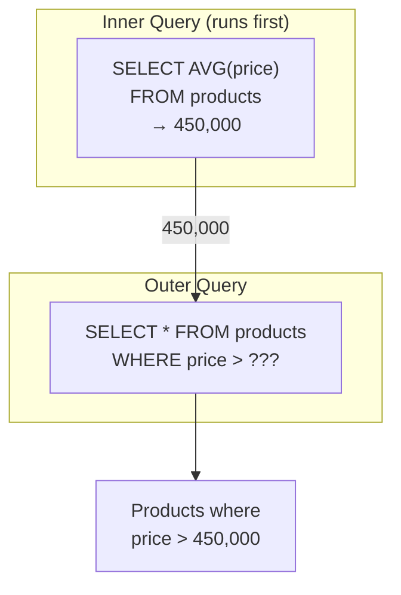

# 9강: 서브쿼리

JOIN으로 테이블을 연결하는 방법을 배웠습니다. 이번에는 쿼리 안에 쿼리를 넣는 서브쿼리를 배웁니다. '평균 가격보다 비싼 상품'처럼, 한 쿼리의 결과를 다른 쿼리의 조건으로 사용할 수 있습니다.

!!! note "이미 알고 계신다면"
    스칼라 서브쿼리, 인라인 뷰, WHERE 서브쿼리에 익숙하다면 [10강: CASE 표현식](10-case.md)으로 건너뛰세요.

서브쿼리(Subquery)는 다른 쿼리 안에 중첩된 `SELECT` 문입니다. `WHERE`, `FROM`, `SELECT` 절 어디에든 사용할 수 있습니다. 서브쿼리를 활용하면 복잡한 질문을 작고 읽기 쉬운 단계로 나눌 수 있습니다.



> 서브쿼리는 안쪽 쿼리가 먼저 실행되고, 그 결과가 바깥 쿼리에 전달됩니다.

## WHERE 절의 스칼라 서브쿼리

스칼라 서브쿼리(Scalar Subquery)는 단일 값(행 1개, 열 1개)을 반환합니다. 리터럴 값이 들어갈 자리라면 어디든 사용할 수 있습니다.

```sql
-- 전체 평균 가격보다 비싼 상품
SELECT name, price
FROM products
WHERE price > (SELECT AVG(price) FROM products WHERE is_active = 1)
  AND is_active = 1
ORDER BY price ASC;
```

**결과:**

| name                            | price  |
| ------------------------------- | -----: |
| 삼성 오디세이 OLED G8                 | 693300 |
| 엡손 L15160                       | 742100 |
| ASUS ROG Swift OLED PG27AQDM 실버 | 754300 |
| ...                             | ...    |

내부 쿼리 `(SELECT AVG(price) FROM products WHERE is_active = 1)`가 평균을 한 번 계산하면, 외부 쿼리가 각 상품 가격을 그 값과 비교합니다.

```sql
-- 첫 번째 주문보다 먼저 가입한 고객
SELECT name, created_at
FROM customers
WHERE created_at < (SELECT MIN(ordered_at) FROM orders)
LIMIT 5;
```

## IN 서브쿼리

{ .off-glb width="280"  }

서브쿼리가 여러 행을 반환할 수 있을 때는 `=` 대신 `IN`을 사용하세요.

```sql
-- 별점 1점 리뷰를 남긴 적 있는 고객
SELECT name, email, grade
FROM customers
WHERE id IN (
    SELECT DISTINCT customer_id
    FROM reviews
    WHERE rating = 1
)
ORDER BY name;
```

**결과:**

| name | email                | grade |
| ---- | -------------------- | ----- |
| 강명자  | user162@testmail.kr  | VIP   |
| 강미숙  | user2129@testmail.kr | VIP   |
| ...  | ...                  | ...   |

```sql
-- 현재 장바구니에 담긴 활성 상품
SELECT name, price, stock_qty
FROM products
WHERE id IN (
    SELECT DISTINCT product_id
    FROM cart_items
)
  AND is_active = 1
ORDER BY name;
```

## NOT IN

{ .off-glb width="280"  }

`NOT IN`은 서브쿼리 결과에 **없는** 행을 찾습니다 — `LEFT JOIN ... IS NULL` 안티 조인 패턴과 유사합니다.

```sql
-- 한 번도 주문되지 않은 상품
SELECT name, price
FROM products
WHERE id NOT IN (
    SELECT DISTINCT product_id
    FROM order_items
)
  AND is_active = 1;
```

> **주의:** 서브쿼리가 NULL 값을 하나라도 반환하면 `NOT IN`이 예상치 못하게 동작합니다(행이 하나도 반환되지 않음). NULL이 포함될 수 있는 경우에는 `NOT EXISTS`(20강)를 사용하세요.

## FROM 서브쿼리 (파생 테이블)

`FROM` 절의 서브쿼리는 임시 인라인 테이블을 만듭니다. 이를 **파생 테이블(Derived Table)** 또는 **인라인 뷰(Inline View)**라고 합니다.

```sql
-- 고객 등급별 평균 주문 금액
SELECT
    grade,
    ROUND(AVG(avg_order), 2) AS avg_order_value
FROM (
    SELECT
        c.grade,
        o.customer_id,
        AVG(o.total_amount) AS avg_order
    FROM orders AS o
    INNER JOIN customers AS c ON o.customer_id = c.id
    WHERE o.status NOT IN ('cancelled', 'returned')
    GROUP BY c.grade, o.customer_id
) AS customer_avgs
GROUP BY grade
ORDER BY avg_order_value DESC;
```

**결과:**

| grade  | avg_order_value |
| ------ | --------------: |
| VIP    |      1297607.02 |
| GOLD   |      1206233.73 |
| SILVER |       873016.36 |
| BRONZE |       702221.89 |

=== "SQLite"
    ```sql
    -- 매출 상위 3개월과 해당 월의 주문 수
    SELECT
        monthly.year_month,
        monthly.revenue,
        monthly.order_count
    FROM (
        SELECT
            SUBSTR(ordered_at, 1, 7) AS year_month,
            SUM(total_amount)        AS revenue,
            COUNT(*)                 AS order_count
        FROM orders
        WHERE status NOT IN ('cancelled', 'returned')
        GROUP BY SUBSTR(ordered_at, 1, 7)
    ) AS monthly
    ORDER BY revenue DESC
    LIMIT 3;
    ```

=== "MySQL"
    ```sql
    SELECT
        monthly.year_month,
        monthly.revenue,
        monthly.order_count
    FROM (
        SELECT
            DATE_FORMAT(ordered_at, '%Y-%m') AS year_month,
            SUM(total_amount)                AS revenue,
            COUNT(*)                         AS order_count
        FROM orders
        WHERE status NOT IN ('cancelled', 'returned')
        GROUP BY DATE_FORMAT(ordered_at, '%Y-%m')
    ) AS monthly
    ORDER BY revenue DESC
    LIMIT 3;
    ```

=== "PostgreSQL"
    ```sql
    SELECT
        monthly.year_month,
        monthly.revenue,
        monthly.order_count
    FROM (
        SELECT
            TO_CHAR(ordered_at, 'YYYY-MM') AS year_month,
            SUM(total_amount)              AS revenue,
            COUNT(*)                       AS order_count
        FROM orders
        WHERE status NOT IN ('cancelled', 'returned')
        GROUP BY TO_CHAR(ordered_at, 'YYYY-MM')
    ) AS monthly
    ORDER BY revenue DESC
    LIMIT 3;
    ```

**결과:**

| year_month | revenue | order_count |
|------------|--------:|------------:|
| 2024-12 | 1841293.70 | 892 |
| 2023-12 | 1624817.40 | 801 |
| 2024-11 | 1312944.90 | 703 |

## SELECT 절의 스칼라 서브쿼리

`SELECT` 목록에 있는 서브쿼리는 출력 행마다 한 번씩 실행됩니다.

```sql
-- 각 고객의 가장 최근 주문일
SELECT
    c.name,
    c.grade,
    (
        SELECT MAX(ordered_at)
        FROM orders
        WHERE customer_id = c.id
    ) AS last_order_date
FROM customers AS c
WHERE c.is_active = 1
ORDER BY last_order_date DESC
LIMIT 8;
```

**결과:**

| name | grade | last_order_date |
|------|-------|-----------------|
| 김민수 | VIP | 2024-12-31 |
| 이지은 | GOLD | 2024-12-30 |
| ... | | |

> `SELECT`의 스칼라 서브쿼리는 행마다 실행되므로 대용량 테이블에서 느릴 수 있습니다. 성능이 중요한 경우에는 `LEFT JOIN`과 집계를 사용하세요.

## 정리

| 개념 | 설명 | 예시 |
|------|------|------|
| 스칼라 서브쿼리 | 단일 값을 반환하는 서브쿼리 | `WHERE price > (SELECT AVG(price) ...)` |
| IN 서브쿼리 | 여러 값을 반환하는 서브쿼리로 포함 여부 확인 | `WHERE id IN (SELECT product_id ...)` |
| NOT IN | 서브쿼리 결과에 없는 행 찾기 (NULL 주의) | `WHERE id NOT IN (SELECT ...)` |
| 파생 테이블 (FROM) | FROM 절에서 임시 인라인 테이블 생성 | `FROM (SELECT ... GROUP BY ...) AS sub` |
| SELECT 스칼라 | SELECT 목록에서 행마다 값을 계산 | `(SELECT MAX(ordered_at) ...) AS last_order` |
| 상관 서브쿼리 | 외부 쿼리의 값을 참조하는 서브쿼리 | `WHERE p2.category_id = p.category_id` |

!!! note "레슨 복습 문제"
    이 레슨에서 배운 개념을 바로 확인하는 간단한 문제입니다. 여러 개념을 종합하는 실전 연습은 [연습 문제](../exercises/index.md) 섹션을 참고하세요.

## 연습 문제
### 연습 1
한 번도 결제가 완료되지 않은 주문을 찾으세요. `NOT IN` 서브쿼리를 사용하여 `payments` 테이블에서 `status = 'completed'`인 `order_id`를 제외하세요. `order_number`, `total_amount`, `status`를 반환하고, `total_amount` 내림차순으로 정렬하여 10행으로 제한하세요.

??? success "정답"
    ```sql
    SELECT order_number, total_amount, status
    FROM orders
    WHERE id NOT IN (
        SELECT order_id
        FROM payments
        WHERE status = 'completed'
    )
    ORDER BY total_amount DESC
    LIMIT 10;
    ```

    **결과 (예시):**

    | order_number       | total_amount | status           |
    | ------------------ | -----------: | ---------------- |
    | ORD-20230504-22760 |     19613300 | return_requested |
    | ORD-20240908-29994 |     14691400 | returned         |
    | ORD-20220923-19607 |     14400000 | cancelled        |
    | ORD-20250309-33168 |     13528400 | cancelled        |
    | ORD-20190726-03947 |     11884300 | cancelled        |
    | ...                | ...          | ...              |


### 연습 2
전체 주문의 평균 금액보다 큰 주문을 조회하세요. `order_number`, `total_amount`를 반환하고, `total_amount` 내림차순으로 정렬하여 10행으로 제한하세요. `WHERE` 절에 스칼라 서브쿼리를 사용하세요.

??? success "정답"
    ```sql
    SELECT order_number, total_amount
    FROM orders
    WHERE total_amount > (
        SELECT AVG(total_amount) FROM orders
    )
    ORDER BY total_amount DESC
    LIMIT 10;
    ```

    **결과 (예시):**

    | order_number       | total_amount |
    | ------------------ | -----------: |
    | ORD-20210628-12574 |     58039800 |
    | ORD-20230809-24046 |     55047300 |
    | ORD-20210321-11106 |     48718000 |
    | ORD-20200605-07165 |     47954000 |
    | ORD-20231020-25036 |     46945700 |
    | ...                | ...          |


### 연습 3
각 상품의 이름과 해당 상품의 리뷰 수를 `SELECT` 절의 스칼라 서브쿼리로 구하세요. `product_name`, `price`, `review_count`를 반환하고, `review_count` 내림차순으로 정렬하여 10행으로 제한하세요. 활성 상품만 대상으로 하세요.

??? success "정답"
    ```sql
    SELECT
        p.name  AS product_name,
        p.price,
        (
            SELECT COUNT(*)
            FROM reviews AS r
            WHERE r.product_id = p.id
        ) AS review_count
    FROM products AS p
    WHERE p.is_active = 1
    ORDER BY review_count DESC
    LIMIT 10;
    ```

    **결과 (예시):**

    | product_name                    | price  | review_count |
    | ------------------------------- | -----: | -----------: |
    | SteelSeries Aerox 5 Wireless 실버 | 119000 |          111 |
    | SteelSeries Prime Wireless 블랙   |  75900 |           93 |
    | JBL Flip 6 블랙                   | 195900 |           92 |
    | 녹투아 NH-L12S                     |  49400 |           88 |
    | 삼성 DDR4 32GB PC4-25600          |  49100 |           87 |
    | ...                             | ...    | ...          |


### 연습 4
같은 카테고리 내 평균 가격보다 비싼 상품을 모두 찾으세요. 외부 쿼리의 `category_id`를 참조하는 스칼라 서브쿼리를 `WHERE` 절에 사용하고, `product_name`, `price`, `category_id`를 반환하세요.

??? success "정답"
    ```sql
    SELECT
        p.name        AS product_name,
        p.price,
        p.category_id
    FROM products AS p
    WHERE p.price > (
        SELECT AVG(p2.price)
        FROM products AS p2
        WHERE p2.category_id = p.category_id
          AND p2.is_active = 1
    )
      AND p.is_active = 1
    ORDER BY p.category_id, p.price DESC;
    ```

    **결과 (예시):**

    | product_name             | price   | category_id |
    | ------------------------ | ------: | ----------: |
    | LG 일체형PC 27V70Q 실버       | 1292200 |           2 |
    | HP Z2 Mini G1a 블랙        | 1166400 |           2 |
    | ASUS ROG Strix GT35      | 4314800 |           3 |
    | ASUS ROG Strix G16CH 화이트 | 2988700 |           3 |
    | 주연 리오나인 R7 시스템           | 1829000 |           3 |
    | ...                      | ...     | ...         |


### 연습 5
최소 한 명의 고객 위시리스트에 있지만 **한 번도 주문된 적 없는** 상품을 찾으세요. `IN`과 `NOT IN` 서브쿼리를 사용하고, `product_name`과 `price`를 반환하세요.

??? success "정답"
    ```sql
    SELECT name AS product_name, price
    FROM products
    WHERE id IN (
        SELECT DISTINCT product_id FROM wishlists
    )
      AND id NOT IN (
        SELECT DISTINCT product_id FROM order_items
    )
    ORDER BY price DESC;
    ```

    **결과 (예시):**

    | product_name                  | price  |
    | ----------------------------- | -----: |
    | 삼성 오디세이 OLED G8               | 693300 |
    | ASRock X870E Taichi 실버        | 583500 |
    | 보스 SoundLink Flex 블랙          | 516000 |
    | MSI MAG B860 TOMAHAWK WIFI    | 440900 |
    | be quiet! Dark Power 13 1000W | 359500 |
    | ...                           | ...    |


### 연습 6
`FROM` 서브쿼리를 사용하여 카테고리별 평균 상품 가격을 먼저 계산한 뒤, 외부 쿼리에서 `categories` 테이블과 조인하여 카테고리명(`category_name`)과 `avg_price`를 반환하세요. `avg_price` 내림차순으로 정렬하세요.

??? success "정답"
    ```sql
    SELECT
        cat.name       AS category_name,
        price_stats.avg_price
    FROM (
        SELECT
            category_id,
            ROUND(AVG(price), 2) AS avg_price
        FROM products
        WHERE is_active = 1
        GROUP BY category_id
    ) AS price_stats
    INNER JOIN categories AS cat ON price_stats.category_id = cat.id
    ORDER BY price_stats.avg_price DESC;
    ```

    **결과 (예시):**

    | category_name | avg_price  |
    | ------------- | ---------: |
    | 맥북            |    3774700 |
    | 게이밍 노트북       |    3169700 |
    | NVIDIA        |    2045440 |
    | 일반 노트북        |  1856837.5 |
    | 조립PC          | 1795033.33 |
    | ...           | ...        |


### 연습 7
`'VIP'` 등급 고객이 한 번이라도 주문한 상품을 모두 찾으세요. `IN` 서브쿼리를 사용하고, `product_name`과 `price`를 반환하세요. 가격 내림차순으로 정렬하세요.

??? success "정답"
    ```sql
    SELECT p.name AS product_name, p.price
    FROM products AS p
    WHERE p.id IN (
        SELECT DISTINCT oi.product_id
        FROM order_items AS oi
        INNER JOIN orders AS o ON oi.order_id = o.id
        INNER JOIN customers AS c ON o.customer_id = c.id
        WHERE c.grade = 'VIP'
    )
    ORDER BY p.price DESC;
    ```

    **결과 (예시):**

    | product_name                                                  | price   |
    | ------------------------------------------------------------- | ------: |
    | ASUS ROG Strix GT35                                           | 4314800 |
    | ASUS ROG Zephyrus G16                                         | 4284100 |
    | ASUS Dual RTX 5070 Ti [특별 한정판 에디션] 저소음 설계, 에너지 효율 1등급, 친환경 포장 | 4226200 |
    | Razer Blade 18 블랙                                             | 4182100 |
    | Razer Blade 16 실버                                             | 4123800 |
    | ...                                                           | ...     |


### 연습 8
`FROM` 서브쿼리를 사용하여 완료된 주문 수 기준 상위 10명의 고객을 구하세요. 내부 쿼리에서 고객별 주문 수를 세고, 외부 쿼리에서 `customers` 테이블과 조인하여 `name`과 `grade`를 추가하세요.

??? success "정답"
    ```sql
    SELECT
        c.name,
        c.grade,
        order_stats.order_count,
        order_stats.total_spent
    FROM (
        SELECT
            customer_id,
            COUNT(*)            AS order_count,
            SUM(total_amount)   AS total_spent
        FROM orders
        WHERE status IN ('delivered', 'confirmed')
        GROUP BY customer_id
    ) AS order_stats
    INNER JOIN customers AS c ON order_stats.customer_id = c.id
    ORDER BY order_stats.order_count DESC
    LIMIT 10;
    ```

    **결과 (예시):**

    | name | grade | order_count | total_spent |
    | ---- | ----- | ----------: | ----------: |
    | 김병철  | VIP   |         319 |   291265567 |
    | 이영자  | VIP   |         315 |   284481704 |
    | 박정수  | VIP   |         305 |   339169936 |
    | 강명자  | VIP   |         240 |   296857745 |
    | 김성민  | VIP   |         210 |   220361434 |
    | ...  | ...   | ...         | ...         |


### 연습 9
주문 횟수가 전체 고객 평균 주문 횟수보다 많은 고객을 찾으세요. `FROM` 서브쿼리로 고객별 주문 횟수를 먼저 구하고, `WHERE` 절에 스칼라 서브쿼리로 평균을 비교하세요. `customer_id`와 `order_count`를 반환하고, `order_count` 내림차순으로 정렬하여 10행으로 제한하세요.

??? success "정답"
    ```sql
    SELECT
        customer_id,
        order_count
    FROM (
        SELECT
            customer_id,
            COUNT(*) AS order_count
        FROM orders
        GROUP BY customer_id
    ) AS cust_orders
    WHERE order_count > (
        SELECT AVG(cnt)
        FROM (
            SELECT COUNT(*) AS cnt
            FROM orders
            GROUP BY customer_id
        ) AS avg_calc
    )
    ORDER BY order_count DESC
    LIMIT 10;
    ```

    **결과 (예시):**

    | customer_id | order_count |
    | ----------: | ----------: |
    |          98 |         346 |
    |          97 |         342 |
    |         226 |         340 |
    |         162 |         254 |
    |         227 |         232 |
    | ...         | ...         |


### 연습 10
가장 최근 주문한 고객 5명의 이름, 이메일, 마지막 주문일을 구하세요. `FROM` 서브쿼리로 고객별 최신 주문일(`last_order`)을 먼저 구하고, 외부 쿼리에서 `customers` 테이블과 조인하세요. `last_order` 내림차순으로 정렬하세요.

??? success "정답"
    ```sql
    SELECT
        c.name,
        c.email,
        recent.last_order
    FROM (
        SELECT
            customer_id,
            MAX(ordered_at) AS last_order
        FROM orders
        GROUP BY customer_id
    ) AS recent
    INNER JOIN customers AS c ON recent.customer_id = c.id
    ORDER BY recent.last_order DESC
    LIMIT 5;
    ```


### 채점 가이드

| 점수 | 다음 단계 |
|:----:|----------|
| **9~10개** | [10강: CASE 표현식](10-case.md)으로 이동 |
| **7~8개** | 틀린 문제 해설을 복습한 뒤 다음강으로 |
| **절반 이하** | 이 강의를 다시 읽어보세요 |
| **3개 이하** | [8강: LEFT JOIN](08-left-join.md)부터 다시 시작하세요 |

**문제별 영역:**

| 영역 | 해당 문제 |
|------|:--------:|
| NOT IN 서브쿼리 | 1 |
| WHERE 스칼라 서브쿼리 | 2 |
| SELECT 스칼라 서브쿼리 | 3 |
| 상관 서브쿼리 | 4 |
| IN + NOT IN 조합 | 5 |
| FROM 서브쿼리 (파생 테이블) | 6, 8, 10 |
| IN 서브쿼리 + JOIN | 7 |
| 중첩 서브쿼리 | 9 |

---
다음: [10강: CASE 표현식](10-case.md)
