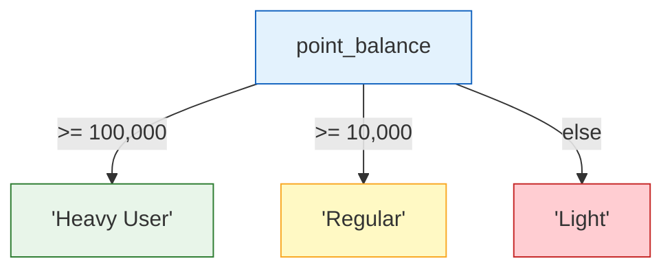

# 10강: CASE 표현식

`CASE`는 SQL의 조건 표현식으로, 프로그래밍 언어의 `if/else`와 유사합니다. 값 변환, 레이블 생성, 데이터 구간 분류, 조건부 집계 등을 단일 쿼리 안에서 모두 처리할 수 있습니다.



> CASE는 SQL의 if-else입니다. 조건을 위에서 아래로 순서대로 검사합니다.

## 단순 CASE

단순(Simple) CASE는 하나의 컬럼 값을 고정된 값들과 비교합니다.

```sql
-- 주문 상태 코드를 읽기 쉬운 레이블로 변환
SELECT
    order_number,
    total_amount,
    CASE status
        WHEN 'pending'          THEN '결제 대기'
        WHEN 'paid'             THEN '결제 완료'
        WHEN 'preparing'        THEN '상품 준비 중'
        WHEN 'shipped'          THEN '배송 중'
        WHEN 'delivered'        THEN '배달 완료'
        WHEN 'confirmed'        THEN '구매 확정'
        WHEN 'cancelled'        THEN '취소됨'
        WHEN 'return_requested' THEN '반품 요청'
        WHEN 'returned'         THEN '반품 완료'
        ELSE status
    END AS status_label
FROM orders
ORDER BY ordered_at DESC
LIMIT 5;
```

**결과:**

| order_number | total_amount | status_label |
|--------------|--------------|--------------|
| ORD-20241231-09842 | 2349.00 | 구매 확정 |
| ORD-20241231-09841 | 149.99 | 배달 완료 |
| ORD-20241231-09840 | 89.99 | 배송 중 |
| ORD-20241230-09839 | 749.00 | 구매 확정 |
| ORD-20241230-09838 | 329.97 | 취소됨 |

## 검색 CASE

검색(Searched) CASE는 독립적인 `WHEN` 조건을 평가하여 비교 및 표현식에 완전한 유연성을 제공합니다.

```sql
-- 상품을 가격대별로 분류
SELECT
    name,
    price,
    CASE
        WHEN price < 50           THEN '저가'
        WHEN price BETWEEN 50 AND 199.99  THEN '중가'
        WHEN price BETWEEN 200 AND 799.99 THEN '고가'
        ELSE '프리미엄'
    END AS price_tier
FROM products
WHERE is_active = 1
ORDER BY price ASC
LIMIT 10;
```

**결과:**

| name | price | price_tier |
|------|-------|------------|
| USB-C Cable 2m | 9.99 | 저가 |
| Microfiber Cleaning Kit | 12.99 | 저가 |
| Screen Protector 15" | 14.99 | 저가 |
| SteelSeries Gaming Headset | 79.99 | 중가 |
| Logitech MX Master 3 | 99.99 | 중가 |
| Corsair 16GB DDR5 RAM | 129.99 | 중가 |
| Samsung 27" Monitor | 449.99 | 고가 |
| ... | | |

## 연령대 분류에 CASE 활용

```sql
-- 고객을 세대별로 분류
SELECT
    name,
    birth_date,
    CASE
        WHEN birth_date IS NULL THEN '미확인'
        WHEN CAST(SUBSTR(birth_date, 1, 4) AS INTEGER) >= 1997 THEN 'Z세대'
        WHEN CAST(SUBSTR(birth_date, 1, 4) AS INTEGER) >= 1981 THEN '밀레니얼'
        WHEN CAST(SUBSTR(birth_date, 1, 4) AS INTEGER) >= 1965 THEN 'X세대'
        ELSE '베이비붐+'
    END AS generation
FROM customers
LIMIT 8;
```

**결과:**

| name | birth_date | generation |
|------|------------|------------|
| 김민수 | 1989-04-12 | 밀레니얼 |
| 이지은 | (NULL) | 미확인 |
| 박서준 | 1972-08-27 | X세대 |
| 최유리 | 2000-01-15 | Z세대 |
| ... | | |

## GROUP BY 및 집계에서의 CASE

`CASE`를 그룹화 표현식으로 사용하거나 집계 함수 내에서 활용할 수 있습니다.

```sql
-- 가격대별 상품 수
SELECT
    CASE
        WHEN price < 50           THEN '저가 (5만원 미만)'
        WHEN price BETWEEN 50 AND 199.99  THEN '중가 (5만~20만원)'
        WHEN price BETWEEN 200 AND 799.99 THEN '고가 (20만~80만원)'
        ELSE '프리미엄 (80만원 이상)'
    END AS price_tier,
    COUNT(*)   AS product_count,
    AVG(price) AS avg_price
FROM products
WHERE is_active = 1
GROUP BY price_tier
ORDER BY avg_price;
```

**결과:**

| price_tier | product_count | avg_price |
|------------|---------------|-----------|
| 저가 (5만원 미만) | 42 | 23.87 |
| 중가 (5만~20만원) | 98 | 112.43 |
| 고가 (20만~80만원) | 87 | 421.29 |
| 프리미엄 (80만원 이상) | 53 | 1342.18 |

```sql
-- 피벗: 주문 상태별 건수를 컬럼으로 표시
SELECT
    SUBSTR(ordered_at, 1, 7) AS year_month,
    COUNT(CASE WHEN status = 'confirmed' THEN 1 END) AS confirmed,
    COUNT(CASE WHEN status = 'cancelled' THEN 1 END) AS cancelled,
    COUNT(CASE WHEN status = 'returned'  THEN 1 END) AS returned,
    COUNT(*) AS total
FROM orders
WHERE ordered_at LIKE '2024%'
GROUP BY SUBSTR(ordered_at, 1, 7)
ORDER BY year_month;
```

**결과:**

| year_month | confirmed | cancelled | returned | total |
|------------|-----------|-----------|----------|-------|
| 2024-01 | 198 | 42 | 12 | 312 |
| 2024-02 | 183 | 38 | 9 | 289 |
| 2024-03 | 261 | 57 | 14 | 405 |
| ... | | | | |

## ORDER BY에서의 CASE

계산된 표현식으로 정렬할 수 있습니다.

```sql
-- 활성 상태 우선, 종료 상태 나중에 정렬
SELECT order_number, status, total_amount
FROM orders
ORDER BY
    CASE status
        WHEN 'pending'   THEN 1
        WHEN 'paid'      THEN 2
        WHEN 'preparing' THEN 3
        WHEN 'shipped'   THEN 4
        ELSE 5
    END,
    total_amount DESC
LIMIT 10;
```

!!! note "레슨 복습 문제"
    이 레슨에서 배운 개념을 바로 확인하는 간단한 문제입니다. 여러 개념을 종합하는 실전 연습은 [연습 문제](../exercises/) 섹션을 참고하세요.

## 연습 문제

### 연습 1
상품 목록에 `stock_status` 컬럼을 추가하세요: `stock_qty = 0`이면 `'품절'`, `1~10`이면 `'재고 부족'`, `11~100`이면 `'재고 있음'`, 100 초과면 `'재고 충분'`. 활성 상품 전체의 `name`, `stock_qty`, `stock_status`를 반환하세요.

??? success "정답"
    ```sql
    SELECT
        name,
        stock_qty,
        CASE
            WHEN stock_qty = 0         THEN '품절'
            WHEN stock_qty <= 10       THEN '재고 부족'
            WHEN stock_qty <= 100      THEN '재고 있음'
            ELSE '재고 충분'
        END AS stock_status
    FROM products
    WHERE is_active = 1
    ORDER BY stock_qty ASC;
    ```

### 연습 2
세대별 분포 보고서를 만드세요: 활성 고객이 각 세대(Z세대: 1997년 이후 출생, 밀레니얼: 1981~1996, X세대: 1965~1980, 베이비붐+: 1965년 이전, 미확인: birth_date가 NULL)에 몇 명씩 있는지 집계하세요. `generation`과 `customer_count`를 반환하세요.

??? success "정답"
    ```sql
    SELECT
        CASE
            WHEN birth_date IS NULL THEN '미확인'
            WHEN CAST(SUBSTR(birth_date, 1, 4) AS INTEGER) >= 1997 THEN 'Z세대'
            WHEN CAST(SUBSTR(birth_date, 1, 4) AS INTEGER) >= 1981 THEN '밀레니얼'
            WHEN CAST(SUBSTR(birth_date, 1, 4) AS INTEGER) >= 1965 THEN 'X세대'
            ELSE '베이비붐+'
        END AS generation,
        COUNT(*) AS customer_count
    FROM customers
    WHERE is_active = 1
    GROUP BY generation
    ORDER BY customer_count DESC;
    ```

### 연습 3
각 상품의 2024년 분기별 매출을 별도 컬럼(`q1_revenue`, `q2_revenue`, `q3_revenue`, `q4_revenue`)으로 계산하세요. 조건부 집계(`SUM(CASE WHEN ... THEN ... END)`)를 사용하고, 2024년 판매 실적이 있는 상품만 포함합니다. 2024년 총 매출 내림차순으로 10행까지 반환하세요.

??? success "정답"
    ```sql
    SELECT
        p.name AS product_name,
        SUM(CASE WHEN o.ordered_at BETWEEN '2024-01-01' AND '2024-03-31 23:59:59'
                 THEN oi.quantity * oi.unit_price ELSE 0 END) AS q1_revenue,
        SUM(CASE WHEN o.ordered_at BETWEEN '2024-04-01' AND '2024-06-30 23:59:59'
                 THEN oi.quantity * oi.unit_price ELSE 0 END) AS q2_revenue,
        SUM(CASE WHEN o.ordered_at BETWEEN '2024-07-01' AND '2024-09-30 23:59:59'
                 THEN oi.quantity * oi.unit_price ELSE 0 END) AS q3_revenue,
        SUM(CASE WHEN o.ordered_at BETWEEN '2024-10-01' AND '2024-12-31 23:59:59'
                 THEN oi.quantity * oi.unit_price ELSE 0 END) AS q4_revenue
    FROM order_items AS oi
    INNER JOIN orders    AS o ON oi.order_id   = o.id
    INNER JOIN products  AS p ON oi.product_id = p.id
    WHERE o.ordered_at LIKE '2024%'
      AND o.status NOT IN ('cancelled', 'returned')
    GROUP BY p.id, p.name
    ORDER BY (q1_revenue + q2_revenue + q3_revenue + q4_revenue) DESC
    LIMIT 10;
    ```

---
다음: [11강: 날짜 및 시간 함수](11-datetime.md)
