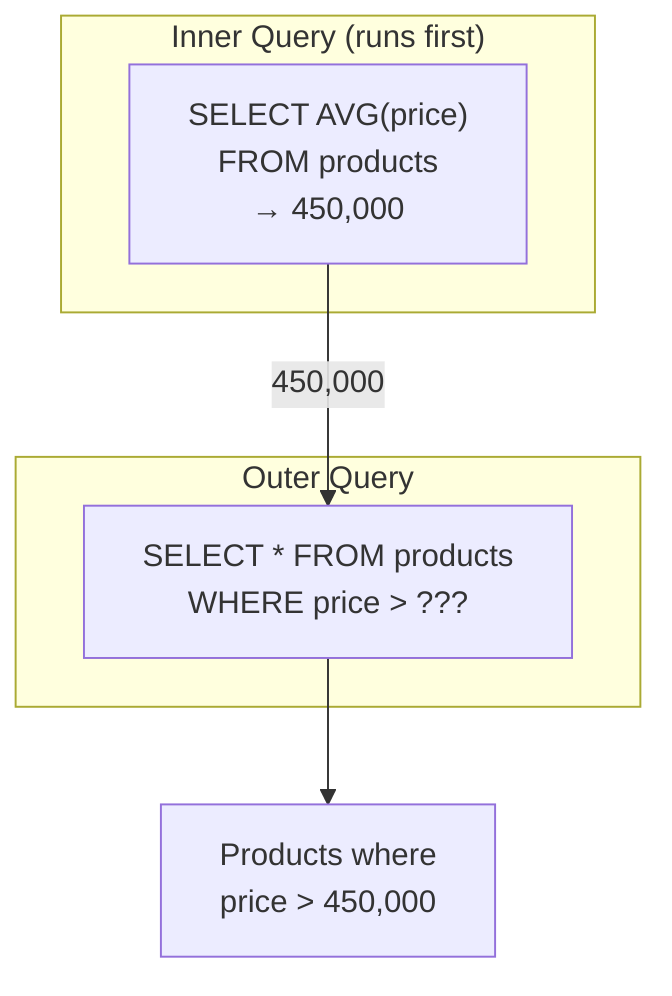
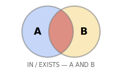
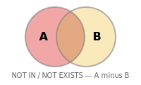

# 10강: 서브쿼리

JOIN으로 테이블을 연결하는 방법을 배웠습니다. 이번에는 쿼리 안에 쿼리를 넣는 서브쿼리를 배웁니다. '평균 가격보다 비싼 상품'처럼, 한 쿼리의 결과를 다른 쿼리의 조건으로 사용할 수 있습니다.

!!! note "이미 알고 계신다면"
    스칼라 서브쿼리, 인라인 뷰, WHERE 서브쿼리에 익숙하다면 [11강: 날짜/시간 함수](11-datetime.md)로 건너뛰세요.

서브쿼리(Subquery)는 다른 쿼리 안에 중첩된 `SELECT` 문입니다. `WHERE`, `FROM`, `SELECT` 절 어디에든 사용할 수 있습니다. 서브쿼리를 활용하면 복잡한 질문을 작고 읽기 쉬운 단계로 나눌 수 있습니다.



> 서브쿼리는 안쪽 쿼리가 먼저 실행되고, 그 결과가 바깥 쿼리에 전달됩니다.

## WHERE 절의 스칼라 서브쿼리

스칼라 서브쿼리(Scalar Subquery)는 단일 값(행 1개, 열 1개)을 반환합니다. 리터럴 값이 들어갈 자리라면 어디든 사용할 수 있습니다.

```sql
-- 전체 평균 가격보다 비싼 상품
SELECT name, price
FROM products
WHERE price > (SELECT AVG(price) FROM products WHERE is_active = 1)
  AND is_active = 1
ORDER BY price ASC;
```

**결과:**

| name | price |
| ---------- | ----------: |
| 기가바이트 B650M AORUS ELITE AX 실버 | 679000.0 |
| ASUS TUF GAMING B760M-PLUS | 681200.0 |
| 엡손 L15160 실버 | 686600.0 |
| HP Slim Desktop S01 블랙 | 689000.0 |
| AMD Ryzen 7 7700X | 691500.0 |
| ASUS ROG STRIX RX 7900 XTX 화이트 | 694200.0 |
| Adobe Acrobat Pro 1년 | 698000.0 |
| HP Z2 Mini G1a 블랙 | 698500.0 |
| ... | ... |

내부 쿼리 `(SELECT AVG(price) FROM products WHERE is_active = 1)`가 평균을 한 번 계산하면, 외부 쿼리가 각 상품 가격을 그 값과 비교합니다.

```sql
-- 첫 번째 주문보다 먼저 가입한 고객
SELECT name, created_at
FROM customers
WHERE created_at < (SELECT MIN(ordered_at) FROM orders)
LIMIT 5;
```

## IN 서브쿼리

{ .off-glb width="280"  }

서브쿼리가 여러 행을 반환할 수 있을 때는 `=` 대신 `IN`을 사용하세요.

```sql
-- 별점 1점 리뷰를 남긴 적 있는 고객
SELECT name, email, grade
FROM customers
WHERE id IN (
    SELECT DISTINCT customer_id
    FROM reviews
    WHERE rating = 1
)
ORDER BY name;
```

**결과:**

| name | email | grade |
| ---------- | ---------- | ---------- |
| 강경수 | user36521@testmail.kr | GOLD |
| 강경숙 | user3645@testmail.kr | VIP |
| 강경숙 | user12913@testmail.kr | SILVER |
| 강경자 | user29357@testmail.kr | SILVER |
| 강경자 | user37003@testmail.kr | VIP |
| 강경희 | user16196@testmail.kr | SILVER |
| 강도윤 | user2334@testmail.kr | BRONZE |
| 강도윤 | user6680@testmail.kr | SILVER |
| ... | ... | ... |

```sql
-- 현재 장바구니에 담긴 활성 상품
SELECT name, price, stock_qty
FROM products
WHERE id IN (
    SELECT DISTINCT product_id
    FROM cart_items
)
  AND is_active = 1
ORDER BY name;
```

## NOT IN

{ .off-glb width="280"  }

`NOT IN`은 서브쿼리 결과에 **없는** 행을 찾습니다 — `LEFT JOIN ... IS NULL` 안티 조인 패턴과 유사합니다.

```sql
-- 한 번도 주문되지 않은 상품
SELECT name, price
FROM products
WHERE id NOT IN (
    SELECT DISTINCT product_id
    FROM order_items
)
  AND is_active = 1;
```

> **주의:** 서브쿼리가 NULL 값을 하나라도 반환하면 `NOT IN`이 예상치 못하게 동작합니다(행이 하나도 반환되지 않음). NULL이 포함될 수 있는 경우에는 `NOT EXISTS`(20강)를 사용하세요.

## FROM 서브쿼리 (파생 테이블)

`FROM` 절의 서브쿼리는 임시 인라인 테이블을 만듭니다. 이를 **파생 테이블(Derived Table)** 또는 **인라인 뷰(Inline View)**라고 합니다.

```sql
-- 고객 등급별 평균 주문 금액
SELECT
    grade,
    ROUND(AVG(avg_order), 2) AS avg_order_value
FROM (
    SELECT
        c.grade,
        o.customer_id,
        AVG(o.total_amount) AS avg_order
    FROM orders AS o
    INNER JOIN customers AS c ON o.customer_id = c.id
    WHERE o.status NOT IN ('cancelled', 'returned')
    GROUP BY c.grade, o.customer_id
) AS customer_avgs
GROUP BY grade
ORDER BY avg_order_value DESC;
```

**결과:**

| grade | avg_order_value |
| ---------- | ----------: |
| VIP | 1384755.9 |
| GOLD | 1193210.31 |
| SILVER | 855361.6 |
| BRONZE | 715847.1 |

=== "SQLite"
    ```sql
    -- 매출 상위 3개월과 해당 월의 주문 수
    SELECT
        monthly.year_month,
        monthly.revenue,
        monthly.order_count
    FROM (
        SELECT
            SUBSTR(ordered_at, 1, 7) AS year_month,
            SUM(total_amount)        AS revenue,
            COUNT(*)                 AS order_count
        FROM orders
        WHERE status NOT IN ('cancelled', 'returned')
        GROUP BY SUBSTR(ordered_at, 1, 7)
    ) AS monthly
    ORDER BY revenue DESC
    LIMIT 3;
    ```

=== "MySQL"
    ```sql
    SELECT
        monthly.year_month,
        monthly.revenue,
        monthly.order_count
    FROM (
        SELECT
            DATE_FORMAT(ordered_at, '%Y-%m') AS year_month,
            SUM(total_amount)                AS revenue,
            COUNT(*)                         AS order_count
        FROM orders
        WHERE status NOT IN ('cancelled', 'returned')
        GROUP BY DATE_FORMAT(ordered_at, '%Y-%m')
    ) AS monthly
    ORDER BY revenue DESC
    LIMIT 3;
    ```

=== "PostgreSQL"
    ```sql
    SELECT
        monthly.year_month,
        monthly.revenue,
        monthly.order_count
    FROM (
        SELECT
            TO_CHAR(ordered_at, 'YYYY-MM') AS year_month,
            SUM(total_amount)              AS revenue,
            COUNT(*)                       AS order_count
        FROM orders
        WHERE status NOT IN ('cancelled', 'returned')
        GROUP BY TO_CHAR(ordered_at, 'YYYY-MM')
    ) AS monthly
    ORDER BY revenue DESC
    LIMIT 3;
    ```

**결과:**

| year_month | revenue | order_count |
|------------|--------:|------------:|
| 2024-12 | 1841293.70 | 892 |
| 2023-12 | 1624817.40 | 801 |
| 2024-11 | 1312944.90 | 703 |

## SELECT 절의 스칼라 서브쿼리

`SELECT` 목록에 있는 서브쿼리는 출력 행마다 한 번씩 실행됩니다.

```sql
-- 각 고객의 가장 최근 주문일
SELECT
    c.name,
    c.grade,
    (
        SELECT MAX(ordered_at)
        FROM orders
        WHERE customer_id = c.id
    ) AS last_order_date
FROM customers AS c
WHERE c.is_active = 1
ORDER BY last_order_date DESC
LIMIT 8;
```

**결과:**

| name | grade | last_order_date |
| ---------- | ---------- | ---------- |
| 송광수 | BRONZE | 2026-01-01 08:40:57 |
| 류미숙 | GOLD | 2025-12-31 23:28:51 |
| 김영미 | GOLD | 2025-12-31 23:26:03 |
| 이영미 | SILVER | 2025-12-31 23:17:28 |
| 조성수 | BRONZE | 2025-12-31 23:12:47 |
| 김지우 | VIP | 2025-12-31 23:09:05 |
| 이중수 | SILVER | 2025-12-31 23:00:56 |
| 곽민준 | BRONZE | 2025-12-31 22:41:19 |
| ... | ... | ... |

> `SELECT`의 스칼라 서브쿼리는 행마다 실행되므로 대용량 테이블에서 느릴 수 있습니다. 성능이 중요한 경우에는 `LEFT JOIN`과 집계를 사용하세요.

## 정리

| 개념 | 설명 | 예시 |
|------|------|------

<!-- BEGIN_LESSON_EXERCISES -->

!!! note "레슨 복습 문제"
    이 레슨에서 배운 개념을 바로 확인하는 간단한 문제입니다. 여러 개념을 종합하는 실전 연습은 [연습 문제](../exercises/index.md) 섹션을 참고하세요.

### 문제 1
한 번도 결제가 완료되지 않은 주문을 찾으세요. `NOT IN` 서브쿼리를 사용하여 `payments` 테이블에서 `status = 'completed'`인 `order_id`를 제외하세요. `order_number`, `total_amount`, `status`를 반환하고, `total_amount` 내림차순으로 정렬하여 10행으로 제한하세요.

??? success "정답"
    ```sql
    SELECT order_number, total_amount, status
    FROM orders
    WHERE id NOT IN (
    SELECT order_id
    FROM payments
    WHERE status = 'completed'
    )
    ORDER BY total_amount DESC
    LIMIT 10;
    ```


    **실행 결과** (총 10행 중 상위 7행)

    | order_number | total_amount | status |
    |---|---|---|
    | ORD-20230523-22331 | 46,094,971.00 | cancelled |
    | ORD-20221231-20394 | 43,585,700.00 | cancelled |
    | ORD-20211112-14229 | 20,640,700.00 | cancelled |
    | ORD-20200316-05860 | 19,280,300.00 | return_requested |
    | ORD-20250424-33207 | 19,179,500.00 | return_requested |
    | ORD-20250307-32312 | 18,229,600.00 | cancelled |
    | ORD-20190519-03402 | 15,130,700.00 | returned |

### 문제 2
전체 주문의 평균 금액보다 큰 주문을 조회하세요. `order_number`, `total_amount`를 반환하고, `total_amount` 내림차순으로 정렬하여 10행으로 제한하세요. `WHERE` 절에 스칼라 서브쿼리를 사용하세요.

??? success "정답"
    ```sql
    SELECT order_number, total_amount
    FROM orders
    WHERE total_amount > (
    SELECT AVG(total_amount) FROM orders
    )
    ORDER BY total_amount DESC
    LIMIT 10;
    ```


    **실행 결과** (총 10행 중 상위 7행)

    | order_number | total_amount |
    |---|---|
    | ORD-20201121-08810 | 50,867,500.00 |
    | ORD-20250305-32265 | 46,820,024.00 |
    | ORD-20230523-22331 | 46,094,971.00 |
    | ORD-20200209-05404 | 43,677,500.00 |
    | ORD-20221231-20394 | 43,585,700.00 |
    | ORD-20251218-37240 | 38,626,400.00 |
    | ORD-20220106-15263 | 37,987,600.00 |

### 문제 3
각 상품의 이름과 해당 상품의 리뷰 수를 `SELECT` 절의 스칼라 서브쿼리로 구하세요. `product_name`, `price`, `review_count`를 반환하고, `review_count` 내림차순으로 정렬하여 10행으로 제한하세요. 활성 상품만 대상으로 하세요.

??? success "정답"
    ```sql
    SELECT
    p.name  AS product_name,
    p.price,
    (
    SELECT COUNT(*)
    FROM reviews AS r
    WHERE r.product_id = p.id
    ) AS review_count
    FROM products AS p
    WHERE p.is_active = 1
    ORDER BY review_count DESC
    LIMIT 10;
    ```


    **실행 결과** (총 10행 중 상위 7행)

    | product_name | price | review_count |
    |---|---|---|
    | SteelSeries Prime Wireless 실버 | 95,900.00 | 105 |
    | Kingston FURY Beast DDR4 16GB 실버 | 48,000.00 | 102 |
    | 로지텍 G502 X PLUS | 97,500.00 | 101 |
    | SteelSeries Aerox 5 Wireless 실버 | 100,000.00 | 100 |
    | Ducky One 3 TKL 화이트 | 189,100.00 | 89 |
    | 삼성 SPA-KFG0BUB 실버 | 21,900.00 | 82 |
    | SteelSeries Prime Wireless 블랙 | 89,800.00 | 80 |

### 문제 4
같은 카테고리 내 평균 가격보다 비싼 상품을 모두 찾으세요. 외부 쿼리의 `category_id`를 참조하는 스칼라 서브쿼리를 `WHERE` 절에 사용하고, `product_name`, `price`, `category_id`를 반환하세요.

??? success "정답"
    ```sql
    SELECT
    p.name        AS product_name,
    p.price,
    p.category_id
    FROM products AS p
    WHERE p.price > (
    SELECT AVG(p2.price)
    FROM products AS p2
    WHERE p2.category_id = p.category_id
    AND p2.is_active = 1
    )
    AND p.is_active = 1
    ORDER BY p.category_id, p.price DESC;
    ```


    **실행 결과** (총 101행 중 상위 7행)

    | product_name | price | category_id |
    |---|---|---|
    | LG 일체형PC 27V70Q 실버 | 1,093,200.00 | 2 |
    | ASUS ROG Strix G16CH 화이트 | 3,671,500.00 | 3 |
    | ASUS ROG Strix GT35 | 3,296,800.00 | 3 |
    | ASUS ROG Strix G16CH 실버 | 1,879,100.00 | 3 |
    | 주연 리오나인 i9 하이엔드 | 1,849,900.00 | 3 |
    | ASUS ExpertBook B5 [특별 한정판 에디션] RGB 라... | 2,121,600.00 | 6 |
    | HP EliteBook 840 G10 블랙 [특별 한정판 에디션] ... | 2,080,300.00 | 6 |

### 문제 5
최소 한 명의 고객 위시리스트에 있지만 **한 번도 주문된 적 없는** 상품을 찾으세요. `IN`과 `NOT IN` 서브쿼리를 사용하고, `product_name`과 `price`를 반환하세요.

??? success "정답"
    ```sql
    SELECT name AS product_name, price
    FROM products
    WHERE id IN (
    SELECT DISTINCT product_id FROM wishlists
    )
    AND id NOT IN (
    SELECT DISTINCT product_id FROM order_items
    )
    ORDER BY price DESC;
    ```

### 문제 6
`FROM` 서브쿼리를 사용하여 카테고리별 평균 상품 가격을 먼저 계산한 뒤, 외부 쿼리에서 `categories` 테이블과 조인하여 카테고리명(`category_name`)과 `avg_price`를 반환하세요. `avg_price` 내림차순으로 정렬하세요.

??? success "정답"
    ```sql
    SELECT
    cat.name       AS category_name,
    price_stats.avg_price
    FROM (
    SELECT
    category_id,
    ROUND(AVG(price), 2) AS avg_price
    FROM products
    WHERE is_active = 1
    GROUP BY category_id
    ) AS price_stats
    INNER JOIN categories AS cat ON price_stats.category_id = cat.id
    ORDER BY price_stats.avg_price DESC;
    ```


    **실행 결과** (총 38행 중 상위 7행)

    | category_name | avg_price |
    |---|---|
    | 맥북 | 5,481,100.00 |
    | 게이밍 노트북 | 2,887,583.33 |
    | NVIDIA | 2,207,600.00 |
    | 조립PC | 1,836,466.67 |
    | 일반 노트북 | 1,794,812.50 |
    | 전문가용 모니터 | 1,492,983.33 |
    | 2in1 | 1,417,242.86 |

### 문제 7
`'VIP'` 등급 고객이 한 번이라도 주문한 상품을 모두 찾으세요. `IN` 서브쿼리를 사용하고, `product_name`과 `price`를 반환하세요. 가격 내림차순으로 정렬하세요.

??? success "정답"
    ```sql
    SELECT p.name AS product_name, p.price
    FROM products AS p
    WHERE p.id IN (
    SELECT DISTINCT oi.product_id
    FROM order_items AS oi
    INNER JOIN orders AS o ON oi.order_id = o.id
    INNER JOIN customers AS c ON o.customer_id = c.id
    WHERE c.grade = 'VIP'
    )
    ORDER BY p.price DESC;
    ```


    **실행 결과** (총 280행 중 상위 7행)

    | product_name | price |
    |---|---|
    | MacBook Air 15 M3 실버 | 5,481,100.00 |
    | ASUS TUF Gaming RTX 5080 화이트 | 4,526,600.00 |
    | ASUS Dual RTX 5070 Ti [특별 한정판 에디션] 저소... | 4,496,700.00 |
    | Razer Blade 18 블랙 | 4,353,100.00 |
    | Razer Blade 16 실버 | 3,702,900.00 |
    | ASUS ROG Strix G16CH 화이트 | 3,671,500.00 |
    | ASUS ROG Zephyrus G16 | 3,429,900.00 |

### 문제 8
`FROM` 서브쿼리를 사용하여 완료된 주문 수 기준 상위 10명의 고객을 구하세요. 내부 쿼리에서 고객별 주문 수를 세고, 외부 쿼리에서 `customers` 테이블과 조인하여 `name`과 `grade`를 추가하세요.

??? success "정답"
    ```sql
    SELECT
    c.name,
    c.grade,
    order_stats.order_count,
    order_stats.total_spent
    FROM (
    SELECT
    customer_id,
    COUNT(*)            AS order_count,
    SUM(total_amount)   AS total_spent
    FROM orders
    WHERE status IN ('delivered', 'confirmed')
    GROUP BY customer_id
    ) AS order_stats
    INNER JOIN customers AS c ON order_stats.customer_id = c.id
    ORDER BY order_stats.order_count DESC
    LIMIT 10;
    ```


    **실행 결과** (총 10행 중 상위 7행)

    | name | grade | order_count | total_spent |
    |---|---|---|---|
    | 김병철 | VIP | 340 | 362,705,631.00 |
    | 박정수 | VIP | 302 | 403,081,258.00 |
    | 이영자 | VIP | 275 | 230,165,991.00 |
    | 강명자 | VIP | 249 | 253,180,338.00 |
    | 김성민 | VIP | 230 | 234,708,853.00 |
    | 정유진 | VIP | 223 | 244,604,910.00 |
    | 이미정 | VIP | 219 | 235,775,349.00 |

### 문제 9
주문 횟수가 전체 고객 평균 주문 횟수보다 많은 고객을 찾으세요. `FROM` 서브쿼리로 고객별 주문 횟수를 먼저 구하고, `WHERE` 절에 스칼라 서브쿼리로 평균을 비교하세요. `customer_id`와 `order_count`를 반환하고, `order_count` 내림차순으로 정렬하여 10행으로 제한하세요.

??? success "정답"
    ```sql
    SELECT
    customer_id,
    order_count
    FROM (
    SELECT
    customer_id,
    COUNT(*) AS order_count
    FROM orders
    GROUP BY customer_id
    ) AS cust_orders
    WHERE order_count > (
    SELECT AVG(cnt)
    FROM (
    SELECT COUNT(*) AS cnt
    FROM orders
    GROUP BY customer_id
    ) AS avg_calc
    )
    ORDER BY order_count DESC
    LIMIT 10;
    ```


    **실행 결과** (총 10행 중 상위 7행)

    | customer_id | order_count |
    |---|---|
    | 97 | 366 |
    | 226 | 328 |
    | 98 | 307 |
    | 162 | 266 |
    | 227 | 246 |
    | 356 | 237 |
    | 549 | 234 |

### 문제 10
가장 최근 주문한 고객 5명의 이름, 이메일, 마지막 주문일을 구하세요. `FROM` 서브쿼리로 고객별 최신 주문일(`last_order`)을 먼저 구하고, 외부 쿼리에서 `customers` 테이블과 조인하세요. `last_order` 내림차순으로 정렬하세요.

??? success "정답"
    ```sql
    SELECT
    c.name,
    c.email,
    recent.last_order
    FROM (
    SELECT
    customer_id,
    MAX(ordered_at) AS last_order
    FROM orders
    GROUP BY customer_id
    ) AS recent
    INNER JOIN customers AS c ON recent.customer_id = c.id
    ORDER BY recent.last_order DESC
    LIMIT 5;
    ```


    **실행 결과** (5행)

    | name | email | last_order |
    |---|---|---|
    | 송지영 | user4206@testmail.kr | 2025-12-31 22:25:39 |
    | 박민서 | user4034@testmail.kr | 2025-12-31 21:40:27 |
    | 강미경 | user4661@testmail.kr | 2025-12-31 20:00:48 |
    | 윤영희 | user3228@testmail.kr | 2025-12-31 18:43:56 |
    | 문도현 | user1982@testmail.kr | 2025-12-31 18:00:24 |

<!-- END_LESSON_EXERCISES -->
