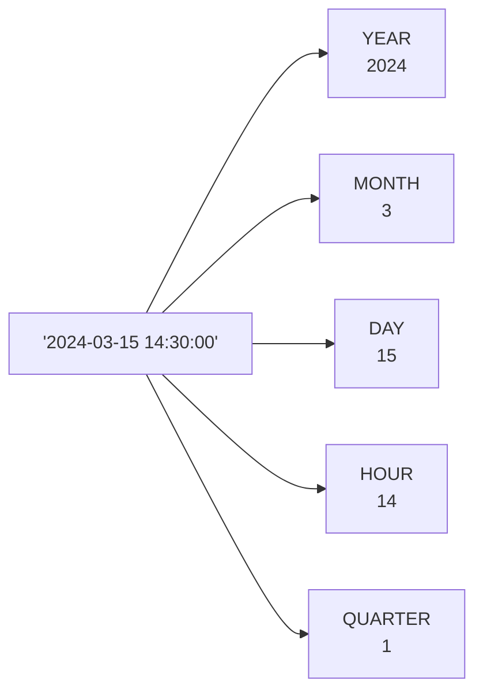

# 11강: 날짜 및 시간 함수

날짜/시간 함수는 데이터베이스마다 문법이 가장 크게 다른 영역 중 하나입니다. 이 강의에서는 SQLite를 기본으로 하되, MySQL과 PostgreSQL의 차이점을 탭으로 함께 보여줍니다.

SQLite는 날짜를 `YYYY-MM-DD` 또는 `YYYY-MM-DD HH:MM:SS` 형식의 텍스트로 저장합니다. 내장 함수를 사용하면 날짜의 일부를 추출하거나, 날짜 간 차이를 계산하거나, 보고서용으로 형식을 변환할 수 있습니다.



> 날짜/시간 값에서 필요한 부분만 추출할 수 있습니다.

## SUBSTR로 연도·월 추출

SQLite 날짜는 문자열이므로 `SUBSTR`을 사용하면 연도나 월을 빠르고 간단하게 추출할 수 있습니다.

```sql
-- 연도별 주문 수
SELECT
    SUBSTR(ordered_at, 1, 4) AS year,
    COUNT(*)                 AS order_count,
    SUM(total_amount)        AS annual_revenue
FROM orders
WHERE status NOT IN ('cancelled', 'returned')
GROUP BY SUBSTR(ordered_at, 1, 4)
ORDER BY year;
```

**결과:**

| year | order_count | annual_revenue |
| ---: | ----------: | -------------: |
| 2016 |         399 |      306223187 |
| 2017 |         608 |      628189049 |
| 2018 |        1444 |     1390778028 |
| ...  | ...         | ...            |

```sql
-- 2024년 월별 매출
SELECT
    SUBSTR(ordered_at, 1, 7) AS year_month,
    COUNT(*)                 AS orders,
    SUM(total_amount)        AS revenue
FROM orders
WHERE ordered_at LIKE '2024%'
  AND status NOT IN ('cancelled', 'returned')
GROUP BY SUBSTR(ordered_at, 1, 7)
ORDER BY year_month;
```

**결과:**

| year_month | orders | revenue   |
| ---------- | -----: | --------: |
| 2024-01    |    371 | 363769660 |
| 2024-02    |    367 | 383853446 |
| 2024-03    |    582 | 553727467 |
| ...        | ...    | ...       |

## DATE()와 strftime()

`DATE(expression, modifier, ...)`는 날짜 문자열을 반환합니다. `strftime(format, expression)`으로 원하는 형식으로 포맷할 수 있습니다.

=== "SQLite"
    ```sql
    -- Today's date
    SELECT DATE('now') AS today;
    ```

=== "MySQL"
    ```sql
    -- Today's date
    SELECT CURDATE() AS today;
    ```

=== "PostgreSQL"
    ```sql
    -- Today's date
    SELECT CURRENT_DATE AS today;
    ```

---

=== "SQLite"
    ```sql
    -- Last 30 days orders
    SELECT order_number, ordered_at, total_amount
    FROM orders
    WHERE ordered_at >= DATE('now', '-30 days')
    ORDER BY ordered_at DESC
    LIMIT 5;
    ```

=== "MySQL"
    ```sql
    -- Last 30 days orders
    SELECT order_number, ordered_at, total_amount
    FROM orders
    WHERE ordered_at >= DATE_SUB(CURDATE(), INTERVAL 30 DAY)
    ORDER BY ordered_at DESC
    LIMIT 5;
    ```

=== "PostgreSQL"
    ```sql
    -- Last 30 days orders
    SELECT order_number, ordered_at, total_amount
    FROM orders
    WHERE ordered_at >= CURRENT_DATE - INTERVAL '30 days'
    ORDER BY ordered_at DESC
    LIMIT 5;
    ```

---

=== "SQLite"
    ```sql
    -- Day of week analysis (0=Sunday, 6=Saturday)
    SELECT
        CASE CAST(strftime('%w', ordered_at) AS INTEGER)
            WHEN 0 THEN '일요일'
            WHEN 1 THEN '월요일'
            WHEN 2 THEN '화요일'
            WHEN 3 THEN '수요일'
            WHEN 4 THEN '목요일'
            WHEN 5 THEN '금요일'
            WHEN 6 THEN '토요일'
        END AS day_of_week,
        COUNT(*) AS order_count
    FROM orders
    GROUP BY strftime('%w', ordered_at)
    ORDER BY CAST(strftime('%w', ordered_at) AS INTEGER);
    ```

=== "MySQL"
    ```sql
    -- Day of week analysis (1=Sunday, 7=Saturday)
    SELECT
        CASE DAYOFWEEK(ordered_at)
            WHEN 1 THEN '일요일'
            WHEN 2 THEN '월요일'
            WHEN 3 THEN '화요일'
            WHEN 4 THEN '수요일'
            WHEN 5 THEN '목요일'
            WHEN 6 THEN '금요일'
            WHEN 7 THEN '토요일'
        END AS day_of_week,
        COUNT(*) AS order_count
    FROM orders
    GROUP BY DAYOFWEEK(ordered_at)
    ORDER BY DAYOFWEEK(ordered_at);
    ```

=== "PostgreSQL"
    ```sql
    -- Day of week analysis (0=Sunday, 6=Saturday)
    SELECT
        CASE EXTRACT(DOW FROM ordered_at::date)
            WHEN 0 THEN '일요일'
            WHEN 1 THEN '월요일'
            WHEN 2 THEN '화요일'
            WHEN 3 THEN '수요일'
            WHEN 4 THEN '목요일'
            WHEN 5 THEN '금요일'
            WHEN 6 THEN '토요일'
        END AS day_of_week,
        COUNT(*) AS order_count
    FROM orders
    GROUP BY EXTRACT(DOW FROM ordered_at::date)
    ORDER BY EXTRACT(DOW FROM ordered_at::date);
    ```

**결과:**

| day_of_week | order_count |
|-------------|------------:|
| 일요일 | 4823 |
| 월요일 | 5012 |
| 화요일 | 4991 |
| 수요일 | 5134 |
| 목요일 | 5089 |
| 금요일 | 5247 |
| 토요일 | 4393 |

## julianday() — 날짜 차이 계산

`julianday()`는 날짜를 부동소수점 율리우스 일수(Julian Day Number)로 변환합니다. 두 값을 빼면 일(day) 단위 차이를 구할 수 있습니다.

=== "SQLite"
    ```sql
    -- How many days between order and delivery?
    SELECT
        o.order_number,
        o.ordered_at,
        s.delivered_at,
        ROUND(julianday(s.delivered_at) - julianday(o.ordered_at), 1) AS delivery_days
    FROM orders AS o
    INNER JOIN shipping AS s ON s.order_id = o.id
    WHERE s.delivered_at IS NOT NULL
    ORDER BY delivery_days DESC
    LIMIT 8;
    ```

=== "MySQL"
    ```sql
    -- How many days between order and delivery?
    SELECT
        o.order_number,
        o.ordered_at,
        s.delivered_at,
        DATEDIFF(s.delivered_at, o.ordered_at) AS delivery_days
    FROM orders AS o
    INNER JOIN shipping AS s ON s.order_id = o.id
    WHERE s.delivered_at IS NOT NULL
    ORDER BY delivery_days DESC
    LIMIT 8;
    ```

=== "PostgreSQL"
    ```sql
    -- How many days between order and delivery?
    SELECT
        o.order_number,
        o.ordered_at,
        s.delivered_at,
        s.delivered_at::date - o.ordered_at::date AS delivery_days
    FROM orders AS o
    INNER JOIN shipping AS s ON s.order_id = o.id
    WHERE s.delivered_at IS NOT NULL
    ORDER BY delivery_days DESC
    LIMIT 8;
    ```

**결과:**

| order_number | ordered_at | delivered_at | delivery_days |
|--------------|------------|--------------|--------------:|
| ORD-20190822-03421 | 2019-08-22 | 2019-09-08 | 17.0 |
| ORD-20201103-04812 | 2020-11-03 | 2020-11-18 | 15.0 |
| ... | | | |

=== "SQLite"
    ```sql
    -- Average delivery days per carrier
    SELECT
        s.carrier,
        COUNT(*)  AS deliveries,
        ROUND(AVG(julianday(s.delivered_at) - julianday(o.ordered_at)), 1) AS avg_days
    FROM shipping AS s
    INNER JOIN orders AS o ON s.order_id = o.id
    WHERE s.delivered_at IS NOT NULL
    GROUP BY s.carrier
    ORDER BY avg_days;
    ```

=== "MySQL"
    ```sql
    -- Average delivery days per carrier
    SELECT
        s.carrier,
        COUNT(*)  AS deliveries,
        ROUND(AVG(DATEDIFF(s.delivered_at, o.ordered_at)), 1) AS avg_days
    FROM shipping AS s
    INNER JOIN orders AS o ON s.order_id = o.id
    WHERE s.delivered_at IS NOT NULL
    GROUP BY s.carrier
    ORDER BY avg_days;
    ```

=== "PostgreSQL"
    ```sql
    -- Average delivery days per carrier
    SELECT
        s.carrier,
        COUNT(*)  AS deliveries,
        ROUND(AVG(s.delivered_at::date - o.ordered_at::date), 1) AS avg_days
    FROM shipping AS s
    INNER JOIN orders AS o ON s.order_id = o.id
    WHERE s.delivered_at IS NOT NULL
    GROUP BY s.carrier
    ORDER BY avg_days;
    ```

**결과:**

| carrier | deliveries | avg_days |
|---------|-----------:|---------:|
| CJ대한통운 | 8341 | 2.8 |
| 한진택배 | 7892 | 3.1 |
| 우체국택배 | 9214 | 4.2 |
| 롯데택배 | 7495 | 3.6 |

## 고객 나이 계산

=== "SQLite"
    ```sql
    -- Customer age from birth_date
    SELECT
        name,
        birth_date,
        CAST(
            (julianday('now') - julianday(birth_date)) / 365.25
        AS INTEGER) AS age
    FROM customers
    WHERE birth_date IS NOT NULL
    ORDER BY age DESC
    LIMIT 8;
    ```

=== "MySQL"
    ```sql
    -- Customer age from birth_date
    SELECT
        name,
        birth_date,
        TIMESTAMPDIFF(YEAR, birth_date, CURDATE()) AS age
    FROM customers
    WHERE birth_date IS NOT NULL
    ORDER BY age DESC
    LIMIT 8;
    ```

=== "PostgreSQL"
    ```sql
    -- Customer age from birth_date
    SELECT
        name,
        birth_date,
        EXTRACT(YEAR FROM AGE(CURRENT_DATE, birth_date))::int AS age
    FROM customers
    WHERE birth_date IS NOT NULL
    ORDER BY age DESC
    LIMIT 8;
    ```

**결과:**

| name | birth_date | age |
|------|------------|----:|
| 김복순 | 1951-02-18 | 73 |
| 이순례 | 1952-08-30 | 72 |
| ... | | |

## 주차 및 분기 추출

=== "SQLite"
    ```sql
    -- Quarterly revenue
    SELECT
        SUBSTR(ordered_at, 1, 4) AS year,
        CASE
            WHEN CAST(SUBSTR(ordered_at, 6, 2) AS INTEGER) BETWEEN 1 AND 3  THEN 'Q1'
            WHEN CAST(SUBSTR(ordered_at, 6, 2) AS INTEGER) BETWEEN 4 AND 6  THEN 'Q2'
            WHEN CAST(SUBSTR(ordered_at, 6, 2) AS INTEGER) BETWEEN 7 AND 9  THEN 'Q3'
            ELSE 'Q4'
        END AS quarter,
        SUM(total_amount) AS revenue
    FROM orders
    WHERE status NOT IN ('cancelled', 'returned')
      AND ordered_at LIKE '2024%'
    GROUP BY year, quarter
    ORDER BY year, quarter;
    ```

=== "MySQL"
    ```sql
    -- Quarterly revenue
    SELECT
        YEAR(ordered_at) AS year,
        CONCAT('Q', QUARTER(ordered_at)) AS quarter,
        SUM(total_amount) AS revenue
    FROM orders
    WHERE status NOT IN ('cancelled', 'returned')
      AND YEAR(ordered_at) = 2024
    GROUP BY YEAR(ordered_at), QUARTER(ordered_at)
    ORDER BY year, quarter;
    ```

=== "PostgreSQL"
    ```sql
    -- Quarterly revenue
    SELECT
        EXTRACT(YEAR FROM ordered_at::date)::int AS year,
        'Q' || EXTRACT(QUARTER FROM ordered_at::date)::int AS quarter,
        SUM(total_amount) AS revenue
    FROM orders
    WHERE status NOT IN ('cancelled', 'returned')
      AND EXTRACT(YEAR FROM ordered_at::date) = 2024
    GROUP BY
        EXTRACT(YEAR FROM ordered_at::date),
        EXTRACT(QUARTER FROM ordered_at::date)
    ORDER BY year, quarter;
    ```

**결과:**

| year | quarter | revenue |
|-----:|---------|--------:|
| 2024 | Q1 | 488246.20 |
| 2024 | Q2 | 523891.40 |
| 2024 | Q3 | 612347.80 |
| 2024 | Q4 | 1218807.10 |

!!! note "레슨 복습 문제"
    이 레슨에서 배운 개념을 바로 확인하는 간단한 문제입니다. 여러 개념을 종합하는 실전 연습은 [연습 문제](../exercises/index.md) 섹션을 참고하세요.

## 연습 문제
### 연습 1
2024년 3월에 주문된 건의 `order_number`, `ordered_at`, `total_amount`를 조회하세요. 날짜 범위 필터링을 사용하고, 주문일 오름차순으로 정렬하세요.

??? success "정답"
    ```sql
    SELECT order_number, ordered_at, total_amount
    FROM orders
    WHERE ordered_at >= '2024-03-01'
      AND ordered_at <  '2024-04-01'
    ORDER BY ordered_at ASC;
    ```

    **결과 (예시):**

    | order_number       | ordered_at          | total_amount |
    | ------------------ | ------------------- | -----------: |
    | ORD-20240301-27091 | 2024-03-01 07:36:13 |        57000 |
    | ORD-20240301-27097 | 2024-03-01 09:11:37 |       114800 |
    | ORD-20240301-27092 | 2024-03-01 09:47:39 |       189100 |
    | ORD-20240301-27099 | 2024-03-01 09:52:24 |      2568500 |
    | ORD-20240301-27103 | 2024-03-01 10:15:18 |      2433600 |
    | ...                | ...                 | ...          |


### 연습 2
직원의 근속 연수를 계산하세요. `name`, `hired_at`, `years_worked`를 반환하고, 활성 직원만 포함합니다. 근속 연수가 긴 순으로 정렬하세요.

??? success "정답"
    === "SQLite"
        ```sql
        SELECT
            name,
            hired_at,
            CAST(
                (julianday('now') - julianday(hired_at)) / 365.25
            AS INTEGER) AS years_worked
        FROM staff
        WHERE is_active = 1
        ORDER BY years_worked DESC;
        ```

        **결과 (예시):**

        | name | hired_at   | years_worked |
        | ---- | ---------- | -----------: |
        | 한민재  | 2016-05-23 |            9 |
        | 장주원  | 2017-08-20 |            8 |
        | 이준혁  | 2022-03-02 |            4 |
        | 박경수  | 2022-10-12 |            3 |
        | 권영희  | 2024-08-05 |            1 |


    === "MySQL"
        ```sql
        SELECT
            name,
            hired_at,
            TIMESTAMPDIFF(YEAR, hired_at, CURDATE()) AS years_worked
        FROM staff
        WHERE is_active = 1
        ORDER BY years_worked DESC;
        ```

    === "PostgreSQL"
        ```sql
        SELECT
            name,
            hired_at,
            EXTRACT(YEAR FROM AGE(CURRENT_DATE, hired_at))::int AS years_worked
        FROM staff
        WHERE is_active = 1
        ORDER BY years_worked DESC;
        ```


### 연습 3
고객의 나이를 계산하여 `name`, `birth_date`, `age`를 반환하세요. `birth_date`가 NULL인 고객은 제외하고, 나이가 많은 순으로 10행까지 정렬하세요.

??? success "정답"
    === "SQLite"
        ```sql
        SELECT
            name,
            birth_date,
            CAST(
                (julianday('now') - julianday(birth_date)) / 365.25
            AS INTEGER) AS age
        FROM customers
        WHERE birth_date IS NOT NULL
        ORDER BY age DESC
        LIMIT 10;
        ```

        **결과 (예시):**

        | name | birth_date | age |
        | ---- | ---------- | --: |
        | 강성민  | 1960-04-02 |  66 |
        | 박예지  | 1960-01-11 |  66 |
        | 양중수  | 1960-02-22 |  66 |
        | 김정순  | 1960-04-09 |  66 |
        | 박승민  | 1960-02-04 |  66 |
        | ...  | ...        | ... |


    === "MySQL"
        ```sql
        SELECT
            name,
            birth_date,
            TIMESTAMPDIFF(YEAR, birth_date, CURDATE()) AS age
        FROM customers
        WHERE birth_date IS NOT NULL
        ORDER BY age DESC
        LIMIT 10;
        ```

    === "PostgreSQL"
        ```sql
        SELECT
            name,
            birth_date,
            EXTRACT(YEAR FROM AGE(CURRENT_DATE, birth_date))::int AS age
        FROM customers
        WHERE birth_date IS NOT NULL
        ORDER BY age DESC
        LIMIT 10;
        ```


### 연습 4
고객의 가입일(`created_at`)과 마지막 로그인(`last_login_at`) 사이의 일수 차이를 계산하세요. 두 날짜가 모두 있는 활성 고객만 포함합니다. `name`, `created_at`, `last_login_at`, `active_days`를 반환하고, `active_days` 내림차순으로 10행까지 정렬하세요.

??? success "정답"
    === "SQLite"
        ```sql
        SELECT
            name,
            created_at,
            last_login_at,
            CAST(julianday(last_login_at) - julianday(created_at) AS INTEGER) AS active_days
        FROM customers
        WHERE is_active = 1
          AND last_login_at IS NOT NULL
        ORDER BY active_days DESC
        LIMIT 10;
        ```

        **결과 (예시):**

        | name | created_at          | last_login_at       | active_days |
        | ---- | ------------------- | ------------------- | ----------: |
        | 강은서  | 2016-01-14 06:39:08 | 2025-06-29 16:32:45 |        3454 |
        | 유현지  | 2016-01-05 22:02:29 | 2025-06-13 23:18:42 |        3447 |
        | 이명자  | 2016-01-31 06:55:50 | 2025-06-23 17:07:32 |        3431 |
        | 이영자  | 2016-01-09 06:08:34 | 2025-05-06 04:21:40 |        3404 |
        | 김준서  | 2016-02-11 06:00:14 | 2025-05-13 15:45:24 |        3379 |
        | ...  | ...                 | ...                 | ...         |


    === "MySQL"
        ```sql
        SELECT
            name,
            created_at,
            last_login_at,
            DATEDIFF(last_login_at, created_at) AS active_days
        FROM customers
        WHERE is_active = 1
          AND last_login_at IS NOT NULL
        ORDER BY active_days DESC
        LIMIT 10;
        ```

    === "PostgreSQL"
        ```sql
        SELECT
            name,
            created_at,
            last_login_at,
            last_login_at::date - created_at::date AS active_days
        FROM customers
        WHERE is_active = 1
          AND last_login_at IS NOT NULL
        ORDER BY active_days DESC
        LIMIT 10;
        ```


### 연습 5
쇼핑몰 개업 이후 연도별 신규 고객 수를 구하세요. `year`와 `new_customers`를 반환하고, 연도 오름차순으로 정렬하세요.

??? success "정답"
    ```sql
    SELECT
        SUBSTR(created_at, 1, 4) AS year,
        COUNT(*)                 AS new_customers
    FROM customers
    GROUP BY SUBSTR(created_at, 1, 4)
    ORDER BY year;
    ```

    **결과 (예시):**

    | year | new_customers |
    | ---: | ------------: |
    | 2016 |           100 |
    | 2017 |           180 |
    | 2018 |           300 |
    | 2019 |           450 |
    | 2020 |           700 |
    | ...  | ...           |


### 연습 6
주문에서 연도와 월을 추출하여 `order_year`, `order_month`, `order_count`를 반환하세요. 2023년 주문만 대상으로, 월 오름차순으로 정렬하세요.

??? success "정답"
    === "SQLite"
        ```sql
        SELECT
            SUBSTR(ordered_at, 1, 4) AS order_year,
            SUBSTR(ordered_at, 6, 2) AS order_month,
            COUNT(*) AS order_count
        FROM orders
        WHERE ordered_at LIKE '2023%'
        GROUP BY SUBSTR(ordered_at, 1, 4), SUBSTR(ordered_at, 6, 2)
        ORDER BY order_month ASC;
        ```

        **결과 (예시):**

        | order_year | order_month | order_count |
        | ---------: | ----------: | ----------: |
        |       2023 |          01 |         317 |
        |       2023 |          02 |         314 |
        |       2023 |          03 |         470 |
        |       2023 |          04 |         369 |
        |       2023 |          05 |         415 |
        | ...        | ...         | ...         |


    === "MySQL"
        ```sql
        SELECT
            YEAR(ordered_at)  AS order_year,
            MONTH(ordered_at) AS order_month,
            COUNT(*) AS order_count
        FROM orders
        WHERE YEAR(ordered_at) = 2023
        GROUP BY YEAR(ordered_at), MONTH(ordered_at)
        ORDER BY order_month ASC;
        ```

    === "PostgreSQL"
        ```sql
        SELECT
            EXTRACT(YEAR FROM ordered_at::date)::int  AS order_year,
            EXTRACT(MONTH FROM ordered_at::date)::int AS order_month,
            COUNT(*) AS order_count
        FROM orders
        WHERE EXTRACT(YEAR FROM ordered_at::date) = 2023
        GROUP BY
            EXTRACT(YEAR FROM ordered_at::date),
            EXTRACT(MONTH FROM ordered_at::date)
        ORDER BY order_month ASC;
        ```


### 연습 7
리뷰가 작성된 월별로 리뷰 수와 평균 평점을 집계하세요. 2024년 리뷰만 대상으로, `review_month`, `review_count`, `avg_rating`(소수점 2자리)을 반환하고, 월 오름차순으로 정렬하세요.

??? success "정답"
    === "SQLite"
        ```sql
        SELECT
            SUBSTR(created_at, 6, 2) AS review_month,
            COUNT(*)                 AS review_count,
            ROUND(AVG(rating), 2)    AS avg_rating
        FROM reviews
        WHERE created_at LIKE '2024%'
        GROUP BY SUBSTR(created_at, 6, 2)
        ORDER BY review_month ASC;
        ```

        **결과 (예시):**

        | review_month | review_count | avg_rating |
        | -----------: | -----------: | ---------: |
        |           01 |          108 |       3.97 |
        |           02 |           82 |       3.82 |
        |           03 |          112 |       3.93 |
        |           04 |          116 |       4.01 |
        |           05 |           92 |       3.84 |
        | ...          | ...          | ...        |


    === "MySQL"
        ```sql
        SELECT
            MONTH(created_at)     AS review_month,
            COUNT(*)              AS review_count,
            ROUND(AVG(rating), 2) AS avg_rating
        FROM reviews
        WHERE YEAR(created_at) = 2024
        GROUP BY MONTH(created_at)
        ORDER BY review_month ASC;
        ```

    === "PostgreSQL"
        ```sql
        SELECT
            EXTRACT(MONTH FROM created_at::date)::int AS review_month,
            COUNT(*)              AS review_count,
            ROUND(AVG(rating), 2) AS avg_rating
        FROM reviews
        WHERE EXTRACT(YEAR FROM created_at::date) = 2024
        GROUP BY EXTRACT(MONTH FROM created_at::date)
        ORDER BY review_month ASC;
        ```


### 연습 8
배송 완료(`delivered_at`이 NOT NULL)된 주문 중 배송 소요일이 7일 이상인 건을 찾으세요. `order_number`, `ordered_at`, `delivered_at`, `delivery_days`를 반환하고, 소요일 내림차순으로 10행까지 정렬하세요.

??? success "정답"
    === "SQLite"
        ```sql
        SELECT
            o.order_number,
            o.ordered_at,
            s.delivered_at,
            ROUND(julianday(s.delivered_at) - julianday(o.ordered_at), 1) AS delivery_days
        FROM orders AS o
        INNER JOIN shipping AS s ON s.order_id = o.id
        WHERE s.delivered_at IS NOT NULL
          AND julianday(s.delivered_at) - julianday(o.ordered_at) >= 7
        ORDER BY delivery_days DESC
        LIMIT 10;
        ```

        **결과 (예시):**

        | order_number       | ordered_at          | delivered_at        | delivery_days |
        | ------------------ | ------------------- | ------------------- | ------------: |
        | ORD-20160111-00016 | 2016-01-11 11:26:10 | 2016-01-18 11:26:10 |             7 |
        | ORD-20160114-00020 | 2016-01-14 10:32:57 | 2016-01-21 10:32:57 |             7 |
        | ORD-20160118-00025 | 2016-01-18 17:56:53 | 2016-01-25 17:56:53 |             7 |
        | ORD-20160130-00037 | 2016-02-03 04:55:50 | 2016-02-10 04:55:50 |             7 |
        | ORD-20160223-00062 | 2016-02-23 15:01:49 | 2016-03-01 15:01:49 |             7 |
        | ...                | ...                 | ...                 | ...           |


    === "MySQL"
        ```sql
        SELECT
            o.order_number,
            o.ordered_at,
            s.delivered_at,
            DATEDIFF(s.delivered_at, o.ordered_at) AS delivery_days
        FROM orders AS o
        INNER JOIN shipping AS s ON s.order_id = o.id
        WHERE s.delivered_at IS NOT NULL
          AND DATEDIFF(s.delivered_at, o.ordered_at) >= 7
        ORDER BY delivery_days DESC
        LIMIT 10;
        ```

    === "PostgreSQL"
        ```sql
        SELECT
            o.order_number,
            o.ordered_at,
            s.delivered_at,
            s.delivered_at::date - o.ordered_at::date AS delivery_days
        FROM orders AS o
        INNER JOIN shipping AS s ON s.order_id = o.id
        WHERE s.delivered_at IS NOT NULL
          AND s.delivered_at::date - o.ordered_at::date >= 7
        ORDER BY delivery_days DESC
        LIMIT 10;
        ```


### 연습 9
평균 주문 금액이 가장 높은 요일을 구하세요. `strftime('%w', ordered_at)` (0=일요일)을 사용하고, `CASE` 표현식으로 숫자를 요일 이름으로 변환하세요. `day_of_week`, `order_count`, `avg_order_value`를 반환하세요.

??? success "정답"
    === "SQLite"
        ```sql
        SELECT
            CASE CAST(strftime('%w', ordered_at) AS INTEGER)
                WHEN 0 THEN '일요일'
                WHEN 1 THEN '월요일'
                WHEN 2 THEN '화요일'
                WHEN 3 THEN '수요일'
                WHEN 4 THEN '목요일'
                WHEN 5 THEN '금요일'
                WHEN 6 THEN '토요일'
            END AS day_of_week,
            COUNT(*)              AS order_count,
            ROUND(AVG(total_amount), 2) AS avg_order_value
        FROM orders
        WHERE status NOT IN ('cancelled', 'returned')
        GROUP BY strftime('%w', ordered_at)
        ORDER BY avg_order_value DESC;
        ```

        **결과 (예시):**

        | day_of_week | order_count | avg_order_value |
        | ----------- | ----------: | --------------: |
        | 월요일         |        5187 |      1037883.42 |
        | 수요일         |        4194 |      1020696.87 |
        | 금요일         |        4380 |         1016079 |
        | 목요일         |        4200 |      1014212.87 |
        | 일요일         |        5144 |      1011256.01 |
        | ...         | ...         | ...             |


    === "MySQL"
        ```sql
        SELECT
            CASE DAYOFWEEK(ordered_at)
                WHEN 1 THEN '일요일'
                WHEN 2 THEN '월요일'
                WHEN 3 THEN '화요일'
                WHEN 4 THEN '수요일'
                WHEN 5 THEN '목요일'
                WHEN 6 THEN '금요일'
                WHEN 7 THEN '토요일'
            END AS day_of_week,
            COUNT(*)              AS order_count,
            ROUND(AVG(total_amount), 2) AS avg_order_value
        FROM orders
        WHERE status NOT IN ('cancelled', 'returned')
        GROUP BY DAYOFWEEK(ordered_at)
        ORDER BY avg_order_value DESC;
        ```

    === "PostgreSQL"
        ```sql
        SELECT
            CASE EXTRACT(DOW FROM ordered_at::date)
                WHEN 0 THEN '일요일'
                WHEN 1 THEN '월요일'
                WHEN 2 THEN '화요일'
                WHEN 3 THEN '수요일'
                WHEN 4 THEN '목요일'
                WHEN 5 THEN '금요일'
                WHEN 6 THEN '토요일'
            END AS day_of_week,
            COUNT(*)              AS order_count,
            ROUND(AVG(total_amount), 2) AS avg_order_value
        FROM orders
        WHERE status NOT IN ('cancelled', 'returned')
        GROUP BY EXTRACT(DOW FROM ordered_at::date)
        ORDER BY avg_order_value DESC;
        ```


### 연습 10
택배사별로 `ordered_at`부터 `shipped_at`(배송 테이블)까지의 평균 처리 일수를 계산하세요. 두 날짜가 모두 있는 행만 포함하고, `carrier`, `shipment_count`, `avg_processing_days`를 `avg_processing_days` 오름차순으로 반환하세요.

??? success "정답"
    === "SQLite"
        ```sql
        SELECT
            s.carrier,
            COUNT(*) AS shipment_count,
            ROUND(
                AVG(julianday(s.shipped_at) - julianday(o.ordered_at)),
                1
            ) AS avg_processing_days
        FROM shipping AS s
        INNER JOIN orders AS o ON s.order_id = o.id
        WHERE s.shipped_at IS NOT NULL
        GROUP BY s.carrier
        ORDER BY avg_processing_days ASC;
        ```

        **결과 (예시):**

        | carrier | shipment_count | avg_processing_days |
        | ------- | -------------: | ------------------: |
        | CJ대한통운  |          13083 |                   2 |
        | 로젠택배    |           6678 |                   2 |
        | 우체국택배   |           4985 |                   2 |
        | 한진택배    |           8340 |                   2 |


    === "MySQL"
        ```sql
        SELECT
            s.carrier,
            COUNT(*) AS shipment_count,
            ROUND(
                AVG(DATEDIFF(s.shipped_at, o.ordered_at)),
                1
            ) AS avg_processing_days
        FROM shipping AS s
        INNER JOIN orders AS o ON s.order_id = o.id
        WHERE s.shipped_at IS NOT NULL
        GROUP BY s.carrier
        ORDER BY avg_processing_days ASC;
        ```

    === "PostgreSQL"
        ```sql
        SELECT
            s.carrier,
            COUNT(*) AS shipment_count,
            ROUND(
                AVG(s.shipped_at::date - o.ordered_at::date),
                1
            ) AS avg_processing_days
        FROM shipping AS s
        INNER JOIN orders AS o ON s.order_id = o.id
        WHERE s.shipped_at IS NOT NULL
        GROUP BY s.carrier
        ORDER BY avg_processing_days ASC;
        ```


---
다음: [12강: 문자열 함수](12-string.md)
