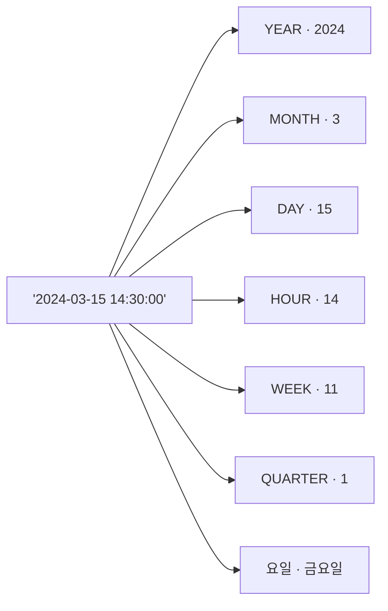

# 11강: 날짜 및 시간 함수

[10강](10-subqueries.md)에서 서브쿼리를 배웠습니다. 실무에서 '이번 달 매출', '가입 후 첫 주문까지 며칠?'같은 질문이 자주 나옵니다. 날짜/시간 함수를 사용하면 날짜를 추출하고, 계산하고, 포맷을 바꿀 수 있습니다.

!!! note "이미 알고 계신다면"
    날짜 추출, 날짜 계산, 포맷 변환, DB별 차이에 익숙하다면 [12강: 문자열 함수](12-string.md)로 건너뛰세요.

날짜/시간 함수는 데이터베이스마다 문법이 가장 크게 다른 영역 중 하나입니다. 이 강의에서는 SQLite를 기본으로 하되, MySQL과 PostgreSQL의 차이점을 탭으로 함께 보여줍니다.

SQLite는 날짜를 `YYYY-MM-DD` 또는 `YYYY-MM-DD HH:MM:SS` 형식의 텍스트로 저장합니다. 내장 함수를 사용하면 날짜의 일부를 추출하거나, 날짜 간 차이를 계산하거나, 보고서용으로 형식을 변환할 수 있습니다.



> 하나의 날짜/시간 값에서 연도, 월, 일, 시간, 주차, 분기, 요일 등 필요한 부분을 추출할 수 있습니다.

## SUBSTR로 연도·월 추출

SQLite 날짜는 문자열이므로 `SUBSTR`을 사용하면 연도나 월을 빠르고 간단하게 추출할 수 있습니다.

```sql
-- 연도별 주문 수
SELECT
    SUBSTR(ordered_at, 1, 4) AS year,
    COUNT(*)                 AS order_count,
    SUM(total_amount)        AS annual_revenue
FROM orders
WHERE status NOT IN ('cancelled', 'returned')
GROUP BY SUBSTR(ordered_at, 1, 4)
ORDER BY year;
```

**결과:**

| year | order_count | annual_revenue |
| ---------- | ----------: | ----------: |
| 2016 | 7002 | 7186536080.0 |
| 2017 | 10710 | 11188959996.0 |
| 2018 | 19356 | 20309091899.0 |
| 2019 | 26981 | 28328279035.0 |
| 2020 | 43749 | 45447183212.0 |
| 2021 | 56519 | 58065333224.0 |
| 2022 | 55414 | 57233324746.0 |
| 2023 | 47910 | 49710423204.0 |
| ... | ... | ... |

```sql
-- 2024년 월별 매출
SELECT
    SUBSTR(ordered_at, 1, 7) AS year_month,
    COUNT(*)                 AS orders,
    SUM(total_amount)        AS revenue
FROM orders
WHERE ordered_at LIKE '2024%'
  AND status NOT IN ('cancelled', 'returned')
GROUP BY SUBSTR(ordered_at, 1, 7)
ORDER BY year_month;
```

**결과:**

| year_month | orders | revenue |
| ---------- | ----------: | ----------: |
| 2024-01 | 3857 | 3807789761.0 |
| 2024-02 | 4530 | 4701108852.0 |
| 2024-03 | 4903 | 4935663129.0 |
| 2024-04 | 4932 | 4954492231.0 |
| 2024-05 | 5001 | 4912114419.0 |
| 2024-06 | 3719 | 3853868900.0 |
| 2024-07 | 4454 | 4453107092.0 |
| 2024-08 | 4827 | 4903583071.0 |
| ... | ... | ... |

## DATE()와 strftime()

`DATE(expression, modifier, ...)`는 날짜 문자열을 반환합니다. `strftime(format, expression)`으로 원하는 형식으로 포맷할 수 있습니다.

=== "SQLite"
    ```sql
    -- Today's date
    SELECT DATE('now') AS today;
    ```

=== "MySQL"
    ```sql
    -- Today's date
    SELECT CURDATE() AS today;
    ```

=== "PostgreSQL"
    ```sql
    -- Today's date
    SELECT CURRENT_DATE AS today;
    ```

---

=== "SQLite"
    ```sql
    -- Last 30 days orders
    SELECT order_number, ordered_at, total_amount
    FROM orders
    WHERE ordered_at >= DATE('now', '-30 days')
    ORDER BY ordered_at DESC
    LIMIT 5;
    ```

=== "MySQL"
    ```sql
    -- Last 30 days orders
    SELECT order_number, ordered_at, total_amount
    FROM orders
    WHERE ordered_at >= DATE_SUB(CURDATE(), INTERVAL 30 DAY)
    ORDER BY ordered_at DESC
    LIMIT 5;
    ```

=== "PostgreSQL"
    ```sql
    -- Last 30 days orders
    SELECT order_number, ordered_at, total_amount
    FROM orders
    WHERE ordered_at >= CURRENT_DATE - INTERVAL '30 days'
    ORDER BY ordered_at DESC
    LIMIT 5;
    ```

---

=== "SQLite"
    ```sql
    -- Day of week analysis (0=Sunday, 6=Saturday)
    SELECT
        CASE CAST(strftime('%w', ordered_at) AS INTEGER)
            WHEN 0 THEN '일요일'
            WHEN 1 THEN '월요일'
            WHEN 2 THEN '화요일'
            WHEN 3 THEN '수요일'
            WHEN 4 THEN '목요일'
            WHEN 5 THEN '금요일'
            WHEN 6 THEN '토요일'
        END AS day_of_week,
        COUNT(*) AS order_count
    FROM orders
    GROUP BY strftime('%w', ordered_at)
    ORDER BY CAST(strftime('%w', ordered_at) AS INTEGER);
    ```

=== "MySQL"
    ```sql
    -- Day of week analysis (1=Sunday, 7=Saturday)
    SELECT
        CASE DAYOFWEEK(ordered_at)
            WHEN 1 THEN '일요일'
            WHEN 2 THEN '월요일'
            WHEN 3 THEN '화요일'
            WHEN 4 THEN '수요일'
            WHEN 5 THEN '목요일'
            WHEN 6 THEN '금요일'
            WHEN 7 THEN '토요일'
        END AS day_of_week,
        COUNT(*) AS order_count
    FROM orders
    GROUP BY DAYOFWEEK(ordered_at)
    ORDER BY DAYOFWEEK(ordered_at);
    ```

=== "PostgreSQL"
    ```sql
    -- Day of week analysis (0=Sunday, 6=Saturday)
    SELECT
        CASE EXTRACT(DOW FROM ordered_at::date)
            WHEN 0 THEN '일요일'
            WHEN 1 THEN '월요일'
            WHEN 2 THEN '화요일'
            WHEN 3 THEN '수요일'
            WHEN 4 THEN '목요일'
            WHEN 5 THEN '금요일'
            WHEN 6 THEN '토요일'
        END AS day_of_week,
        COUNT(*) AS order_count
    FROM orders
    GROUP BY EXTRACT(DOW FROM ordered_at::date)
    ORDER BY EXTRACT(DOW FROM ordered_at::date);
    ```

**결과:**

| day_of_week | order_count |
|-------------|------------:|
| 일요일 | 4823 |
| 월요일 | 5012 |
| 화요일 | 4991 |
| 수요일 | 5134 |
| 목요일 | 5089 |
| 금요일 | 5247 |
| 토요일 | 4393 |

## 시간 추출 — HOUR, MINUTE

날짜뿐만 아니라 **시간** 정보도 분석에 유용합니다. "시간대별 주문 집중도"는 운영 시간 결정, 서버 트래픽 예측 등에 자주 쓰입니다.

=== "SQLite"
    ```sql
    -- 시간대별 주문 건수
    SELECT
        CAST(strftime('%H', ordered_at) AS INTEGER) AS hour,
        COUNT(*) AS order_count
    FROM orders
    WHERE ordered_at LIKE '2024%'
    GROUP BY strftime('%H', ordered_at)
    ORDER BY hour;
    ```

=== "MySQL"
    ```sql
    -- 시간대별 주문 건수
    SELECT
        HOUR(ordered_at) AS hour,
        COUNT(*) AS order_count
    FROM orders
    WHERE ordered_at >= '2024-01-01'
      AND ordered_at <  '2025-01-01'
    GROUP BY HOUR(ordered_at)
    ORDER BY hour;
    ```

=== "PostgreSQL"
    ```sql
    -- 시간대별 주문 건수
    SELECT
        EXTRACT(HOUR FROM ordered_at)::int AS hour,
        COUNT(*) AS order_count
    FROM orders
    WHERE ordered_at >= '2024-01-01'
      AND ordered_at <  '2025-01-01'
    GROUP BY EXTRACT(HOUR FROM ordered_at)
    ORDER BY hour;
    ```

**결과 (예시):**

| hour | order_count |
| ---: | ----------: |
|    0 |         237 |
|    1 |         198 |
|    2 |         189 |
| ...  | ...         |
|   10 |         302 |
|   11 |         315 |
| ...  | ...         |

> SQLite는 `strftime('%H')` (문자열 반환), MySQL은 `HOUR()`, PostgreSQL은 `EXTRACT(HOUR FROM ...)` 를 사용합니다. 분(minute)도 `%M` / `MINUTE()` / `EXTRACT(MINUTE)` 로 같은 패턴입니다.

## 날짜 더하기 — 미래 날짜 계산

앞에서 `DATE('now', '-30 days')`로 과거 날짜를 구했습니다. 반대로 **미래 날짜**도 계산할 수 있습니다. "배송 예정일", "쿠폰 만료일", "구독 갱신일" 등이 대표적입니다.

=== "SQLite"
    ```sql
    -- 주문일로부터 7일 후 = 배송 예정일
    SELECT
        order_number,
        ordered_at,
        DATE(ordered_at, '+7 days') AS expected_delivery
    FROM orders
    WHERE ordered_at LIKE '2024-12%'
    ORDER BY ordered_at DESC
    LIMIT 5;
    ```

    SQLite modifier 예시: `'+1 month'`, `'+1 year'`, `'-3 hours'`, `'start of month'`

=== "MySQL"
    ```sql
    -- 주문일로부터 7일 후 = 배송 예정일
    SELECT
        order_number,
        ordered_at,
        DATE_ADD(ordered_at, INTERVAL 7 DAY) AS expected_delivery
    FROM orders
    WHERE ordered_at >= '2024-12-01'
      AND ordered_at <  '2025-01-01'
    ORDER BY ordered_at DESC
    LIMIT 5;
    ```

    MySQL에서는 `DATE_ADD(date, INTERVAL n UNIT)` 또는 `date + INTERVAL n UNIT` 를 사용합니다.

=== "PostgreSQL"
    ```sql
    -- 주문일로부터 7일 후 = 배송 예정일
    SELECT
        order_number,
        ordered_at,
        ordered_at::date + INTERVAL '7 days' AS expected_delivery
    FROM orders
    WHERE ordered_at >= '2024-12-01'
      AND ordered_at <  '2025-01-01'
    ORDER BY ordered_at DESC
    LIMIT 5;
    ```

    PostgreSQL은 `+ INTERVAL '값'` 구문을 사용합니다. `'1 month'`, `'2 hours'` 등 자유로운 표현이 가능합니다.

**결과 (예시):**

| order_number       | ordered_at          | expected_delivery |
| ------------------ | ------------------- | ----------------- |
| ORD-20241231-32070 | 2024-12-31 22:45:12 | 2025-01-07        |
| ORD-20241231-32068 | 2024-12-31 18:03:44 | 2025-01-07        |
| ...                | ...                 | ...               |

## 날짜 자르기 — 월초·연초 구하기

보고서에서 "이번 달 시작일", "올해 첫날"처럼 기간의 시작점이 필요할 때 사용합니다.

=== "SQLite"
    ```sql
    -- 이번 달 첫날, 올해 첫날
    SELECT
        DATE('now', 'start of month')  AS first_of_month,
        DATE('now', 'start of year')   AS first_of_year;
    ```

    ```sql
    -- 월별 첫 주문일과 마지막 주문일
    SELECT
        SUBSTR(ordered_at, 1, 7) AS month,
        MIN(DATE(ordered_at))    AS first_order,
        MAX(DATE(ordered_at))    AS last_order
    FROM orders
    WHERE ordered_at LIKE '2024%'
    GROUP BY SUBSTR(ordered_at, 1, 7)
    ORDER BY month;
    ```

=== "MySQL"
    ```sql
    -- 이번 달 첫날, 올해 첫날
    SELECT
        DATE_FORMAT(CURDATE(), '%Y-%m-01')     AS first_of_month,
        DATE_FORMAT(CURDATE(), '%Y-01-01')     AS first_of_year;

    -- 또는 LAST_DAY()로 월말 구하기
    SELECT LAST_DAY(CURDATE()) AS last_of_month;
    ```

=== "PostgreSQL"
    ```sql
    -- 이번 달 첫날, 올해 첫날
    SELECT
        DATE_TRUNC('month', CURRENT_DATE) AS first_of_month,
        DATE_TRUNC('year',  CURRENT_DATE) AS first_of_year;
    ```

    PostgreSQL의 `DATE_TRUNC`은 가장 직관적입니다. `'week'`, `'quarter'`, `'hour'` 등 다양한 단위를 지원합니다.

## 날짜 포맷 변환

같은 날짜를 다른 형식으로 출력할 수 있습니다. 보고서용 "2024년 3월 15일" 형식이나, 파일명용 "20240315" 형식 등이 필요할 때 사용합니다.

=== "SQLite"
    ```sql
    SELECT
        ordered_at,
        strftime('%Y년 %m월 %d일', ordered_at)       AS korean_format,
        strftime('%Y%m%d', ordered_at)               AS compact_format,
        strftime('%d/%m/%Y', ordered_at)              AS eu_format
    FROM orders
    LIMIT 3;
    ```

    | 코드 | 의미 | 예시 |
    |------|------|------|
    | `%Y` | 4자리 연도 | 2024 |
    | `%m` | 2자리 월 | 03 |
    | `%d` | 2자리 일 | 15 |
    | `%H` | 24시간 | 14 |
    | `%M` | 분 | 30 |
    | `%S` | 초 | 00 |
    | `%w` | 요일 (0=일) | 5 |
    | `%W` | 주차 (00-53) | 11 |
    | `%j` | 연중 일수 (001-366) | 075 |

=== "MySQL"
    ```sql
    SELECT
        ordered_at,
        DATE_FORMAT(ordered_at, '%Y년 %m월 %d일')  AS korean_format,
        DATE_FORMAT(ordered_at, '%Y%m%d')          AS compact_format,
        DATE_FORMAT(ordered_at, '%d/%m/%Y')         AS eu_format
    FROM orders
    LIMIT 3;
    ```

=== "PostgreSQL"
    ```sql
    SELECT
        ordered_at,
        TO_CHAR(ordered_at, 'YYYY"년" MM"월" DD"일"')  AS korean_format,
        TO_CHAR(ordered_at, 'YYYYMMDD')                AS compact_format,
        TO_CHAR(ordered_at, 'DD/MM/YYYY')               AS eu_format
    FROM orders
    LIMIT 3;
    ```

**결과 (예시):**

| ordered_at          | korean_format  | compact_format | eu_format  |
| ------------------- | -------------- | -------------- | ---------- |
| 2024-03-15 14:30:00 | 2024년 03월 15일 | 20240315       | 15/03/2024 |

## julianday() — 날짜 차이 계산

`julianday()`는 날짜를 부동소수점 율리우스 일수(Julian Day Number)로 변환합니다. 두 값을 빼면 일(day) 단위 차이를 구할 수 있습니다.

=== "SQLite"
    ```sql
    -- How many days between order and delivery?
    SELECT
        o.order_number,
        o.ordered_at,
        s.delivered_at,
        ROUND(julianday(s.delivered_at) - julianday(o.ordered_at), 1) AS delivery_days
    FROM orders AS o
    INNER JOIN shipping AS s ON s.order_id = o.id
    WHERE s.delivered_at IS NOT NULL
    ORDER BY delivery_days DESC
    LIMIT 8;
    ```

=== "MySQL"
    ```sql
    -- How many days between order and delivery?
    SELECT
        o.order_number,
        o.ordered_at,
        s.delivered_at,
        DATEDIFF(s.delivered_at, o.ordered_at) AS delivery_days
    FROM orders AS o
    INNER JOIN shipping AS s ON s.order_id = o.id
    WHERE s.delivered_at IS NOT NULL
    ORDER BY delivery_days DESC
    LIMIT 8;
    ```

=== "PostgreSQL"
    ```sql
    -- How many days between order and delivery?
    SELECT
        o.order_number,
        o.ordered_at,
        s.delivered_at,
        s.delivered_at::date - o.ordered_at::date AS delivery_days
    FROM orders AS o
    INNER JOIN shipping AS s ON s.order_id = o.id
    WHERE s.delivered_at IS NOT NULL
    ORDER BY delivery_days DESC
    LIMIT 8;
    ```

**결과:**

| order_number | ordered_at | delivered_at | delivery_days |
|--------------|------------|--------------|--------------:|
| ORD-20190822-03421 | 2019-08-22 | 2019-09-08 | 17.0 |
| ORD-20201103-04812 | 2020-11-03 | 2020-11-18 | 15.0 |
| ... | | | |

=== "SQLite"
    ```sql
    -- Average delivery days per carrier
    SELECT
        s.carrier,
        COUNT(*)  AS deliveries,
        ROUND(AVG(julianday(s.delivered_at) - julianday(o.ordered_at)), 1) AS avg_days
    FROM shipping AS s
    INNER JOIN orders AS o ON s.order_id = o.id
    WHERE s.delivered_at IS NOT NULL
    GROUP BY s.carrier
    ORDER BY avg_days;
    ```

=== "MySQL"
    ```sql
    -- Average delivery days per carrier
    SELECT
        s.carrier,
        COUNT(*)  AS deliveries,
        ROUND(AVG(DATEDIFF(s.delivered_at, o.ordered_at)), 1) AS avg_days
    FROM shipping AS s
    INNER JOIN orders AS o ON s.order_id = o.id
    WHERE s.delivered_at IS NOT NULL
    GROUP BY s.carrier
    ORDER BY avg_days;
    ```

=== "PostgreSQL"
    ```sql
    -- Average delivery days per carrier
    SELECT
        s.carrier,
        COUNT(*)  AS deliveries,
        ROUND(AVG(s.delivered_at::date - o.ordered_at::date), 1) AS avg_days
    FROM shipping AS s
    INNER JOIN orders AS o ON s.order_id = o.id
    WHERE s.delivered_at IS NOT NULL
    GROUP BY s.carrier
    ORDER BY avg_days;
    ```

**결과:**

| carrier | deliveries | avg_days |
|---------|-----------:|---------:|
| CJ대한통운 | 8341 | 2.8 |
| 한진택배 | 7892 | 3.1 |
| 우체국택배 | 9214 | 4.2 |
| 롯데택배 | 7495 | 3.6 |

## 고객 나이 계산

=== "SQLite"
    ```sql
    -- Customer age from birth_date
    SELECT
        name,
        birth_date,
        CAST(
            (julianday('now') - julianday(birth_date)) / 365.25
        AS INTEGER) AS age
    FROM customers
    WHERE birth_date IS NOT NULL
    ORDER BY age DESC
    LIMIT 8;
    ```

=== "MySQL"
    ```sql
    -- Customer age from birth_date
    SELECT
        name,
        birth_date,
        TIMESTAMPDIFF(YEAR, birth_date, CURDATE()) AS age
    FROM customers
    WHERE birth_date IS NOT NULL
    ORDER BY age DESC
    LIMIT 8;
    ```

=== "PostgreSQL"
    ```sql
    -- Customer age from birth_date
    SELECT
        name,
        birth_date,
        EXTRACT(YEAR FROM AGE(CURRENT_DATE, birth_date))::int AS age
    FROM customers
    WHERE birth_date IS NOT NULL
    ORDER BY age DESC
    LIMIT 8;
    ```

**결과:**

| name | birth_date | age |
|------|------------|----:|
| 김복순 | 1951-02-18 | 73 |
| 이순례 | 1952-08-30 | 72 |
| ... | | |

## 주차 및 분기 추출

### 주차 (Week Number)

"이번 주 매출"이나 "주간 보고서"를 만들 때 주차 번호가 필요합니다.

=== "SQLite"
    ```sql
    -- 2024년 주차별 주문 건수
    SELECT
        strftime('%W', ordered_at) AS week_number,
        COUNT(*)                   AS order_count
    FROM orders
    WHERE ordered_at LIKE '2024%'
    GROUP BY strftime('%W', ordered_at)
    ORDER BY week_number
    LIMIT 10;
    ```

    > `%W`는 월요일 기준 주차(00-53), `%w`는 요일(0-6)입니다. 혼동하지 않도록 주의하세요.

=== "MySQL"
    ```sql
    -- 2024년 주차별 주문 건수
    SELECT
        WEEK(ordered_at, 1) AS week_number,
        COUNT(*)            AS order_count
    FROM orders
    WHERE YEAR(ordered_at) = 2024
    GROUP BY WEEK(ordered_at, 1)
    ORDER BY week_number
    LIMIT 10;
    ```

    > `WEEK(date, 1)`에서 두 번째 인자 `1`은 월요일 시작 기준입니다. 생략하면 일요일 기준입니다.

=== "PostgreSQL"
    ```sql
    -- 2024년 주차별 주문 건수
    SELECT
        EXTRACT(WEEK FROM ordered_at::date)::int AS week_number,
        COUNT(*)                                  AS order_count
    FROM orders
    WHERE EXTRACT(YEAR FROM ordered_at::date) = 2024
    GROUP BY EXTRACT(WEEK FROM ordered_at::date)
    ORDER BY week_number
    LIMIT 10;
    ```

    > PostgreSQL의 `EXTRACT(WEEK)`은 ISO 8601 주차(월요일 시작, 1-53)를 반환합니다.

**결과 (예시):**

| week_number | order_count |
| ----------: | ----------: |
|           1 |          79 |
|           2 |          78 |
|           3 |          85 |
|           4 |          82 |
|           5 |          92 |
| ...         | ...         |

### 분기 (Quarter)

=== "SQLite"
    ```sql
    -- Quarterly revenue
    SELECT
        SUBSTR(ordered_at, 1, 4) AS year,
        CASE
            WHEN CAST(SUBSTR(ordered_at, 6, 2) AS INTEGER) BETWEEN 1 AND 3  THEN 'Q1'
            WHEN CAST(SUBSTR(ordered_at, 6, 2) AS INTEGER) BETWEEN 4 AND 6  THEN 'Q2'
            WHEN CAST(SUBSTR(ordered_at, 6, 2) AS INTEGER) BETWEEN 7 AND 9  THEN 'Q3'
            ELSE 'Q4'
        END AS quarter,
        SUM(total_amount) AS revenue
    FROM orders
    WHERE status NOT IN ('cancelled', 'returned')
      AND ordered_at LIKE '2024%'
    GROUP BY year, quarter
    ORDER BY year, quarter;
    ```

=== "MySQL"
    ```sql
    -- Quarterly revenue
    SELECT
        YEAR(ordered_at) AS year,
        CONCAT('Q', QUARTER(ordered_at)) AS quarter,
        SUM(total_amount) AS revenue
    FROM orders
    WHERE status NOT IN ('cancelled', 'returned')
      AND YEAR(ordered_at) = 2024
    GROUP BY YEAR(ordered_at), QUARTER(ordered_at)
    ORDER BY year, quarter;
    ```

=== "PostgreSQL"
    ```sql
    -- Quarterly revenue
    SELECT
        EXTRACT(YEAR FROM ordered_at::date)::int AS year,
        'Q' || EXTRACT(QUARTER FROM ordered_at::date)::int AS quarter,
        SUM(total_amount) AS revenue
    FROM orders
    WHERE status NOT IN ('cancelled', 'returned')
      AND EXTRACT(YEAR FROM ordered_at::date) = 2024
    GROUP BY
        EXTRACT(YEAR FROM ordered_at::date),
        EXTRACT(QUARTER FROM ordered_at::date)
    ORDER BY year, quarter;
    ```

**결과:**

| year | quarter | revenue |
|-----:|---------|--------:|
| 2024 | Q1 | 488246.20 |
| 2024 | Q2 | 523891.40 |
| 2024 | Q3 | 612347.80 |
| 2024 | Q4 | 1218807.10 |

## calendar 테이블 활용

TechShop 데이터베이스에는 `calendar` 테이블이 미리 준비되어 있습니다. 날짜, 요일, 주말 여부, 공휴일 정보가 들어있어 날짜 분석에 매우 유용합니다.

```sql
-- calendar 테이블 구조 확인
SELECT * FROM calendar WHERE year = 2024 LIMIT 5;
```

| date_key   | year | month | day | day_name | day_of_week | is_weekend | is_holiday | holiday_name |
| ---------- | ---: | ----: | --: | -------- | ----------: | ---------: | ---------: | ------------ |
| 2024-01-01 | 2024 |     1 |   1 | Monday   |           1 |          0 |          1 | 신정           |
| 2024-01-02 | 2024 |     1 |   2 | Tuesday  |           2 |          0 |          0 | (NULL)       |
| ...        | ...  | ...   | ... | ...      | ...         | ...        | ...        | ...          |

### 주문이 없었던 날 찾기

calendar를 기준으로 LEFT JOIN하면, 주문이 없는 날도 빠짐없이 확인할 수 있습니다.

```sql
SELECT
    c.date_key,
    c.day_name,
    c.is_weekend,
    c.is_holiday,
    c.holiday_name
FROM calendar AS c
LEFT JOIN orders AS o ON DATE(o.ordered_at) = c.date_key
WHERE o.id IS NULL
  AND c.year = 2024
ORDER BY c.date_key;
```

### 공휴일 vs 평일 매출 비교

```sql
SELECT
    CASE WHEN c.is_holiday = 1 THEN '공휴일'
         WHEN c.is_weekend = 1 THEN '주말'
         ELSE '평일'
    END AS day_type,
    COUNT(o.id)                  AS order_count,
    ROUND(AVG(o.total_amount), 2) AS avg_order_amount
FROM orders AS o
INNER JOIN calendar AS c ON DATE(o.ordered_at) = c.date_key
WHERE o.ordered_at LIKE '2024%'
  AND o.status NOT IN ('cancelled', 'returned')
GROUP BY day_type
ORDER BY avg_order_amount DESC;
```

> `calendar` 테이블이 없는 환경에서는 CTE로 날짜 시리즈를 생성하여 같은 패턴을 구현할 수 있습니다. 17강 CROSS JOIN 섹션에서 이 기법을 다룹니다.

## 정리

| 개념 | 설명 | 예시 |
|------|------|------

<!-- BEGIN_LESSON_EXERCISES -->

!!! note "레슨 복습 문제"
    이 레슨에서 배운 개념을 바로 확인하는 간단한 문제입니다. 여러 개념을 종합하는 실전 연습은 [연습 문제](../exercises/index.md) 섹션을 참고하세요.

### 문제 1
2024년 3월에 주문된 건의 `order_number`, `ordered_at`, `total_amount`를 조회하세요. 날짜 범위 필터링을 사용하고, 주문일 오름차순으로 정렬하세요.

??? success "정답"
    ```sql
    SELECT order_number, ordered_at, total_amount
    FROM orders
    WHERE ordered_at >= '2024-03-01'
    AND ordered_at <  '2024-04-01'
    ORDER BY ordered_at ASC;
    ```


    **실행 결과** (총 601행 중 상위 7행)

    | order_number | ordered_at | total_amount |
    |---|---|---|
    | ORD-20240301-26270 | 2024-03-01 08:34:44 | 442,400.00 |
    | ORD-20240301-26266 | 2024-03-01 10:52:51 | 1,535,100.00 |
    | ORD-20240301-26276 | 2024-03-01 11:20:49 | 132,049.00 |
    | ORD-20240301-26269 | 2024-03-01 12:01:36 | 1,594,600.00 |
    | ORD-20240301-26264 | 2024-03-01 12:19:23 | 212,717.00 |
    | ORD-20240301-26267 | 2024-03-01 12:44:10 | 144,200.00 |
    | ORD-20240301-26265 | 2024-03-01 12:51:29 | 105,900.00 |

### 문제 2
직원의 근속 연수를 계산하세요. `name`, `hired_at`, `years_worked`를 반환하고, 활성 직원만 포함합니다. 근속 연수가 긴 순으로 정렬하세요.

??? success "정답"
    ```sql
    SELECT
    name,
    hired_at,
    CAST(
    (julianday('now') - julianday(hired_at)) / 365.25
    AS INTEGER) AS years_worked
    FROM staff
    WHERE is_active = 1
    ORDER BY years_worked DESC;
    ```


    **실행 결과** (5행)

    | name | hired_at | years_worked |
    |---|---|---|
    | 한민재 | 2016-05-23 | 9 |
    | 장주원 | 2017-08-20 | 8 |
    | 이준혁 | 2022-03-02 | 4 |
    | 박경수 | 2022-10-12 | 3 |
    | 권영희 | 2024-08-05 | 1 |

### 문제 3
고객의 나이를 계산하여 `name`, `birth_date`, `age`를 반환하세요. `birth_date`가 NULL인 고객은 제외하고, 나이가 많은 순으로 10행까지 정렬하세요.

??? success "정답"
    ```sql
    SELECT
    name,
    birth_date,
    CAST(
    (julianday('now') - julianday(birth_date)) / 365.25
    AS INTEGER) AS age
    FROM customers
    WHERE birth_date IS NOT NULL
    ORDER BY age DESC
    LIMIT 10;
    ```


    **실행 결과** (총 10행 중 상위 7행)

    | name | birth_date | age |
    |---|---|---|
    | 강성민 | 1960-04-02 | 66 |
    | 류유진 | 1960-02-22 | 66 |
    | 배하윤 | 1960-04-09 | 66 |
    | 김채원 | 1960-04-03 | 66 |
    | 김경숙 | 1960-02-04 | 66 |
    | 김정호 | 1960-01-18 | 66 |
    | 주현준 | 1960-01-11 | 66 |

### 문제 4
고객의 가입일(`created_at`)과 마지막 로그인(`last_login_at`) 사이의 일수 차이를 계산하세요. 두 날짜가 모두 있는 활성 고객만 포함합니다. `name`, `created_at`, `last_login_at`, `active_days`를 반환하고, `active_days` 내림차순으로 10행까지 정렬하세요.

??? success "정답"
    ```sql
    SELECT
    name,
    created_at,
    last_login_at,
    CAST(julianday(last_login_at) - julianday(created_at) AS INTEGER) AS active_days
    FROM customers
    WHERE is_active = 1
    AND last_login_at IS NOT NULL
    ORDER BY active_days DESC
    LIMIT 10;
    ```


    **실행 결과** (총 10행 중 상위 7행)

    | name | created_at | last_login_at | active_days |
    |---|---|---|---|
    | 강은서 | 2016-01-14 06:39:08 | 2025-12-30 16:32:45 | 3638 |
    | 유현지 | 2016-01-05 22:02:29 | 2025-12-14 23:18:42 | 3631 |
    | 이명자 | 2016-01-31 06:55:50 | 2025-12-24 17:07:32 | 3615 |
    | 이영자 | 2016-01-09 06:08:34 | 2025-11-06 04:21:40 | 3588 |
    | 김준서 | 2016-02-11 06:00:14 | 2025-11-13 15:45:24 | 3563 |
    | 남예준 | 2016-01-29 01:16:37 | 2025-10-16 00:34:44 | 3547 |
    | 안민석 | 2016-02-28 12:15:25 | 2025-11-08 09:25:59 | 3540 |

### 문제 5
쇼핑몰 개업 이후 연도별 신규 고객 수를 구하세요. `year`와 `new_customers`를 반환하고, 연도 오름차순으로 정렬하세요.

??? success "정답"
    ```sql
    SELECT
    SUBSTR(created_at, 1, 4) AS year,
    COUNT(*)                 AS new_customers
    FROM customers
    GROUP BY SUBSTR(created_at, 1, 4)
    ORDER BY year;
    ```


    **실행 결과** (총 10행 중 상위 7행)

    | year | new_customers |
    |---|---|
    | 2016 | 100 |
    | 2017 | 180 |
    | 2018 | 300 |
    | 2019 | 450 |
    | 2020 | 700 |
    | 2021 | 800 |
    | 2022 | 650 |

### 문제 6
주문에서 연도와 월을 추출하여 `order_year`, `order_month`, `order_count`를 반환하세요. 2023년 주문만 대상으로, 월 오름차순으로 정렬하세요.

??? success "정답"
    ```sql
    SELECT
    SUBSTR(ordered_at, 1, 4) AS order_year,
    SUBSTR(ordered_at, 6, 2) AS order_month,
    COUNT(*) AS order_count
    FROM orders
    WHERE ordered_at LIKE '2023%'
    GROUP BY SUBSTR(ordered_at, 1, 4), SUBSTR(ordered_at, 6, 2)
    ORDER BY order_month ASC;
    ```


    **실행 결과** (총 12행 중 상위 7행)

    | order_year | order_month | order_count |
    |---|---|---|
    | 2023 | 01 | 305 |
    | 2023 | 02 | 383 |
    | 2023 | 03 | 504 |
    | 2023 | 04 | 423 |
    | 2023 | 05 | 430 |
    | 2023 | 06 | 332 |
    | 2023 | 07 | 329 |

### 문제 7
리뷰가 작성된 월별로 리뷰 수와 평균 평점을 집계하세요. 2024년 리뷰만 대상으로, `review_month`, `review_count`, `avg_rating`(소수점 2자리)을 반환하고, 월 오름차순으로 정렬하세요.

??? success "정답"
    ```sql
    SELECT
    SUBSTR(created_at, 6, 2) AS review_month,
    COUNT(*)                 AS review_count,
    ROUND(AVG(rating), 2)    AS avg_rating
    FROM reviews
    WHERE created_at LIKE '2024%'
    GROUP BY SUBSTR(created_at, 6, 2)
    ORDER BY review_month ASC;
    ```


    **실행 결과** (총 12행 중 상위 7행)

    | review_month | review_count | avg_rating |
    |---|---|---|
    | 01 | 74 | 3.91 |
    | 02 | 82 | 3.79 |
    | 03 | 120 | 3.91 |
    | 04 | 120 | 3.92 |
    | 05 | 104 | 3.79 |
    | 06 | 102 | 3.92 |
    | 07 | 101 | 4.05 |

### 문제 8
배송 완료(`delivered_at`이 NOT NULL)된 주문 중 배송 소요일이 7일 이상인 건을 찾으세요. `order_number`, `ordered_at`, `delivered_at`, `delivery_days`를 반환하고, 소요일 내림차순으로 10행까지 정렬하세요.

??? success "정답"
    ```sql
    SELECT
    o.order_number,
    o.ordered_at,
    s.delivered_at,
    ROUND(julianday(s.delivered_at) - julianday(o.ordered_at), 1) AS delivery_days
    FROM orders AS o
    INNER JOIN shipping AS s ON s.order_id = o.id
    WHERE s.delivered_at IS NOT NULL
    AND julianday(s.delivered_at) - julianday(o.ordered_at) >= 7
    ORDER BY delivery_days DESC
    LIMIT 10;
    ```


    **실행 결과** (총 10행 중 상위 7행)

    | order_number | ordered_at | delivered_at | delivery_days |
    |---|---|---|---|
    | ORD-20160112-00016 | 2016-01-15 17:24:53 | 2016-01-22 17:24:53 | 7.00 |
    | ORD-20160116-00021 | 2016-01-16 17:22:38 | 2016-01-23 17:22:38 | 7.00 |
    | ORD-20160120-00026 | 2016-01-20 11:56:59 | 2016-01-27 11:56:59 | 7.00 |
    | ORD-20160130-00038 | 2016-01-30 09:06:04 | 2016-02-06 09:06:04 | 7.00 |
    | ORD-20160225-00064 | 2016-02-25 21:21:35 | 2016-03-03 21:21:35 | 7.00 |
    | ORD-20160316-00084 | 2016-03-16 23:03:25 | 2016-03-23 23:03:25 | 7.00 |
    | ORD-20160320-00088 | 2016-03-20 08:20:56 | 2016-03-27 08:20:56 | 7.00 |

### 문제 9
평균 주문 금액이 가장 높은 요일을 구하세요. `strftime('%w', ordered_at)` (0=일요일)을 사용하고, `CASE` 표현식으로 숫자를 요일 이름으로 변환하세요. `day_of_week`, `order_count`, `avg_order_value`를 반환하세요.

??? success "정답"
    ```sql
    SELECT
    CASE CAST(strftime('%w', ordered_at) AS INTEGER)
    WHEN 0 THEN '일요일'
    WHEN 1 THEN '월요일'
    WHEN 2 THEN '화요일'
    WHEN 3 THEN '수요일'
    WHEN 4 THEN '목요일'
    WHEN 5 THEN '금요일'
    WHEN 6 THEN '토요일'
    END AS day_of_week,
    COUNT(*)              AS order_count,
    ROUND(AVG(total_amount), 2) AS avg_order_value
    FROM orders
    WHERE status NOT IN ('cancelled', 'returned')
    GROUP BY strftime('%w', ordered_at)
    ORDER BY avg_order_value DESC;
    ```


    **실행 결과** (7행)

    | day_of_week | order_count | avg_order_value |
    |---|---|---|
    | 목요일 | 4487 | 1,025,958.00 |
    | 화요일 | 4812 | 1,019,944.09 |
    | 수요일 | 4480 | 1,019,189.59 |
    | 일요일 | 5555 | 1,014,093.02 |
    | 월요일 | 5518 | 1,002,154.75 |
    | 금요일 | 4781 | 998,998.66 |
    | 토요일 | 5572 | 998,584.46 |

### 문제 10
택배사별로 `ordered_at`부터 `shipped_at`(배송 테이블)까지의 평균 처리 일수를 계산하세요. 두 날짜가 모두 있는 행만 포함하고, `carrier`, `shipment_count`, `avg_processing_days`를 `avg_processing_days` 오름차순으로 반환하세요.

??? success "정답"
    ```sql
    SELECT
    s.carrier,
    COUNT(*) AS shipment_count,
    ROUND(
    AVG(julianday(s.shipped_at) - julianday(o.ordered_at)),
    1
    ) AS avg_processing_days
    FROM shipping AS s
    INNER JOIN orders AS o ON s.order_id = o.id
    WHERE s.shipped_at IS NOT NULL
    GROUP BY s.carrier
    ORDER BY avg_processing_days ASC;
    ```


    **실행 결과** (4행)

    | carrier | shipment_count | avg_processing_days |
    |---|---|---|
    | CJ대한통운 | 14,068 | 2.00 |
    | 로젠택배 | 7154 | 2.00 |
    | 우체국택배 | 5379 | 2.00 |
    | 한진택배 | 8968 | 2.00 |

### 문제 11
2024년 시간대별(0~23시) 주문 건수와 평균 주문 금액을 구하세요. `hour`, `order_count`, `avg_amount`(소수점 없이)를 반환하고, 주문 건수가 많은 순으로 정렬하세요.

??? success "정답"
    ```sql
    SELECT
    CAST(strftime('%H', ordered_at) AS INTEGER) AS hour,
    COUNT(*)                  AS order_count,
    ROUND(AVG(total_amount))  AS avg_amount
    FROM orders
    WHERE ordered_at LIKE '2024%'
    GROUP BY strftime('%H', ordered_at)
    ORDER BY order_count DESC;
    ```


    **실행 결과** (총 24행 중 상위 7행)

    | hour | order_count | avg_amount |
    |---|---|---|
    | 21 | 520 | 990,572.00 |
    | 20 | 452 | 1,007,711.00 |
    | 12 | 404 | 939,809.00 |
    | 22 | 389 | 1,006,908.00 |
    | 13 | 357 | 947,275.00 |
    | 11 | 347 | 1,038,210.00 |
    | 19 | 330 | 802,364.00 |

### 문제 12
각 주문에 대해 주문일로부터 14일 후를 "교환/환불 기한"(`refund_deadline`)으로 계산하세요. 2024년 12월 주문만 대상으로, `order_number`, `ordered_at`, `refund_deadline`을 반환하고, 주문일 내림차순으로 5행까지 정렬하세요.

??? success "정답"
    ```sql
    SELECT
    order_number,
    ordered_at,
    DATE(ordered_at, '+14 days') AS refund_deadline
    FROM orders
    WHERE ordered_at >= '2024-12-01'
    AND ordered_at <  '2025-01-01'
    ORDER BY ordered_at DESC
    LIMIT 5;
    ```


    **실행 결과** (5행)

    | order_number | ordered_at | refund_deadline |
    |---|---|---|
    | ORD-20241231-31230 | 2024-12-31 21:25:24 | 2025-01-14 |
    | ORD-20241231-31229 | 2024-12-31 20:47:26 | 2025-01-14 |
    | ORD-20241231-31228 | 2024-12-31 20:17:42 | 2025-01-14 |
    | ORD-20241231-31223 | 2024-12-31 19:30:18 | 2025-01-14 |
    | ORD-20241231-31226 | 2024-12-31 19:28:26 | 2025-01-14 |

### 문제 13
2024년 월별 매출을 구하되, `start of month`를 이용하여 월의 첫 날(`month_start`)과 함께 표시하세요. `month_start`, `order_count`, `revenue`를 반환하고, 월 오름차순으로 정렬하세요.

??? success "정답"
    ```sql
    SELECT
    DATE(ordered_at, 'start of month') AS month_start,
    COUNT(*)                           AS order_count,
    SUM(total_amount)                  AS revenue
    FROM orders
    WHERE ordered_at LIKE '2024%'
    AND status NOT IN ('cancelled', 'returned')
    GROUP BY DATE(ordered_at, 'start of month')
    ORDER BY month_start;
    ```


    **실행 결과** (총 12행 중 상위 7행)

    | month_start | order_count | revenue |
    |---|---|---|
    | 2024-01-01 | 322 | 298,764,720.00 |
    | 2024-02-01 | 424 | 413,105,149.00 |
    | 2024-03-01 | 565 | 527,614,956.00 |
    | 2024-04-01 | 474 | 463,645,381.00 |
    | 2024-05-01 | 390 | 444,935,778.00 |
    | 2024-06-01 | 395 | 373,863,202.00 |
    | 2024-07-01 | 387 | 360,080,397.00 |

### 문제 14
주문 날짜를 `'2024년 03월 15일'` 형식으로 변환하여 `order_number`와 `korean_date`를 반환하세요. 2024년 12월 주문만 대상으로, 최신 5건을 표시하세요.

??? success "정답"
    ```sql
    SELECT
    order_number,
    strftime('%Y년 %m월 %d일', ordered_at) AS korean_date
    FROM orders
    WHERE ordered_at >= '2024-12-01'
    AND ordered_at <  '2025-01-01'
    ORDER BY ordered_at DESC
    LIMIT 5;
    ```


    **실행 결과** (5행)

    | order_number | korean_date |
    |---|---|
    | ORD-20241231-31230 | 2024년 12월 31일 |
    | ORD-20241231-31229 | 2024년 12월 31일 |
    | ORD-20241231-31228 | 2024년 12월 31일 |
    | ORD-20241231-31223 | 2024년 12월 31일 |
    | ORD-20241231-31226 | 2024년 12월 31일 |

### 문제 15
2024년 주차별(`week_number`) 주문 건수와 매출을 구하세요. `week_number`, `order_count`, `revenue`를 반환하고, 주차 오름차순으로 정렬하세요. 취소·반품 주문은 제외합니다.

??? success "정답"
    ```sql
    SELECT
    CAST(strftime('%W', ordered_at) AS INTEGER) AS week_number,
    COUNT(*)          AS order_count,
    SUM(total_amount) AS revenue
    FROM orders
    WHERE ordered_at LIKE '2024%'
    AND status NOT IN ('cancelled', 'returned')
    GROUP BY strftime('%W', ordered_at)
    ORDER BY week_number;
    ```


    **실행 결과** (총 53행 중 상위 7행)

    | week_number | order_count | revenue |
    |---|---|---|
    | 1 | 70 | 70,017,515.00 |
    | 2 | 77 | 66,634,679.00 |
    | 3 | 76 | 76,493,961.00 |
    | 4 | 67 | 56,802,885.00 |
    | 5 | 89 | 86,358,217.00 |
    | 6 | 105 | 89,671,449.00 |
    | 7 | 101 | 77,323,125.00 |

### 문제 16
`calendar` 테이블을 활용하여 2024년의 공휴일, 주말, 평일별 주문 건수와 평균 주문 금액을 비교하세요. `day_type`('공휴일', '주말', '평일'), `order_count`, `avg_amount`(소수점 없이)를 반환하고, `avg_amount` 내림차순으로 정렬하세요.

??? success "정답"
    ```sql
    SELECT
    CASE WHEN c.is_holiday = 1 THEN '공휴일'
    WHEN c.is_weekend = 1 THEN '주말'
    ELSE '평일'
    END AS day_type,
    COUNT(o.id)                  AS order_count,
    ROUND(AVG(o.total_amount))   AS avg_amount
    FROM orders AS o
    INNER JOIN calendar AS c ON DATE(o.ordered_at) = c.date_key
    WHERE o.ordered_at LIKE '2024%'
    AND o.status NOT IN ('cancelled', 'returned')
    GROUP BY day_type
    ORDER BY avg_amount DESC;
    ```


    **실행 결과** (3행)

    | day_type | order_count | avg_amount |
    |---|---|---|
    | 평일 | 3532 | 979,188.00 |
    | 주말 | 1656 | 960,823.00 |
    | 공휴일 | 213 | 894,253.00 |

<!-- END_LESSON_EXERCISES -->
