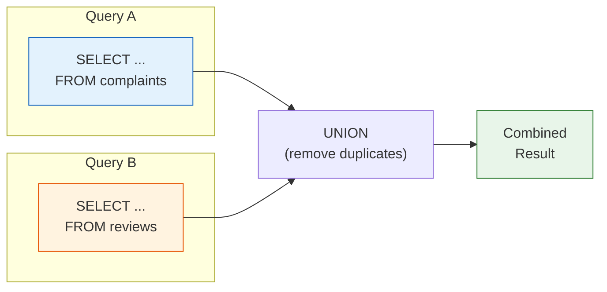

# 13강: UNION

`UNION`은 두 개 이상의 `SELECT` 문 결과를 위아래로 쌓아 합칩니다. 각 쿼리는 같은 수의 컬럼을 반환해야 하며, 대응하는 컬럼의 타입이 호환되어야 합니다. 컬럼 이름은 첫 번째 쿼리의 것을 사용합니다.



> UNION은 두 쿼리의 결과를 세로로 합칩니다. 컬럼 수와 타입이 일치해야 합니다.

## UNION vs. UNION ALL

| 연산자 | 중복 처리 | 속도 |
|--------|-----------|------|
| `UNION` | 제거 (`DISTINCT`처럼 동작) | 느림 — 중복 제거를 위한 정렬/해시 필요 |
| `UNION ALL` | 유지 | 빠름 — 중복 제거 단계 없음 |

중복이 없다는 것을 알거나, 모든 발생 횟수를 세고 싶을 때는 `UNION ALL`을 사용하세요.

## 기본 UNION

```sql
-- VIP 고객과 GOLD 고객을 하나의 목록으로 합치기
-- (같은 테이블이라 중복이 불가능하지만, UNION은 혹시 모를 중복을 제거합니다)
SELECT id, name, grade FROM customers WHERE grade = 'VIP'
UNION
SELECT id, name, grade FROM customers WHERE grade = 'GOLD'
ORDER BY name;
```

> 이 결과는 `WHERE grade IN ('VIP', 'GOLD')`와 동일하지만, UNION의 진가는 서로 다른 테이블을 합칠 때 발휘됩니다.

## 서로 다른 테이블 합치기

UNION의 대표적인 활용 사례: 여러 소스 테이블에서 통합된 활동 피드나 보고서를 만들 때 사용합니다.

```sql
-- 특정 고객의 주문과 리뷰를 합친 활동 로그
SELECT
    'order'   AS activity_type,
    customer_id,
    ordered_at AS activity_date,
    CAST(total_amount AS TEXT) AS detail
FROM orders
WHERE customer_id = 42

UNION ALL

SELECT
    'review'  AS activity_type,
    customer_id,
    created_at AS activity_date,
    '별점: ' || CAST(rating AS TEXT) AS detail
FROM reviews
WHERE customer_id = 42

ORDER BY activity_date DESC;
```

**결과:**

| activity_type | customer_id | activity_date | detail |
|---------------|-------------|---------------|--------|
| order | 42 | 2024-11-18 | 299.99 |
| review | 42 | 2024-11-20 | 별점: 5 |
| order | 42 | 2024-09-03 | 89.99 |
| review | 42 | 2024-09-05 | 별점: 4 |
| ... | | | |

```sql
-- 2024년 불만 접수 및 반품 이벤트 전체
SELECT
    'complaint'         AS event_type,
    c.customer_id,
    c.created_at        AS event_date,
    c.subject           AS description
FROM complaints AS c
WHERE c.created_at LIKE '2024%'

UNION ALL

SELECT
    'return'            AS event_type,
    o.customer_id,
    r.created_at        AS event_date,
    r.reason            AS description
FROM returns AS r
INNER JOIN orders AS o ON r.order_id = o.id
WHERE r.created_at LIKE '2024%'

ORDER BY event_date DESC
LIMIT 10;
```

## UNION ALL로 롤업 보고서 만들기

```sql
-- 카테고리별 매출 + 합계 행 추가
SELECT
    cat.name AS category,
    SUM(oi.quantity * oi.unit_price) AS revenue
FROM order_items AS oi
INNER JOIN products   AS p   ON oi.product_id = p.id
INNER JOIN categories AS cat ON p.category_id = cat.id
INNER JOIN orders     AS o   ON oi.order_id   = o.id
WHERE o.status IN ('delivered', 'confirmed')
  AND o.ordered_at LIKE '2024%'
GROUP BY cat.name

UNION ALL

SELECT
    '합계' AS category,
    SUM(oi.quantity * oi.unit_price) AS revenue
FROM order_items AS oi
INNER JOIN orders AS o ON oi.order_id = o.id
WHERE o.status IN ('delivered', 'confirmed')
  AND o.ordered_at LIKE '2024%'

ORDER BY
    CASE WHEN category = '합계' THEN 1 ELSE 0 END,
    revenue DESC;
```

**결과 (일부):**

| category | revenue |
|----------|---------|
| Laptops | 1849201.88 |
| Desktops | 943847.00 |
| Monitors | 541920.45 |
| ... | |
| 합계 | 4218807.10 |

!!! note "레슨 복습 문제"
    이 레슨에서 배운 개념을 바로 확인하는 간단한 문제입니다. 여러 개념을 종합하는 실전 연습은 [연습 문제](../exercises/) 섹션을 참고하세요.

## 연습 문제

### 연습 1
2023~2024년의 취소 주문과 반품 주문을 합친 "부정 이벤트" 목록을 만드세요. `UNION ALL`을 사용하고, `event_type`('cancellation' 또는 'return'), `order_number`, `customer_id`, `event_date`(취소는 `cancelled_at`, 반품은 `completed_at` 사용)를 포함하세요. `event_date` 내림차순으로 정렬하세요.

??? success "정답"
    ```sql
    SELECT
        'cancellation'  AS event_type,
        order_number,
        customer_id,
        cancelled_at    AS event_date
    FROM orders
    WHERE status = 'cancelled'
      AND cancelled_at BETWEEN '2023-01-01' AND '2024-12-31 23:59:59'

    UNION ALL

    SELECT
        'return'        AS event_type,
        order_number,
        customer_id,
        completed_at    AS event_date
    FROM orders
    WHERE status = 'returned'
      AND completed_at BETWEEN '2023-01-01' AND '2024-12-31 23:59:59'

    ORDER BY event_date DESC;
    ```

### 연습 2
고객 참여도 요약을 만드세요. `UNION ALL`을 사용하여 고객별 총 주문 수, 총 리뷰 수, 총 불만 수를 집계하세요. 유니온 결과를 서브쿼리(파생 테이블)로 감싸서 고객별 한 행으로 집계하고, 총 활동 수 기준 상위 10명을 반환하세요.

??? success "정답"
    ```sql
    SELECT
        customer_id,
        SUM(activity_count) AS total_activity
    FROM (
        SELECT customer_id, COUNT(*) AS activity_count
        FROM orders GROUP BY customer_id

        UNION ALL

        SELECT customer_id, COUNT(*) AS activity_count
        FROM reviews GROUP BY customer_id

        UNION ALL

        SELECT customer_id, COUNT(*) AS activity_count
        FROM complaints GROUP BY customer_id
    ) AS all_activity
    GROUP BY customer_id
    ORDER BY total_activity DESC
    LIMIT 10;
    ```

---
다음: [14강: INSERT, UPDATE, DELETE](14-dml.md)
