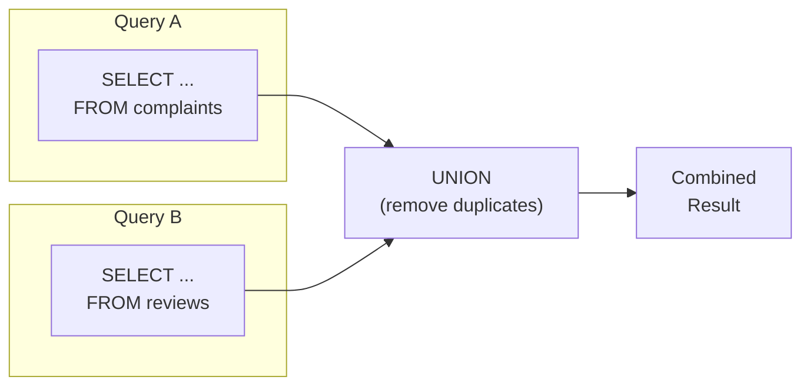
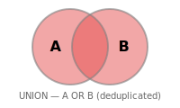

# 13강: UNION

[12강](12-string.md)에서 문자열 함수로 텍스트를 가공하는 법을 배웠습니다. 지금까지 하나의 SELECT로 데이터를 조회했습니다. 하지만 '상위 5개 상품 + 하위 5개 상품'처럼 여러 쿼리의 결과를 하나로 합쳐야 할 때가 있습니다. UNION으로 결과를 결합하는 방법을 배웁니다.

!!! note "이미 알고 계신다면"
    UNION, UNION ALL, INTERSECT, EXCEPT에 익숙하다면 [14강: DML](14-dml.md)로 건너뛰세요.

`UNION`은 두 개 이상의 `SELECT` 문 결과를 위아래로 쌓아 합칩니다. 각 쿼리는 같은 수의 칼럼을 반환해야 하며, 대응하는 칼럼의 타입이 호환되어야 합니다. 칼럼 이름은 첫 번째 쿼리의 것을 사용합니다.



> UNION은 두 쿼리의 결과를 세로로 합칩니다. 칼럼 수와 타입이 일치해야 합니다.

## UNION vs. UNION ALL

{ .off-glb width="280"  }

| 연산자 | 중복 처리 | 속도 |
|--------|-----------|------|
| `UNION` | 제거 (`DISTINCT`처럼 동작) | 느림 — 중복 제거를 위한 정렬/해시 필요 |
| `UNION ALL` | 유지 | 빠름 — 중복 제거 단계 없음 |

중복이 없다는 것을 알거나, 모든 발생 횟수를 세고 싶을 때는 `UNION ALL`을 사용하세요.

## 기본 UNION

```sql
-- VIP 고객과 GOLD 고객을 하나의 목록으로 합치기
-- (같은 테이블이라 중복이 불가능하지만, UNION은 혹시 모를 중복을 제거합니다)
SELECT id, name, grade FROM customers WHERE grade = 'VIP'
UNION
SELECT id, name, grade FROM customers WHERE grade = 'GOLD'
ORDER BY name;
```

> 이 결과는 `WHERE grade IN ('VIP', 'GOLD')`와 동일하지만, UNION의 진가는 서로 다른 테이블을 합칠 때 발휘됩니다.

## 서로 다른 테이블 합치기

UNION의 대표적인 활용 사례: 여러 소스 테이블에서 통합된 활동 피드나 보고서를 만들 때 사용합니다.

=== "SQLite"
    ```sql
    -- 특정 고객의 주문과 리뷰를 합친 활동 로그
    SELECT
        'order'   AS activity_type,
        customer_id,
        ordered_at AS activity_date,
        CAST(total_amount AS TEXT) AS detail
    FROM orders
    WHERE customer_id = 42

    UNION ALL

    SELECT
        'review'  AS activity_type,
        customer_id,
        created_at AS activity_date,
        '별점: ' || CAST(rating AS TEXT) AS detail
    FROM reviews
    WHERE customer_id = 42

    ORDER BY activity_date DESC;
    ```

=== "MySQL"
    ```sql
    SELECT
        'order'   AS activity_type,
        customer_id,
        ordered_at AS activity_date,
        CAST(total_amount AS CHAR) AS detail
    FROM orders
    WHERE customer_id = 42

    UNION ALL

    SELECT
        'review'  AS activity_type,
        customer_id,
        created_at AS activity_date,
        CONCAT('별점: ', rating) AS detail
    FROM reviews
    WHERE customer_id = 42

    ORDER BY activity_date DESC;
    ```

=== "PostgreSQL"
    ```sql
    SELECT
        'order'   AS activity_type,
        customer_id,
        ordered_at AS activity_date,
        total_amount::text AS detail
    FROM orders
    WHERE customer_id = 42

    UNION ALL

    SELECT
        'review'  AS activity_type,
        customer_id,
        created_at AS activity_date,
        '별점: ' || rating::text AS detail
    FROM reviews
    WHERE customer_id = 42

    ORDER BY activity_date DESC;
    ```

**결과:**

| activity_type | customer_id | activity_date | detail |
|---------------|------------:|---------------|--------|
| order | 42 | 2024-11-18 | 299.99 |
| review | 42 | 2024-11-20 | 별점: 5 |
| order | 42 | 2024-09-03 | 89.99 |
| review | 42 | 2024-09-05 | 별점: 4 |
| ... | | | |

```sql
-- 2024년 불만 접수 및 반품 이벤트 전체
SELECT
    'complaint'         AS event_type,
    c.customer_id,
    c.created_at        AS event_date,
    c.subject           AS description
FROM complaints AS c
WHERE c.created_at LIKE '2024%'

UNION ALL

SELECT
    'return'            AS event_type,
    o.customer_id,
    r.created_at        AS event_date,
    r.reason            AS description
FROM returns AS r
INNER JOIN orders AS o ON r.order_id = o.id
WHERE r.created_at LIKE '2024%'

ORDER BY event_date DESC
LIMIT 10;
```

## UNION ALL로 롤업 보고서 만들기

```sql
-- 카테고리별 매출 + 합계 행 추가
SELECT
    0 AS sort_key,
    cat.name AS category,
    SUM(oi.quantity * oi.unit_price) AS revenue
FROM order_items AS oi
INNER JOIN products   AS p   ON oi.product_id = p.id
INNER JOIN categories AS cat ON p.category_id = cat.id
INNER JOIN orders     AS o   ON oi.order_id   = o.id
WHERE o.status IN ('delivered', 'confirmed')
  AND o.ordered_at LIKE '2024%'
GROUP BY cat.name

UNION ALL

SELECT
    1 AS sort_key,
    '합계' AS category,
    SUM(oi.quantity * oi.unit_price) AS revenue
FROM order_items AS oi
INNER JOIN orders AS o ON oi.order_id = o.id
WHERE o.status IN ('delivered', 'confirmed')
  AND o.ordered_at LIKE '2024%'

ORDER BY sort_key, revenue DESC;
```

> **SQLite 참고:** `UNION` / `UNION ALL`의 `ORDER BY`에서는 `CASE` 표현식을 직접 사용할 수 없습니다.
> 대신 위처럼 정렬용 칼럼(`sort_key`)을 각 `SELECT`에 추가하는 것이 가장 간결합니다.

**결과 (일부):**

| sort_key | category | revenue |
|---------:|----------|--------:|
| 0 | Laptops | 1849201.88 |
| 0 | Desktops | 943847.00 |
| 0 | Monitors | 541920.45 |
| ... | | |
| 1 | 합계 | 4218807.10 |

## 정리

| 개념 | 설명 | 예시 |
|------|------|------|
| UNION | 중복 제거 후 결과 합치기 | `SELECT ... UNION SELECT ...` |
| UNION ALL | 중복 유지, 결과 합치기 (더 빠름) | `SELECT ... UNION ALL SELECT ...` |
| 칼럼 일치 규칙 | 양쪽 SELECT의 칼럼 수·타입 일치 필수 | 칼럼 이름은 첫 번째 쿼리 기준 |
| 서로 다른 테이블 합치기 | 활동 로그, 피드백 통합 등 | 주문 + 리뷰 → 활동 피드 |
| 롤업 보고서 | UNION ALL로 합계 행 추가 | `sort_key`로 정렬 제어 |
| ORDER BY 위치 | 전체 결과에 한 번만, 맨 마지막에 | 마지막 SELECT 뒤에 작성 |

!!! note "레슨 복습 문제"
    이 레슨에서 배운 개념을 바로 확인하는 간단한 문제입니다. 여러 개념을 종합하는 실전 연습은 [연습 문제](../exercises/index.md) 섹션을 참고하세요.

## 연습 문제
### 연습 1
VIP 등급 고객의 이름과 등급, GOLD 등급 고객의 이름과 등급을 `UNION`으로 합쳐서 하나의 목록으로 조회하세요. 이름순으로 정렬하세요.

??? success "정답"
    ```sql
    SELECT name, grade FROM customers WHERE grade = 'VIP'
    UNION
    SELECT name, grade FROM customers WHERE grade = 'GOLD'
    ORDER BY name;
    ```

    **결과 (예시):**

    | name | grade |
    | ---- | ----- |
    | 강경희  | GOLD  |
    | 강도윤  | VIP   |
    | 강도현  | GOLD  |
    | 강명자  | VIP   |
    | 강미숙  | VIP   |
    | ...  | ...   |


### 연습 2
모든 활성 상품(`is_active = 1`)의 `name`과 모든 카테고리의 `name`을 `UNION`으로 합쳐서 중복 없는 이름 목록을 만드세요. 결과 칼럼명은 `name`으로 하세요.

??? success "정답"
    ```sql
    SELECT name FROM products WHERE is_active = 1
    UNION
    SELECT name FROM categories
    ORDER BY name;
    ```

    **결과 (예시):**

    | name                                |
    | ----------------------------------- |
    | 2in1                                |
    | AMD                                 |
    | AMD Ryzen 9 9900X                   |
    | AMD 소켓                              |
    | APC Back-UPS Pro Gaming BGM1500B 블랙 |
    | ...                                 |


### 연습 3
2023~2024년의 취소 주문과 반품 주문을 합친 "부정 이벤트" 목록을 만드세요. `UNION ALL`을 사용하고, `event_type`('cancellation' 또는 'return'), `order_number`, `customer_id`, `event_date`(취소는 `cancelled_at`, 반품은 `completed_at` 사용)를 포함하세요. `event_date` 내림차순으로 정렬하세요.

??? success "정답"
    ```sql
    SELECT
        'cancellation'  AS event_type,
        order_number,
        customer_id,
        cancelled_at    AS event_date
    FROM orders
    WHERE status = 'cancelled'
      AND cancelled_at BETWEEN '2023-01-01' AND '2024-12-31 23:59:59'

    UNION ALL

    SELECT
        'return'        AS event_type,
        order_number,
        customer_id,
        completed_at    AS event_date
    FROM orders
    WHERE status = 'returned'
      AND completed_at BETWEEN '2023-01-01' AND '2024-12-31 23:59:59'

    ORDER BY event_date DESC;
    ```

    **결과 (예시):**

    | event_type   | order_number       | customer_id | event_date          |
    | ------------ | ------------------ | ----------: | ------------------- |
    | cancellation | ORD-20241229-32059 |        3033 | 2024-12-31 03:16:33 |
    | cancellation | ORD-20241230-32061 |        1101 | 2024-12-31 00:20:24 |
    | cancellation | ORD-20241228-32027 |         124 | 2024-12-30 03:07:39 |
    | cancellation | ORD-20241229-32055 |        3852 | 2024-12-29 19:21:00 |
    | cancellation | ORD-20241228-32025 |         355 | 2024-12-29 14:56:49 |
    | ...          | ...                | ...         | ...                 |


### 연습 4
2024년 리뷰와 2024년 상품 Q&A(질문만, `parent_id IS NULL`)를 합친 "고객 피드백" 목록을 만드세요. `UNION ALL`을 사용하고, `feedback_type`('review' 또는 'qna'), `product_id`, `customer_id`, `created_at`을 포함하세요. `created_at` 내림차순으로 정렬하고 상위 20건만 표시하세요.

??? success "정답"
    ```sql
    SELECT
        'review' AS feedback_type,
        product_id,
        customer_id,
        created_at
    FROM reviews
    WHERE created_at LIKE '2024%'

    UNION ALL

    SELECT
        'qna' AS feedback_type,
        product_id,
        customer_id,
        created_at
    FROM product_qna
    WHERE parent_id IS NULL
      AND created_at LIKE '2024%'

    ORDER BY created_at DESC
    LIMIT 20;
    ```

    **결과 (예시):**

    | feedback_type | product_id | customer_id | created_at          |
    | ------------- | ---------: | ----------: | ------------------- |
    | review        |        136 |         425 | 2024-12-31 21:40:46 |
    | review        |        163 |        1429 | 2024-12-31 14:52:52 |
    | review        |        250 |         275 | 2024-12-30 22:21:51 |
    | review        |        152 |         784 | 2024-12-30 18:34:28 |
    | review        |         11 |         646 | 2024-12-30 13:36:27 |
    | ...           | ...        | ...         | ...                 |


### 연습 5
결제 수단별 건수를 집계한 뒤, `UNION ALL`로 합계 행을 추가하세요. 합계 행의 `method`는 `'합계'`로 표시합니다. `status = 'completed'`인 결제만 대상입니다.

??? success "정답"
    ```sql
    SELECT
        0 AS sort_key,
        method,
        COUNT(*) AS tx_count
    FROM payments
    WHERE status = 'completed'
    GROUP BY method

    UNION ALL

    SELECT
        1 AS sort_key,
        '합계' AS method,
        COUNT(*) AS tx_count
    FROM payments
    WHERE status = 'completed'

    ORDER BY sort_key, tx_count DESC;
    ```

    **결과 (예시):**

    | sort_key | method          | tx_count |
    | -------: | --------------- | -------: |
    |        0 | card            |    14522 |
    |        0 | kakao_pay       |     6359 |
    |        0 | naver_pay       |     4835 |
    |        0 | bank_transfer   |     3194 |
    |        0 | virtual_account |     1638 |
    | ...      | ...             | ...      |


### 연습 6
고객 등급별 인원수를 집계한 뒤, `UNION ALL`로 전체 합계 행(`'전체'`)을 추가하세요. `is_active = 1`인 고객만 대상입니다. 합계 행이 마지막에 오도록 정렬하세요.

??? success "정답"
    ```sql
    SELECT
        0 AS sort_key,
        grade,
        COUNT(*) AS cnt
    FROM customers
    WHERE is_active = 1
    GROUP BY grade

    UNION ALL

    SELECT
        1 AS sort_key,
        '전체' AS grade,
        COUNT(*) AS cnt
    FROM customers
    WHERE is_active = 1

    ORDER BY sort_key, cnt DESC;
    ```

    **결과 (예시):**

    | sort_key | grade  | cnt  |
    | -------: | ------ | ---: |
    |        0 | BRONZE | 2548 |
    |        0 | GOLD   |  484 |
    |        0 | SILVER |  469 |
    |        0 | VIP    |  315 |
    |        1 | 전체     | 3816 |


### 연습 7
고객 참여도 요약을 만드세요. `UNION ALL`을 사용하여 고객별 총 주문 수, 총 리뷰 수, 총 불만 수를 집계하세요. 유니온 결과를 서브쿼리(파생 테이블)로 감싸서 고객별 한 행으로 집계하고, 총 활동 수 기준 상위 10명을 반환하세요.

??? success "정답"
    ```sql
    SELECT
        customer_id,
        SUM(activity_count) AS total_activity
    FROM (
        SELECT customer_id, COUNT(*) AS activity_count
        FROM orders GROUP BY customer_id

        UNION ALL

        SELECT customer_id, COUNT(*) AS activity_count
        FROM reviews GROUP BY customer_id

        UNION ALL

        SELECT customer_id, COUNT(*) AS activity_count
        FROM complaints GROUP BY customer_id
    ) AS all_activity
    GROUP BY customer_id
    ORDER BY total_activity DESC
    LIMIT 10;
    ```

    **결과 (예시):**

    | customer_id | total_activity |
    | ----------: | -------------: |
    |          98 |            469 |
    |          97 |            453 |
    |         226 |            423 |
    |         162 |            328 |
    |         227 |            326 |
    | ...         | ...            |


### 연습 8
주문 상태별 건수와 평균 금액을 집계한 뒤, `UNION ALL`로 전체 합계 행을 추가하세요. 결과를 서브쿼리로 감싸서 `pct`(각 상태의 건수가 전체 건수에서 차지하는 비율, 소수 첫째 자리까지)를 계산하세요.

??? success "정답"
    ```sql
    SELECT
        status,
        order_count,
        avg_amount,
        ROUND(100.0 * order_count / SUM(order_count) OVER (), 1) AS pct
    FROM (
        SELECT
            0 AS sort_key,
            status,
            COUNT(*)            AS order_count,
            ROUND(AVG(total_amount), 2) AS avg_amount
        FROM orders
        GROUP BY status

        UNION ALL

        SELECT
            1 AS sort_key,
            '합계' AS status,
            COUNT(*)            AS order_count,
            ROUND(AVG(total_amount), 2) AS avg_amount
        FROM orders
    ) AS t
    ORDER BY sort_key, order_count DESC;
    ```

    **결과 (예시):**

    | status           | order_count | avg_amount | pct  |
    | ---------------- | ----------: | ---------: | ---: |
    | confirmed        |       32053 | 1007832.35 | 45.9 |
    | cancelled        |        1754 |  997251.54 |  2.5 |
    | return_requested |         477 | 1512187.66 |  0.7 |
    | returned         |         459 | 1382638.93 |  0.7 |
    | delivered        |          77 |  876186.49 |  0.1 |
    | ...              | ...         | ...        | ...  |


### 연습 9
공급업체별 활성 상품 수와 비활성 상품 수를 각각 집계하고, `UNION ALL`로 합친 뒤 서브쿼리로 감싸서 공급업체별 한 행(활성 수, 비활성 수)으로 만드세요. `suppliers` 테이블과 JOIN하여 회사명도 표시하세요.

??? success "정답"
    ```sql
    SELECT
        s.company_name,
        SUM(CASE WHEN t.status_type = 'active' THEN t.cnt ELSE 0 END) AS active_count,
        SUM(CASE WHEN t.status_type = 'inactive' THEN t.cnt ELSE 0 END) AS inactive_count
    FROM (
        SELECT supplier_id, 'active' AS status_type, COUNT(*) AS cnt
        FROM products WHERE is_active = 1
        GROUP BY supplier_id

        UNION ALL

        SELECT supplier_id, 'inactive' AS status_type, COUNT(*) AS cnt
        FROM products WHERE is_active = 0
        GROUP BY supplier_id
    ) AS t
    INNER JOIN suppliers AS s ON t.supplier_id = s.id
    GROUP BY s.company_name
    ORDER BY active_count DESC;
    ```

    **결과 (예시):**

    | company_name | active_count | inactive_count |
    | ------------ | -----------: | -------------: |
    | 에이수스코리아      |           21 |              5 |
    | 삼성전자 공식 유통   |           21 |              4 |
    | MSI코리아       |           12 |              1 |
    | 서린시스테크       |           11 |              1 |
    | 로지텍코리아       |           11 |              6 |
    | ...          | ...          | ...            |


!!! tip "채점 기준"
    | 기준 | 배점 |
    |------|------|
    | 연습 1: UNION으로 두 등급 합치기 | 8점 |
    | 연습 2: UNION으로 상품+카테고리 이름 합치기 | 8점 |
    | 연습 3: UNION ALL + 날짜 필터 + 정렬 | 12점 |
    | 연습 4: UNION ALL로 리뷰+Q&A 합치기 | 10점 |
    | 연습 5: UNION ALL로 합계 행 추가 | 12점 |
    | 연습 6: UNION ALL + sort_key 정렬 제어 | 10점 |
    | 연습 7: UNION ALL + 서브쿼리 집계 | 14점 |
    | 연습 8: UNION ALL + 서브쿼리 + 윈도우 함수 | 14점 |
    | 연습 9: UNION ALL + 서브쿼리 + JOIN + CASE | 12점 |
    | **합계** | **100점** |

---
다음: [14강: INSERT, UPDATE, DELETE](14-dml.md)
