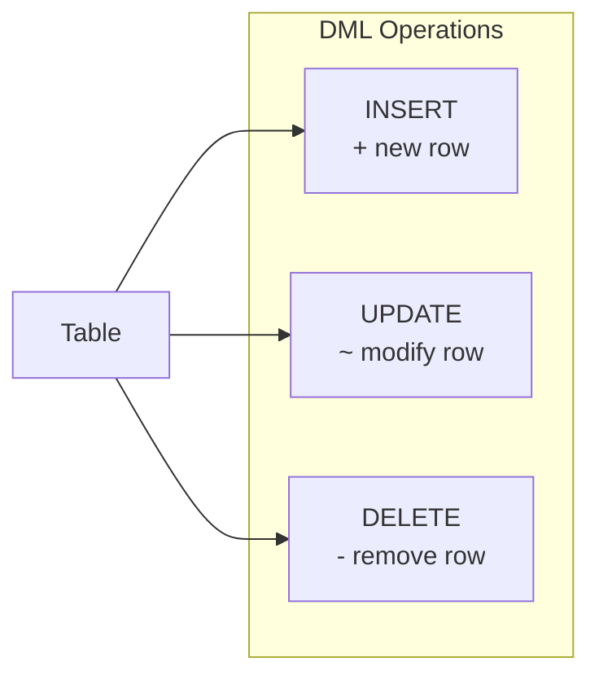

# 14강: INSERT, UPDATE, DELETE

DML(Data Manipulation Language, 데이터 조작 언어) 문은 테이블의 데이터를 변경합니다. `SELECT`와 달리 이 문장들은 영구적으로 반영됩니다 — `UPDATE`나 `DELETE`를 실행하기 전에 `WHERE` 절을 반드시 다시 확인하세요.

대부분의 DML은 표준 SQL이므로 모든 데이터베이스에서 동일하게 동작합니다. 차이가 있는 부분(날짜 함수, UPSERT 등)만 탭으로 표시합니다.



> DML은 데이터를 조작합니다. INSERT(추가), UPDATE(수정), DELETE(삭제)가 있습니다.

> **안전 수칙:** `UPDATE`나 `DELETE`를 실행하기 전에, 동일한 `WHERE` 조건으로 먼저 `SELECT`를 실행하여 영향받을 행을 정확히 확인하세요.

## INSERT INTO

### 단일 행 삽입

칼럼 이름을 명시적으로 나열하세요 — 쿼리가 자기 문서화되고, 테이블 구조 변경에도 안전합니다.

=== "SQLite"
    ```sql
    -- Add a new product
    INSERT INTO products (sku, name, category_id, supplier_id, price, stock_qty, is_active, created_at, updated_at)
    VALUES (
        'SKU-TEST-001',
        '테스트 기계식 키보드',
        9,          -- Keyboards category ID
        1,          -- supplier ID
        129.99,
        50,
        1,
        datetime('now'),
        datetime('now')
    );
    ```

=== "MySQL / PostgreSQL"
    ```sql
    -- Add a new product
    INSERT INTO products (sku, name, category_id, supplier_id, price, stock_qty, is_active, created_at, updated_at)
    VALUES (
        'SKU-TEST-001',
        '테스트 기계식 키보드',
        9,          -- Keyboards category ID
        1,          -- supplier ID
        129.99,
        50,
        1,
        NOW(),
        NOW()
    );
    ```

실행 후 확인:
```sql
SELECT * FROM products WHERE sku = 'SKU-TEST-001';
```

### 여러 행 한 번에 삽입

```sql
-- 여러 쿠폰 코드 한 번에 추가
INSERT INTO coupons (code, type, discount_value, min_order_amount, is_active, expires_at)
VALUES
    ('SAVE10', 'percentage', 10, 50.00,  1, '2025-12-31'),
    ('FLAT20', 'fixed',      20, 100.00, 1, '2025-06-30'),
    ('VIP50',  'percentage', 50, 200.00, 1, '2025-03-31');
```

### SELECT를 활용한 INSERT

다른 테이블에서 데이터를 복사하거나 오래된 레코드를 아카이브할 때 사용합니다.

```sql
-- (가정) 기존 상품을 기반으로 리퍼비시 상품 추가
INSERT INTO products (sku, name, category_id, supplier_id, price, stock_qty, is_active, created_at, updated_at)
SELECT
    'SKU-' || CAST(id + 10000 AS TEXT),
    name || ' (리퍼비시)',
    category_id,
    supplier_id,
    ROUND(price * 0.7, 2),
    10,
    1,
    datetime('now'),
    datetime('now')
FROM products
WHERE sku = 'SKU-0001';
```

## UPDATE SET

### 특정 행 업데이트

```sql
-- 카테고리 3의 모든 활성 상품 가격 15% 인상
UPDATE products
SET
    price      = ROUND(price * 1.15, 2),
    updated_at = datetime('now')
WHERE category_id = 3
  AND is_active = 1;
```

> 실행 전 확인: `SELECT id, name, price FROM products WHERE category_id = 3 AND is_active = 1;`

### 단일 행 업데이트

```sql
-- 수동 검토 후 고객 등급 변경
UPDATE customers
SET
    grade      = 'GOLD',
    updated_at = datetime('now')
WHERE id = 1042;
```

### 서브쿼리를 활용한 UPDATE

```sql
-- 한 번도 주문되지 않은 상품 비활성화
UPDATE products
SET
    is_active  = 0,
    updated_at = datetime('now')
WHERE id NOT IN (
    SELECT DISTINCT product_id FROM order_items
)
  AND is_active = 1;
```

## DELETE FROM

### 특정 행 삭제

=== "SQLite"
    ```sql
    -- Remove cancelled orders older than 3 years
    DELETE FROM orders
    WHERE status = 'cancelled'
      AND cancelled_at < DATE('now', '-3 years');
    ```

=== "MySQL"
    ```sql
    -- Remove cancelled orders older than 3 years
    DELETE FROM orders
    WHERE status = 'cancelled'
      AND cancelled_at < DATE_SUB(CURDATE(), INTERVAL 3 YEAR);
    ```

=== "PostgreSQL"
    ```sql
    -- Remove cancelled orders older than 3 years
    DELETE FROM orders
    WHERE status = 'cancelled'
      AND cancelled_at < CURRENT_DATE - INTERVAL '3 years';
    ```

> 실행 전 확인: `SELECT COUNT(*) FROM orders WHERE status = 'cancelled' AND cancelled_at < DATE('now', '-3 years');`

### 서브쿼리를 활용한 DELETE

```sql
-- 더 이상 존재하지 않는 상품의 위시리스트 항목 삭제
DELETE FROM wishlists
WHERE product_id NOT IN (
    SELECT id FROM products
);
```

## 트랜잭션 — 모두 성공하거나 모두 취소하거나

관련된 DML 문들을 트랜잭션으로 묶으면 모두 성공하거나 모두 롤백됩니다.

```sql
BEGIN TRANSACTION;

-- 1단계: 재고 차감
UPDATE products
SET stock_qty = stock_qty - 2,
    updated_at = datetime('now')
WHERE id = 5;

-- 2단계: 재고 거래 내역 기록
INSERT INTO inventory_transactions (product_id, change_qty, reason, created_at)
VALUES (5, -2, 'manual_adjustment', datetime('now'));

-- 모두 정상이면:
COMMIT;

-- 문제가 생겼다면:
-- ROLLBACK;
```

## 자주 하는 실수

| 실수 | 결과 | 예방법 |
|------|------|--------|
| `WHERE` 없이 `UPDATE table SET col = val` | 모든 행이 업데이트됨 | 항상 먼저 `SELECT`로 확인 |
| `WHERE` 없이 `DELETE FROM table` | 모든 행이 삭제됨 | 트랜잭션 사용; 먼저 COUNT 확인 |
| `updated_at` 누락 | 감사 추적 정보가 낡아짐 | 모든 UPDATE에 `updated_at = datetime('now')` 포함 |
| 중복 기본 키 삽입 | 제약 조건 오류 | SQLite: `INSERT OR IGNORE` / MySQL: `INSERT IGNORE` / PG: `ON CONFLICT DO NOTHING` |

## UPSERT (INSERT 또는 UPDATE)

실무에서 흔한 패턴입니다: **행이 이미 존재하면 UPDATE, 없으면 INSERT**. 이를 UPSERT라고 부릅니다. 문제는 데이터베이스마다 문법이 완전히 다르다는 것입니다.

### 기본 문법

=== "SQLite"
    SQLite는 두 가지 방식을 지원합니다.

    **방법 1: `INSERT OR REPLACE`** — 충돌 시 기존 행을 삭제하고 새로 삽입합니다. 명시하지 않은 칼럼은 기본값으로 초기화되므로 주의하세요.
    ```sql
    INSERT OR REPLACE INTO customers (id, name, email, point_balance, updated_at)
    VALUES (100, '홍길동', 'hong@testmail.kr', 1500, datetime('now'));
    ```

    **방법 2: `ON CONFLICT ... DO UPDATE`** — 더 세밀한 제어가 가능합니다. 기존 행의 다른 칼럼은 그대로 유지됩니다.
    ```sql
    INSERT INTO customers (id, name, email, point_balance, updated_at)
    VALUES (100, '홍길동', 'hong@testmail.kr', 1500, datetime('now'))
    ON CONFLICT(id) DO UPDATE SET
        point_balance = excluded.point_balance,
        updated_at    = excluded.updated_at;
    ```

    > `excluded`는 삽입하려던 값을 참조하는 특수 키워드입니다.

=== "MySQL"
    MySQL은 `ON DUPLICATE KEY UPDATE` 구문을 사용합니다.
    ```sql
    INSERT INTO customers (id, name, email, point_balance, updated_at)
    VALUES (100, '홍길동', 'hong@testmail.kr', 1500, NOW())
    ON DUPLICATE KEY UPDATE
        point_balance = VALUES(point_balance),
        updated_at    = VALUES(updated_at);
    ```

    > `VALUES(칼럼명)`은 삽입하려던 값을 참조합니다. MySQL 8.0.20+에서는 `AS new` 별칭 방식도 지원합니다.

=== "PostgreSQL"
    PostgreSQL은 SQLite와 유사한 `ON CONFLICT` 구문을 사용합니다.
    ```sql
    INSERT INTO customers (id, name, email, point_balance, updated_at)
    VALUES (100, '홍길동', 'hong@testmail.kr', 1500, NOW())
    ON CONFLICT(id) DO UPDATE SET
        point_balance = EXCLUDED.point_balance,
        updated_at    = EXCLUDED.updated_at;
    ```

    > `EXCLUDED`는 삽입하려던 값을 참조하는 특수 키워드입니다.

### 예제: 상품 재고 동기화

외부 시스템에서 받은 재고 데이터를 동기화할 때, SKU가 이미 있으면 재고를 갱신하고 없으면 새로 삽입합니다.

=== "SQLite"
    ```sql
    INSERT INTO products (sku, name, category_id, supplier_id, price, stock_qty, is_active, created_at, updated_at)
    VALUES ('SKU-0042', '무선 마우스 X', 10, 3, 45.00, 200, 1, datetime('now'), datetime('now'))
    ON CONFLICT(sku) DO UPDATE SET
        stock_qty  = excluded.stock_qty,
        updated_at = excluded.updated_at;
    ```

=== "MySQL"
    ```sql
    INSERT INTO products (sku, name, category_id, supplier_id, price, stock_qty, is_active, created_at, updated_at)
    VALUES ('SKU-0042', '무선 마우스 X', 10, 3, 45.00, 200, 1, NOW(), NOW())
    ON DUPLICATE KEY UPDATE
        stock_qty  = VALUES(stock_qty),
        updated_at = VALUES(updated_at);
    ```

=== "PostgreSQL"
    ```sql
    INSERT INTO products (sku, name, category_id, supplier_id, price, stock_qty, is_active, created_at, updated_at)
    VALUES ('SKU-0042', '무선 마우스 X', 10, 3, 45.00, 200, 1, NOW(), NOW())
    ON CONFLICT(sku) DO UPDATE SET
        stock_qty  = EXCLUDED.stock_qty,
        updated_at = EXCLUDED.updated_at;
    ```

### 참고: SQL 표준 MERGE

SQL 표준에는 `MERGE` 문이 정의되어 있습니다. `MERGE`는 UPSERT보다 더 범용적인 구문으로, 원본 테이블과 대상 테이블을 비교하여 일치 여부에 따라 INSERT/UPDATE/DELETE를 모두 수행할 수 있습니다.

```sql
-- SQL 표준 MERGE (참고용 — SQLite, MySQL에서는 사용 불가)
MERGE INTO target_table t
USING source_table s ON t.id = s.id
WHEN MATCHED THEN
    UPDATE SET t.value = s.value
WHEN NOT MATCHED THEN
    INSERT (id, value) VALUES (s.id, s.value);
```

그러나 지원 현황은 제한적입니다:

| DB | MERGE 지원 |
|----|-----------|
| SQLite | 미지원 |
| MySQL | 미지원 |
| PostgreSQL | 15+ 지원 |

실무에서는 위에서 배운 **UPSERT 패턴을 훨씬 더 많이 사용**합니다. 대부분의 경우 UPSERT로 충분하며, 모든 주요 데이터베이스에서 동작합니다.

!!! note "레슨 복습 문제"
    이 레슨에서 배운 개념을 바로 확인하는 간단한 문제입니다. 여러 개념을 종합하는 실전 연습은 [연습 문제](../exercises/index.md) 섹션을 참고하세요.

## 연습 문제
### 연습 1
`products` 테이블에 다음 3개의 상품을 한 번에 삽입하세요. `category_id = 9`(키보드), `supplier_id = 1`, `is_active = 1`, `stock_qty = 30`은 모두 동일합니다.

| sku | name | price |
|-----|------|------:|
| SKU-TEST-101 | 무선 키보드 A | 59.99 |
| SKU-TEST-102 | 무선 키보드 B | 79.99 |
| SKU-TEST-103 | 무선 키보드 C | 99.99 |

??? success "정답"
    === "SQLite"
        ```sql
        INSERT INTO products (sku, name, brand, category_id, supplier_id, price, cost_price, stock_qty, is_active, created_at, updated_at)
        VALUES
            ('SKU-TEST-101', '무선 키보드 A', 'Logitech', 9, 1, 59.99, 35.00, 30, 1, datetime('now'), datetime('now')),
            ('SKU-TEST-102', '무선 키보드 B', 'Logitech', 9, 1, 79.99, 45.00, 30, 1, datetime('now'), datetime('now')),
            ('SKU-TEST-103', '무선 키보드 C', 'Logitech', 9, 1, 99.99, 55.00, 30, 1, datetime('now'), datetime('now'));
        ```

    === "MySQL / PostgreSQL"
        ```sql
        INSERT INTO products (sku, name, brand, category_id, supplier_id, price, cost_price, stock_qty, is_active, created_at, updated_at)
        VALUES
            ('SKU-TEST-101', '무선 키보드 A', 'Logitech', 9, 1, 59.99, 35.00, 30, 1, NOW(), NOW()),
            ('SKU-TEST-102', '무선 키보드 B', 'Logitech', 9, 1, 79.99, 45.00, 30, 1, NOW(), NOW()),
            ('SKU-TEST-103', '무선 키보드 C', 'Logitech', 9, 1, 99.99, 55.00, 30, 1, NOW(), NOW());
        ```


### 연습 2
다음 시나리오에서 `WHERE` 절을 빠뜨리면 어떤 일이 발생하는지 설명하고, 올바른 `UPDATE`를 작성하세요: "고객 ID 500의 전화번호를 `'020-0555-1234'`로 변경"

??? success "정답"
    `WHERE`를 빠뜨리면 **모든 고객**의 전화번호가 `'020-0555-1234'`로 변경됩니다. 올바른 쿼리:

    === "SQLite"
        ```sql
        UPDATE customers
        SET
            phone      = '020-0555-1234',
            updated_at = datetime('now')
        WHERE id = 500;
        ```

    === "MySQL / PostgreSQL"
        ```sql
        UPDATE customers
        SET
            phone      = '020-0555-1234',
            updated_at = NOW()
        WHERE id = 500;
        ```


### 연습 3
고객 ID 300의 포인트 잔액을 갱신하는 UPSERT를 작성하세요. 고객이 존재하면 `point_balance`를 `2000`으로, `updated_at`을 현재 시각으로 갱신합니다. 존재하지 않으면 name `'이서윤'`, email `'lee.sy@testmail.kr'`, phone `'020-0300-0001'`, grade `'BRONZE'`, `point_balance = 2000`, `is_active = 1`로 새로 삽입합니다.

??? success "정답"
    === "SQLite"
        ```sql
        INSERT INTO customers (id, name, email, password_hash, phone, grade, point_balance, is_active, created_at, updated_at)
        VALUES (300, '이서윤', 'lee.sy@testmail.kr', 'hash_placeholder', '020-0300-0001', 'BRONZE', 2000, 1, datetime('now'), datetime('now'))
        ON CONFLICT(id) DO UPDATE SET
            point_balance = excluded.point_balance,
            updated_at    = excluded.updated_at;
        ```

    === "MySQL"
        ```sql
        INSERT INTO customers (id, name, email, password_hash, phone, grade, point_balance, is_active, created_at, updated_at)
        VALUES (300, '이서윤', 'lee.sy@testmail.kr', 'hash_placeholder', '020-0300-0001', 'BRONZE', 2000, 1, NOW(), NOW())
        ON DUPLICATE KEY UPDATE
            point_balance = VALUES(point_balance),
            updated_at    = VALUES(updated_at);
        ```

    === "PostgreSQL"
        ```sql
        INSERT INTO customers (id, name, email, password_hash, phone, grade, point_balance, is_active, created_at, updated_at)
        VALUES (300, '이서윤', 'lee.sy@testmail.kr', 'hash_placeholder', '020-0300-0001', 'BRONZE', 2000, 1, NOW(), NOW())
        ON CONFLICT(id) DO UPDATE SET
            point_balance = EXCLUDED.point_balance,
            updated_at    = EXCLUDED.updated_at;
        ```


### 연습 4
외부 재고 시스템에서 SKU `'SKU-0099'` 상품의 재고가 150개라는 데이터를 받았습니다. 해당 SKU가 이미 존재하면 `stock_qty`를 150으로 갱신하되, **가격이 현재보다 낮아지지 않도록** 기존 가격을 유지하세요. 존재하지 않으면 name `'USB-C 허브'`, `category_id = 10`, `supplier_id = 2`, `price = 35.00`, `stock_qty = 150`, `is_active = 1`로 삽입합니다.

??? success "정답"
    === "SQLite"
        ```sql
        INSERT INTO products (sku, name, brand, category_id, supplier_id, price, cost_price, stock_qty, is_active, created_at, updated_at)
        VALUES ('SKU-0099', 'USB-C 허브', 'Anker', 10, 2, 35.00, 20.00, 150, 1, datetime('now'), datetime('now'))
        ON CONFLICT(sku) DO UPDATE SET
            stock_qty  = excluded.stock_qty,
            price      = MAX(products.price, excluded.price),
            updated_at = excluded.updated_at;
        ```

    === "MySQL"
        ```sql
        INSERT INTO products (sku, name, brand, category_id, supplier_id, price, cost_price, stock_qty, is_active, created_at, updated_at)
        VALUES ('SKU-0099', 'USB-C 허브', 'Anker', 10, 2, 35.00, 20.00, 150, 1, NOW(), NOW())
        ON DUPLICATE KEY UPDATE
            stock_qty  = VALUES(stock_qty),
            price      = GREATEST(price, VALUES(price)),
            updated_at = VALUES(updated_at);
        ```

    === "PostgreSQL"
        ```sql
        INSERT INTO products (sku, name, brand, category_id, supplier_id, price, cost_price, stock_qty, is_active, created_at, updated_at)
        VALUES ('SKU-0099', 'USB-C 허브', 'Anker', 10, 2, 35.00, 20.00, 150, 1, NOW(), NOW())
        ON CONFLICT(sku) DO UPDATE SET
            stock_qty  = EXCLUDED.stock_qty,
            price      = GREATEST(products.price, EXCLUDED.price),
            updated_at = EXCLUDED.updated_at;
        ```


### 연습 5
현장 등록 신규 고객 레코드를 삽입하세요. 사용 데이터: name `'김민준'`, email `'k.minjun@testmail.kr'`, phone `'020-0199-7823'`, grade `'BRONZE'`, `point_balance = 0`, `is_active = 1`, `created_at`과 `updated_at` 모두 현재 시각으로 설정하세요.

??? success "정답"
    ```sql
    INSERT INTO customers (name, email, password_hash, phone, grade, point_balance, is_active, created_at, updated_at)
    VALUES (
        '김민준',
        'k.minjun@testmail.kr',
        'hash_placeholder',
        '020-0199-7823',
        'BRONZE',
        0,
        1,
        datetime('now'),
        datetime('now')
    );
    ```


### 연습 6
공급업체가 납품 가격을 변경했습니다. `supplier_id = 7`인 모든 활성 상품의 `price`를 8% 인상하고 `updated_at`도 갱신하세요. 먼저 어떤 행이 변경될지 확인하는 `SELECT`를 작성하고, 그 다음 `UPDATE`를 작성하세요.

??? success "정답"
    ```sql
    -- 먼저 확인
    SELECT id, name, price, ROUND(price * 1.08, 2) AS new_price
    FROM products
    WHERE supplier_id = 7 AND is_active = 1;

    -- 그 다음 업데이트
    UPDATE products
    SET
        price      = ROUND(price * 1.08, 2),
        updated_at = datetime('now')
    WHERE supplier_id = 7
      AND is_active = 1;
    ```


### 연습 7
비활성(`is_active = 0`)이고 단종된(`discontinued_at IS NOT NULL`) 상품의 `stock_qty`를 0으로, `updated_at`을 현재 시각으로 갱신하세요.

??? success "정답"
    === "SQLite"
        ```sql
        -- 먼저 확인
        SELECT id, name, stock_qty
        FROM products
        WHERE is_active = 0 AND discontinued_at IS NOT NULL AND stock_qty > 0;

        -- 업데이트
        UPDATE products
        SET
            stock_qty  = 0,
            updated_at = datetime('now')
        WHERE is_active = 0
          AND discontinued_at IS NOT NULL
          AND stock_qty > 0;
        ```

    === "MySQL / PostgreSQL"
        ```sql
        -- 먼저 확인
        SELECT id, name, stock_qty
        FROM products
        WHERE is_active = 0 AND discontinued_at IS NOT NULL AND stock_qty > 0;

        -- 업데이트
        UPDATE products
        SET
            stock_qty  = 0,
            updated_at = NOW()
        WHERE is_active = 0
          AND discontinued_at IS NOT NULL
          AND stock_qty > 0;
        ```


### 연습 8
BRONZE 등급이고 포인트 잔액(`point_balance`)이 0인 활성 고객의 등급을 `'SILVER'`로, 포인트를 `500`으로 변경하세요. `updated_at`도 갱신하세요.

??? success "정답"
    === "SQLite"
        ```sql
        -- 먼저 확인
        SELECT id, name, grade, point_balance
        FROM customers
        WHERE grade = 'BRONZE' AND point_balance = 0 AND is_active = 1;

        -- 업데이트
        UPDATE customers
        SET
            grade         = 'SILVER',
            point_balance = 500,
            updated_at    = datetime('now')
        WHERE grade = 'BRONZE'
          AND point_balance = 0
          AND is_active = 1;
        ```

    === "MySQL / PostgreSQL"
        ```sql
        -- 먼저 확인
        SELECT id, name, grade, point_balance
        FROM customers
        WHERE grade = 'BRONZE' AND point_balance = 0 AND is_active = 1;

        -- 업데이트
        UPDATE customers
        SET
            grade         = 'SILVER',
            point_balance = 500,
            updated_at    = NOW()
        WHERE grade = 'BRONZE'
          AND point_balance = 0
          AND is_active = 1;
        ```


### 연습 9
`reviews` 테이블에서 `rating`이 1이고 `content`가 NULL인 리뷰를 삭제하세요. 먼저 `SELECT`로 삭제 대상 건수를 확인하세요.

??? success "정답"
    ```sql
    -- 먼저 확인
    SELECT COUNT(*)
    FROM reviews
    WHERE rating = 1 AND content IS NULL;

    -- 삭제
    DELETE FROM reviews
    WHERE rating = 1
      AND content IS NULL;
    ```


### 연습 10
가격이 1000 이상이고 활성인 상품을 기반으로, 가격을 60%로 할인한 리퍼비시 상품을 `INSERT ... SELECT`로 삽입하세요. `sku`는 원래 SKU 앞에 `'REF-'`를 붙이고, `name` 뒤에 `' (리퍼비시)'`를 추가하세요. `stock_qty`는 5로 설정합니다.

??? success "정답"
    === "SQLite / PostgreSQL"
        ```sql
        INSERT INTO products (sku, name, brand, category_id, supplier_id, price, cost_price, stock_qty, is_active, created_at, updated_at)
        SELECT
            'REF-' || sku,
            name || ' (리퍼비시)',
            brand,
            category_id,
            supplier_id,
            ROUND(price * 0.6, 2),
            ROUND(cost_price * 0.6, 2),
            5,
            1,
            datetime('now'),
            datetime('now')
        FROM products
        WHERE price >= 1000
          AND is_active = 1;
        ```

    === "MySQL"
        ```sql
        INSERT INTO products (sku, name, brand, category_id, supplier_id, price, cost_price, stock_qty, is_active, created_at, updated_at)
        SELECT
            CONCAT('REF-', sku),
            CONCAT(name, ' (리퍼비시)'),
            brand,
            category_id,
            supplier_id,
            ROUND(price * 0.6, 2),
            ROUND(cost_price * 0.6, 2),
            5,
            1,
            NOW(),
            NOW()
        FROM products
        WHERE price >= 1000
          AND is_active = 1;
        ```


### 연습 11
2022년 이전에 접수된(`created_at < '2022-01-01'`) `status = 'resolved'`인 불만을 삭제하세요. 먼저 `SELECT`로 건수와 날짜 범위를 확인하세요.

??? success "정답"
    ```sql
    -- 먼저 확인
    SELECT COUNT(*), MIN(created_at), MAX(created_at)
    FROM complaints
    WHERE status = 'resolved'
      AND created_at < '2022-01-01';

    -- 삭제
    DELETE FROM complaints
    WHERE status = 'resolved'
      AND created_at < '2022-01-01';
    ```


### 연습 12
한 번도 주문되지 않은 상품의 재고(`stock_qty`)를 확인하는 `SELECT`를 작성한 뒤, 해당 상품들을 비활성(`is_active = 0`)으로 변경하는 `UPDATE`를 작성하세요. 서브쿼리를 사용하세요.

??? success "정답"
    === "SQLite"
        ```sql
        -- 먼저 확인
        SELECT id, name, stock_qty
        FROM products
        WHERE id NOT IN (SELECT DISTINCT product_id FROM order_items)
          AND is_active = 1;

        -- 업데이트
        UPDATE products
        SET
            is_active  = 0,
            updated_at = datetime('now')
        WHERE id NOT IN (SELECT DISTINCT product_id FROM order_items)
          AND is_active = 1;
        ```

    === "MySQL / PostgreSQL"
        ```sql
        -- 먼저 확인
        SELECT id, name, stock_qty
        FROM products
        WHERE id NOT IN (SELECT DISTINCT product_id FROM order_items)
          AND is_active = 1;

        -- 업데이트
        UPDATE products
        SET
            is_active  = 0,
            updated_at = NOW()
        WHERE id NOT IN (SELECT DISTINCT product_id FROM order_items)
          AND is_active = 1;
        ```


---
다음: [15강: DDL — 테이블 생성과 변경](15-ddl.md)
