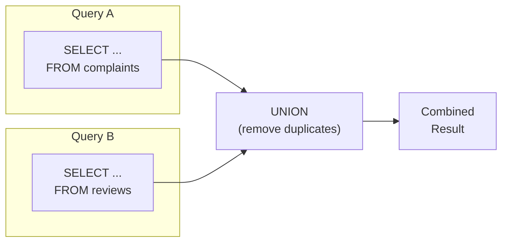

# 14강: UNION

[13강](13-utility-functions.md)에서 숫자·변환·조건 함수를 배웠습니다. 지금까지 하나의 SELECT로 데이터를 조회했습니다. 하지만 '상위 5개 상품 + 하위 5개 상품'처럼 여러 쿼리의 결과를 하나로 합쳐야 할 때가 있습니다. UNION으로 결과를 결합하는 방법을 배웁니다.

!!! note "이미 알고 계신다면"
    UNION, UNION ALL, INTERSECT, EXCEPT에 익숙하다면 [15강: DML](15-dml.md)로 건너뛰세요.

`UNION`은 두 개 이상의 `SELECT` 문 결과를 위아래로 쌓아 합칩니다. 각 쿼리는 같은 수의 칼럼을 반환해야 하며, 대응하는 칼럼의 타입이 호환되어야 합니다. 칼럼 이름은 첫 번째 쿼리의 것을 사용합니다.



> UNION은 두 쿼리의 결과를 세로로 합칩니다. 칼럼 수와 타입이 일치해야 합니다.

## UNION vs. UNION ALL

{ .off-glb width="280"  }

| 연산자 | 중복 처리 | 속도 |
|--------|-----------|------|
| `UNION` | 제거 (`DISTINCT`처럼 동작) | 느림 — 중복 제거를 위한 정렬/해시 필요 |
| `UNION ALL` | 유지 | 빠름 — 중복 제거 단계 없음 |

중복이 없다는 것을 알거나, 모든 발생 횟수를 세고 싶을 때는 `UNION ALL`을 사용하세요.

## 기본 UNION

```sql
-- VIP 고객과 GOLD 고객을 하나의 목록으로 합치기
-- (같은 테이블이라 중복이 불가능하지만, UNION은 혹시 모를 중복을 제거합니다)
SELECT id, name, grade FROM customers WHERE grade = 'VIP'
UNION
SELECT id, name, grade FROM customers WHERE grade = 'GOLD'
ORDER BY name;
```

> 이 결과는 `WHERE grade IN ('VIP', 'GOLD')`와 동일하지만, UNION의 진가는 서로 다른 테이블을 합칠 때 발휘됩니다.

## 서로 다른 테이블 합치기

UNION의 대표적인 활용 사례: 여러 소스 테이블에서 통합된 활동 피드나 보고서를 만들 때 사용합니다.

=== "SQLite"
    ```sql
    -- 특정 고객의 주문과 리뷰를 합친 활동 로그
    SELECT
        'order'   AS activity_type,
        customer_id,
        ordered_at AS activity_date,
        CAST(total_amount AS TEXT) AS detail
    FROM orders
    WHERE customer_id = 42

    UNION ALL

    SELECT
        'review'  AS activity_type,
        customer_id,
        created_at AS activity_date,
        '별점: ' || CAST(rating AS TEXT) AS detail
    FROM reviews
    WHERE customer_id = 42

    ORDER BY activity_date DESC;
    ```

=== "MySQL"
    ```sql
    SELECT
        'order'   AS activity_type,
        customer_id,
        ordered_at AS activity_date,
        CAST(total_amount AS CHAR) AS detail
    FROM orders
    WHERE customer_id = 42

    UNION ALL

    SELECT
        'review'  AS activity_type,
        customer_id,
        created_at AS activity_date,
        CONCAT('별점: ', rating) AS detail
    FROM reviews
    WHERE customer_id = 42

    ORDER BY activity_date DESC;
    ```

=== "PostgreSQL"
    ```sql
    SELECT
        'order'   AS activity_type,
        customer_id,
        ordered_at AS activity_date,
        total_amount::text AS detail
    FROM orders
    WHERE customer_id = 42

    UNION ALL

    SELECT
        'review'  AS activity_type,
        customer_id,
        created_at AS activity_date,
        '별점: ' || rating::text AS detail
    FROM reviews
    WHERE customer_id = 42

    ORDER BY activity_date DESC;
    ```

**결과:**

| activity_type | customer_id | activity_date | detail |
|---------------|------------:|---------------|--------|
| order | 42 | 2024-11-18 | 299.99 |
| review | 42 | 2024-11-20 | 별점: 5 |
| order | 42 | 2024-09-03 | 89.99 |
| review | 42 | 2024-09-05 | 별점: 4 |
| ... | | | |

```sql
-- 2024년 불만 접수 및 반품 이벤트 전체
SELECT
    'complaint'         AS event_type,
    c.customer_id,
    c.created_at        AS event_date,
    c.title             AS description
FROM complaints AS c
WHERE c.created_at LIKE '2024%'

UNION ALL

SELECT
    'return'            AS event_type,
    o.customer_id,
    r.created_at        AS event_date,
    r.reason            AS description
FROM returns AS r
INNER JOIN orders AS o ON r.order_id = o.id
WHERE r.created_at LIKE '2024%'

ORDER BY event_date DESC
LIMIT 10;
```

## UNION ALL로 롤업 보고서 만들기

```sql
-- 카테고리별 매출 + 합계 행 추가
SELECT
    0 AS sort_key,
    cat.name AS category,
    SUM(oi.quantity * oi.unit_price) AS revenue
FROM order_items AS oi
INNER JOIN products   AS p   ON oi.product_id = p.id
INNER JOIN categories AS cat ON p.category_id = cat.id
INNER JOIN orders     AS o   ON oi.order_id   = o.id
WHERE o.status IN ('delivered', 'confirmed')
  AND o.ordered_at LIKE '2024%'
GROUP BY cat.name

UNION ALL

SELECT
    1 AS sort_key,
    '합계' AS category,
    SUM(oi.quantity * oi.unit_price) AS revenue
FROM order_items AS oi
INNER JOIN orders AS o ON oi.order_id = o.id
WHERE o.status IN ('delivered', 'confirmed')
  AND o.ordered_at LIKE '2024%'

ORDER BY 1, 3 DESC;
```

> **SQLite 참고:** `UNION` / `UNION ALL`의 `ORDER BY`에서는 `CASE` 표현식을 직접 사용할 수 없고, 별칭 대신 **칼럼 위치 번호**를 쓰는 것이 안전합니다.
> 위에서 `ORDER BY 1, 3 DESC`는 첫 번째 칼럼(`sort_key`) 오름차순, 세 번째 칼럼(`revenue`) 내림차순입니다.

**결과 (일부):**

| sort_key | category | revenue |
| ----------: | ---------- | ----------: |
| 0 | 게이밍 노트북 | 7252261700.0 |
| 0 | NVIDIA | 6049128000.0 |
| 0 | AMD | 5055980700.0 |
| 0 | 일반 노트북 | 4852629300.0 |
| 0 | 게이밍 모니터 | 3575676600.0 |
| 0 | 스피커/헤드셋 | 2473846600.0 |
| 0 | Intel 소켓 | 2265205100.0 |
| 0 | 2in1 | 2164737100.0 |
| ... | ... | ... |

## INTERSECT — 교집합

`INTERSECT`는 양쪽 쿼리 결과에 **모두 존재하는** 행만 반환합니다.

```sql
-- 리뷰도 쓰고, 불만도 접수한 고객
SELECT customer_id FROM reviews
INTERSECT
SELECT customer_id FROM complaints;
```

> **SQLite 참고:** SQLite 3.34.0+(2020-12) 이상에서 `INTERSECT`를 지원합니다. 모든 MySQL 8.0.31+, PostgreSQL에서 사용 가능합니다.

```sql
-- 활용: VIP이면서 최근 6개월 내 주문한 고객
SELECT id FROM customers WHERE grade = 'VIP'
INTERSECT
SELECT DISTINCT customer_id FROM orders
WHERE ordered_at >= DATE('now', '-6 months');
```

## EXCEPT / MINUS — 차집합

`EXCEPT`는 첫 번째 쿼리 결과에서 두 번째 쿼리 결과를 **빼고** 남은 행을 반환합니다. Oracle에서는 `MINUS`라고 합니다.

```sql
-- 리뷰를 쓴 적 있지만 불만을 접수한 적 없는 고객
SELECT customer_id FROM reviews
EXCEPT
SELECT customer_id FROM complaints;
```

```sql
-- 주문은 했지만 배송이 시작되지 않은 주문
SELECT id FROM orders WHERE status = 'confirmed'
EXCEPT
SELECT order_id FROM shipping;
```

> `EXCEPT`는 `NOT IN` 서브쿼리나 `LEFT JOIN ... IS NULL` 안티 조인과 같은 결과를 반환하지만, 집합 연산 문법이 더 읽기 쉽습니다.

### UNION vs. INTERSECT vs. EXCEPT 비교

| 연산자 | 의미 | 집합 기호 |
|--------|------|:---------:|
| UNION | 합집합 (A ∪ B) | ∪ |
| INTERSECT | 교집합 (A ∩ B) | ∩ |
| EXCEPT | 차집합 (A − B) | − |

세 연산 모두 **중복을 제거**합니다. 중복을 유지하려면 `UNION ALL`, `INTERSECT ALL`, `EXCEPT ALL`을 사용합니다 (DB별 지원 여부가 다름).

## 정리

| 개념 | 설명 | 예시 |
|------|------|------

<!-- BEGIN_LESSON_EXERCISES -->

!!! note "레슨 복습 문제"
    이 레슨에서 배운 개념을 바로 확인하는 간단한 문제입니다. 여러 개념을 종합하는 실전 연습은 [연습 문제](../exercises/index.md) 섹션을 참고하세요.

### 문제 1
VIP 등급 고객의 이름과 등급, GOLD 등급 고객의 이름과 등급을 `UNION`으로 합쳐서 하나의 목록으로 조회하세요. 이름순으로 정렬하세요.

??? success "정답"
    ```sql
    SELECT name, grade FROM customers WHERE grade = 'VIP'
    UNION
    SELECT name, grade FROM customers WHERE grade = 'GOLD'
    ORDER BY name;
    ```


    **실행 결과** (총 753행 중 상위 7행)

    | name | grade |
    |---|---|
    | 강경숙 | VIP |
    | 강명자 | VIP |
    | 강민석 | VIP |
    | 강민재 | VIP |
    | 강상철 | VIP |
    | 강서준 | GOLD |
    | 강서현 | GOLD |

### 문제 2
모든 활성 상품(`is_active = 1`)의 `name`과 모든 카테고리의 `name`을 `UNION`으로 합쳐서 중복 없는 이름 목록을 만드세요. 결과 칼럼명은 `name`으로 하세요.

??? success "정답"
    ```sql
    SELECT name FROM products WHERE is_active = 1
    UNION
    SELECT name FROM categories
    ORDER BY name;
    ```


    **실행 결과** (총 257행 중 상위 7행)

    | name |
    |---|
    | 2in1 |
    | AMD |
    | AMD Ryzen 9 9900X |
    | AMD 소켓 |
    | APC Back-UPS Pro Gaming BGM1500B 블랙 |
    | ASRock B850M Pro RS 실버 |
    | ASRock B850M Pro RS 화이트 |

### 문제 3
2023~2024년의 취소 주문과 반품 주문을 합친 "부정 이벤트" 목록을 만드세요. `UNION ALL`을 사용하고, `event_type`('cancellation' 또는 'return'), `order_number`, `customer_id`, `event_date`(취소는 `cancelled_at`, 반품은 `completed_at` 사용)를 포함하세요. `event_date` 내림차순으로 정렬하세요.

??? success "정답"
    ```sql
    SELECT
    'cancellation'  AS event_type,
    order_number,
    customer_id,
    cancelled_at    AS event_date
    FROM orders
    WHERE status = 'cancelled'
    AND cancelled_at BETWEEN '2023-01-01' AND '2024-12-31 23:59:59'
    
    UNION ALL
    
    SELECT
    'return'        AS event_type,
    order_number,
    customer_id,
    completed_at    AS event_date
    FROM orders
    WHERE status = 'returned'
    AND completed_at BETWEEN '2023-01-01' AND '2024-12-31 23:59:59'
    
    ORDER BY event_date DESC;
    ```


    **실행 결과** (총 579행 중 상위 7행)

    | event_type | order_number | customer_id | event_date |
    |---|---|---|---|
    | cancellation | ORD-20241229-31194 | 1616 | 2024-12-31 11:37:44 |
    | cancellation | ORD-20241228-31179 | 1971 | 2024-12-30 00:01:41 |
    | cancellation | ORD-20241228-31177 | 2552 | 2024-12-28 21:35:05 |
    | cancellation | ORD-20241226-31148 | 1420 | 2024-12-27 20:44:43 |
    | cancellation | ORD-20241225-31134 | 1303 | 2024-12-26 18:43:50 |
    | cancellation | ORD-20241223-31096 | 3326 | 2024-12-25 19:56:46 |
    | cancellation | ORD-20241222-31087 | 1220 | 2024-12-24 13:53:00 |

### 문제 4
2024년 리뷰와 2024년 상품 Q&A(질문만, `parent_id IS NULL`)를 합친 "고객 피드백" 목록을 만드세요. `UNION ALL`을 사용하고, `feedback_type`('review' 또는 'qna'), `product_id`, `customer_id`, `created_at`을 포함하세요. `created_at` 내림차순으로 정렬하고 상위 20건만 표시하세요.

??? success "정답"
    ```sql
    SELECT
    'review' AS feedback_type,
    product_id,
    customer_id,
    created_at
    FROM reviews
    WHERE created_at LIKE '2024%'
    
    UNION ALL
    
    SELECT
    'qna' AS feedback_type,
    product_id,
    customer_id,
    created_at
    FROM product_qna
    WHERE parent_id IS NULL
    AND created_at LIKE '2024%'
    
    ORDER BY created_at DESC
    LIMIT 20;
    ```


    **실행 결과** (총 20행 중 상위 7행)

    | feedback_type | product_id | customer_id | created_at |
    |---|---|---|---|
    | review | 241 | 3714 | 2024-12-31 23:05:31 |
    | review | 209 | 3905 | 2024-12-31 10:47:07 |
    | qna | 109 | 1544 | 2024-12-31 05:50:42 |
    | qna | 223 | 3974 | 2024-12-29 19:05:30 |
    | review | 214 | 1903 | 2024-12-29 10:19:21 |
    | review | 246 | 2324 | 2024-12-28 23:13:40 |
    | review | 182 | 1530 | 2024-12-28 20:28:36 |

### 문제 5
결제 수단별 건수를 집계한 뒤, `UNION ALL`로 합계 행을 추가하세요. 합계 행의 `method`는 `'합계'`로 표시합니다. `status = 'completed'`인 결제만 대상입니다.

??? success "정답"
    ```sql
    SELECT
    0 AS sort_key,
    method,
    COUNT(*) AS tx_count
    FROM payments
    WHERE status = 'completed'
    GROUP BY method
    
    UNION ALL
    
    SELECT
    1 AS sort_key,
    '합계' AS method,
    COUNT(*) AS tx_count
    FROM payments
    WHERE status = 'completed'
    
    ORDER BY sort_key, tx_count DESC;
    ```


    **실행 결과** (7행)

    | sort_key | method | tx_count |
    |---|---|---|
    | 0 | card | 15,556 |
    | 0 | kakao_pay | 6886 |
    | 0 | naver_pay | 5270 |
    | 0 | bank_transfer | 3429 |
    | 0 | point | 1770 |
    | 0 | virtual_account | 1705 |
    | 1 | 합계 | 34,616 |

### 문제 6
고객 등급별 인원수를 집계한 뒤, `UNION ALL`로 전체 합계 행(`'전체'`)을 추가하세요. `is_active = 1`인 고객만 대상입니다. 합계 행이 마지막에 오도록 정렬하세요.

??? success "정답"
    ```sql
    SELECT
    0 AS sort_key,
    grade,
    COUNT(*) AS cnt
    FROM customers
    WHERE is_active = 1
    GROUP BY grade
    
    UNION ALL
    
    SELECT
    1 AS sort_key,
    '전체' AS grade,
    COUNT(*) AS cnt
    FROM customers
    WHERE is_active = 1
    
    ORDER BY sort_key, cnt DESC;
    ```


    **실행 결과** (5행)

    | sort_key | grade | cnt |
    |---|---|---|
    | 0 | BRONZE | 2289 |
    | 0 | GOLD | 524 |
    | 0 | SILVER | 479 |
    | 0 | VIP | 368 |
    | 1 | 전체 | 3660 |

### 문제 7
고객 참여도 요약을 만드세요. `UNION ALL`을 사용하여 고객별 총 주문 수, 총 리뷰 수, 총 불만 수를 집계하세요. 유니온 결과를 서브쿼리(파생 테이블)로 감싸서 고객별 한 행으로 집계하고, 총 활동 수 기준 상위 10명을 반환하세요.

??? success "정답"
    ```sql
    SELECT
    customer_id,
    SUM(activity_count) AS total_activity
    FROM (
    SELECT customer_id, COUNT(*) AS activity_count
    FROM orders GROUP BY customer_id
    
    UNION ALL
    
    SELECT customer_id, COUNT(*) AS activity_count
    FROM reviews GROUP BY customer_id
    
    UNION ALL
    
    SELECT customer_id, COUNT(*) AS activity_count
    FROM complaints GROUP BY customer_id
    ) AS all_activity
    GROUP BY customer_id
    ORDER BY total_activity DESC
    LIMIT 10;
    ```


    **실행 결과** (총 10행 중 상위 7행)

    | customer_id | total_activity |
    |---|---|
    | 97 | 463 |
    | 226 | 410 |
    | 98 | 398 |
    | 162 | 352 |
    | 356 | 319 |
    | 227 | 318 |
    | 549 | 313 |

### 문제 8
주문 상태별 건수와 평균 금액을 집계한 뒤, `UNION ALL`로 전체 합계 행을 추가하세요. 결과를 서브쿼리로 감싸서 `pct`(각 상태의 건수가 전체 건수에서 차지하는 비율, 소수 첫째 자리까지)를 계산하세요.

??? success "정답"
    ```sql
    SELECT
    status,
    order_count,
    avg_amount,
    ROUND(100.0 * order_count / SUM(order_count) OVER (), 1) AS pct
    FROM (
    SELECT
    0 AS sort_key,
    status,
    COUNT(*)            AS order_count,
    ROUND(AVG(total_amount), 2) AS avg_amount
    FROM orders
    GROUP BY status
    
    UNION ALL
    
    SELECT
    1 AS sort_key,
    '합계' AS status,
    COUNT(*)            AS order_count,
    ROUND(AVG(total_amount), 2) AS avg_amount
    FROM orders
    ) AS t
    ORDER BY sort_key, order_count DESC;
    ```


    **실행 결과** (총 10행 중 상위 7행)

    | status | order_count | avg_amount | pct |
    |---|---|---|---|
    | confirmed | 34,393 | 999,813.63 | 45.80 |
    | cancelled | 1859 | 1,045,258.09 | 2.50 |
    | return_requested | 507 | 1,600,567.46 | 0.7 |
    | returned | 493 | 1,337,615.77 | 0.7 |
    | delivered | 125 | 1,566,145.88 | 0.2 |
    | pending | 82 | 1,063,783.45 | 0.1 |
    | shipped | 51 | 1,452,363.65 | 0.1 |

### 문제 9
공급업체별 활성 상품 수와 비활성 상품 수를 각각 집계하고, `UNION ALL`로 합친 뒤 서브쿼리로 감싸서 공급업체별 한 행(활성 수, 비활성 수)으로 만드세요. `suppliers` 테이블과 JOIN하여 회사명도 표시하세요.

??? success "정답"
    ```sql
    SELECT
    s.company_name,
    SUM(CASE WHEN t.status_type = 'active' THEN t.cnt ELSE 0 END) AS active_count,
    SUM(CASE WHEN t.status_type = 'inactive' THEN t.cnt ELSE 0 END) AS inactive_count
    FROM (
    SELECT supplier_id, 'active' AS status_type, COUNT(*) AS cnt
    FROM products WHERE is_active = 1
    GROUP BY supplier_id
    
    UNION ALL
    
    SELECT supplier_id, 'inactive' AS status_type, COUNT(*) AS cnt
    FROM products WHERE is_active = 0
    GROUP BY supplier_id
    ) AS t
    INNER JOIN suppliers AS s ON t.supplier_id = s.id
    GROUP BY s.company_name
    ORDER BY active_count DESC;
    ```


    **실행 결과** (총 45행 중 상위 7행)

    | company_name | active_count | inactive_count |
    |---|---|---|
    | 삼성전자 공식 유통 | 22 | 4 |
    | 에이수스코리아 | 21 | 5 |
    | MSI코리아 | 12 | 1 |
    | 서린시스테크 | 11 | 1 |
    | 로지텍코리아 | 11 | 6 |
    | TP-Link코리아 | 11 | 0 |
    | LG전자 공식 유통 | 11 | 0 |

### 문제 10
각 공급업체별로 "최고가 상품"과 "최저가 상품"을 한 목록으로 합치세요. `UNION ALL`을 사용하고, `price_type`('최고가' 또는 '최저가'), `company_name`, `product_name`, `price`를 포함하세요. `company_name`, `price_type` 순으로 정렬하세요.

??? success "정답"
    ```sql
    SELECT
    '최고가' AS price_type,
    s.company_name,
    p.name  AS product_name,
    p.price
    FROM products AS p
    INNER JOIN suppliers AS s ON p.supplier_id = s.id
    WHERE p.is_active = 1
    AND p.price = (
    SELECT MAX(p2.price)
    FROM products AS p2
    WHERE p2.supplier_id = p.supplier_id AND p2.is_active = 1
    )
    
    UNION ALL
    
    SELECT
    '최저가' AS price_type,
    s.company_name,
    p.name  AS product_name,
    p.price
    FROM products AS p
    INNER JOIN suppliers AS s ON p.supplier_id = s.id
    WHERE p.is_active = 1
    AND p.price = (
    SELECT MIN(p2.price)
    FROM products AS p2
    WHERE p2.supplier_id = p.supplier_id AND p2.is_active = 1
    )
    
    ORDER BY company_name, price_type;
    ```


    **실행 결과** (총 82행 중 상위 7행)

    | price_type | company_name | product_name | price |
    |---|---|---|---|
    | 최고가 | AMD코리아 | AMD Ryzen 9 9900X | 591,800.00 |
    | 최저가 | AMD코리아 | AMD Ryzen 9 9900X | 335,700.00 |
    | 최고가 | APC코리아 | APC Back-UPS Pro Gaming BGM1500B 블랙 | 516,300.00 |
    | 최저가 | APC코리아 | APC Back-UPS Pro Gaming BGM1500B 블랙 | 516,300.00 |
    | 최고가 | ASRock코리아 | ASRock B850M Pro RS 실버 | 665,600.00 |
    | 최저가 | ASRock코리아 | ASRock B860M Pro RS 화이트 | 230,100.00 |
    | 최고가 | HP코리아 | HP EliteBook 840 G10 블랙 [특별 한정판 에디션] ... | 2,080,300.00 |

### 문제 11
리뷰를 작성한 고객과 불만을 접수한 고객의 **교집합**을 구하세요. `INTERSECT`를 사용하고, 결과의 `customer_id` 수를 세세요.

??? success "정답"
    ```sql
    SELECT COUNT(*) AS both_count
    FROM (
    SELECT customer_id FROM reviews
    INTERSECT
    SELECT customer_id FROM complaints
    ) AS both_active;
    ```


    **실행 결과** (1행)

    | both_count |
    |---|
    | 1231 |

### 문제 12
위시리스트에 상품을 등록한 고객 중, 한 번도 주문하지 않은 고객을 `EXCEPT`로 찾으세요. `customer_id`를 반환하고, 오름차순 정렬하세요.

??? success "정답"
    ```sql
    SELECT customer_id FROM wishlists
    EXCEPT
    SELECT DISTINCT customer_id FROM orders
    ORDER BY customer_id;
    ```


    **실행 결과** (총 346행 중 상위 7행)

    | customer_id |
    |---|
    | 25 |
    | 158 |
    | 312 |
    | 331 |
    | 358 |
    | 371 |
    | 531 |

<!-- END_LESSON_EXERCISES -->
