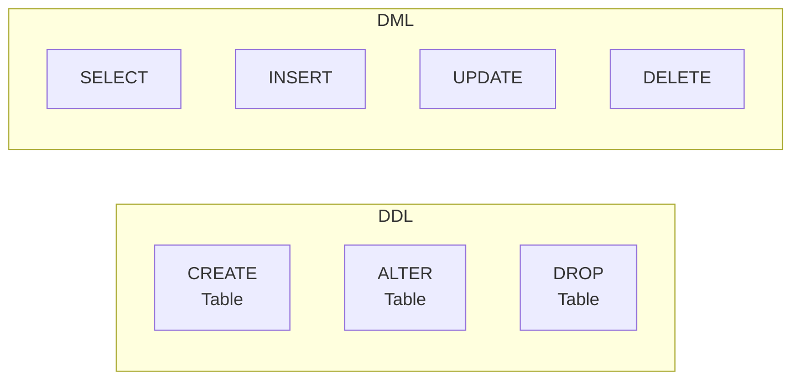
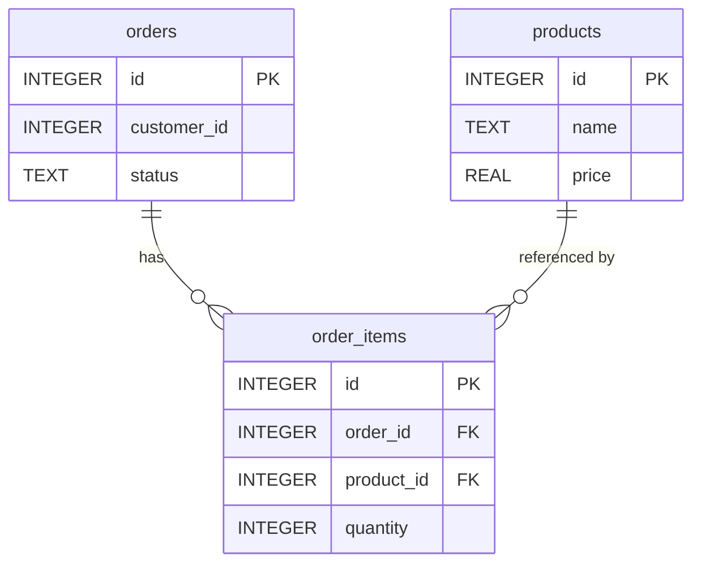

# 15강: DDL — 테이블 생성과 변경

지금까지 `SELECT`, `INSERT`, `UPDATE`, `DELETE`로 데이터를 조회하고 조작하는 **DML**(Data Manipulation Language)을 배웠습니다. 이번 강에서는 테이블 자체를 만들고, 구조를 바꾸고, 삭제하는 **DDL**(Data Definition Language)을 다룹니다.



> **DML**은 테이블 안의 데이터를 다루고, **DDL**은 테이블 자체(구조)를 다룹니다. DDL 문은 대부분의 데이터베이스에서 자동으로 COMMIT되므로 롤백이 불가능합니다 — 신중하게 실행하세요.

| 분류 | 주요 문 | 대상 |
|------|---------|------|
| DML | SELECT, INSERT, UPDATE, DELETE | 행(데이터) |
| DDL | CREATE, ALTER, DROP | 테이블, 인덱스, 뷰 등(구조) |

## CREATE TABLE

### 기본 문법

```sql
CREATE TABLE table_name (
    column1  datatype  constraints,
    column2  datatype  constraints,
    ...
);
```

간단한 예시 — 주문 아카이브 테이블을 만들어 봅시다:

```sql
CREATE TABLE order_archive (
    id            INTEGER PRIMARY KEY,
    order_id      INTEGER NOT NULL,
    customer_name TEXT    NOT NULL,
    total_amount  REAL,
    archived_at   TEXT    NOT NULL
);
```

## 데이터 타입

데이터베이스마다 지원하는 데이터 타입이 다릅니다. 가장 자주 쓰이는 타입을 정리합니다.

### SQLite

SQLite는 동적 타입 시스템을 사용합니다. 칼럼에 어떤 타입을 선언하든 실제로는 5가지 저장 클래스 중 하나로 저장됩니다.

| 저장 클래스 | 용도 | 예시 |
|-------------|------|------|
| TEXT | 문자열 | 이름, 이메일, 날짜 문자열 |
| INTEGER | 정수 | ID, 수량, 불리언(0/1) |
| REAL | 부동소수점 | 가격, 비율 |
| BLOB | 바이너리 데이터 | 이미지, 파일 |
| NULL | 값 없음 | — |

### MySQL

| 타입 | 용도 | 예시 |
|------|------|------|
| VARCHAR(n) | 가변 길이 문자열 (최대 n자) | 이름, 이메일 |
| INT | 정수 (-2^31 ~ 2^31-1) | ID, 수량 |
| BIGINT | 큰 정수 | 대용량 ID |
| DECIMAL(p,s) | 고정 소수점 (전체 p자리, 소수 s자리) | 가격, 금액 |
| DATE | 날짜 (YYYY-MM-DD) | 생년월일 |
| DATETIME | 날짜+시각 | 주문 시각 |
| BOOLEAN | 참/거짓 (내부적으로 TINYINT(1)) | 활성 여부 |
| TEXT | 긴 문자열 | 리뷰 본문 |

### PostgreSQL

| 타입 | 용도 | 예시 |
|------|------|------|
| VARCHAR(n) | 가변 길이 문자열 (최대 n자) | 이름, 이메일 |
| INTEGER | 정수 (-2^31 ~ 2^31-1) | ID, 수량 |
| BIGINT | 큰 정수 | 대용량 ID |
| NUMERIC(p,s) | 고정 소수점 | 가격, 금액 |
| DATE | 날짜 | 생년월일 |
| TIMESTAMP | 날짜+시각 | 주문 시각 |
| BOOLEAN | 참/거짓 (true/false) | 활성 여부 |
| TEXT | 길이 제한 없는 문자열 | 리뷰 본문 |

## 칼럼 제약조건

제약조건(Constraint)은 칼럼에 저장할 수 있는 값의 규칙을 정의합니다. 잘못된 데이터가 들어오는 것을 데이터베이스 수준에서 방지합니다.

| 제약조건 | 의미 | 예시 |
|----------|------|------|
| NOT NULL | NULL 값 불허 | `name TEXT NOT NULL` |
| DEFAULT | 값 미지정 시 기본값 사용 | `is_active INTEGER DEFAULT 1` |
| UNIQUE | 중복 값 불허 | `email VARCHAR(200) UNIQUE` |
| CHECK | 조건식을 만족해야 삽입/수정 가능 | `CHECK (price >= 0)` |

### NOT NULL과 DEFAULT

```sql
CREATE TABLE temp_products (
    id         INTEGER PRIMARY KEY,
    name       TEXT    NOT NULL,
    price      REAL    NOT NULL DEFAULT 0,
    stock_qty  INTEGER NOT NULL DEFAULT 0,
    is_active  INTEGER NOT NULL DEFAULT 1,
    created_at TEXT    NOT NULL
);
```

`price`에 값을 넣지 않으면 자동으로 `0`이 됩니다. 하지만 `name`이나 `created_at`은 반드시 값을 넣어야 합니다.

### UNIQUE

```sql
CREATE TABLE temp_customers (
    id    INTEGER PRIMARY KEY,
    email TEXT    NOT NULL UNIQUE,
    phone TEXT    UNIQUE
);
```

같은 이메일이나 전화번호를 가진 행이 이미 있으면 삽입이 거부됩니다. `UNIQUE`는 NULL을 허용합니다 — `phone`이 NULL인 행은 여러 개 존재할 수 있습니다.

### CHECK

```sql
CREATE TABLE temp_order_items (
    id         INTEGER PRIMARY KEY,
    order_id   INTEGER NOT NULL,
    product_id INTEGER NOT NULL,
    quantity   INTEGER NOT NULL CHECK (quantity > 0),
    unit_price REAL    NOT NULL CHECK (unit_price >= 0)
);
```

`quantity`가 0 이하이거나 `unit_price`가 음수이면 삽입/수정이 거부됩니다.

## PRIMARY KEY와 자동 증가

기본 키(Primary Key)는 테이블의 각 행을 고유하게 식별합니다. 자동 증가를 사용하면 새 행을 삽입할 때 ID를 직접 넣지 않아도 됩니다.

=== "SQLite"
    ```sql
    -- AUTOINCREMENT: 이전에 사용된 ID를 재사용하지 않음
    CREATE TABLE event_log (
        id         INTEGER PRIMARY KEY AUTOINCREMENT,
        event_type TEXT NOT NULL,
        message    TEXT,
        created_at TEXT NOT NULL
    );

    -- INSERT 시 id를 생략하면 자동 증가
    INSERT INTO event_log (event_type, message, created_at)
    VALUES ('LOGIN', '고객 로그인', datetime('now'));
    ```

    > SQLite에서 `INTEGER PRIMARY KEY`만 선언하면(AUTOINCREMENT 없이) 자동 증가가 되지만, 삭제된 ID가 재사용될 수 있습니다. `AUTOINCREMENT`를 붙이면 재사용을 방지합니다.

=== "MySQL"
    ```sql
    CREATE TABLE event_log (
        id         INT AUTO_INCREMENT PRIMARY KEY,
        event_type VARCHAR(50)  NOT NULL,
        message    TEXT,
        created_at DATETIME     NOT NULL
    );

    INSERT INTO event_log (event_type, message, created_at)
    VALUES ('LOGIN', '고객 로그인', NOW());
    ```

=== "PostgreSQL"
    ```sql
    -- 최신 표준 문법 (GENERATED ALWAYS AS IDENTITY)
    CREATE TABLE event_log (
        id         INTEGER GENERATED ALWAYS AS IDENTITY PRIMARY KEY,
        event_type VARCHAR(50)  NOT NULL,
        message    TEXT,
        created_at TIMESTAMP    NOT NULL
    );

    INSERT INTO event_log (event_type, message, created_at)
    VALUES ('LOGIN', '고객 로그인', NOW());
    ```

    > PostgreSQL에서 `SERIAL` 타입도 자동 증가를 지원하지만, `GENERATED ALWAYS AS IDENTITY`가 SQL 표준에 더 가깝고 권장됩니다.

## FOREIGN KEY — 참조 무결성

외래 키(Foreign Key)는 한 테이블의 칼럼이 다른 테이블의 기본 키를 참조하도록 강제합니다. 존재하지 않는 값을 참조하는 것을 데이터베이스가 자동으로 차단합니다.



> `order_items.order_id`는 `orders.id`를 참조하고, `order_items.product_id`는 `products.id`를 참조합니다.

### 기본 선언

```sql
CREATE TABLE temp_order_items (
    id         INTEGER PRIMARY KEY,
    order_id   INTEGER NOT NULL,
    product_id INTEGER NOT NULL,
    quantity   INTEGER NOT NULL CHECK (quantity > 0),
    unit_price REAL    NOT NULL,
    FOREIGN KEY (order_id)   REFERENCES orders (id),
    FOREIGN KEY (product_id) REFERENCES products (id)
);
```

이제 `orders` 테이블에 존재하지 않는 `order_id`를 삽입하면 오류가 발생합니다.

> **SQLite 참고:** SQLite에서 외래 키 검사는 기본적으로 꺼져 있습니다. `PRAGMA foreign_keys = ON;`을 먼저 실행해야 합니다.

### ON DELETE — 부모 행 삭제 시 동작

부모 행이 삭제될 때 자식 행을 어떻게 처리할지 정할 수 있습니다.

| 옵션 | 동작 |
|------|------|
| RESTRICT (기본값) | 자식 행이 있으면 부모 삭제를 거부 |
| CASCADE | 부모 삭제 시 자식 행도 함께 삭제 |
| SET NULL | 부모 삭제 시 자식의 FK 칼럼을 NULL로 변경 |

```sql
CREATE TABLE temp_reviews (
    id         INTEGER PRIMARY KEY,
    product_id INTEGER NOT NULL,
    customer_id INTEGER,
    rating     INTEGER NOT NULL CHECK (rating BETWEEN 1 AND 5),
    content    TEXT,
    FOREIGN KEY (product_id)  REFERENCES products (id) ON DELETE CASCADE,
    FOREIGN KEY (customer_id) REFERENCES customers (id) ON DELETE SET NULL
);
```

- 상품이 삭제되면 해당 상품의 리뷰도 **함께 삭제**됩니다 (CASCADE).
- 고객이 삭제되면 리뷰는 남지만 `customer_id`가 **NULL**로 변경됩니다 (SET NULL).

## ALTER TABLE

이미 존재하는 테이블의 구조를 변경합니다. 데이터베이스마다 지원 범위가 다릅니다.

### ADD COLUMN — 칼럼 추가

=== "SQLite"
    ```sql
    ALTER TABLE order_archive ADD COLUMN reason TEXT;
    ```

    > SQLite에서 추가하는 칼럼에는 `NOT NULL` 제약을 걸 수 없습니다(기존 행의 값이 NULL이 되므로). `DEFAULT`를 함께 지정하면 가능합니다.

    ```sql
    ALTER TABLE order_archive ADD COLUMN status TEXT NOT NULL DEFAULT 'archived';
    ```

=== "MySQL"
    ```sql
    ALTER TABLE order_archive ADD COLUMN reason TEXT;

    -- MySQL은 칼럼 위치를 지정할 수 있음
    ALTER TABLE order_archive ADD COLUMN status VARCHAR(20) NOT NULL DEFAULT 'archived' AFTER total_amount;
    ```

=== "PostgreSQL"
    ```sql
    ALTER TABLE order_archive ADD COLUMN reason TEXT;
    ALTER TABLE order_archive ADD COLUMN status VARCHAR(20) NOT NULL DEFAULT 'archived';
    ```

### RENAME COLUMN — 칼럼 이름 변경

=== "SQLite"
    ```sql
    -- SQLite 3.25.0+ (2018년 9월) 지원
    ALTER TABLE order_archive RENAME COLUMN customer_name TO customer_full_name;
    ```

=== "MySQL"
    ```sql
    -- MySQL 8.0+ 지원
    ALTER TABLE order_archive RENAME COLUMN customer_name TO customer_full_name;
    ```

=== "PostgreSQL"
    ```sql
    ALTER TABLE order_archive RENAME COLUMN customer_name TO customer_full_name;
    ```

### DROP COLUMN — 칼럼 삭제

=== "SQLite"
    ```sql
    -- SQLite 3.35.0+ (2021년 3월) 지원
    ALTER TABLE order_archive DROP COLUMN reason;
    ```

    > 오래된 SQLite 버전에서는 `DROP COLUMN`을 지원하지 않습니다. 이 경우 새 테이블을 만들고 데이터를 복사한 뒤 원래 테이블을 삭제하는 방법을 사용해야 합니다.

=== "MySQL"
    ```sql
    ALTER TABLE order_archive DROP COLUMN reason;
    ```

=== "PostgreSQL"
    ```sql
    ALTER TABLE order_archive DROP COLUMN reason;
    ```

### RENAME TABLE — 테이블 이름 변경

=== "SQLite"
    ```sql
    ALTER TABLE order_archive RENAME TO old_order_archive;
    ```

=== "MySQL"
    ```sql
    ALTER TABLE order_archive RENAME TO old_order_archive;
    -- 또는
    RENAME TABLE order_archive TO old_order_archive;
    ```

=== "PostgreSQL"
    ```sql
    ALTER TABLE order_archive RENAME TO old_order_archive;
    ```

## DROP TABLE

테이블을 완전히 삭제합니다. 테이블의 구조와 모든 데이터가 사라집니다.

```sql
DROP TABLE order_archive;
```

테이블이 존재하지 않으면 오류가 발생합니다. `IF EXISTS`를 사용하면 안전하게 삭제할 수 있습니다:

```sql
DROP TABLE IF EXISTS order_archive;
```

> **주의:** `DROP TABLE`은 되돌릴 수 없습니다. 운영 환경에서는 반드시 백업을 확인한 후 실행하세요. 외래 키로 참조되는 테이블은 자식 테이블을 먼저 삭제하거나 외래 키를 제거해야 합니다.

## CREATE TABLE AS SELECT (CTAS)

기존 쿼리의 결과로 새 테이블을 만듭니다. 데이터 백업, 분석용 스냅샷, 임시 작업 테이블을 만들 때 유용합니다.

=== "SQLite / PostgreSQL"
    ```sql
    -- 2024년 주문을 아카이브 테이블로 복사
    CREATE TABLE orders_2024 AS
    SELECT
        o.id,
        o.customer_id,
        c.name AS customer_name,
        o.total_amount,
        o.status,
        o.ordered_at
    FROM orders AS o
    JOIN customers AS c ON o.customer_id = c.id
    WHERE o.ordered_at >= '2024-01-01'
      AND o.ordered_at <  '2025-01-01';
    ```

=== "MySQL"
    ```sql
    -- 2024년 주문을 아카이브 테이블로 복사
    CREATE TABLE orders_2024 AS
    SELECT
        o.id,
        o.customer_id,
        c.name AS customer_name,
        o.total_amount,
        o.status,
        o.ordered_at
    FROM orders AS o
    JOIN customers AS c ON o.customer_id = c.id
    WHERE o.ordered_at >= '2024-01-01'
      AND o.ordered_at <  '2025-01-01';
    ```

> **참고:** CTAS로 만든 테이블은 원본 테이블의 제약조건(PRIMARY KEY, FOREIGN KEY, NOT NULL 등)을 상속하지 않습니다. 필요하면 `ALTER TABLE`로 별도로 추가해야 합니다.

## 요약

| DDL 문 | 용도 | 예시 |
|--------|------|------|
| CREATE TABLE | 새 테이블 생성 | `CREATE TABLE t (id INT PRIMARY KEY, ...)` |
| ALTER TABLE ADD COLUMN | 칼럼 추가 | `ALTER TABLE t ADD COLUMN col TEXT` |
| ALTER TABLE RENAME COLUMN | 칼럼 이름 변경 | `ALTER TABLE t RENAME COLUMN a TO b` |
| ALTER TABLE DROP COLUMN | 칼럼 삭제 | `ALTER TABLE t DROP COLUMN col` |
| ALTER TABLE RENAME TO | 테이블 이름 변경 | `ALTER TABLE t RENAME TO new_t` |
| DROP TABLE | 테이블 삭제 | `DROP TABLE IF EXISTS t` |
| CREATE TABLE AS SELECT | 쿼리 결과로 테이블 생성 | `CREATE TABLE t AS SELECT ...` |

!!! note "레슨 복습 문제"
    이 레슨에서 배운 개념을 바로 확인하는 간단한 문제입니다. 여러 개념을 종합하는 실전 연습은 [연습 문제](../exercises/index.md) 섹션을 참고하세요.

## 연습 문제

### 연습 1
이벤트 참가자를 저장하는 `event_participants` 테이블을 만드세요. 칼럼: `id`(정수, 기본 키), `event_name`(문자열, NOT NULL), `participant_name`(문자열, NOT NULL), `email`(문자열, UNIQUE), `registered_at`(문자열, NOT NULL).

??? success "정답"
    ```sql
    CREATE TABLE event_participants (
        id               INTEGER PRIMARY KEY,
        event_name       TEXT NOT NULL,
        participant_name TEXT NOT NULL,
        email            TEXT UNIQUE,
        registered_at    TEXT NOT NULL
    );
    ```

### 연습 2
상품 가격 이력을 저장하는 `price_history` 테이블을 만드세요. 칼럼: `id`(정수, 자동 증가 기본 키), `product_id`(정수, NOT NULL), `old_price`, `new_price`(둘 다 실수, NOT NULL), `changed_at`(NOT NULL). `new_price`는 0 이상이어야 합니다(CHECK). `product_id`는 `products(id)`를 참조하는 외래 키입니다.

??? success "정답"
    === "SQLite"
        ```sql
        CREATE TABLE price_history (
            id         INTEGER PRIMARY KEY AUTOINCREMENT,
            product_id INTEGER NOT NULL,
            old_price  REAL    NOT NULL,
            new_price  REAL    NOT NULL CHECK (new_price >= 0),
            changed_at TEXT    NOT NULL,
            FOREIGN KEY (product_id) REFERENCES products (id)
        );
        ```

    === "MySQL"
        ```sql
        CREATE TABLE price_history (
            id         INT AUTO_INCREMENT PRIMARY KEY,
            product_id INT            NOT NULL,
            old_price  DECIMAL(12,2)  NOT NULL,
            new_price  DECIMAL(12,2)  NOT NULL CHECK (new_price >= 0),
            changed_at DATETIME       NOT NULL,
            FOREIGN KEY (product_id) REFERENCES products (id)
        );
        ```

    === "PostgreSQL"
        ```sql
        CREATE TABLE price_history (
            id         INTEGER GENERATED ALWAYS AS IDENTITY PRIMARY KEY,
            product_id INTEGER       NOT NULL,
            old_price  NUMERIC(12,2) NOT NULL,
            new_price  NUMERIC(12,2) NOT NULL CHECK (new_price >= 0),
            changed_at TIMESTAMP     NOT NULL,
            FOREIGN KEY (product_id) REFERENCES products (id)
        );
        ```

### 연습 3
다음 `CREATE TABLE` 문에서 잘못된 부분을 찾고 올바르게 수정하세요:

```sql
CREATE TABLE temp_staff (
    id    INTEGER,
    name  TEXT,
    email TEXT,
    salary REAL CHECK (salary > 0)
);
```

힌트: 기본 키가 없고, 필수 칼럼에 NOT NULL이 빠져 있고, 이메일 중복이 가능합니다.

??? success "정답"
    ```sql
    CREATE TABLE temp_staff (
        id     INTEGER PRIMARY KEY,
        name   TEXT    NOT NULL,
        email  TEXT    NOT NULL UNIQUE,
        salary REAL    NOT NULL CHECK (salary > 0)
    );
    ```
    - `id`에 `PRIMARY KEY` 추가 — 각 행을 고유하게 식별
    - `name`에 `NOT NULL` 추가 — 이름은 필수
    - `email`에 `NOT NULL UNIQUE` 추가 — 필수이고 중복 불가
    - `salary`에 `NOT NULL` 추가 — 급여는 필수

### 연습 4
`event_participants` 테이블에 `phone` 칼럼(문자열)과 `is_vip` 칼럼(정수, NOT NULL, 기본값 0)을 추가하세요.

??? success "정답"
    ```sql
    ALTER TABLE event_participants ADD COLUMN phone TEXT;
    ALTER TABLE event_participants ADD COLUMN is_vip INTEGER NOT NULL DEFAULT 0;
    ```

### 연습 5
`event_participants` 테이블의 `participant_name` 칼럼 이름을 `full_name`으로 변경하세요.

??? success "정답"
    ```sql
    ALTER TABLE event_participants RENAME COLUMN participant_name TO full_name;
    ```

### 연습 6
주문 아이템을 저장하는 테이블을 만드세요. `quantity`는 1 이상, `unit_price`는 0 이상이어야 합니다. `order_id`는 `orders(id)`를, `product_id`는 `products(id)`를 참조합니다. 주문이 삭제되면 주문 아이템도 함께 삭제되어야 하고(CASCADE), 상품이 삭제되면 `product_id`는 NULL로 변경되어야 합니다(SET NULL).

??? success "정답"
    ```sql
    CREATE TABLE temp_order_details (
        id         INTEGER PRIMARY KEY,
        order_id   INTEGER NOT NULL,
        product_id INTEGER,
        quantity   INTEGER NOT NULL CHECK (quantity >= 1),
        unit_price REAL    NOT NULL CHECK (unit_price >= 0),
        FOREIGN KEY (order_id)   REFERENCES orders (id)   ON DELETE CASCADE,
        FOREIGN KEY (product_id) REFERENCES products (id)  ON DELETE SET NULL
    );
    ```
    `product_id`는 `SET NULL`이 적용되므로 `NOT NULL`을 빼야 합니다 — NULL이 될 수 있어야 하기 때문입니다.

### 연습 7
`event_participants` 테이블을 삭제하세요. 테이블이 존재하지 않아도 오류가 발생하지 않도록 작성하세요.

??? success "정답"
    ```sql
    DROP TABLE IF EXISTS event_participants;
    ```

### 연습 8
`reviews` 테이블에서 `rating`이 4 이상인 리뷰만 모아 `top_reviews` 테이블을 만드세요. `id`, `product_id`, `customer_id`, `rating`, `content` 칼럼을 포함합니다.

??? success "정답"
    ```sql
    CREATE TABLE top_reviews AS
    SELECT id, product_id, customer_id, rating, content
    FROM reviews
    WHERE rating >= 4;
    ```

### 연습 9
GOLD 등급 고객의 `id`, `name`, `email`, `grade`를 담는 `gold_customers` 테이블을 CTAS로 만든 뒤, `ALTER TABLE`로 `note` 칼럼(문자열, 기본값 없음)을 추가하세요.

??? success "정답"
    ```sql
    -- 1. CTAS로 테이블 생성
    CREATE TABLE gold_customers AS
    SELECT id, name, email, grade
    FROM customers
    WHERE grade = 'GOLD';

    -- 2. 칼럼 추가
    ALTER TABLE gold_customers ADD COLUMN note TEXT;
    ```

### 연습 10
다음 요구사항을 만족하는 `product_audit` 테이블을 만드세요:

- `id`: 자동 증가 기본 키
- `product_id`: 정수, NOT NULL, `products(id)` 참조 외래 키
- `action`: 문자열, NOT NULL, 'INSERT', 'UPDATE', 'DELETE' 중 하나만 허용 (CHECK)
- `old_price`: 실수 (NULL 허용)
- `new_price`: 실수 (NULL 허용)
- `changed_by`: 문자열, NOT NULL
- `changed_at`: NOT NULL, 기본값은 현재 시각

??? success "정답"
    === "SQLite"
        ```sql
        CREATE TABLE product_audit (
            id          INTEGER PRIMARY KEY AUTOINCREMENT,
            product_id  INTEGER NOT NULL,
            action      TEXT    NOT NULL CHECK (action IN ('INSERT', 'UPDATE', 'DELETE')),
            old_price   REAL,
            new_price   REAL,
            changed_by  TEXT    NOT NULL,
            changed_at  TEXT    NOT NULL DEFAULT (datetime('now')),
            FOREIGN KEY (product_id) REFERENCES products (id)
        );
        ```

    === "MySQL"
        ```sql
        CREATE TABLE product_audit (
            id          INT AUTO_INCREMENT PRIMARY KEY,
            product_id  INT           NOT NULL,
            action      VARCHAR(10)   NOT NULL CHECK (action IN ('INSERT', 'UPDATE', 'DELETE')),
            old_price   DECIMAL(12,2),
            new_price   DECIMAL(12,2),
            changed_by  VARCHAR(100)  NOT NULL,
            changed_at  DATETIME      NOT NULL DEFAULT NOW(),
            FOREIGN KEY (product_id) REFERENCES products (id)
        );
        ```

    === "PostgreSQL"
        ```sql
        CREATE TABLE product_audit (
            id          INTEGER GENERATED ALWAYS AS IDENTITY PRIMARY KEY,
            product_id  INTEGER       NOT NULL,
            action      VARCHAR(10)   NOT NULL CHECK (action IN ('INSERT', 'UPDATE', 'DELETE')),
            old_price   NUMERIC(12,2),
            new_price   NUMERIC(12,2),
            changed_by  VARCHAR(100)  NOT NULL,
            changed_at  TIMESTAMP     NOT NULL DEFAULT NOW(),
            FOREIGN KEY (product_id) REFERENCES products (id)
        );
        ```

---
다음: [16강: SELF JOIN과 CROSS JOIN](16-self-cross-join.md)
