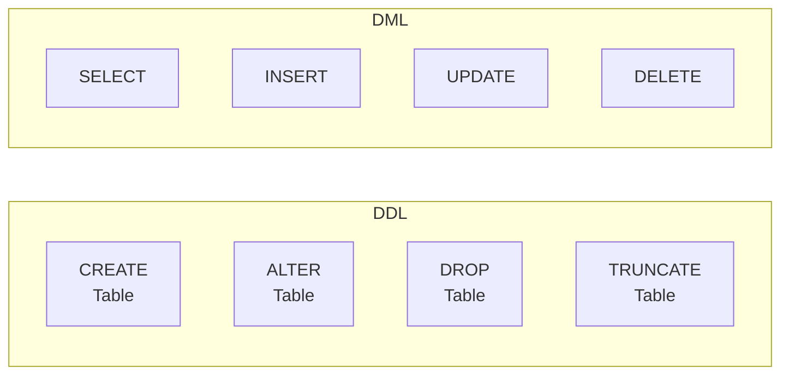
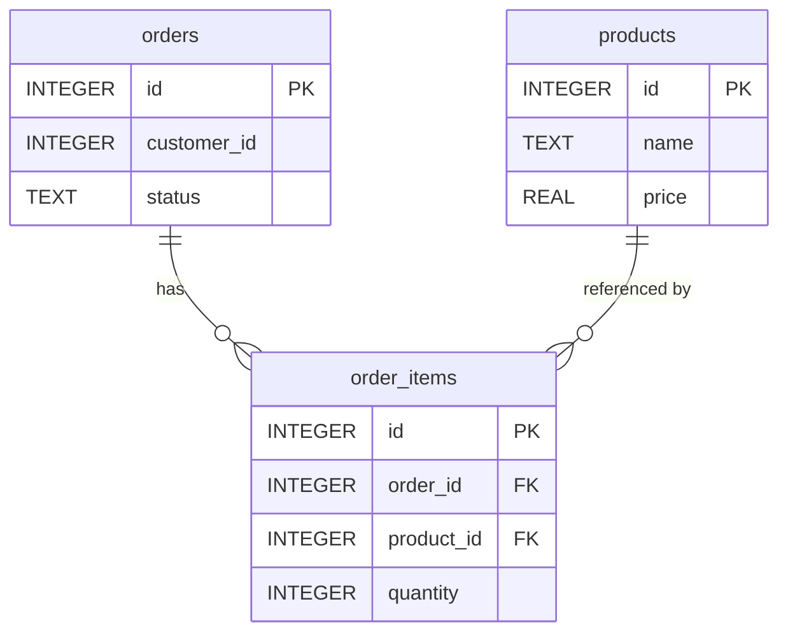

# 15강: DDL — 테이블 생성과 변경

14강에서 데이터를 추가/수정/삭제하는 DML을 배웠습니다. 이번에는 테이블 자체를 만들고, 변경하고, 삭제하는 **DDL**(Data Definition Language)을 배웁니다. [0강](../beginner/00-introduction.md)에서 배운 PK, FK, 데이터 타입을 직접 사용해봅니다.

!!! note "이미 알고 계신다면"
    CREATE TABLE, ALTER TABLE, DROP TABLE, 제약 조건(PK, FK, CHECK, UNIQUE, NOT NULL)에 익숙하다면 [16강: 트랜잭션](16-transactions.md)으로 건너뛰세요.



> **DML**은 테이블 안의 데이터를 다루고, **DDL**은 테이블 자체(구조)를 다룹니다. DDL 문은 대부분의 데이터베이스에서 자동으로 COMMIT되므로 롤백이 불가능합니다 — 신중하게 실행하세요.

| 분류 | 주요 문 | 대상 |
|------|---------|------|
| DML | SELECT, INSERT, UPDATE, DELETE | 행(데이터) |
| DDL | CREATE, ALTER, DROP, TRUNCATE | 테이블, 인덱스, 뷰 등(구조) |

## CREATE TABLE

### 기본 문법

```sql
CREATE TABLE table_name (
    column1  datatype  constraints,
    column2  datatype  constraints,
    ...
);
```

간단한 예시 — 주문 아카이브 테이블을 만들어 봅시다:

```sql
CREATE TABLE order_archive (
    id            INTEGER PRIMARY KEY,
    order_id      INTEGER NOT NULL,
    customer_name TEXT    NOT NULL,
    total_amount  REAL,
    archived_at   TEXT    NOT NULL
);
```

## 데이터 타입

데이터베이스마다 지원하는 데이터 타입이 다릅니다. 가장 자주 쓰이는 타입을 정리합니다.

=== "SQLite"
    SQLite는 동적 타입 시스템(**타입 어피니티**)을 사용합니다. 칼럼에 어떤 타입을 선언하든 실제로는 5가지 저장 클래스 중 하나로 저장됩니다.

    | 저장 클래스 | 용도 | 예시 |
    |-------------|------|------|
    | TEXT | 문자열, 날짜 | 이름, 이메일, ISO 날짜 |
    | INTEGER | 정수, 불리언 | ID, 수량, 0/1 플래그 |
    | REAL | 부동소수점 | 가격, 비율 |
    | BLOB | 바이너리 데이터 | 이미지, 파일 |
    | NUMERIC | 유연한 타입 | INTEGER 또는 REAL로 저장 |

    ```sql
    CREATE TABLE temp_products (
        id          INTEGER PRIMARY KEY,
        name        TEXT    NOT NULL,
        price       REAL    NOT NULL,
        stock_qty   INTEGER DEFAULT 0,
        is_active   INTEGER DEFAULT 1,
        created_at  TEXT    DEFAULT (datetime('now'))
    );
    ```

=== "MySQL"
    MySQL은 엄격한 타입 시스템을 사용하며, 다양한 특화 타입을 제공합니다.

    | 타입 | 용도 | 비고 |
    |------|------|------|
    | VARCHAR(n) | 가변 길이 문자열 | 최대 65,535바이트 |
    | INT | 정수 | 4바이트, -2B ~ +2B |
    | BIGINT | 큰 정수 | 8바이트 |
    | DECIMAL(p,s) | 고정 소수점 | `DECIMAL(10,2)` — 가격용 |
    | DATE | 날짜 | `'2025-03-15'` |
    | DATETIME | 날짜+시각 | `'2025-03-15 14:30:00'` |
    | BOOLEAN | 참/거짓 | TINYINT(1)의 별칭 |
    | TEXT | 긴 문자열 | 최대 65,535바이트 |

    ```sql
    CREATE TABLE temp_products (
        id          INT AUTO_INCREMENT PRIMARY KEY,
        name        VARCHAR(200)   NOT NULL,
        price       DECIMAL(10, 2) NOT NULL,
        stock_qty   INT            DEFAULT 0,
        is_active   BOOLEAN        DEFAULT TRUE,
        created_at  DATETIME       DEFAULT CURRENT_TIMESTAMP
    );
    ```

=== "PostgreSQL"
    PostgreSQL은 풍부한 타입 시스템과 엄격한 타입 검사를 제공합니다.

    | 타입 | 용도 | 비고 |
    |------|------|------|
    | VARCHAR(n) | 가변 길이 문자열 | 또는 TEXT (제한 없음) |
    | INTEGER | 정수 | 4바이트 |
    | BIGINT | 큰 정수 | 8바이트 |
    | NUMERIC(p,s) | 고정 소수점 | `NUMERIC(10,2)` — 가격용 |
    | DATE | 날짜 | `'2025-03-15'` |
    | TIMESTAMP | 날짜+시각 | 타임존 유무 선택 가능 |
    | BOOLEAN | 참/거짓 | TRUE / FALSE 리터럴 |
    | TEXT | 길이 제한 없는 문자열 | PG에서는 VARCHAR보다 선호 |

    ```sql
    CREATE TABLE temp_products (
        id          INTEGER GENERATED ALWAYS AS IDENTITY PRIMARY KEY,
        name        VARCHAR(200)   NOT NULL,
        price       NUMERIC(10, 2) NOT NULL,
        stock_qty   INTEGER        DEFAULT 0,
        is_active   BOOLEAN        DEFAULT TRUE,
        created_at  TIMESTAMP      DEFAULT CURRENT_TIMESTAMP
    );
    ```

## 칼럼 제약조건

제약조건(Constraint)은 칼럼에 저장할 수 있는 값의 규칙을 정의합니다. 잘못된 데이터가 들어오는 것을 데이터베이스 수준에서 방지합니다.

| 제약조건 | 의미 | 예시 |
|----------|------|------|
| NOT NULL | NULL 값 불허 | `name TEXT NOT NULL` |
| DEFAULT | 값 미지정 시 기본값 사용 | `is_active INTEGER DEFAULT 1` |
| UNIQUE | 중복 값 불허 | `email VARCHAR(200) UNIQUE` |
| CHECK | 조건식을 만족해야 삽입/수정 가능 | `CHECK (price >= 0)` |

### NOT NULL

`NOT NULL`로 지정한 칼럼은 NULL 값을 가질 수 없습니다. INSERT 또는 UPDATE에서 NULL을 넣으려 하면 오류가 발생합니다.

```sql
CREATE TABLE temp_customers (
    id    INTEGER PRIMARY KEY,
    name  TEXT NOT NULL,       -- 필수
    email TEXT NOT NULL,       -- 필수
    phone TEXT                 -- 선택 (NULL 허용)
);
```

### DEFAULT

값을 지정하지 않을 때 사용할 기본값을 정의합니다.

=== "SQLite"
    ```sql
    CREATE TABLE temp_orders (
        id         INTEGER PRIMARY KEY,
        status     TEXT    NOT NULL DEFAULT 'pending',
        quantity   INTEGER NOT NULL DEFAULT 1,
        created_at TEXT    DEFAULT (datetime('now'))
    );

    -- status, quantity, created_at을 지정하지 않고 삽입
    INSERT INTO temp_orders (id) VALUES (1);
    -- 결과: status='pending', quantity=1, created_at=현재 시각
    ```

=== "MySQL"
    ```sql
    CREATE TABLE temp_orders (
        id         INT AUTO_INCREMENT PRIMARY KEY,
        status     VARCHAR(20) NOT NULL DEFAULT 'pending',
        quantity   INT         NOT NULL DEFAULT 1,
        created_at DATETIME    DEFAULT CURRENT_TIMESTAMP
    );
    ```

=== "PostgreSQL"
    ```sql
    CREATE TABLE temp_orders (
        id         INTEGER GENERATED ALWAYS AS IDENTITY PRIMARY KEY,
        status     VARCHAR(20) NOT NULL DEFAULT 'pending',
        quantity   INTEGER     NOT NULL DEFAULT 1,
        created_at TIMESTAMP   DEFAULT CURRENT_TIMESTAMP
    );
    ```

### UNIQUE

중복 값을 허용하지 않습니다. 대부분의 데이터베이스에서 NULL은 유니크 검사에서 제외됩니다.

```sql
CREATE TABLE temp_users (
    id       INTEGER PRIMARY KEY,
    username TEXT NOT NULL UNIQUE,
    email    TEXT NOT NULL UNIQUE
);

-- 성공
INSERT INTO temp_users VALUES (1, 'alice', 'alice@testmail.kr');

-- 실패: username 중복
INSERT INTO temp_users VALUES (2, 'alice', 'bob@testmail.kr');
```

### CHECK

값이 조건을 만족해야 행의 삽입/수정이 허용됩니다.

```sql
CREATE TABLE temp_products (
    id        INTEGER PRIMARY KEY,
    name      TEXT    NOT NULL,
    price     REAL    NOT NULL CHECK (price > 0),
    stock_qty INTEGER NOT NULL CHECK (stock_qty >= 0),
    rating    REAL    CHECK (rating BETWEEN 1.0 AND 5.0)
);

-- 성공
INSERT INTO temp_products VALUES (1, 'Keyboard', 49.99, 100, 4.5);

-- 실패: price는 0보다 커야 함
INSERT INTO temp_products VALUES (2, 'Mouse', -10.00, 50, 3.0);
```

## PRIMARY KEY와 자동 증가

기본 키(Primary Key)는 테이블의 각 행을 고유하게 식별합니다. 자동 증가를 사용하면 새 행을 삽입할 때 ID를 직접 넣지 않아도 됩니다.

=== "SQLite"
    ```sql
    -- AUTOINCREMENT: 이전에 사용된 ID를 재사용하지 않음
    CREATE TABLE event_log (
        id         INTEGER PRIMARY KEY AUTOINCREMENT,
        event_type TEXT NOT NULL,
        message    TEXT,
        created_at TEXT NOT NULL
    );

    -- INSERT 시 id를 생략하면 자동 증가
    INSERT INTO event_log (event_type, message, created_at)
    VALUES ('LOGIN', '고객 로그인', datetime('now'));
    ```

    > SQLite에서 `INTEGER PRIMARY KEY`만 선언하면(AUTOINCREMENT 없이) 자동 증가가 되지만, 삭제된 ID가 재사용될 수 있습니다. `AUTOINCREMENT`를 붙이면 재사용을 방지합니다.

=== "MySQL"
    ```sql
    CREATE TABLE event_log (
        id         INT AUTO_INCREMENT PRIMARY KEY,
        event_type VARCHAR(50)  NOT NULL,
        message    TEXT,
        created_at DATETIME     NOT NULL
    );

    INSERT INTO event_log (event_type, message, created_at)
    VALUES ('LOGIN', '고객 로그인', NOW());
    ```

=== "PostgreSQL"
    ```sql
    -- 최신 표준 문법 (GENERATED ALWAYS AS IDENTITY)
    CREATE TABLE event_log (
        id         INTEGER GENERATED ALWAYS AS IDENTITY PRIMARY KEY,
        event_type VARCHAR(50)  NOT NULL,
        message    TEXT,
        created_at TIMESTAMP    NOT NULL
    );

    INSERT INTO event_log (event_type, message, created_at)
    VALUES ('LOGIN', '고객 로그인', NOW());
    ```

    > PostgreSQL에서 `SERIAL` 타입도 자동 증가를 지원하지만, `GENERATED ALWAYS AS IDENTITY`가 SQL 표준에 더 가깝고 권장됩니다.

### 복합 기본 키

단일 칼럼으로 행을 고유하게 식별할 수 없을 때, 여러 칼럼을 조합합니다.

```sql
-- 한 학생은 같은 강좌에 한 번만 등록 가능
CREATE TABLE enrollments (
    student_id  INTEGER NOT NULL,
    course_id   INTEGER NOT NULL,
    enrolled_at TEXT,
    PRIMARY KEY (student_id, course_id)
);
```

## FOREIGN KEY — 참조 무결성

외래 키(Foreign Key)는 한 테이블의 칼럼이 다른 테이블의 기본 키를 참조하도록 강제합니다. 존재하지 않는 값을 참조하는 것을 데이터베이스가 자동으로 차단합니다.



> `order_items.order_id`는 `orders.id`를 참조하고, `order_items.product_id`는 `products.id`를 참조합니다.

### 기본 선언

```sql
CREATE TABLE temp_order_items (
    id         INTEGER PRIMARY KEY,
    order_id   INTEGER NOT NULL,
    product_id INTEGER NOT NULL,
    quantity   INTEGER NOT NULL CHECK (quantity > 0),
    unit_price REAL    NOT NULL,
    FOREIGN KEY (order_id)   REFERENCES orders (id),
    FOREIGN KEY (product_id) REFERENCES products (id)
);
```

이제 `orders` 테이블에 존재하지 않는 `order_id`를 삽입하면 오류가 발생합니다.

> **SQLite 참고:** SQLite에서 외래 키 검사는 기본적으로 꺼져 있습니다. `PRAGMA foreign_keys = ON;`을 먼저 실행해야 합니다.

### ON DELETE — 부모 행 삭제 시 동작

부모 행이 삭제될 때 자식 행을 어떻게 처리할지 정할 수 있습니다.

| 옵션 | 동작 |
|------|------|
| RESTRICT (기본값) | 자식 행이 있으면 부모 삭제를 거부 |
| CASCADE | 부모 삭제 시 자식 행도 함께 삭제 |
| SET NULL | 부모 삭제 시 자식의 FK 칼럼을 NULL로 변경 |

```sql
CREATE TABLE temp_reviews (
    id         INTEGER PRIMARY KEY,
    product_id INTEGER NOT NULL,
    customer_id INTEGER,
    rating     INTEGER NOT NULL CHECK (rating BETWEEN 1 AND 5),
    content    TEXT,
    FOREIGN KEY (product_id)  REFERENCES products (id) ON DELETE CASCADE,
    FOREIGN KEY (customer_id) REFERENCES customers (id) ON DELETE SET NULL
);
```

- 상품이 삭제되면 해당 상품의 리뷰도 **함께 삭제**됩니다 (CASCADE).
- 고객이 삭제되면 리뷰는 남지만 `customer_id`가 **NULL**로 변경됩니다 (SET NULL).

### DB별 외래 키 설정

=== "SQLite"
    ```sql
    -- SQLite는 연결마다 외래 키 검사를 활성화해야 함
    PRAGMA foreign_keys = ON;
    ```

    > SQLite는 외래 키가 **기본적으로 꺼져** 있습니다. 매 세션 시작 시 `PRAGMA foreign_keys = ON;`을 실행해야 합니다.

=== "MySQL"
    ```sql
    -- InnoDB 엔진에서는 외래 키가 기본적으로 활성화됨
    CREATE TABLE temp_order_items (
        id          INT AUTO_INCREMENT PRIMARY KEY,
        order_id    INT NOT NULL,
        product_id  INT NOT NULL,
        quantity    INT NOT NULL DEFAULT 1,
        FOREIGN KEY (order_id)   REFERENCES orders (id) ON DELETE CASCADE,
        FOREIGN KEY (product_id) REFERENCES products (id) ON DELETE RESTRICT
    ) ENGINE=InnoDB;
    ```

=== "PostgreSQL"
    ```sql
    -- PostgreSQL은 외래 키가 항상 활성화됨
    CREATE TABLE temp_order_items (
        id          INTEGER GENERATED ALWAYS AS IDENTITY PRIMARY KEY,
        order_id    INTEGER NOT NULL,
        product_id  INTEGER NOT NULL,
        quantity    INTEGER NOT NULL DEFAULT 1,
        FOREIGN KEY (order_id)   REFERENCES orders (id) ON DELETE CASCADE,
        FOREIGN KEY (product_id) REFERENCES products (id) ON DELETE RESTRICT
    );
    ```

## ALTER TABLE

이미 존재하는 테이블의 구조를 변경합니다. 데이터베이스마다 지원 범위가 다릅니다.

### ADD COLUMN — 칼럼 추가

=== "SQLite"
    ```sql
    ALTER TABLE order_archive ADD COLUMN reason TEXT;
    ```

    > SQLite에서 추가하는 칼럼에는 `NOT NULL` 제약을 걸 수 없습니다(기존 행의 값이 NULL이 되므로). `DEFAULT`를 함께 지정하면 가능합니다.

    ```sql
    ALTER TABLE order_archive ADD COLUMN status TEXT NOT NULL DEFAULT 'archived';
    ```

=== "MySQL"
    ```sql
    ALTER TABLE order_archive ADD COLUMN reason TEXT;

    -- MySQL은 칼럼 위치를 지정할 수 있음
    ALTER TABLE order_archive ADD COLUMN status VARCHAR(20) NOT NULL DEFAULT 'archived' AFTER total_amount;
    ```

=== "PostgreSQL"
    ```sql
    ALTER TABLE order_archive ADD COLUMN reason TEXT;
    ALTER TABLE order_archive ADD COLUMN status VARCHAR(20) NOT NULL DEFAULT 'archived';
    ```

### RENAME COLUMN — 칼럼 이름 변경

=== "SQLite"
    ```sql
    -- SQLite 3.25.0+ (2018년 9월) 지원
    ALTER TABLE order_archive RENAME COLUMN customer_name TO customer_full_name;
    ```

=== "MySQL"
    ```sql
    -- MySQL 8.0+ 지원
    ALTER TABLE order_archive RENAME COLUMN customer_name TO customer_full_name;
    ```

=== "PostgreSQL"
    ```sql
    ALTER TABLE order_archive RENAME COLUMN customer_name TO customer_full_name;
    ```

### DROP COLUMN — 칼럼 삭제

=== "SQLite"
    ```sql
    -- SQLite 3.35.0+ (2021년 3월) 지원
    ALTER TABLE order_archive DROP COLUMN reason;
    ```

    > 오래된 SQLite 버전에서는 `DROP COLUMN`을 지원하지 않습니다. 이 경우 새 테이블을 만들고 데이터를 복사한 뒤 원래 테이블을 삭제하는 방법을 사용해야 합니다.

=== "MySQL"
    ```sql
    ALTER TABLE order_archive DROP COLUMN reason;
    ```

=== "PostgreSQL"
    ```sql
    ALTER TABLE order_archive DROP COLUMN reason;
    ```

### RENAME TABLE — 테이블 이름 변경

=== "SQLite"
    ```sql
    ALTER TABLE order_archive RENAME TO old_order_archive;
    ```

=== "MySQL"
    ```sql
    ALTER TABLE order_archive RENAME TO old_order_archive;
    -- 또는
    RENAME TABLE order_archive TO old_order_archive;
    ```

=== "PostgreSQL"
    ```sql
    ALTER TABLE order_archive RENAME TO old_order_archive;
    ```

## DROP TABLE

테이블을 완전히 삭제합니다. 테이블의 구조와 모든 데이터가 사라집니다.

```sql
DROP TABLE order_archive;
```

테이블이 존재하지 않으면 오류가 발생합니다. `IF EXISTS`를 사용하면 안전하게 삭제할 수 있습니다:

```sql
DROP TABLE IF EXISTS order_archive;
```

> **주의:** `DROP TABLE`은 되돌릴 수 없습니다. 운영 환경에서는 반드시 백업을 확인한 후 실행하세요. 외래 키로 참조되는 테이블은 자식 테이블을 먼저 삭제하거나 외래 키를 제거해야 합니다.

## TRUNCATE TABLE

`TRUNCATE TABLE`은 테이블의 **모든 행을 삭제**하되, 테이블 구조(칼럼, 제약조건, 인덱스)는 그대로 유지합니다. `DELETE FROM table_name`과 비슷하지만 동작 방식이 다릅니다.

### DELETE와 TRUNCATE 비교

| 항목 | DELETE | TRUNCATE |
|------|--------|----------|
| WHERE 조건 | 가능 | 불가 |
| 트랜잭션 롤백 | 가능 | DB에 따라 다름 |
| 트리거 실행 | 실행됨 | 실행 안 됨 |
| 속도 (대량 데이터) | 느림 | 빠름 |
| Auto-increment | 유지 | 리셋 |

`DELETE`는 행을 하나씩 삭제하며 각 행마다 로그를 기록하지만, `TRUNCATE`는 데이터 페이지를 통째로 해제하므로 대량 데이터에서 훨씬 빠릅니다.

### DB별 구문

=== "SQLite"
    SQLite는 `TRUNCATE TABLE` 문을 지원하지 않습니다. `DELETE FROM`으로 대체합니다.

    ```sql
    -- 모든 행 삭제 (테이블 구조는 유지)
    DELETE FROM order_archive;

    -- 디스크 공간까지 회수하려면 VACUUM 실행
    VACUUM;
    ```

    > SQLite에서 `DELETE FROM table_name`은 모든 행을 삭제하지만, 파일 크기는 줄어들지 않습니다. `VACUUM`을 실행해야 실제 디스크 공간이 회수됩니다.

=== "MySQL"
    ```sql
    TRUNCATE TABLE order_archive;
    ```

    > MySQL에서 `TRUNCATE`는 **DDL로 취급**됩니다. 암묵적으로 COMMIT이 실행되므로 `ROLLBACK`으로 되돌릴 수 없습니다. `AUTO_INCREMENT` 값이 리셋됩니다.

=== "PostgreSQL"
    ```sql
    -- 기본 TRUNCATE
    TRUNCATE TABLE order_archive;

    -- 시퀀스(자동 증가 값)도 함께 리셋
    TRUNCATE TABLE order_archive RESTART IDENTITY;

    -- 외래 키로 참조하는 자식 테이블도 함께 TRUNCATE
    TRUNCATE TABLE order_archive CASCADE;
    ```

    > PostgreSQL의 `TRUNCATE`는 트랜잭션 안에서 `ROLLBACK`이 가능합니다. `RESTART IDENTITY`로 시퀀스를 리셋하고, `CASCADE`로 참조하는 자식 테이블까지 함께 비울 수 있습니다.

## CREATE TABLE AS SELECT (CTAS)

기존 쿼리의 결과로 새 테이블을 만듭니다. 데이터 백업, 분석용 스냅샷, 임시 작업 테이블을 만들 때 유용합니다.

=== "SQLite / PostgreSQL"
    ```sql
    -- 2024년 주문을 아카이브 테이블로 복사
    CREATE TABLE orders_2024 AS
    SELECT
        o.id,
        o.customer_id,
        c.name AS customer_name,
        o.total_amount,
        o.status,
        o.ordered_at
    FROM orders AS o
    JOIN customers AS c ON o.customer_id = c.id
    WHERE o.ordered_at >= '2024-01-01'
      AND o.ordered_at <  '2025-01-01';
    ```

=== "MySQL"
    ```sql
    -- 2024년 주문을 아카이브 테이블로 복사
    CREATE TABLE orders_2024 AS
    SELECT
        o.id,
        o.customer_id,
        c.name AS customer_name,
        o.total_amount,
        o.status,
        o.ordered_at
    FROM orders AS o
    JOIN customers AS c ON o.customer_id = c.id
    WHERE o.ordered_at >= '2024-01-01'
      AND o.ordered_at <  '2025-01-01';
    ```

```sql
-- 리포팅용 요약 테이블 생성
CREATE TABLE category_summary AS
SELECT
    cat.name            AS category,
    COUNT(p.id)         AS product_count,
    ROUND(AVG(p.price), 2) AS avg_price,
    SUM(p.stock_qty)    AS total_stock
FROM categories cat
LEFT JOIN products p ON p.category_id = cat.id
GROUP BY cat.name;
```

> **참고:** CTAS로 만든 테이블은 원본 테이블의 제약조건(PRIMARY KEY, FOREIGN KEY, NOT NULL 등)을 상속하지 않습니다. 아카이브, 리포팅 스냅샷, 복잡한 쿼리 결과 저장에 유용합니다. 필요하면 `ALTER TABLE`로 제약조건을 별도로 추가하세요.

## 정리

| DDL 문 | 용도 | 예시 |
|--------|------|------|
| CREATE TABLE | 새 테이블 생성 | `CREATE TABLE t (id INT PRIMARY KEY, ...)` |
| ALTER TABLE ADD COLUMN | 칼럼 추가 | `ALTER TABLE t ADD COLUMN col TEXT` |
| ALTER TABLE RENAME COLUMN | 칼럼 이름 변경 | `ALTER TABLE t RENAME COLUMN a TO b` |
| ALTER TABLE DROP COLUMN | 칼럼 삭제 | `ALTER TABLE t DROP COLUMN col` |
| ALTER TABLE RENAME TO | 테이블 이름 변경 | `ALTER TABLE t RENAME TO new_t` |
| DROP TABLE | 테이블 삭제 | `DROP TABLE IF EXISTS t` |
| TRUNCATE TABLE | 모든 행 삭제 (구조 유지) | `TRUNCATE TABLE t` |
| CREATE TABLE AS SELECT | 쿼리 결과로 테이블 생성 | `CREATE TABLE t AS SELECT ...` |

!!! note "레슨 복습 문제"
    이 레슨에서 배운 개념을 바로 확인하는 간단한 문제입니다. 여러 개념을 종합하는 실전 연습은 [연습 문제](../exercises/index.md) 섹션을 참고하세요.

## 연습 문제
### 연습 1
`temp_employees` 테이블을 만드세요. 칼럼: `id`(자동 증가 기본 키), `name`(필수, 문자열), `email`(필수, UNIQUE, 문자열), `department`(문자열, 기본값 `'General'`), `hire_date`(문자열/날짜).

??? success "정답"
    === "SQLite"
        ```sql
        CREATE TABLE temp_employees (
            id         INTEGER PRIMARY KEY AUTOINCREMENT,
            name       TEXT NOT NULL,
            email      TEXT NOT NULL UNIQUE,
            department TEXT DEFAULT 'General',
            hire_date  TEXT
        );
        ```

    === "MySQL"
        ```sql
        CREATE TABLE temp_employees (
            id         INT AUTO_INCREMENT PRIMARY KEY,
            name       VARCHAR(200) NOT NULL,
            email      VARCHAR(200) NOT NULL UNIQUE,
            department VARCHAR(100) DEFAULT 'General',
            hire_date  DATE
        );
        ```

    === "PostgreSQL"
        ```sql
        CREATE TABLE temp_employees (
            id         INTEGER GENERATED ALWAYS AS IDENTITY PRIMARY KEY,
            name       VARCHAR(200) NOT NULL,
            email      VARCHAR(200) NOT NULL UNIQUE,
            department VARCHAR(100) DEFAULT 'General',
            hire_date  DATE
        );
        ```


### 연습 2
`temp_employees` 테이블에 `phone` 칼럼(문자열, 선택)을 추가한 뒤, `department` 칼럼의 이름을 `dept`로 변경하세요.

??? success "정답"
    ```sql
    ALTER TABLE temp_employees ADD COLUMN phone TEXT;

    ALTER TABLE temp_employees RENAME COLUMN department TO dept;
    ```


### 연습 3
**복합 기본 키**를 사용하는 `temp_order_log` 테이블을 만드세요. (`order_id`, `log_seq`)가 복합 기본 키입니다. 칼럼: `order_id`(정수, 필수), `log_seq`(정수, 필수), `action`(문자열, 필수, `'created'`, `'shipped'`, `'delivered'`, `'cancelled'` 중 하나만 허용), `logged_at`(기본값: 현재 시각).

??? success "정답"
    === "SQLite"
        ```sql
        CREATE TABLE temp_order_log (
            order_id  INTEGER NOT NULL,
            log_seq   INTEGER NOT NULL,
            action    TEXT    NOT NULL CHECK (action IN ('created', 'shipped', 'delivered', 'cancelled')),
            logged_at TEXT    DEFAULT (datetime('now')),
            PRIMARY KEY (order_id, log_seq)
        );
        ```

    === "MySQL"
        ```sql
        CREATE TABLE temp_order_log (
            order_id  INT         NOT NULL,
            log_seq   INT         NOT NULL,
            action    VARCHAR(20) NOT NULL CHECK (action IN ('created', 'shipped', 'delivered', 'cancelled')),
            logged_at DATETIME    DEFAULT CURRENT_TIMESTAMP,
            PRIMARY KEY (order_id, log_seq)
        );
        ```

    === "PostgreSQL"
        ```sql
        CREATE TABLE temp_order_log (
            order_id  INTEGER     NOT NULL,
            log_seq   INTEGER     NOT NULL,
            action    VARCHAR(20) NOT NULL CHECK (action IN ('created', 'shipped', 'delivered', 'cancelled')),
            logged_at TIMESTAMP   DEFAULT CURRENT_TIMESTAMP,
            PRIMARY KEY (order_id, log_seq)
        );
        ```


### 연습 4
`DELETE FROM`과 `TRUNCATE TABLE`의 차이를 설명하세요. 그리고 `order_archive` 테이블의 모든 데이터를 삭제하는 구문을 DB별로 작성하세요.

??? success "정답"
    **차이점:**

    - `DELETE`는 행 단위로 삭제하며 트랜잭션 로그에 기록되고, WHERE 조건으로 일부만 삭제할 수 있습니다. 트리거가 실행되며, auto-increment 값은 유지됩니다.
    - `TRUNCATE`는 데이터 페이지를 통째로 해제하여 훨씬 빠르고, WHERE 조건을 사용할 수 없습니다. 트리거가 실행되지 않으며, auto-increment 값이 리셋됩니다.

    === "SQLite"
        ```sql
        -- SQLite는 TRUNCATE를 지원하지 않으므로 DELETE로 대체
        DELETE FROM order_archive;

        -- 디스크 공간 회수가 필요하면
        VACUUM;
        ```

    === "MySQL"
        ```sql
        TRUNCATE TABLE order_archive;
        ```

    === "PostgreSQL"
        ```sql
        -- 기본 TRUNCATE
        TRUNCATE TABLE order_archive;

        -- 시퀀스도 리셋하려면
        TRUNCATE TABLE order_archive RESTART IDENTITY;
        ```


### 연습 5
상품 가격 이력을 저장하는 `price_history` 테이블을 만드세요. 칼럼: `id`(정수, 자동 증가 기본 키), `product_id`(정수, NOT NULL), `old_price`, `new_price`(둘 다 실수, NOT NULL), `changed_at`(NOT NULL). `new_price`는 0 이상이어야 합니다(CHECK). `product_id`는 `products(id)`를 참조하는 외래 키입니다.

??? success "정답"
    === "SQLite"
        ```sql
        CREATE TABLE price_history (
            id         INTEGER PRIMARY KEY AUTOINCREMENT,
            product_id INTEGER NOT NULL,
            old_price  REAL    NOT NULL,
            new_price  REAL    NOT NULL CHECK (new_price >= 0),
            changed_at TEXT    NOT NULL,
            FOREIGN KEY (product_id) REFERENCES products (id)
        );
        ```

    === "MySQL"
        ```sql
        CREATE TABLE price_history (
            id         INT AUTO_INCREMENT PRIMARY KEY,
            product_id INT            NOT NULL,
            old_price  DECIMAL(12,2)  NOT NULL,
            new_price  DECIMAL(12,2)  NOT NULL CHECK (new_price >= 0),
            changed_at DATETIME       NOT NULL,
            FOREIGN KEY (product_id) REFERENCES products (id)
        );
        ```

    === "PostgreSQL"
        ```sql
        CREATE TABLE price_history (
            id         INTEGER GENERATED ALWAYS AS IDENTITY PRIMARY KEY,
            product_id INTEGER       NOT NULL,
            old_price  NUMERIC(12,2) NOT NULL,
            new_price  NUMERIC(12,2) NOT NULL CHECK (new_price >= 0),
            changed_at TIMESTAMP     NOT NULL,
            FOREIGN KEY (product_id) REFERENCES products (id)
        );
        ```


### 연습 6
다음 테이블 정의에서 잘못된 부분을 찾고 수정하세요.

```sql
CREATE TABLE temp_inventory (
    product_id INTEGER,
    warehouse  TEXT,
    quantity   INTEGER DEFAULT -1,
    updated_at TEXT
);
```

??? success "정답"
    세 가지 문제: (1) 기본 키가 없음, (2) quantity 기본값이 -1로 비현실적, (3) product_id에 NOT NULL이 빠져 있음. 수정된 버전:

    ```sql
    CREATE TABLE temp_inventory (
        id         INTEGER PRIMARY KEY,
        product_id INTEGER NOT NULL,
        warehouse  TEXT    NOT NULL,
        quantity   INTEGER NOT NULL DEFAULT 0 CHECK (quantity >= 0),
        updated_at TEXT,
        FOREIGN KEY (product_id) REFERENCES products (id)
    );
    ```


### 연습 7
`event_participants` 테이블을 삭제하세요. 테이블이 존재하지 않아도 오류가 발생하지 않도록 작성하세요.

??? success "정답"
    ```sql
    DROP TABLE IF EXISTS event_participants;
    ```


### 연습 8
주문 아이템을 저장하는 테이블을 만드세요. `quantity`는 1 이상, `unit_price`는 0 이상이어야 합니다. `order_id`는 `orders(id)`를, `product_id`는 `products(id)`를 참조합니다. 주문이 삭제되면 주문 아이템도 함께 삭제되어야 하고(CASCADE), 상품이 삭제되면 `product_id`는 NULL로 변경되어야 합니다(SET NULL).

??? success "정답"
    ```sql
    CREATE TABLE temp_order_details (
        id         INTEGER PRIMARY KEY,
        order_id   INTEGER NOT NULL,
        product_id INTEGER,
        quantity   INTEGER NOT NULL CHECK (quantity >= 1),
        unit_price REAL    NOT NULL CHECK (unit_price >= 0),
        FOREIGN KEY (order_id)   REFERENCES orders (id)   ON DELETE CASCADE,
        FOREIGN KEY (product_id) REFERENCES products (id)  ON DELETE SET NULL
    );
    ```
    `product_id`는 `SET NULL`이 적용되므로 `NOT NULL`을 빼야 합니다 — NULL이 될 수 있어야 하기 때문입니다.


### 연습 9
GOLD 등급 고객의 `id`, `name`, `email`, `grade`를 담는 `gold_customers` 테이블을 CTAS로 만든 뒤, `ALTER TABLE`로 `note` 칼럼(문자열, 기본값 없음)을 추가하세요.

??? success "정답"
    ```sql
    -- 1. CTAS로 테이블 생성
    CREATE TABLE gold_customers AS
    SELECT id, name, email, grade
    FROM customers
    WHERE grade = 'GOLD';

    -- 2. 칼럼 추가
    ALTER TABLE gold_customers ADD COLUMN note TEXT;
    ```


### 연습 10
다음 요구사항을 만족하는 `product_audit` 테이블을 만드세요:

- `id`: 자동 증가 기본 키
- `product_id`: 정수, NOT NULL, `products(id)` 참조 외래 키
- `action`: 문자열, NOT NULL, 'INSERT', 'UPDATE', 'DELETE' 중 하나만 허용 (CHECK)
- `old_price`: 실수 (NULL 허용)
- `new_price`: 실수 (NULL 허용)
- `changed_by`: 문자열, NOT NULL
- `changed_at`: NOT NULL, 기본값은 현재 시각

??? success "정답"
    === "SQLite"
        ```sql
        CREATE TABLE product_audit (
            id          INTEGER PRIMARY KEY AUTOINCREMENT,
            product_id  INTEGER NOT NULL,
            action      TEXT    NOT NULL CHECK (action IN ('INSERT', 'UPDATE', 'DELETE')),
            old_price   REAL,
            new_price   REAL,
            changed_by  TEXT    NOT NULL,
            changed_at  TEXT    NOT NULL DEFAULT (datetime('now')),
            FOREIGN KEY (product_id) REFERENCES products (id)
        );
        ```

    === "MySQL"
        ```sql
        CREATE TABLE product_audit (
            id          INT AUTO_INCREMENT PRIMARY KEY,
            product_id  INT           NOT NULL,
            action      VARCHAR(10)   NOT NULL CHECK (action IN ('INSERT', 'UPDATE', 'DELETE')),
            old_price   DECIMAL(12,2),
            new_price   DECIMAL(12,2),
            changed_by  VARCHAR(100)  NOT NULL,
            changed_at  DATETIME      NOT NULL DEFAULT NOW(),
            FOREIGN KEY (product_id) REFERENCES products (id)
        );
        ```

    === "PostgreSQL"
        ```sql
        CREATE TABLE product_audit (
            id          INTEGER GENERATED ALWAYS AS IDENTITY PRIMARY KEY,
            product_id  INTEGER       NOT NULL,
            action      VARCHAR(10)   NOT NULL CHECK (action IN ('INSERT', 'UPDATE', 'DELETE')),
            old_price   NUMERIC(12,2),
            new_price   NUMERIC(12,2),
            changed_by  VARCHAR(100)  NOT NULL,
            changed_at  TIMESTAMP     NOT NULL DEFAULT NOW(),
            FOREIGN KEY (product_id) REFERENCES products (id)
        );
        ```


### 채점 가이드

| 점수 | 다음 단계 |
|:----:|----------|
| **9~10개** | [16강: 트랜잭션](16-transactions.md)으로 이동 |
| **7~8개** | 틀린 문제 해설을 복습한 뒤 다음강으로 |
| **절반 이하** | 이 강의를 다시 읽어보세요 |
| **3개 이하** | [14강: DML](14-dml.md)부터 다시 시작하세요 |

**문제별 영역:**

| 영역 | 해당 문제 |
|------|:--------:|
| CREATE TABLE + 제약조건 | 1, 3, 5, 10 |
| ALTER TABLE (ADD/RENAME) | 2 |
| DELETE vs TRUNCATE | 4 |
| DDL 문제점 식별 + 수정 | 6 |
| DROP TABLE IF EXISTS | 7 |
| FOREIGN KEY ON DELETE 옵션 | 8 |
| CTAS (CREATE TABLE AS SELECT) | 9 |

---
다음: [16강: 트랜잭션과 ACID](16-transactions.md)
