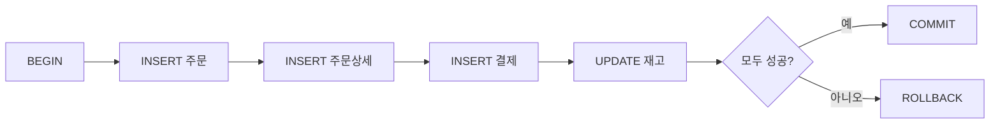
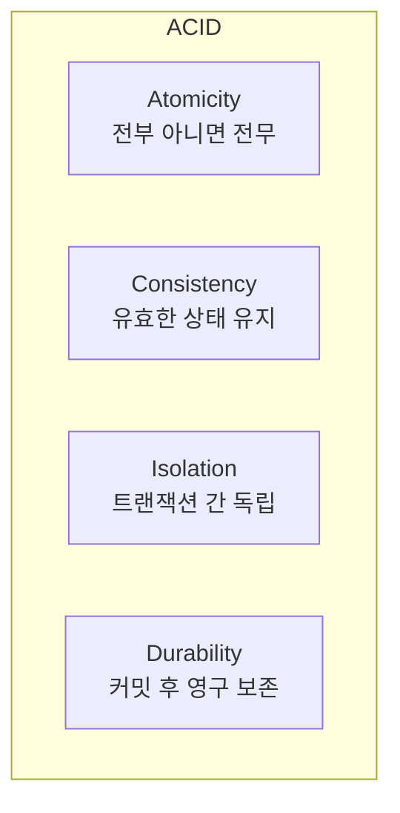

# 16강: 트랜잭션과 ACID

주문을 생성할 때 orders 테이블에 INSERT하고, payments 테이블에도 INSERT해야 합니다. 만약 첫 번째는 성공했는데 두 번째가 실패하면? 결제 없는 주문이 생깁니다. 트랜잭션으로 여러 작업을 하나의 단위로 묶어 이런 문제를 방지합니다.

!!! note "이미 알고 계신다면"
    BEGIN, COMMIT, ROLLBACK, ACID에 익숙하다면 [17강: SELF JOIN과 CROSS JOIN](17-self-cross-join.md)으로 건너뛰세요.



> **트랜잭션(Transaction)** = 하나의 논리적 작업 단위를 구성하는 SQL 문의 묶음. 전부 성공하면 COMMIT, 하나라도 실패하면 ROLLBACK하여 데이터 일관성을 보장합니다.

---

## ACID 속성

트랜잭션이 지켜야 할 4가지 핵심 속성을 **ACID**라고 부릅니다.

| 속성 | 영문 | 의미 |
|------|------|------|
| 원자성 | Atomicity | 트랜잭션 내 작업은 **전부 실행되거나 전부 취소** — 중간 상태 없음 |
| 일관성 | Consistency | 트랜잭션 전후로 데이터베이스는 항상 **유효한 상태** 유지 (제약조건 충족) |
| 격리성 | Isolation | 동시에 실행되는 트랜잭션끼리 **서로 간섭하지 않음** |
| 지속성 | Durability | COMMIT된 데이터는 시스템 장애가 발생해도 **영구 보존** |



> 은행 계좌 이체를 떠올리면 이해가 쉽습니다. A 계좌에서 100만 원을 빼고 B 계좌에 100만 원을 넣는 작업 — 두 작업이 모두 완료되거나(COMMIT), 모두 취소되어야(ROLLBACK) 돈이 사라지거나 복제되지 않습니다.

---

## BEGIN / COMMIT / ROLLBACK

트랜잭션의 3가지 기본 명령입니다.

| 명령 | 역할 |
|------|------|
| BEGIN | 트랜잭션 시작 |
| COMMIT | 변경 사항을 영구 반영 |
| ROLLBACK | 변경 사항을 모두 취소하고 BEGIN 이전 상태로 복원 |

### DB별 문법

=== "SQLite"
    ```sql
    BEGIN TRANSACTION;

    UPDATE products SET stock_qty = stock_qty - 1 WHERE id = 42;
    INSERT INTO order_items (order_id, product_id, quantity, unit_price)
    VALUES (1001, 42, 1, 89000);

    COMMIT;
    ```

    > SQLite에서는 `BEGIN`, `BEGIN TRANSACTION`, `BEGIN DEFERRED` 모두 사용할 수 있습니다.

=== "MySQL"
    ```sql
    START TRANSACTION;

    UPDATE products SET stock_qty = stock_qty - 1 WHERE id = 42;
    INSERT INTO order_items (order_id, product_id, quantity, unit_price)
    VALUES (1001, 42, 1, 89000);

    COMMIT;
    ```

    > MySQL에서는 `START TRANSACTION` 또는 `BEGIN`을 사용합니다.

=== "PostgreSQL"
    ```sql
    BEGIN;

    UPDATE products SET stock_qty = stock_qty - 1 WHERE id = 42;
    INSERT INTO order_items (order_id, product_id, quantity, unit_price)
    VALUES (1001, 42, 1, 89000);

    COMMIT;
    ```

    > PostgreSQL에서는 `BEGIN` 또는 `BEGIN TRANSACTION`을 사용합니다.

### ROLLBACK 예시

트랜잭션 도중 문제가 발생하면 ROLLBACK으로 모든 변경을 취소합니다.

```sql
BEGIN;

UPDATE products SET stock_qty = stock_qty - 1 WHERE id = 42;
INSERT INTO order_items (order_id, product_id, quantity, unit_price)
VALUES (1001, 42, 1, 89000);

-- 결제 처리 중 오류 발생!
ROLLBACK;
-- products의 stock_qty 변경도 취소됨
```

---

## SAVEPOINT — 부분 롤백

`SAVEPOINT`는 트랜잭션 내에 **중간 저장점**을 만듭니다. `ROLLBACK TO`로 해당 지점까지만 되돌리고, 그 이전 작업은 유지할 수 있습니다.


=== "SQLite"
    ```sql
    BEGIN TRANSACTION;

    INSERT INTO orders (id, order_number, customer_id, status, total_amount, ordered_at)
    VALUES (5001, 'ORD-5001', 100, 'pending', 178000, datetime('now'));

    SAVEPOINT sp_items;

    INSERT INTO order_items (order_id, product_id, quantity, unit_price)
    VALUES (5001, 10, 2, 89000);

    -- 두 번째 상품 재고 부족 → 이 상품만 취소
    ROLLBACK TO sp_items;

    -- 첫 번째 상품 다시 추가 (금액 수정)
    INSERT INTO order_items (order_id, product_id, quantity, unit_price)
    VALUES (5001, 10, 1, 89000);

    RELEASE sp_items;

    COMMIT;
    ```

=== "MySQL"
    ```sql
    START TRANSACTION;

    INSERT INTO orders (id, order_number, customer_id, status, total_amount, ordered_at)
    VALUES (5001, 'ORD-5001', 100, 'pending', 178000, NOW());

    SAVEPOINT sp_items;

    INSERT INTO order_items (order_id, product_id, quantity, unit_price)
    VALUES (5001, 10, 2, 89000);

    -- 두 번째 상품 재고 부족 → 이 상품만 취소
    ROLLBACK TO SAVEPOINT sp_items;

    -- 첫 번째 상품 다시 추가 (금액 수정)
    INSERT INTO order_items (order_id, product_id, quantity, unit_price)
    VALUES (5001, 10, 1, 89000);

    RELEASE SAVEPOINT sp_items;

    COMMIT;
    ```

=== "PostgreSQL"
    ```sql
    BEGIN;

    INSERT INTO orders (id, order_number, customer_id, status, total_amount, ordered_at)
    VALUES (5001, 'ORD-5001', 100, 'pending', 178000, NOW());

    SAVEPOINT sp_items;

    INSERT INTO order_items (order_id, product_id, quantity, unit_price)
    VALUES (5001, 10, 2, 89000);

    -- 두 번째 상품 재고 부족 → 이 상품만 취소
    ROLLBACK TO SAVEPOINT sp_items;

    -- 첫 번째 상품 다시 추가 (금액 수정)
    INSERT INTO order_items (order_id, product_id, quantity, unit_price)
    VALUES (5001, 10, 1, 89000);

    RELEASE SAVEPOINT sp_items;

    COMMIT;
    ```

> `RELEASE SAVEPOINT`는 해당 저장점을 제거합니다. COMMIT과 다르며, 트랜잭션은 아직 진행 중입니다.

---

## 자동 커밋 vs 명시적 트랜잭션

대부분의 데이터베이스는 기본적으로 **자동 커밋(Auto-Commit)** 모드로 동작합니다. 각 SQL 문이 개별 트랜잭션으로 자동 실행되고 즉시 커밋됩니다.

| DB | 기본 동작 | 명시적 트랜잭션 시작 | 비고 |
|----|-----------|---------------------|------|
| SQLite | 자동 커밋 | `BEGIN TRANSACTION` | 각 문장이 암묵적 트랜잭션으로 실행 |
| MySQL | 자동 커밋 (`autocommit=1`) | `START TRANSACTION` | `SET autocommit=0`으로 변경 가능 |
| PostgreSQL | 자동 커밋 | `BEGIN` | psql에서 `\set AUTOCOMMIT off` 가능 |

**자동 커밋 모드의 문제:**

```sql
-- 자동 커밋 모드 (기본)
INSERT INTO orders (...) VALUES (...);   -- 즉시 COMMIT됨
INSERT INTO order_items (...) VALUES (...);  -- 여기서 오류 발생!
-- orders에는 이미 데이터가 들어갔지만 order_items는 비어 있음 → 불일치!
```

**명시적 트랜잭션으로 해결:**

```sql
BEGIN;
INSERT INTO orders (...) VALUES (...);
INSERT INTO order_items (...) VALUES (...);  -- 오류 발생 시
ROLLBACK;  -- orders INSERT도 함께 취소됨 → 일관성 유지
```

> 여러 테이블에 걸친 작업은 반드시 명시적 트랜잭션으로 감싸세요.

---

## 격리 수준 개요

여러 트랜잭션이 동시에 실행될 때, 한 트랜잭션의 변경이 다른 트랜잭션에 얼마나 보이는지를 결정하는 것이 **격리 수준(Isolation Level)**입니다.

### 동시성 문제

| 문제 | 설명 |
|------|------|
| Dirty Read | 아직 커밋되지 않은 다른 트랜잭션의 변경을 읽음 |
| Non-Repeatable Read | 같은 행을 두 번 읽었는데 값이 달라짐 (다른 트랜잭션이 UPDATE 후 COMMIT) |
| Phantom Read | 같은 조건으로 두 번 조회했는데 행의 수가 달라짐 (다른 트랜잭션이 INSERT 후 COMMIT) |

### 격리 수준별 방지 범위

| 격리 수준 | Dirty Read | Non-Repeatable Read | Phantom Read |
|-----------|:----------:|:-------------------:|:------------:|
| READ UNCOMMITTED | 발생 가능 | 발생 가능 | 발생 가능 |
| READ COMMITTED | 방지 | 발생 가능 | 발생 가능 |
| REPEATABLE READ | 방지 | 방지 | 발생 가능 |
| SERIALIZABLE | 방지 | 방지 | 방지 |

> 격리 수준이 높을수록 안전하지만 동시 처리 성능은 낮아집니다.

### DB별 기본 격리 수준

| DB | 기본 격리 수준 | 비고 |
|----|---------------|------|
| SQLite | SERIALIZABLE | 파일 기반 잠금, 쓰기는 한 번에 하나만 |
| MySQL (InnoDB) | REPEATABLE READ | MVCC 사용, 갭 락으로 팬텀 리드 일부 방지 |
| PostgreSQL | READ COMMITTED | MVCC 사용, 필요 시 `SET TRANSACTION ISOLATION LEVEL` |

> 격리 수준의 심화 내용(MVCC, 잠금 전략 등)은 이 튜토리얼의 범위를 벗어납니다. 여기서는 각 수준의 의미와 DB별 기본값을 이해하는 것으로 충분합니다.

---

## 트랜잭션 실전 예제 — 주문 처리

고객이 상품 2종을 주문하고 카드로 결제하는 시나리오입니다. 4개 테이블에 걸친 작업을 하나의 트랜잭션으로 처리합니다.

=== "SQLite"
    ```sql
    BEGIN TRANSACTION;

    -- 1. 주문 생성
    INSERT INTO orders (id, order_number, customer_id, status, total_amount, ordered_at)
    VALUES (9001, 'ORD-9001', 55, 'confirmed', 267000, datetime('now'));

    -- 2. 주문 상세 (키보드 1개 + 마우스 2개)
    INSERT INTO order_items (order_id, product_id, quantity, unit_price)
    VALUES (9001, 101, 1, 89000);

    INSERT INTO order_items (order_id, product_id, quantity, unit_price)
    VALUES (9001, 205, 2, 89000);

    -- 3. 결제
    INSERT INTO payments (order_id, method, amount, status, paid_at)
    VALUES (9001, 'credit_card', 267000, 'completed', datetime('now'));

    -- 4. 재고 차감
    UPDATE products SET stock_qty = stock_qty - 1 WHERE id = 101;
    UPDATE products SET stock_qty = stock_qty - 2 WHERE id = 205;

    COMMIT;
    ```

=== "MySQL"
    ```sql
    START TRANSACTION;

    -- 1. 주문 생성
    INSERT INTO orders (id, order_number, customer_id, status, total_amount, ordered_at)
    VALUES (9001, 'ORD-9001', 55, 'confirmed', 267000, NOW());

    -- 2. 주문 상세 (키보드 1개 + 마우스 2개)
    INSERT INTO order_items (order_id, product_id, quantity, unit_price)
    VALUES (9001, 101, 1, 89000);

    INSERT INTO order_items (order_id, product_id, quantity, unit_price)
    VALUES (9001, 205, 2, 89000);

    -- 3. 결제
    INSERT INTO payments (order_id, method, amount, status, paid_at)
    VALUES (9001, 'credit_card', 267000, 'completed', NOW());

    -- 4. 재고 차감
    UPDATE products SET stock_qty = stock_qty - 1 WHERE id = 101;
    UPDATE products SET stock_qty = stock_qty - 2 WHERE id = 205;

    COMMIT;
    ```

=== "PostgreSQL"
    ```sql
    BEGIN;

    -- 1. 주문 생성
    INSERT INTO orders (id, order_number, customer_id, status, total_amount, ordered_at)
    VALUES (9001, 'ORD-9001', 55, 'confirmed', 267000, NOW());

    -- 2. 주문 상세 (키보드 1개 + 마우스 2개)
    INSERT INTO order_items (order_id, product_id, quantity, unit_price)
    VALUES (9001, 101, 1, 89000);

    INSERT INTO order_items (order_id, product_id, quantity, unit_price)
    VALUES (9001, 205, 2, 89000);

    -- 3. 결제
    INSERT INTO payments (order_id, method, amount, status, paid_at)
    VALUES (9001, 'credit_card', 267000, 'completed', NOW());

    -- 4. 재고 차감
    UPDATE products SET stock_qty = stock_qty - 1 WHERE id = 101;
    UPDATE products SET stock_qty = stock_qty - 2 WHERE id = 205;

    COMMIT;
    ```

만약 4번(재고 차감) 단계에서 오류가 발생하면 `ROLLBACK`으로 1~3번 작업까지 모두 취소됩니다. 주문도, 결제도 없던 일이 됩니다.

---

## 정리

| 개념 | 설명 | 핵심 구문 |
|------|------|-----------|
| 트랜잭션 | 여러 SQL을 하나의 논리적 작업 단위로 묶음 | `BEGIN` ... `COMMIT` |
| COMMIT | 변경 사항을 영구 반영 | `COMMIT` |
| ROLLBACK | 변경 사항을 모두 취소하고 BEGIN 이전으로 복원 | `ROLLBACK` |
| SAVEPOINT | 트랜잭션 내 중간 저장점 — 부분 롤백 가능 | `SAVEPOINT sp1` / `ROLLBACK TO sp1` |
| Atomicity | 전부 실행되거나 전부 취소 (중간 상태 없음) | - |
| Consistency | 트랜잭션 전후로 데이터베이스가 유효한 상태 유지 | - |
| Isolation | 동시 실행 트랜잭션끼리 서로 간섭하지 않음 | - |
| Durability | COMMIT된 데이터는 장애 후에도 영구 보존 | - |
| 자동 커밋 | 각 SQL 문이 개별 트랜잭션으로 즉시 커밋 (기본 모드) | - |

---

!!! note "레슨 복습 문제"
    이 레슨에서 배운 개념을 바로 확인하는 간단한 문제입니다. 여러 개념을 종합하는 실전 연습은 [연습 문제](../exercises/index.md) 섹션을 참고하세요.

### 연습 1
트랜잭션이란 무엇이며, 왜 필요한지 한 문장으로 설명하세요.

??? success "정답"
    트랜잭션은 여러 SQL 문을 하나의 논리적 작업 단위로 묶어, **전부 성공하면 COMMIT**, **하나라도 실패하면 ROLLBACK**하여 데이터의 일관성을 보장하는 메커니즘입니다.

    여러 테이블에 걸친 작업(예: 주문 + 결제 + 재고)이 중간에 실패하면 데이터 불일치가 발생하므로, 트랜잭션으로 원자성을 보장해야 합니다.

### 연습 2
ACID 속성 중 **Atomicity(원자성)**와 **Durability(지속성)**의 차이를 설명하세요.

??? success "정답"
    - **Atomicity(원자성):** 트랜잭션 내 모든 작업이 전부 수행되거나 전부 취소됩니다. 중간 상태는 허용되지 않습니다.
    - **Durability(지속성):** 한번 COMMIT된 데이터는 시스템 장애(정전, 크래시 등)가 발생하더라도 영구적으로 보존됩니다.

    원자성은 "실행 중" 보장이고, 지속성은 "실행 완료 후" 보장입니다.

### 연습 3
다음 시나리오를 트랜잭션으로 작성하세요: 고객(id=30)의 포인트를 5000 차감하고, 해당 포인트를 orders(id=8001)의 total_amount에서 할인 적용하세요.

??? success "정답"
    === "SQLite"
        ```sql
        BEGIN TRANSACTION;

        UPDATE customers SET point_balance = point_balance - 5000 WHERE id = 30;
        UPDATE orders SET total_amount = total_amount - 5000 WHERE id = 8001;

        COMMIT;
        ```

    === "MySQL"
        ```sql
        START TRANSACTION;

        UPDATE customers SET point_balance = point_balance - 5000 WHERE id = 30;
        UPDATE orders SET total_amount = total_amount - 5000 WHERE id = 8001;

        COMMIT;
        ```

    === "PostgreSQL"
        ```sql
        BEGIN;

        UPDATE customers SET point_balance = point_balance - 5000 WHERE id = 30;
        UPDATE orders SET total_amount = total_amount - 5000 WHERE id = 8001;

        COMMIT;
        ```

### 연습 4
아래 SQL에서 문제점을 찾고, 트랜잭션을 사용하여 안전하게 수정하세요.

```sql
INSERT INTO orders (id, order_number, customer_id, address_id, status, total_amount, discount_amount, shipping_fee, point_used, point_earned, ordered_at, created_at, updated_at)
VALUES (99001, 'ORD-99001', 10, 1, 'confirmed', 150000, 0, 0, 0, 1500, '2024-06-15', '2024-06-15', '2024-06-15');

INSERT INTO payments (order_id, method, amount, status, paid_at, created_at)
VALUES (99001, 'bank_transfer', 150000, 'completed', '2024-06-15', '2024-06-15');

UPDATE products SET stock_qty = stock_qty - 3 WHERE id = 50;
```

??? success "정답"
    **문제점:** 자동 커밋 모드에서 각 문장이 개별 커밋됩니다. 두 번째 INSERT나 UPDATE에서 오류가 발생하면 첫 번째 INSERT만 반영되어 데이터 불일치가 발생합니다.

    === "SQLite"
        ```sql
        BEGIN TRANSACTION;

        INSERT INTO orders (id, order_number, customer_id, address_id, status, total_amount, discount_amount, shipping_fee, point_used, point_earned, ordered_at, created_at, updated_at)
        VALUES (99001, 'ORD-99001', 10, 1, 'confirmed', 150000, 0, 0, 0, 1500, '2024-06-15', '2024-06-15', '2024-06-15');

        INSERT INTO payments (order_id, method, amount, status, paid_at, created_at)
        VALUES (99001, 'bank_transfer', 150000, 'completed', '2024-06-15', '2024-06-15');

        UPDATE products SET stock_qty = stock_qty - 3 WHERE id = 50;

        COMMIT;
        ```

    === "MySQL"
        ```sql
        START TRANSACTION;

        INSERT INTO orders (id, order_number, customer_id, address_id, status, total_amount, discount_amount, shipping_fee, point_used, point_earned, ordered_at, created_at, updated_at)
        VALUES (99001, 'ORD-99001', 10, 1, 'confirmed', 150000, 0, 0, 0, 1500, '2024-06-15', '2024-06-15', '2024-06-15');

        INSERT INTO payments (order_id, method, amount, status, paid_at, created_at)
        VALUES (99001, 'bank_transfer', 150000, 'completed', '2024-06-15', '2024-06-15');

        UPDATE products SET stock_qty = stock_qty - 3 WHERE id = 50;

        COMMIT;
        ```

    === "PostgreSQL"
        ```sql
        BEGIN;

        INSERT INTO orders (id, order_number, customer_id, address_id, status, total_amount, discount_amount, shipping_fee, point_used, point_earned, ordered_at, created_at, updated_at)
        VALUES (99001, 'ORD-99001', 10, 1, 'confirmed', 150000, 0, 0, 0, 1500, '2024-06-15', '2024-06-15', '2024-06-15');

        INSERT INTO payments (order_id, method, amount, status, paid_at, created_at)
        VALUES (99001, 'bank_transfer', 150000, 'completed', '2024-06-15', '2024-06-15');

        UPDATE products SET stock_qty = stock_qty - 3 WHERE id = 50;

        COMMIT;
        ```

### 연습 5
SAVEPOINT를 사용하여 다음 시나리오를 작성하세요: 주문(id=100)에 상품 3개를 추가하되, 두 번째 상품 추가 후 문제가 발견되어 두 번째 상품만 취소하고, 나머지는 유지한 채 커밋합니다.

??? success "정답"
    ```sql
    BEGIN;

    INSERT INTO order_items (order_id, product_id, quantity, unit_price, discount_amount, subtotal)
    VALUES (100, 10, 1, 45000, 0, 45000);

    SAVEPOINT sp_item2;

    INSERT INTO order_items (order_id, product_id, quantity, unit_price, discount_amount, subtotal)
    VALUES (100, 20, 1, 32000, 0, 32000);

    -- 두 번째 상품에 문제 발견 → 취소
    ROLLBACK TO SAVEPOINT sp_item2;

    -- 세 번째 상품은 정상 추가
    INSERT INTO order_items (order_id, product_id, quantity, unit_price, discount_amount, subtotal)
    VALUES (100, 30, 2, 18000, 0, 36000);

    COMMIT;
    ```

    첫 번째 상품(301)과 세 번째 상품(303)만 최종 반영되고, 두 번째 상품(302)은 SAVEPOINT 롤백으로 취소됩니다.

### 연습 6
SQLite, MySQL, PostgreSQL의 기본 격리 수준을 각각 말하고, 격리 수준이 높을수록 어떤 트레이드오프가 있는지 설명하세요.

??? success "정답"
    | DB | 기본 격리 수준 |
    |----|---------------|
    | SQLite | SERIALIZABLE |
    | MySQL (InnoDB) | REPEATABLE READ |
    | PostgreSQL | READ COMMITTED |

    격리 수준이 높을수록 Dirty Read, Non-Repeatable Read, Phantom Read 같은 동시성 문제를 더 많이 방지하지만, 그만큼 **잠금(Lock)이 많아지고 동시 처리 성능이 떨어집니다**. 반대로 격리 수준이 낮으면 성능은 좋지만 데이터 정합성 문제가 발생할 수 있습니다.

### 연습 7
자동 커밋 모드에서 아래 두 문장을 실행했을 때, 두 번째 문장이 실패하면 어떻게 되는지 설명하세요.

```sql
UPDATE products SET stock_qty = stock_qty - 5 WHERE id = 77;
UPDATE products SET stock_qty = stock_qty - 3 WHERE id = 9999;  -- 존재하지 않는 ID
```

??? success "정답"
    자동 커밋 모드에서는 각 문장이 **독립적인 트랜잭션**으로 실행됩니다.

    - 첫 번째 `UPDATE`는 성공하고 즉시 COMMIT됩니다. `id=77` 상품의 재고가 5 감소합니다.
    - 두 번째 `UPDATE`는 `id=9999`가 존재하지 않으므로 영향받는 행이 0개입니다. SQL 오류가 발생하지는 않지만(WHERE 조건에 맞는 행이 없을 뿐), 의도한 동작이 아닙니다.

    만약 두 작업이 논리적으로 하나의 단위라면, 명시적 트랜잭션으로 감싸고 애플리케이션에서 영향받은 행 수를 검사하여 0이면 ROLLBACK해야 합니다.

### 연습 8
다음 트랜잭션에서 `ROLLBACK TO SAVEPOINT sp_payment` 실행 후, 어떤 작업이 유지되고 어떤 작업이 취소되는지 설명하세요.

```sql
BEGIN;

INSERT INTO orders (id, order_number, customer_id, status, total_amount, ordered_at)
VALUES (8001, 'ORD-8001', 20, 'pending', 200000, '2024-07-01');

SAVEPOINT sp_payment;

INSERT INTO payments (order_id, method, amount, status, paid_at)
VALUES (8001, 'credit_card', 200000, 'failed', '2024-07-01');

ROLLBACK TO SAVEPOINT sp_payment;

INSERT INTO payments (order_id, method, amount, status, paid_at)
VALUES (8001, 'bank_transfer', 200000, 'completed', '2024-07-01');

COMMIT;
```

??? success "정답"
    - **유지:** `orders` 테이블의 INSERT (SAVEPOINT 이전에 실행)
    - **취소:** `payments` 테이블의 첫 번째 INSERT (`credit_card`, `failed` — SAVEPOINT 이후에 실행되어 롤백됨)
    - **최종 반영:** ROLLBACK TO 이후 다시 실행한 `payments` INSERT (`bank_transfer`, `completed`)

    최종적으로 COMMIT 시 주문 1건(ORD-8001)과 은행 이체 결제 1건이 반영됩니다. 실패한 카드 결제는 데이터베이스에 남지 않습니다.

### 연습 9
ACID 속성 4가지를 다음 시나리오에 각각 대응시키세요:

1. 주문 INSERT 후 서버가 갑자기 꺼졌지만, 재시작 후 데이터가 살아있다
2. 주문과 결제를 함께 처리하는 도중 결제가 실패하여 주문도 함께 취소되었다
3. A 사용자가 재고를 수정하는 동안 B 사용자의 조회에는 수정 전 값이 보인다
4. 재고가 음수가 되는 UPDATE는 CHECK 제약조건에 의해 거부된다

??? success "정답"
    1. **Durability(지속성)** — COMMIT된 데이터는 시스템 장애 후에도 영구 보존
    2. **Atomicity(원자성)** — 트랜잭션 내 작업이 전부 실행되거나 전부 취소
    3. **Isolation(격리성)** — 동시 실행 중인 트랜잭션이 서로 간섭하지 않음
    4. **Consistency(일관성)** — 트랜잭션 전후로 데이터베이스가 유효한 상태 유지 (제약조건 충족)

### 연습 10
주문 처리 트랜잭션을 작성하세요. 고객(id=45)이 상품(id=120)을 3개 주문하고, 단가는 55000원입니다. 주문(orders), 주문상세(order_items), 결제(payments), 재고(products.stock_qty) 4개 테이블을 하나의 트랜잭션으로 처리하세요. 결제는 카드 결제이고, 재고 변동도 inventory_transactions에 기록합니다.

??? success "정답"
    === "SQLite"
        ```sql
        BEGIN TRANSACTION;

        -- 주문
        INSERT INTO orders (id, order_number, customer_id, address_id, status, total_amount, discount_amount, shipping_fee, point_used, point_earned, ordered_at, created_at, updated_at)
        VALUES (99003, 'ORD-99003', 45, 1, 'confirmed', 165000, 0, 0, 0, 1650, datetime('now'), datetime('now'), datetime('now'));

        -- 주문 상세
        INSERT INTO order_items (order_id, product_id, quantity, unit_price, discount_amount, subtotal)
        VALUES (99003, 120, 3, 55000, 0, 165000);

        -- 결제
        INSERT INTO payments (order_id, method, amount, status, paid_at, created_at)
        VALUES (99003, 'credit_card', 165000, 'completed', datetime('now'), datetime('now'));

        -- 재고 차감
        UPDATE products SET stock_qty = stock_qty - 3 WHERE id = 120;

        -- 재고 변동 기록
        INSERT INTO inventory_transactions (product_id, type, quantity, created_at)
        VALUES (120, 'OUT', -3, datetime('now'));

        COMMIT;
        ```

    === "MySQL"
        ```sql
        START TRANSACTION;

        -- 주문
        INSERT INTO orders (id, order_number, customer_id, address_id, status, total_amount, discount_amount, shipping_fee, point_used, point_earned, ordered_at, created_at, updated_at)
        VALUES (99003, 'ORD-99003', 45, 1, 'confirmed', 165000, 0, 0, 0, 1650, NOW(), NOW(), NOW());

        -- 주문 상세
        INSERT INTO order_items (order_id, product_id, quantity, unit_price, discount_amount, subtotal)
        VALUES (99003, 120, 3, 55000, 0, 165000);

        -- 결제
        INSERT INTO payments (order_id, method, amount, status, paid_at, created_at)
        VALUES (99003, 'credit_card', 165000, 'completed', NOW(), NOW());

        -- 재고 차감
        UPDATE products SET stock_qty = stock_qty - 3 WHERE id = 120;

        -- 재고 변동 기록
        INSERT INTO inventory_transactions (product_id, type, quantity, created_at)
        VALUES (120, 'OUT', -3, NOW());

        COMMIT;
        ```

    === "PostgreSQL"
        ```sql
        BEGIN;

        -- 주문
        INSERT INTO orders (id, order_number, customer_id, address_id, status, total_amount, discount_amount, shipping_fee, point_used, point_earned, ordered_at, created_at, updated_at)
        VALUES (99003, 'ORD-99003', 45, 1, 'confirmed', 165000, 0, 0, 0, 1650, NOW(), NOW(), NOW());

        -- 주문 상세
        INSERT INTO order_items (order_id, product_id, quantity, unit_price, discount_amount, subtotal)
        VALUES (99003, 120, 3, 55000, 0, 165000);

        -- 결제
        INSERT INTO payments (order_id, method, amount, status, paid_at, created_at)
        VALUES (99003, 'credit_card', 165000, 'completed', NOW(), NOW());

        -- 재고 차감
        UPDATE products SET stock_qty = stock_qty - 3 WHERE id = 120;

        -- 재고 변동 기록
        INSERT INTO inventory_transactions (product_id, type, quantity, created_at)
        VALUES (120, 'OUT', -3, NOW());

        COMMIT;
        ```

    총 금액은 55,000 x 3 = 165,000원입니다. 5개 테이블(orders, order_items, payments, products, inventory_transactions)에 걸친 작업이 하나의 트랜잭션으로 묶여, 어느 하나라도 실패하면 전체가 롤백됩니다.

!!! tip "채점 기준"
    | 기준 | 배점 |
    |------|------|
    | 연습 1: 트랜잭션 정의와 필요성 설명 | 10점 |
    | 연습 2: Atomicity vs Durability 차이 설명 | 10점 |
    | 연습 3: 두 테이블 UPDATE를 트랜잭션으로 묶기 | 10점 |
    | 연습 4: 자동 커밋 문제점 식별 + 트랜잭션 수정 | 10점 |
    | 연습 5: SAVEPOINT + 부분 ROLLBACK 활용 | 10점 |
    | 연습 6: DB별 기본 격리 수준 + 트레이드오프 설명 | 10점 |
    | 연습 7: 자동 커밋 모드 동작 분석 | 10점 |
    | 연습 8: SAVEPOINT 롤백 후 유지/취소 항목 분석 | 10점 |
    | 연습 9: ACID 4속성과 시나리오 매칭 | 10점 |
    | 연습 10: 종합 주문 처리 트랜잭션 (5개 테이블) | 10점 |
    | **합계** | **100점** |

---
다음: [17강: SELF JOIN과 CROSS JOIN](17-self-cross-join.md)
