# 데이터베이스 스키마

## 개요

이 섹션에서는 **테크샵(TechShop)** 데이터베이스의 전체 구조를 다룹니다. ERD, 테이블 목록, 칼럼 상세, 뷰, 트리거, 저장 프로시저, 스키마 조회 쿼리를 확인할 수 있습니다.

> 이 데이터는 시드값 42로 생성된 결정적 데이터입니다. 동일한 쿼리는 항상 동일한 결과를 반환합니다. 시드에 대한 자세한 설명은 [생성기 고급 옵션 > 시드와 재현성](../setup/04-generate-advanced.md#시드와-재현성)을 참고하세요.

## 엔티티 관계도(ERD)

### 주문 흐름 (Order Flow) — 고객 → 주문 → 결제/배송

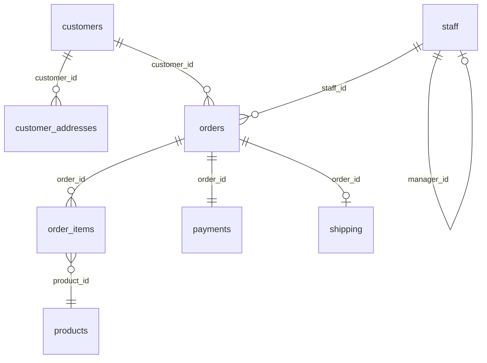

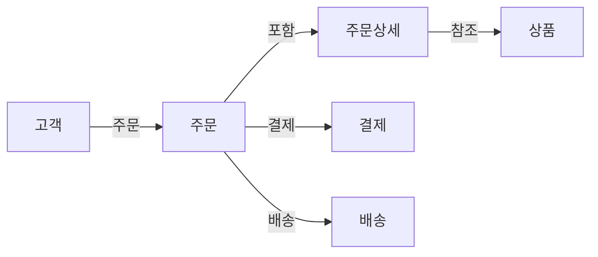

### 상품 카탈로그 (Product Catalog) — 카테고리, 공급업체, 이미지, 가격

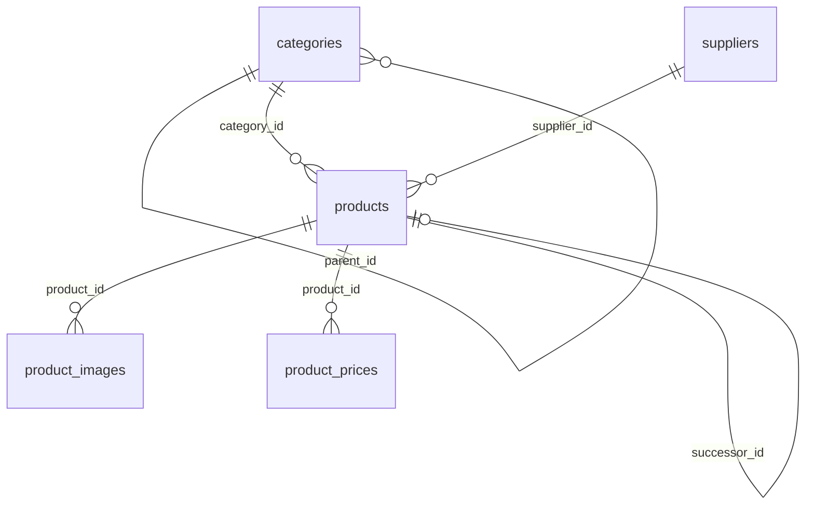

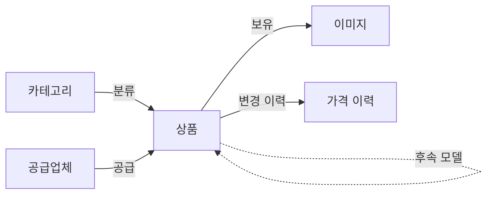

### 고객 참여 (Engagement) — 리뷰, 위시리스트

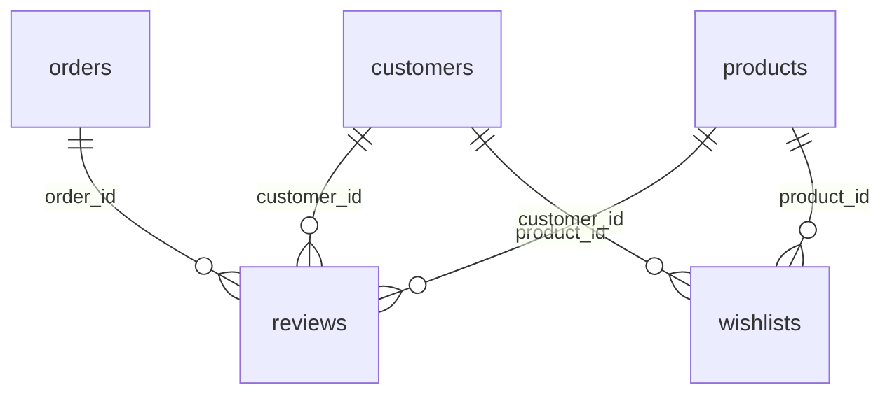

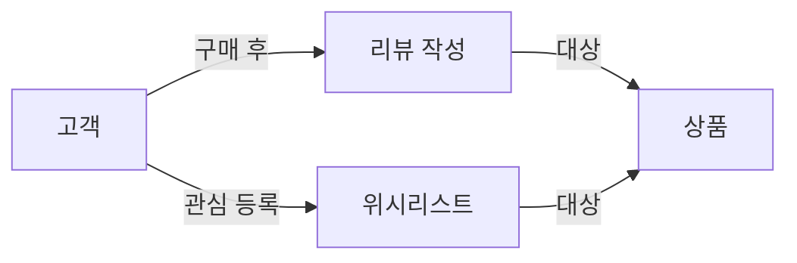

### 고객 지원 (Support) — 문의, 반품, 쿠폰

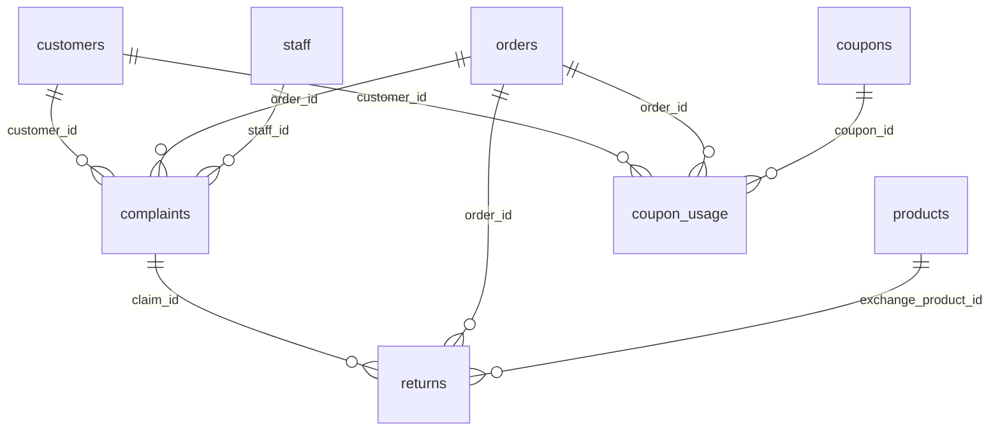

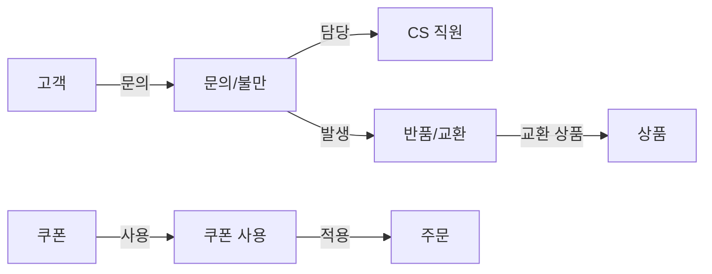

### 장바구니 및 고객 활동 (Activity) — 6개 테이블

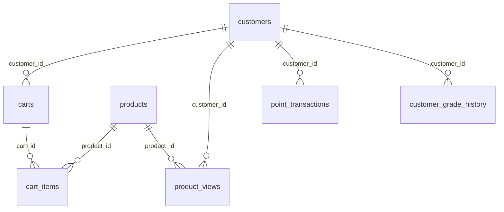

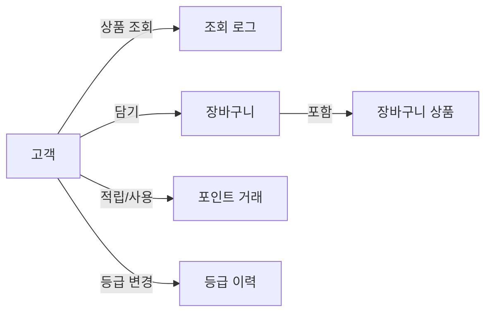

### 상품 부가정보 및 프로모션 (Catalog & Promo) — 5개 테이블

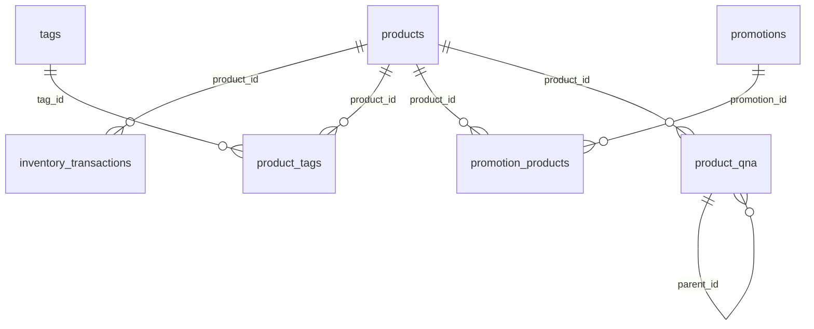

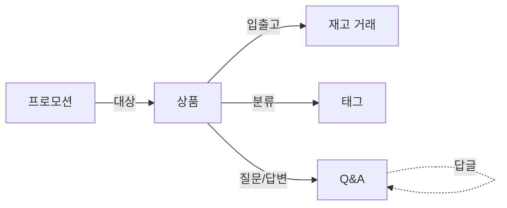

> `calendar`는 독립 차원 테이블로, 다른 테이블과 FK 관계 없이 CROSS JOIN에 활용됩니다.

### 관계 유형 요약

| 유형 | 예시 | 설명 |
|-------------|------|------|
| 1:1 | orders → payments | 주문당 하나의 결제 |
| 1:N | customers → orders | 한 고객이 여러 주문 |
| M:N | products ↔ tags (product_tags) | 교차 테이블을 통한 다대다 |
| 자기 참조 | categories.parent_id, staff.manager_id, products.successor_id, product_qna.parent_id | 같은 테이블 내 계층/연결 |
| Nullable FK | orders.staff_id → staff.id | CS 처리가 필요한 주문에만 지정 |
| Cross-table FK | returns.claim_id → complaints.id | 반품이 CS 불만에서 기원 |

---

## 규모별 데이터 사이즈

생성기의 `--size` 옵션에 따른 테이블별 행 수입니다. Medium/Large는 Small 기준 추정치입니다.

| 테이블 | Small (0.1x) | Medium (1x) | Large (5x) |
|--------|-------------:|-------------:|-------------:|
| `customers` | 5,230 | ~52,300 | ~261,500 |
| `orders` | 34,908 | ~349,080 | ~1,745,400 |
| `order_items` | 84,270 | ~842,700 | ~4,213,500 |
| `product_views` | 299,792 | ~2,997,920 | ~14,989,600 |
| `point_transactions` | 130,149 | ~1,301,490 | ~6,507,450 |
| `payments` | 34,908 | ~349,080 | ~1,745,400 |
| `shipping` | 33,107 | ~331,070 | ~1,655,350 |
| `inventory_transactions` | 14,331 | ~143,310 | ~716,550 |
| `customer_grade_history` | 10,273 | ~102,730 | ~513,650 |
| `cart_items` | 9,037 | ~90,370 | ~451,850 |
| `customer_addresses` | 8,554 | ~85,540 | ~427,700 |
| `reviews` | 7,945 | ~79,450 | ~397,250 |
| `promotion_products` | 6,871 | ~68,710 | ~343,550 |
| `calendar` | 3,469 | ~34,690 | ~173,450 |
| `complaints` | 3,477 | ~34,770 | ~173,850 |
| `carts` | 3,000 | ~30,000 | ~150,000 |
| `wishlists` | 1,999 | ~19,990 | ~99,950 |
| `product_tags` | 1,288 | ~12,880 | ~64,400 |
| `product_qna` | 946 | ~9,460 | ~47,300 |
| `returns` | 936 | ~9,360 | ~46,800 |
| `product_prices` | 829 | ~8,290 | ~41,450 |
| `product_images` | 748 | ~7,480 | ~37,400 |
| `products` | 280 | ~2,800 | ~14,000 |
| `promotions` | 129 | ~1,290 | ~6,450 |
| `coupon_usage` | 111 | ~1,110 | ~5,550 |
| `suppliers` | 60 | ~600 | ~3,000 |
| `categories` | 53 | ~530 | ~2,650 |
| `tags` | 46 | ~460 | ~2,300 |
| `coupons` | 20 | ~200 | ~1,000 |
| `staff` | 5 | ~50 | ~250 |
| **합계** | **~697K** | **~6.97M** | **~34.8M** |

!!! info "파일 크기"
    | 규모 | SQLite DB | MySQL SQL | PG SQL | 생성 시간 |
    |------|----------:|----------:|-------:|----------:|
    | Small | ~80 MB | ~62 MB | ~62 MB | ~20초 |
    | Medium | ~800 MB | ~620 MB | ~620 MB | ~3분 |
    | Large | ~4 GB | ~3.1 GB | ~3.1 GB | ~15분 |

---

## 테이블 목록

### 핵심 상거래 (Core Commerce) — 12개

| # | 테이블 | 행 수 (small) | 설명 |
|--:|--------|-------------:|------|
| 1 | categories | 53 | 상품 카테고리 (3단계 계층) |
| 2 | suppliers | 60 | 공급업체 |
| 3 | products | 280 | 상품 (JSON 스펙, 후속모델 참조) |
| 4 | product_images | 748 | 상품 이미지 |
| 5 | product_prices | 829 | 가격 변경 이력 |
| 6 | customers | 5,230 | 고객 (등급, 가입채널) |
| 7 | customer_addresses | 8,554 | 고객 배송지 |
| 8 | staff | 5 | 직원 (관리자 자기참조) |
| 9 | orders | 34,908 | 주문 |
| 10 | order_items | 84,270 | 주문 상세 |
| 11 | payments | 34,908 | 결제 |
| 12 | shipping | 33,107 | 배송 |

### 고객 참여 및 지원 (Engagement & Support) — 6개

| # | 테이블 | 행 수 (small) | 설명 |
|--:|--------|-------------:|------|
| 13 | reviews | 7,945 | 상품 리뷰 |
| 14 | wishlists | 1,999 | 위시리스트 (구매전환 추적) |
| 15 | complaints | 3,477 | 고객 문의/불만 (유형/보상/에스컬레이션) |
| 16 | returns | 936 | 반품/교환 (불만 연결, 교환상품, 재입고 수수료) |
| 17 | coupons | 20 | 쿠폰 |
| 18 | coupon_usage | 111 | 쿠폰 사용 내역 |

### 분석 및 리워드 (Analytics & Rewards) — 12개

| # | 테이블 | 행 수 (small) | 설명 |
|--:|--------|-------------:|------|
| 19 | inventory_transactions | 14,331 | 재고 입출고 이력 |
| 20 | carts | 3,000 | 장바구니 |
| 21 | cart_items | 9,037 | 장바구니 상품 |
| 22 | calendar | 3,469 | 날짜 차원 (CROSS JOIN 연습) |
| 23 | customer_grade_history | 10,273 | 등급 변경 이력 (SCD Type 2) |
| 24 | tags | 46 | 상품 태그 |
| 25 | product_tags | 1,288 | 상품-태그 매핑 (M:N) |
| 26 | product_views | 299,792 | 상품 조회 로그 (퍼널/코호트) |
| 27 | point_transactions | 130,149 | 포인트 적립/사용/소멸 |
| 28 | promotions | 129 | 프로모션/세일 이벤트 |
| 29 | promotion_products | 6,871 | 프로모션 대상 상품 |
| 30 | product_qna | 946 | 상품 Q&A (자기참조) |

---

