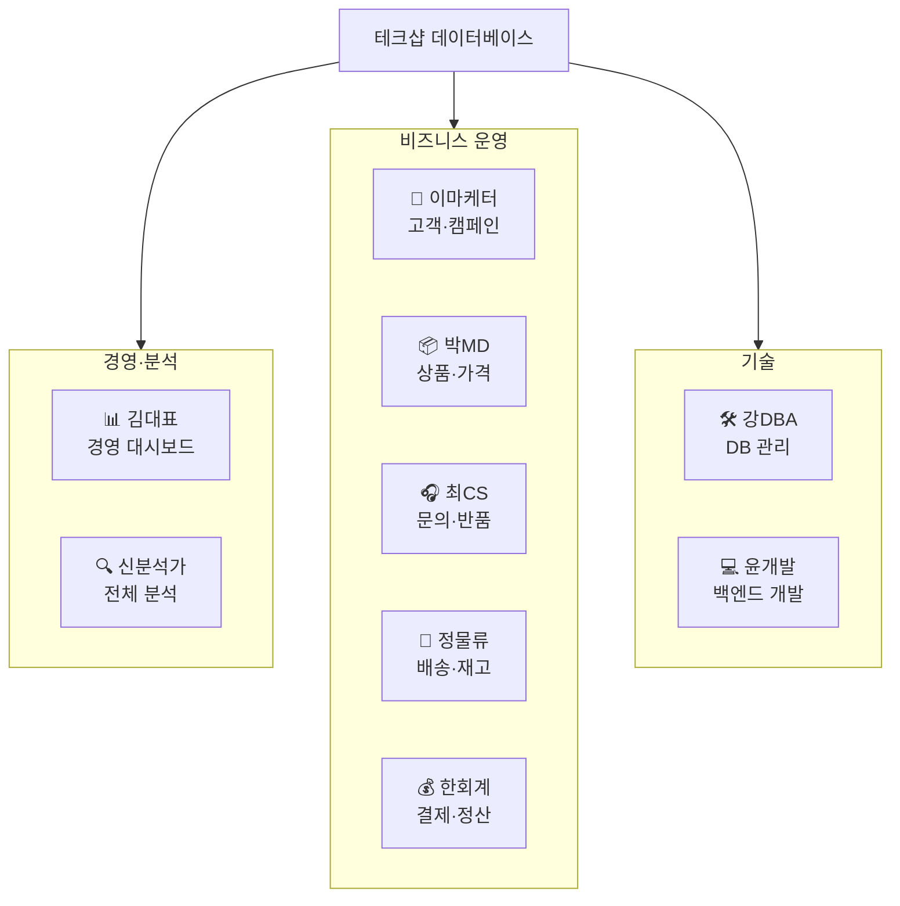
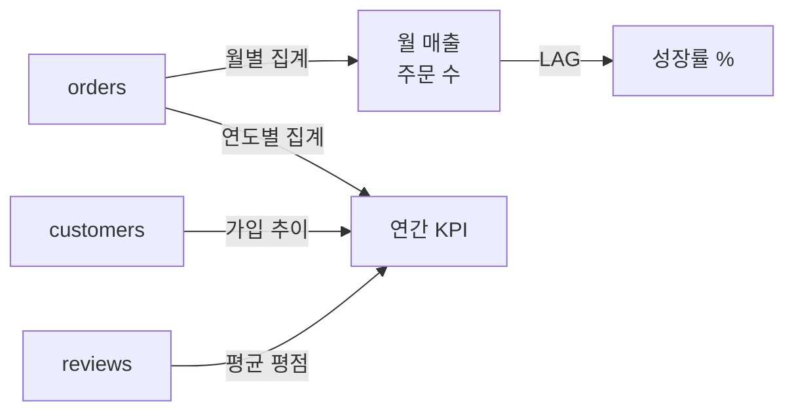
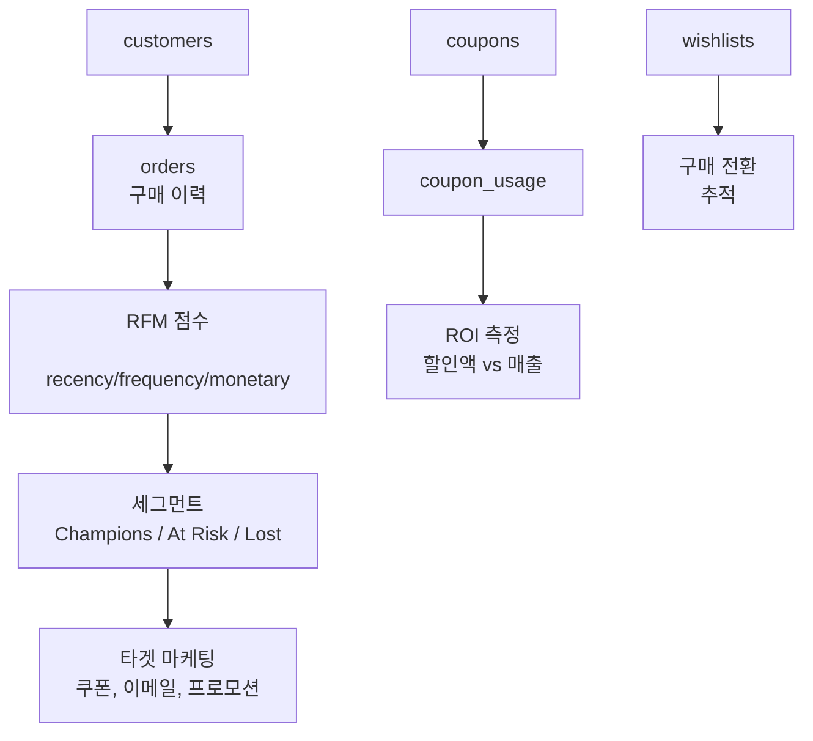
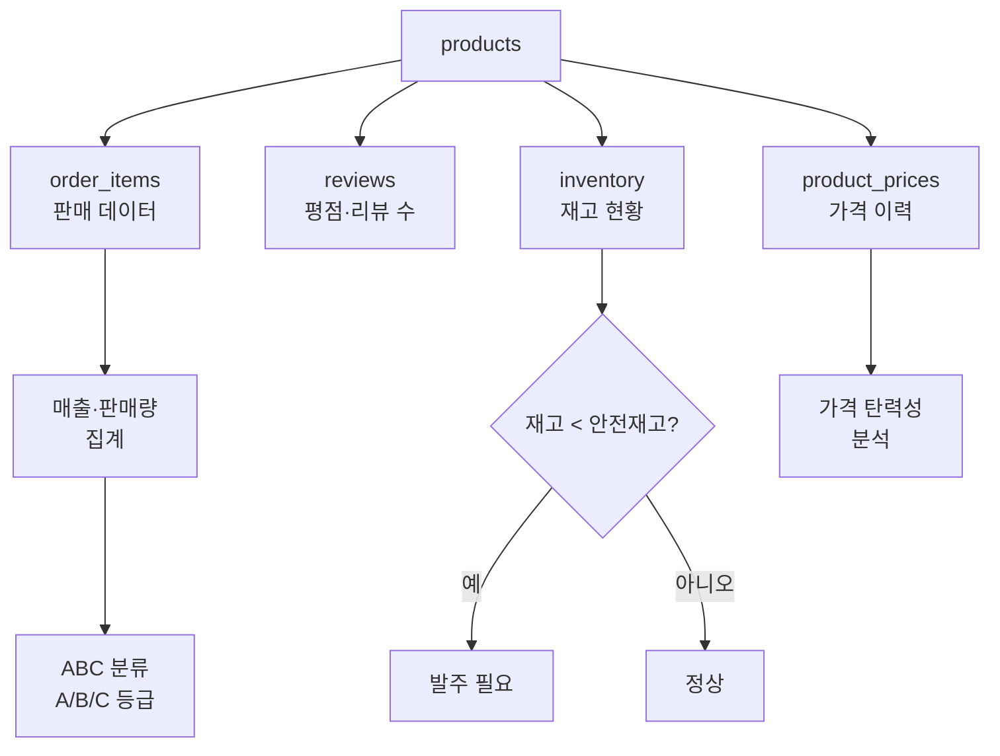
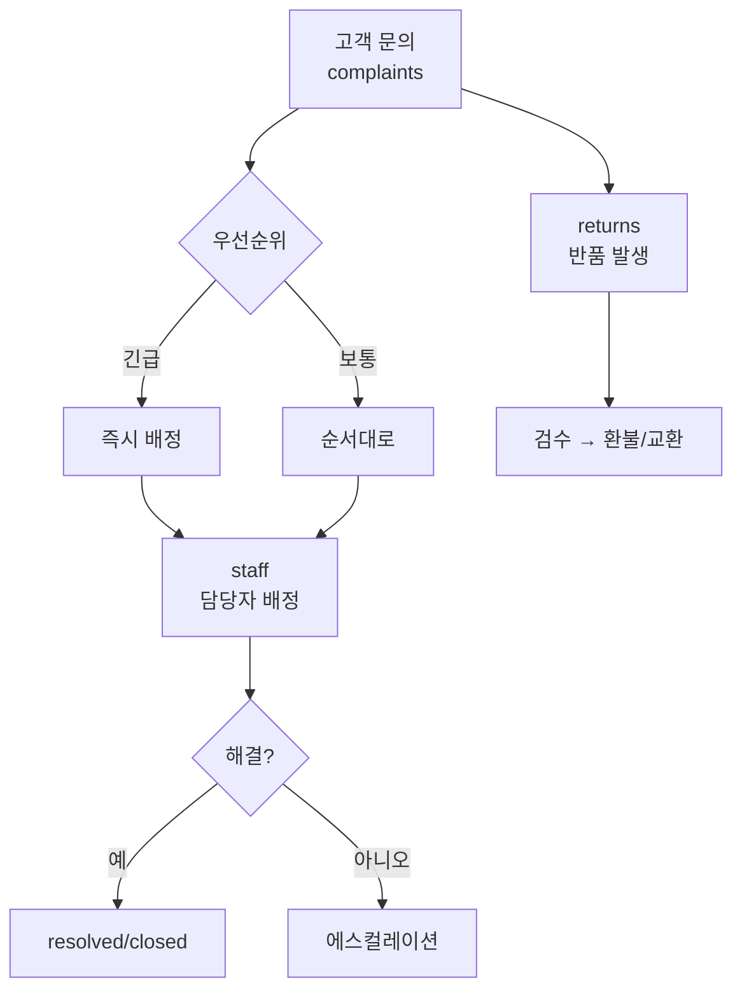
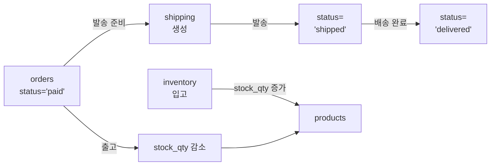
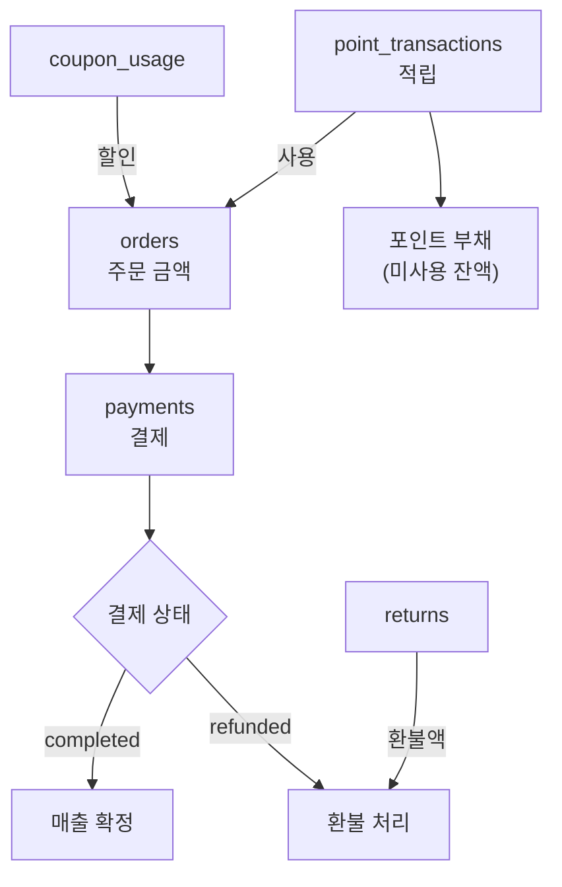
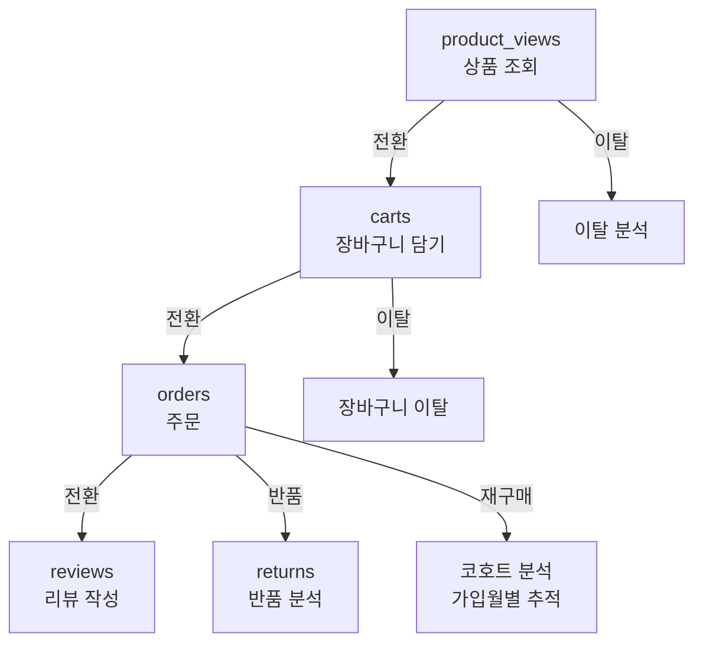
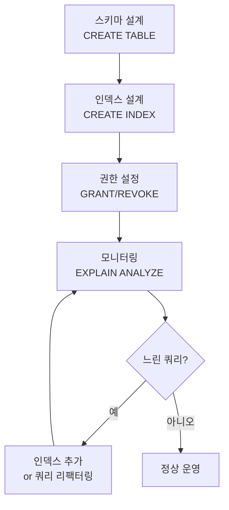
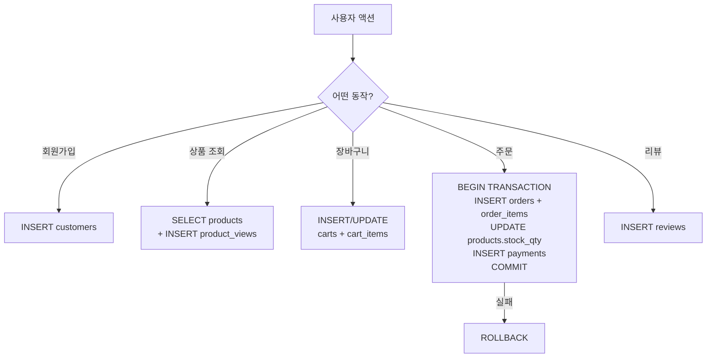

# 06. 페르소나별 활용 가이드

실제 쇼핑몰에서 데이터를 다루는 7가지 역할을 정의하고, 각 역할이 **어떤 테이블을 사용하는지**, **어떤 질문에 답하는지**, **어떤 SQL 패턴이 필요한지**를 정리합니다.

SQL을 배울 때 **"이 쿼리를 왜 쓰는지"**를 이해하면 문법 암기보다 훨씬 효과적입니다. 자신의 역할(또는 관심 분야)에 해당하는 페르소나부터 읽어보세요.

## 페르소나 요약

**경영·분석** — 데이터를 읽고 의사결정에 활용

| | 페르소나 | 역할 | 핵심 질문 |
|:-:|---------|------|----------|
| 📊 | [김대표](#ceo) | CEO/경영진 | "이번 달 매출은? 성장률은?" |
| 🔍 | [신분석가](#analyst) | 데이터 분석가 | "고객 이탈 패턴은? 퍼널 전환율은?" |

**비즈니스 운영** — 고객·상품·주문을 일상적으로 관리

| | 페르소나 | 역할 | 핵심 질문 |
|:-:|---------|------|----------|
| 📢 | [이마케터](#marketing) | 마케팅 담당 | "VIP 고객은? 쿠폰 ROI는?" |
| 📦 | [박MD](#md) | 상품 기획자 | "베스트셀러는? 재고 부족은?" |
| 🎧 | [최CS](#cs) | CS 매니저 | "미해결 문의는? 반품 사유 1위는?" |
| 🚚 | [정물류](#logistics) | 물류 담당 | "오늘 발송 건수는? 재고 부족은?" |
| 💰 | [한회계](#finance) | 재무/회계 | "결제 수단별 매출은? 환불액은?" |

**기술** — DB와 애플리케이션을 만들고 관리

| | 페르소나 | 역할 | 핵심 질문 |
|:-:|---------|------|----------|
| 🛠️ | [강DBA](#dba) | DB 관리자 | "느린 쿼리는? 인덱스가 필요한 곳은?" |
| 💻 | [윤개발](#developer) | 백엔드 개발자 | "주문 생성 로직은? 동시성 문제는?" |



---

## 김대표 (CEO) — 경영 대시보드 { #ceo }

<div class="persona" markdown>
<div class="persona-avatar persona-ceo">📊</div>
<div class="persona-info" markdown>
<strong>김대표</strong> — CEO / 경영진<br>
<p><strong>"숫자로 회사의 건강 상태를 본다"</strong></p>
</div>
</div>

경영진은 세부 데이터를 직접 다루지 않지만, **핵심 지표(KPI)**를 한눈에 파악해야 합니다. 월별 매출 추이, 취소율, 반품률, 고객 만족도 등을 모니터링합니다.

### 사용 테이블

| 테이블 | 용도 |
|--------|------|
| orders | 매출, 주문 수, 취소/반품 건수 |
| customers | 신규 가입 추이, 고객 수 |
| payments | 결제 수단 분포 |
| reviews | 평균 평점 (고객 만족도) |
| complaints | CS 품질 지표 |

### 주로 사용하는 뷰

- **v_monthly_sales** — 월별 매출·주문·고객 수
- **v_yearly_kpi** — 연간 핵심 KPI (매출, 취소율, 반품률)
- **v_revenue_growth** — 전월 대비 성장률

### 데이터 흐름



### 대표 질문과 SQL 패턴

| 질문 | SQL 패턴 | 관련 레슨 |
|------|----------|----------|
| 이번 달 매출은 얼마인가? | GROUP BY 월 + SUM | 05. GROUP BY |
| 작년 대비 성장률은? | LAG 윈도우 함수 | 18. 윈도우 함수 |
| 취소율·반품률 추이는? | CASE + 비율 계산 | 10. CASE |
| 가장 매출이 높은 월은? | ORDER BY + LIMIT | 03. 정렬과 페이징 |

---

## 이마케터 (마케팅) — 고객 분석·캠페인 { #marketing }

<div class="persona" markdown>
<div class="persona-avatar persona-mkt">📢</div>
<div class="persona-info" markdown>
<strong>이마케터</strong> — 마케팅 담당<br>
<p><strong>"고객을 이해하고, 적절한 타이밍에 적절한 메시지를"</strong></p>
</div>
</div>

마케팅 담당자는 고객을 세분화하고, 캠페인의 효과를 측정하고, 이탈 위험 고객을 식별합니다.

### 사용 테이블

| 테이블 | 용도 |
|--------|------|
| customers | 고객 프로필, 등급, 가입 채널 |
| orders | 구매 빈도, 금액 |
| wishlists | 관심 상품, 구매 전환 추적 |
| coupons + coupon_usage | 캠페인 효과, ROI |
| point_transactions | 적립·사용 패턴 |
| customer_grade_history | 등급 이동 패턴 |
| product_views | 상품 조회 → 구매 퍼널 |

### 주로 사용하는 뷰

- **v_customer_rfm** — RFM 세그먼트 (Champions, Loyal, At Risk, Lost)
- **v_customer_summary** — 고객별 종합 프로필
- **v_coupon_effectiveness** — 쿠폰 ROI
- **v_cart_abandonment** — 장바구니 이탈 분석
- **v_hourly_pattern** — 시간대별 주문 패턴 (프로모션 타이밍 결정)

### 데이터 흐름



### 대표 질문과 SQL 패턴

| 질문 | SQL 패턴 | 관련 레슨 |
|------|----------|----------|
| 이탈 위험 고객은 누구? | NTILE + CASE (RFM) | 18. 윈도우 함수 |
| 쿠폰 ROI가 높은 캠페인은? | JOIN + 비율 계산 | 07. INNER JOIN |
| 찜 → 구매 전환율은? | 집계 + 비율 | 04. 집계 함수 |
| 등급 상승/하락 패턴은? | LAG + 등급 비교 | 18. 윈도우 함수 |
| 가입 채널별 LTV는? | GROUP BY channel + AVG | 05. GROUP BY |

---

## 박MD (상품 기획) — 카탈로그·가격·성과 { #md }

<div class="persona" markdown>
<div class="persona-avatar persona-md">📦</div>
<div class="persona-info" markdown>
<strong>박MD</strong> — 상품 기획자<br>
<p><strong>"어떤 상품을 얼마에, 얼마나 준비할 것인가"</strong></p>
</div>
</div>

상품 기획자는 카테고리별 성과를 분석하고, 가격 전략을 수립하고, 재고를 관리합니다.

### 사용 테이블

| 테이블 | 용도 |
|--------|------|
| products | 상품 정보, 가격, 마진 |
| categories | 카테고리 계층 |
| suppliers | 공급업체별 성과 |
| order_items | 판매량, 매출 |
| reviews | 상품 평점, 고객 피드백 |
| inventory_transactions | 입출고 이력, 재고 현황 |
| product_prices | 가격 변경 이력 |
| product_tags | 상품 분류/검색 |
| promotion_products | 프로모션 대상 상품 |

### 주로 사용하는 뷰

- **v_product_performance** — 상품별 종합 성과
- **v_product_abc** — ABC 분류 (매출 기여도)
- **v_top_products_by_category** — 카테고리별 Top 5
- **v_category_tree** — 카테고리 계층 경로
- **v_supplier_performance** — 공급업체 성과

### 데이터 흐름



### 대표 질문과 SQL 패턴

| 질문 | SQL 패턴 | 관련 레슨 |
|------|----------|----------|
| ABC 분류에서 C등급 상품은? | 누적 SUM OVER | 18. 윈도우 함수 |
| 카테고리별 마진율 Top 5는? | ROW_NUMBER PARTITION BY | 18. 윈도우 함수 |
| 단종 후보 상품은? | 복합 WHERE 조건 | 02. WHERE |
| 공급업체별 반품률은? | 다중 JOIN + 비율 | 07. INNER JOIN |
| 가격 인하 후 판매량 변화는? | product_prices JOIN + 기간 비교 | 11. 날짜/시간 |

---

## 최CS (CS 매니저) — 문의·반품·직원 성과 { #cs }

<div class="persona" markdown>
<div class="persona-avatar persona-cs">🎧</div>
<div class="persona-info" markdown>
<strong>최CS</strong> — CS 매니저<br>
<p><strong>"고객 불만을 빠르게 해결하고, 팀 효율을 높인다"</strong></p>
</div>
</div>

CS 매니저는 문의 처리 현황을 모니터링하고, 반품 사유를 분석하고, 직원별 성과를 관리합니다.

### 사용 테이블

| 테이블 | 용도 |
|--------|------|
| complaints | 문의 유형, 우선순위, 상태 |
| returns | 반품 사유, 처리 현황 |
| staff | 직원 정보, 부서 |
| orders | 문의 관련 주문 |
| customers | 문의 고객 정보 |

### 주로 사용하는 뷰

- **v_staff_workload** — 직원별 처리량, 해결률, 평균 처리시간
- **v_return_analysis** — 반품 사유별 분석
- **v_order_detail** — 주문+고객+결제+배송 한 번에 조회 (문의 처리 시 활용)

### 데이터 흐름



### 대표 질문과 SQL 패턴

| 질문 | SQL 패턴 | 관련 레슨 |
|------|----------|----------|
| SLA 초과 미해결 건은? | 날짜 차이 + WHERE | 11. 날짜/시간 |
| 반품 사유 1위는? | GROUP BY reason + ORDER BY | 05. GROUP BY |
| 직원별 처리 효율은? | LEFT JOIN + AVG | 08. LEFT JOIN |
| 에스컬레이션 비율은? | CASE + 비율 계산 | 10. CASE |

---

## 정물류 (물류) — 배송·재고 { #logistics }

<div class="persona" markdown>
<div class="persona-avatar persona-log">🚚</div>
<div class="persona-info" markdown>
<strong>정물류</strong> — 물류 담당<br>
<p><strong>"정확한 시간에, 정확한 상품을, 정확한 곳으로"</strong></p>
</div>
</div>

물류 담당자는 발송 대기 주문을 관리하고, 배송 현황을 추적하고, 재고를 관리합니다.

### 사용 테이블

| 테이블 | 용도 |
|--------|------|
| orders | 주문 상태별 분류 |
| order_items | 발송할 상품 상세 |
| shipping | 배송 상태, 택배사, 송장 |
| products | 재고 수량, 무게 |
| inventory_transactions | 입출고 이력 |

### 데이터 흐름



### 대표 질문과 SQL 패턴

| 질문 | SQL 패턴 | 관련 레슨 |
|------|----------|----------|
| 오늘 발송할 주문은? | WHERE status + 날짜 | 02. WHERE |
| 택배사별 배송 소요일은? | AVG(날짜 차이) + GROUP BY | 11. 날짜/시간 |
| 재고 부족 상품은? | WHERE stock_qty < N | 02. WHERE |
| 입출고 이력 조회는? | WHERE + ORDER BY 날짜 | 03. 정렬 |

---

## 한회계 (재무) — 결제·정산·환불 { #finance }

<div class="persona" markdown>
<div class="persona-avatar persona-fin">💰</div>
<div class="persona-info" markdown>
<strong>한회계</strong> — 재무/회계<br>
<p><strong>"돈의 흐름을 정확히 추적한다"</strong></p>
</div>
</div>

재무 담당자는 결제 현황, 환불 내역, 포인트 부채를 관리합니다.

### 사용 테이블

| 테이블 | 용도 |
|--------|------|
| payments | 결제 수단, 금액, 환불 |
| orders | 주문 금액, 할인, 배송비 |
| coupon_usage | 쿠폰 할인 비용 |
| point_transactions | 포인트 적립·사용·소멸 |
| returns | 반품 환불액 |

### 주로 사용하는 뷰

- **v_payment_summary** — 결제 수단별 비율, 완료/환불/실패

### 데이터 흐름



### 대표 질문과 SQL 패턴

| 질문 | SQL 패턴 | 관련 레슨 |
|------|----------|----------|
| 결제 수단별 월 매출은? | GROUP BY method, 월 | 05. GROUP BY |
| 환불 총액은? | WHERE status='refunded' + SUM | 04. 집계 함수 |
| 포인트 부채(미사용)는? | SUM(적립) - SUM(사용) - SUM(소멸) | 13. UNION |
| 쿠폰 할인 총 비용은? | coupon_usage SUM | 04. 집계 함수 |

---

## 신분석가 (데이터 분석) — 전체 { #analyst }

<div class="persona" markdown>
<div class="persona-avatar persona-analyst">🔍</div>
<div class="persona-info" markdown>
<strong>신분석가</strong> — 데이터 분석가<br>
<p><strong>"데이터에서 패턴을 찾고, 의사결정을 지원한다"</strong></p>
</div>
</div>

데이터 분석가는 모든 테이블을 넘나들며 깊은 분석을 수행합니다. 고급 SQL(윈도우 함수, CTE, 서브쿼리)을 자유자재로 사용합니다.

### 사용 테이블

전체 30개 테이블 + 18개 뷰

### 주요 분석 영역

| 분석 | 사용 테이블 | SQL 패턴 |
|------|------------|----------|
| 코호트 분석 | customers, orders | 가입월별 GROUP BY + 재구매율 |
| 퍼널 분석 | product_views → carts → orders | 단계별 COUNT + 전환율 |
| 장바구니 이탈 | carts, cart_items, products | status='abandoned' + 잠재 매출 |
| 시간대별 패턴 | orders | HOUR 추출 + GROUP BY |
| 상품 연관 분석 | order_items | 같은 주문에 포함된 상품 조합 |
| 고객 LTV | customers, orders | SUM(total_amount) GROUP BY customer |
| 계절성 분석 | orders, calendar | 월별 + 공휴일 효과 |

### 데이터 흐름



### 대표 질문과 SQL 패턴

| 질문 | SQL 패턴 | 관련 레슨 |
|------|----------|----------|
| 퍼널 전환율은? | 단계별 COUNT + 비율 | 09. 서브쿼리 |
| 코호트별 재구매율은? | 가입월 GROUP BY + 재구매 조건 | 19. CTE |
| 요일·시간대 최적 프로모션 타이밍은? | EXTRACT + GROUP BY | 11. 날짜/시간 |
| 같이 구매하는 상품 조합은? | SELF JOIN on order_id | 17. SELF JOIN |
| 고객 LTV 분포는? | SUM + NTILE | 18. 윈도우 함수 |

---

## 강DBA (DB 관리자) — 스키마·성능·보안 { #dba }

<div class="persona" markdown>
<div class="persona-avatar persona-ceo" style="background:#795548;">🛠️</div>
<div class="persona-info" markdown>
<strong>강DBA</strong> — DB 관리자<br>
<p><strong>"DB가 안정적으로 돌아가게 하는 것이 내 일이다"</strong></p>
</div>
</div>

DB 관리자는 데이터를 분석하지 않지만, **데이터가 안전하고 빠르게 동작하는 환경**을 만듭니다. 스키마 설계, 인덱스 튜닝, 사용자 권한, 백업/복구를 담당합니다.

### 사용 테이블

전체 30개 테이블 — 데이터 내용보다 **구조(DDL, 인덱스, 제약 조건)**에 관심

### 주요 업무

| 업무 | 사용하는 것 | SQL 패턴 |
|------|-----------|----------|
| 스키마 설계·변경 | DDL (CREATE, ALTER, DROP) | 15. DDL |
| 인덱스 설계 | EXPLAIN, CREATE INDEX | 22. 인덱스와 성능 |
| 사용자·권한 관리 | GRANT, REVOKE, CREATE USER | 15. DDL |
| 느린 쿼리 분석 | EXPLAIN ANALYZE | 22. 인덱스와 성능 |
| 데이터 무결성 검증 | FK 관계, CHECK 제약 | 15. DDL |
| 백업·복구 | mysqldump, pg_dump | (DB 관리 도구) |
| 트리거 관리 | CREATE TRIGGER | 23. 트리거 |
| 저장 프로시저 배포 | CREATE PROCEDURE/FUNCTION | 25. 저장 프로시저 |

### 데이터 흐름



### 대표 질문과 SQL 패턴

| 질문 | SQL 패턴 | 관련 레슨 |
|------|----------|----------|
| 이 쿼리가 왜 느린가? | EXPLAIN ANALYZE | 22. 인덱스와 성능 |
| 어떤 인덱스가 필요한가? | 실행 계획 분석 + CREATE INDEX | 22. 인덱스와 성능 |
| FK 무결성이 깨진 곳은? | LEFT JOIN + IS NULL | 08. LEFT JOIN |
| 사용하지 않는 인덱스는? | 인덱스 통계 조회 | 05. 스키마 조회 쿼리 |
| 테이블별 용량은? | 메타데이터 조회 | 05. 스키마 조회 쿼리 |

---

## 윤개발 (백엔드 개발자) — CRUD·트랜잭션·API { #developer }

<div class="persona" markdown>
<div class="persona-avatar persona-ceo" style="background:#00897b;">💻</div>
<div class="persona-info" markdown>
<strong>윤개발</strong> — 백엔드 개발자<br>
<p><strong>"사용자의 액션을 데이터로 정확하게 기록한다"</strong></p>
</div>
</div>

백엔드 개발자는 분석 쿼리보다 **애플리케이션이 동작하기 위한 SQL**을 작성합니다. 회원 가입, 주문 생성, 장바구니 관리 같은 CRUD와 트랜잭션이 핵심입니다.

### 사용 테이블

| 테이블 | 용도 |
|--------|------|
| customers + customer_addresses | 회원 가입, 프로필 수정 |
| products + product_images | 상품 목록 조회, 검색 |
| carts + cart_items | 장바구니 CRUD |
| orders + order_items | 주문 생성 (트랜잭션) |
| payments | 결제 처리 |
| shipping | 배송 상태 업데이트 |
| reviews | 리뷰 작성 |
| wishlists | 찜하기 |
| product_views | 조회 로그 기록 |
| point_transactions | 포인트 적립·사용 |

### 데이터 흐름



### 대표 질문과 SQL 패턴

| 질문 | SQL 패턴 | 관련 레슨 |
|------|----------|----------|
| 주문 생성을 원자적으로 처리하려면? | BEGIN + INSERT 다중 + COMMIT | 16. 트랜잭션 |
| 동시에 같은 상품을 주문하면? | SELECT FOR UPDATE (비관적 락) | 16. 트랜잭션 |
| 상품 검색 쿼리를 최적화하려면? | LIKE + 인덱스, EXPLAIN | 22. 인덱스와 성능 |
| 페이징 처리는? | LIMIT + OFFSET, 커서 기반 | 03. 정렬과 페이징 |
| N+1 문제를 해결하려면? | JOIN으로 한 번에 조회 | 07. INNER JOIN |
| UPSERT는? | INSERT ON CONFLICT / ON DUPLICATE KEY | 14. DML |

---

## 페르소나 / 테이블 / 권한 매트릭스

각 페르소나(DB 사용자)가 어떤 테이블에 어떤 권한을 갖는지 한눈에 보여줍니다.

> R = 읽기 · RW = 읽기/쓰기 · A = ALL · V = 뷰 전용 · - = 접근 불가

<div class="table-matrix" markdown>

| 테이블 | 📊 | 📢 | 📦 | 🎧 | 🚚 | 💰 | 🔍 | 🛠️ | 💻 |
|--------|:-:|:-:|:-:|:-:|:-:|:-:|:-:|:-:|:-:|
| customers | V | R | - | R | - | - | R | A | RW |
| customer_addresses | - | - | - | - | - | - | R | A | RW |
| orders | V | R | R | R | R | R | R | A | RW |
| order_items | - | - | R | - | R | - | R | A | RW |
| products | - | - | RW | - | RW* | - | R | A | RW |
| categories | - | - | R | - | - | - | R | A | RW |
| suppliers | - | - | R | - | - | - | R | A | RW |
| product_images | - | - | RW | - | - | - | R | A | RW |
| product_prices | - | - | R | - | - | - | R | A | RW |
| product_tags | - | - | R | - | - | - | R | A | RW |
| staff | - | - | - | R | - | - | R | A | RW |
| payments | V | - | - | - | - | R | R | A | RW |
| shipping | - | - | - | - | RW | - | R | A | RW |
| reviews | V | - | R | - | - | - | R | A | RW |
| wishlists | - | R | - | - | - | - | R | A | RW |
| complaints | V | - | - | RW | - | - | R | A | RW |
| returns | - | - | - | RW | - | R | R | A | RW |
| coupons | - | R | - | - | - | - | R | A | RW |
| coupon_usage | - | R | - | - | - | R | R | A | RW |
| point_transactions | - | R | - | - | - | R | R | A | RW |
| grade_history | - | R | - | - | - | - | R | A | RW |
| inventory_tx | - | - | R | - | RW | - | R | A | RW |
| carts | - | - | - | - | - | - | R | A | RW |
| cart_items | - | - | - | - | - | - | R | A | RW |
| product_views | - | R | - | - | - | - | R | A | RW |
| promotions | - | R | - | - | - | - | R | A | RW |
| promo_products | - | R | R | - | - | - | R | A | RW |
| product_qna | - | - | R | R | - | - | R | A | RW |
| calendar | - | - | - | - | - | - | R | A | RW |
| tags | - | - | R | - | - | - | R | A | RW |

</div>

> 📊 CEO · 📢 마케팅 · 📦 MD · 🎧 CS · 🚚 물류 · 💰 재무 · 🔍 분석 · 🛠️ DBA · 💻 개발
>
> \* 물류의 products 쓰기 권한은 `stock_qty` 칼럼에만 한정 · DBA의 A = DDL + DML + GRANT · 개발의 RW = DML만 (DDL 불가)

---

## 페르소나별 DB 사용자 생성

실무에서는 역할별로 **최소 권한 원칙**(Principle of Least Privilege)에 따라 DB 사용자를 분리합니다. 각 페르소나가 필요한 테이블에만 접근할 수 있도록 권한을 설정합니다.

!!! info "SQLite"
    SQLite는 사용자/권한 관리를 지원하지 않습니다. 파일 시스템 권한으로 접근을 제어합니다.

### 권한 요약

| 페르소나 | DB 사용자 | 권한 | 대상 |
|---------|----------|:----:|------|
| 김대표 | `ceo_reader` | `SELECT` | 뷰 전체 (테이블 직접 접근 불가) |
| 이마케터 | `marketing` | `SELECT` | customers, orders, wishlists, coupons, coupon_usage, point_transactions, customer_grade_history, product_views |
| 박MD | `merchandiser` | `SELECT`, `UPDATE` | products, categories, suppliers, product_images, product_prices, product_tags, inventory_transactions, promotion_products |
| 최CS | `cs_manager` | `SELECT`, `UPDATE` | complaints, returns, staff, orders(상태만), customers(읽기) |
| 정물류 | `logistics` | `SELECT`, `UPDATE` | orders, shipping, products(재고만), inventory_transactions |
| 한회계 | `finance` | `SELECT` | payments, orders, coupon_usage, point_transactions, returns |
| 신분석가 | `analyst` | `SELECT` | 전체 테이블 + 뷰 (읽기 전용) |
| 강DBA | `dba_admin` | `ALL` | 전체 (DDL + DML + GRANT) |
| 윤개발 | `app_developer` | `SELECT`, `INSERT`, `UPDATE`, `DELETE` | 전체 테이블 (DDL 불가) |

### 사용자 생성 SQL

=== "MySQL"

    ```sql
    -- =============================================
    -- 1. CEO: 뷰만 조회 가능
    -- =============================================
    CREATE USER 'ceo_reader'@'%' IDENTIFIED BY 'ceo_pass_2025';
    GRANT SELECT ON ecommerce.v_monthly_sales TO 'ceo_reader'@'%';
    GRANT SELECT ON ecommerce.v_yearly_kpi TO 'ceo_reader'@'%';
    GRANT SELECT ON ecommerce.v_revenue_growth TO 'ceo_reader'@'%';
    GRANT SELECT ON ecommerce.v_daily_orders TO 'ceo_reader'@'%';

    -- =============================================
    -- 2. 마케팅: 고객·캠페인 관련 읽기
    -- =============================================
    CREATE USER 'marketing'@'%' IDENTIFIED BY 'mkt_pass_2025';
    GRANT SELECT ON ecommerce.customers TO 'marketing'@'%';
    GRANT SELECT ON ecommerce.orders TO 'marketing'@'%';
    GRANT SELECT ON ecommerce.wishlists TO 'marketing'@'%';
    GRANT SELECT ON ecommerce.coupons TO 'marketing'@'%';
    GRANT SELECT ON ecommerce.coupon_usage TO 'marketing'@'%';
    GRANT SELECT ON ecommerce.point_transactions TO 'marketing'@'%';
    GRANT SELECT ON ecommerce.customer_grade_history TO 'marketing'@'%';
    GRANT SELECT ON ecommerce.product_views TO 'marketing'@'%';
    GRANT SELECT ON ecommerce.v_customer_rfm TO 'marketing'@'%';
    GRANT SELECT ON ecommerce.v_customer_summary TO 'marketing'@'%';
    GRANT SELECT ON ecommerce.v_coupon_effectiveness TO 'marketing'@'%';
    GRANT SELECT ON ecommerce.v_cart_abandonment TO 'marketing'@'%';

    -- =============================================
    -- 3. MD: 상품 관련 읽기/수정
    -- =============================================
    CREATE USER 'merchandiser'@'%' IDENTIFIED BY 'md_pass_2025';
    GRANT SELECT, UPDATE ON ecommerce.products TO 'merchandiser'@'%';
    GRANT SELECT ON ecommerce.categories TO 'merchandiser'@'%';
    GRANT SELECT ON ecommerce.suppliers TO 'merchandiser'@'%';
    GRANT SELECT, INSERT, UPDATE ON ecommerce.product_images TO 'merchandiser'@'%';
    GRANT SELECT ON ecommerce.product_prices TO 'merchandiser'@'%';
    GRANT SELECT ON ecommerce.product_tags TO 'merchandiser'@'%';
    GRANT SELECT ON ecommerce.order_items TO 'merchandiser'@'%';
    GRANT SELECT ON ecommerce.reviews TO 'merchandiser'@'%';
    GRANT SELECT ON ecommerce.inventory_transactions TO 'merchandiser'@'%';
    GRANT SELECT ON ecommerce.v_product_performance TO 'merchandiser'@'%';
    GRANT SELECT ON ecommerce.v_product_abc TO 'merchandiser'@'%';

    -- =============================================
    -- 4. CS: 문의/반품 처리
    -- =============================================
    CREATE USER 'cs_manager'@'%' IDENTIFIED BY 'cs_pass_2025';
    GRANT SELECT, UPDATE ON ecommerce.complaints TO 'cs_manager'@'%';
    GRANT SELECT, UPDATE ON ecommerce.returns TO 'cs_manager'@'%';
    GRANT SELECT ON ecommerce.staff TO 'cs_manager'@'%';
    GRANT SELECT ON ecommerce.orders TO 'cs_manager'@'%';
    GRANT SELECT ON ecommerce.customers TO 'cs_manager'@'%';
    GRANT SELECT ON ecommerce.v_staff_workload TO 'cs_manager'@'%';
    GRANT SELECT ON ecommerce.v_return_analysis TO 'cs_manager'@'%';

    -- =============================================
    -- 5. 물류: 배송/재고 관리
    -- =============================================
    CREATE USER 'logistics'@'%' IDENTIFIED BY 'log_pass_2025';
    GRANT SELECT ON ecommerce.orders TO 'logistics'@'%';
    GRANT SELECT, UPDATE ON ecommerce.shipping TO 'logistics'@'%';
    GRANT SELECT, UPDATE (stock_qty) ON ecommerce.products TO 'logistics'@'%';
    GRANT SELECT, INSERT ON ecommerce.inventory_transactions TO 'logistics'@'%';

    -- =============================================
    -- 6. 재무: 결제/정산 읽기 전용
    -- =============================================
    CREATE USER 'finance'@'%' IDENTIFIED BY 'fin_pass_2025';
    GRANT SELECT ON ecommerce.payments TO 'finance'@'%';
    GRANT SELECT ON ecommerce.orders TO 'finance'@'%';
    GRANT SELECT ON ecommerce.coupon_usage TO 'finance'@'%';
    GRANT SELECT ON ecommerce.point_transactions TO 'finance'@'%';
    GRANT SELECT ON ecommerce.returns TO 'finance'@'%';
    GRANT SELECT ON ecommerce.v_payment_summary TO 'finance'@'%';

    -- =============================================
    -- 7. 분석가: 전체 읽기 전용
    -- =============================================
    CREATE USER 'analyst'@'%' IDENTIFIED BY 'analyst_pass_2025';
    GRANT SELECT ON ecommerce.* TO 'analyst'@'%';

    -- =============================================
    -- 8. DBA: 전체 권한
    -- =============================================
    CREATE USER 'dba_admin'@'%' IDENTIFIED BY 'dba_pass_2025';
    GRANT ALL PRIVILEGES ON ecommerce.* TO 'dba_admin'@'%' WITH GRANT OPTION;

    -- =============================================
    -- 9. 개발자: 전체 DML (DDL 불가)
    -- =============================================
    CREATE USER 'app_developer'@'%' IDENTIFIED BY 'dev_pass_2025';
    GRANT SELECT, INSERT, UPDATE, DELETE ON ecommerce.* TO 'app_developer'@'%';
    GRANT EXECUTE ON ecommerce.* TO 'app_developer'@'%';

    FLUSH PRIVILEGES;
    ```

=== "PostgreSQL"

    ```sql
    -- =============================================
    -- 1. CEO: 뷰만 조회 가능
    -- =============================================
    CREATE ROLE ceo_reader LOGIN PASSWORD 'ceo_pass_2025';
    GRANT USAGE ON SCHEMA public TO ceo_reader;
    GRANT SELECT ON v_monthly_sales, v_yearly_kpi,
                    v_revenue_growth, v_daily_orders TO ceo_reader;

    -- =============================================
    -- 2. 마케팅: 고객·캠페인 관련 읽기
    -- =============================================
    CREATE ROLE marketing LOGIN PASSWORD 'mkt_pass_2025';
    GRANT USAGE ON SCHEMA public TO marketing;
    GRANT SELECT ON customers, orders, wishlists, coupons,
                    coupon_usage, point_transactions,
                    customer_grade_history, product_views TO marketing;
    GRANT SELECT ON v_customer_rfm, v_customer_summary,
                    v_coupon_effectiveness, v_cart_abandonment TO marketing;

    -- =============================================
    -- 3. MD: 상품 관련 읽기/수정
    -- =============================================
    CREATE ROLE merchandiser LOGIN PASSWORD 'md_pass_2025';
    GRANT USAGE ON SCHEMA public TO merchandiser;
    GRANT SELECT, UPDATE ON products TO merchandiser;
    GRANT SELECT ON categories, suppliers, product_prices,
                    product_tags, order_items, reviews,
                    inventory_transactions TO merchandiser;
    GRANT SELECT, INSERT, UPDATE ON product_images TO merchandiser;
    GRANT SELECT ON v_product_performance, v_product_abc TO merchandiser;

    -- =============================================
    -- 4. CS: 문의/반품 처리
    -- =============================================
    CREATE ROLE cs_manager LOGIN PASSWORD 'cs_pass_2025';
    GRANT USAGE ON SCHEMA public TO cs_manager;
    GRANT SELECT, UPDATE ON complaints, returns TO cs_manager;
    GRANT SELECT ON staff, orders, customers TO cs_manager;
    GRANT SELECT ON v_staff_workload, v_return_analysis TO cs_manager;

    -- =============================================
    -- 5. 물류: 배송/재고 관리
    -- =============================================
    CREATE ROLE logistics LOGIN PASSWORD 'log_pass_2025';
    GRANT USAGE ON SCHEMA public TO logistics;
    GRANT SELECT ON orders TO logistics;
    GRANT SELECT, UPDATE ON shipping TO logistics;
    GRANT SELECT, UPDATE (stock_qty) ON products TO logistics;
    GRANT SELECT, INSERT ON inventory_transactions TO logistics;

    -- =============================================
    -- 6. 재무: 결제/정산 읽기 전용
    -- =============================================
    CREATE ROLE finance LOGIN PASSWORD 'fin_pass_2025';
    GRANT USAGE ON SCHEMA public TO finance;
    GRANT SELECT ON payments, orders, coupon_usage,
                    point_transactions, returns TO finance;
    GRANT SELECT ON v_payment_summary TO finance;

    -- =============================================
    -- 7. 분석가: 전체 읽기 전용
    -- =============================================
    CREATE ROLE analyst LOGIN PASSWORD 'analyst_pass_2025';
    GRANT USAGE ON SCHEMA public TO analyst;
    GRANT SELECT ON ALL TABLES IN SCHEMA public TO analyst;

    -- =============================================
    -- 8. DBA: 전체 권한
    -- =============================================
    CREATE ROLE dba_admin LOGIN PASSWORD 'dba_pass_2025' SUPERUSER;

    -- =============================================
    -- 9. 개발자: 전체 DML (DDL 불가)
    -- =============================================
    CREATE ROLE app_developer LOGIN PASSWORD 'dev_pass_2025';
    GRANT USAGE ON SCHEMA public TO app_developer;
    GRANT SELECT, INSERT, UPDATE, DELETE ON ALL TABLES IN SCHEMA public TO app_developer;
    GRANT EXECUTE ON ALL FUNCTIONS IN SCHEMA public TO app_developer;
    ```

### 권한 확인

=== "MySQL"

    ```sql
    -- 특정 사용자의 권한 확인
    SHOW GRANTS FOR 'marketing'@'%';
    ```

=== "PostgreSQL"

    ```sql
    -- 특정 역할의 테이블 권한 확인
    SELECT table_name, privilege_type
    FROM information_schema.role_table_grants
    WHERE grantee = 'marketing'
    ORDER BY table_name;
    ```

!!! tip "페르소나별 실무 포인트"

    **📊 CEO** — `v_monthly_sales`, `v_yearly_kpi` 등 뷰만 접근. 원본 테이블의 개인정보(이름, 이메일, 전화번호)를 볼 수 없으므로 개인정보보호법 준수에 유리

    **📢 마케팅** — customers를 읽을 수 있지만 수정은 불가. 쿠폰을 만들 수 없고(`coupons` INSERT 없음), 사용 내역만 조회. 잘못된 쿠폰 발행을 방지

    **📦 MD** — products를 UPDATE할 수 있지만, orders나 payments에는 접근 불가. 상품 가격을 변경해도 기존 주문 금액에 영향을 줄 수 없음

    **🎧 CS** — complaints와 returns를 UPDATE할 수 있지만, payments에는 접근 불가. 환불 처리는 재무팀만 가능하도록 분리

    **🚚 물류** — products의 `stock_qty` 칼럼만 UPDATE 가능. 상품 가격(`price`)이나 이름(`name`)은 수정할 수 없음. 재고만 관리

    **💰 재무** — payments, returns를 읽을 수 있지만 수정은 불가. 결제 데이터를 조회만 하고, 실제 환불 처리는 결제 시스템(PG사)을 통해 진행

    **🔍 분석가** — 전체 테이블 SELECT만 가능. 어떤 테이블도 INSERT/UPDATE/DELETE 불가. 실수로 데이터를 변경할 위험이 없음

    **🛠️ DBA** — ALL 권한 + WITH GRANT OPTION. 다른 사용자의 권한을 설정할 수 있는 유일한 역할. 스키마 변경(DDL)도 DBA만 가능

    **💻 개발자** — 전체 DML(SELECT/INSERT/UPDATE/DELETE) + EXECUTE(저장 프로시저 호출). 하지만 DDL(CREATE/DROP/ALTER TABLE)은 불가. 테이블 구조 변경은 DBA를 통해서만 가능

    비밀번호는 예시이며, 실무에서는 반드시 강력한 비밀번호를 사용하세요.
