# 04. 저장 프로시저

## 저장 프로시저(Stored Procedure)란?

저장 프로시저는 **자주 사용하는 SQL 로직을 이름을 붙여 DB 안에 저장**한 것입니다. 파라미터를 받아 복잡한 비즈니스 로직(트랜잭션, 조건 분기, 반복 등)을 실행하고 결과를 반환합니다.

**저장 프로시저를 사용하는 이유:**

- **재사용** — 주문 생성, 포인트 만료 같은 복잡한 로직을 한 번 작성하면 어디서든 호출 가능
- **원자성** — 여러 테이블을 동시에 변경하는 작업을 하나의 트랜잭션으로 묶어 안전하게 처리
- **보안** — 테이블에 직접 INSERT/UPDATE 권한을 주지 않고, 프로시저 실행 권한만 부여할 수 있습니다
- **성능** — DB 서버에서 직접 실행되므로, 애플리케이션과 DB 사이의 네트워크 왕복이 줄어듭니다

저장 프로시저에 대한 상세 학습은 [25. 저장 프로시저](../advanced/25-stored-procedures.md) 레슨에서 다룹니다.

## 프로시저 목록

MySQL/PostgreSQL 생성 시 데이터베이스 네이티브 저장 프로시저/함수가 포함됩니다. SQLite는 저장 프로시저를 지원하지 않습니다.

| 프로시저/함수 | 설명 | 실무 패턴 | DB |
|-------------|------|----------|:--:|
| sp_place_order | 주문 생성 | 트랜잭션 + 다중 테이블 INSERT | `M` `P` |
| sp_expire_points | 포인트 만료 처리 | 배치 UPDATE + 조건 집계 | `M` `P` |
| sp_monthly_settlement | 월별 정산 리포트 | 리포트/결과셋 반환 | `M` `P` |
| sp_cancel_order | 주문 취소 및 재고 복원 | 상태 전이 + 비즈니스 규칙 검증 | `M` `P` |
| sp_update_customer_grades | 고객 등급 재산정 | 집계 기반 등급 갱신 + 이력 기록 | `M` `P` |
| sp_cleanup_abandoned_carts | 이탈 장바구니 정리 | FK 관계 DELETE (자식 → 부모) | `M` `P` |
| sp_product_restock | 상품 입고 처리 | 재고 갱신 + 이력 기록 | `M` `P` |
| sp_customer_statistics | 고객 통계 조회 | OUT 파라미터 / RETURNS TABLE | `M` `P` |
| sp_daily_summary | 일별 KPI 요약 | 복합 결과셋 (다중 SELECT) | `M` `P` |
| sp_search_products | 상품 동적 검색 | 동적 SQL (PREPARE/EXECUTE) | `M` `P` |
| sp_transfer_points | 포인트 이체 | 동일 테이블 두 행 동시 UPDATE | `M` `P` |
| sp_generate_order_report | 주문 상세 리포트 | 커서(CURSOR) 순회 | `M` `P` |
| sp_bulk_update_prices | 상품 가격 일괄 변경 | 배열/JSON 파라미터 | `M` `P` |
| sp_archive_old_orders | 오래된 주문 아카이빙 | 테이블 간 데이터 이동 | `M` `P` |
| refresh_materialized_views | Materialized View 갱신 | REFRESH CONCURRENTLY | `P` |

> `M` = MySQL  `P` = PostgreSQL


### sp_place_order — 주문 생성

활성 장바구니에서 주문을 생성합니다. 주문번호 자동 생성, 장바구니 아이템을 주문 아이템으로 이동, 장바구니 상태를 converted로 변경합니다.

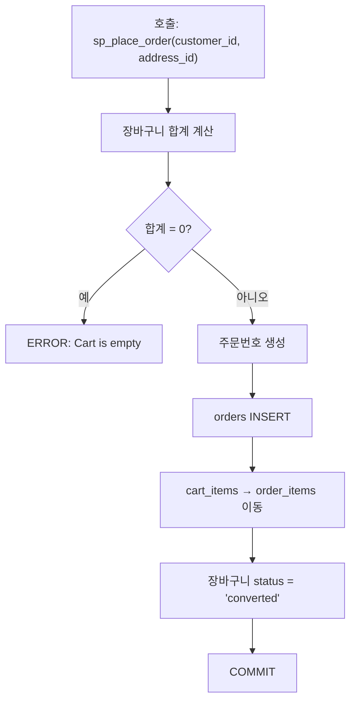

=== "MySQL"

    ```sql
    -- =============================================
    -- sp_place_order: Create a new order and deduct customer points
    -- Parameters:
    --   p_customer_id  - Customer placing the order
    --   p_address_id   - Delivery address
    -- =============================================
    CREATE PROCEDURE sp_place_order(
        IN p_customer_id INT,
        IN p_address_id INT
    )
    BEGIN
        DECLARE v_order_id INT;
        DECLARE v_total DECIMAL(12,2) DEFAULT 0;
        DECLARE v_points INT DEFAULT 0;
        DECLARE v_order_number VARCHAR(30);
        DECLARE v_now DATETIME DEFAULT NOW();
    
        DECLARE EXIT HANDLER FOR SQLEXCEPTION
        BEGIN
            ROLLBACK;
            RESIGNAL;
        END;
    
        START TRANSACTION;
    
        -- Generate order number
        SET v_order_number = CONCAT('ORD-', DATE_FORMAT(v_now, '%Y%m%d'), '-',
            LPAD((SELECT COALESCE(MAX(id), 0) + 1 FROM orders), 5, '0'));
    
        -- Calculate cart total
        SELECT COALESCE(SUM(p.price * ci.quantity), 0)
        INTO v_total
        FROM carts c
        JOIN cart_items ci ON c.id = ci.cart_id
        JOIN products p ON ci.product_id = p.id
        WHERE c.customer_id = p_customer_id AND c.status = 'active';
    
        IF v_total = 0 THEN
            SIGNAL SQLSTATE '45000' SET MESSAGE_TEXT = 'Cart is empty';
        END IF;
    
        -- Get customer point balance
        SELECT point_balance INTO v_points
        FROM customers WHERE id = p_customer_id FOR UPDATE;
    
        -- Create order
        INSERT INTO orders (order_number, customer_id, address_id, status,
                            total_amount, discount_amount, shipping_fee,
                            point_used, point_earned, ordered_at, created_at, updated_at)
        VALUES (v_order_number, p_customer_id, p_address_id, 'pending',
                v_total, 0, IF(v_total >= 50000, 0, 3000),
                0, FLOOR(v_total * 0.01), v_now, v_now, v_now);
    
        SET v_order_id = LAST_INSERT_ID();
    
        -- Move cart items to order items
        INSERT INTO order_items (order_id, product_id, quantity, unit_price, discount_amount, subtotal)
        SELECT v_order_id, ci.product_id, ci.quantity, p.price, 0, p.price * ci.quantity
        FROM carts c
        JOIN cart_items ci ON c.id = ci.cart_id
        JOIN products p ON ci.product_id = p.id
        WHERE c.customer_id = p_customer_id AND c.status = 'active';
    
        -- Mark cart as converted
        UPDATE carts SET status = 'converted', updated_at = v_now
        WHERE customer_id = p_customer_id AND status = 'active';
    
        COMMIT;
    
        SELECT v_order_id AS order_id, v_order_number AS order_number, v_total AS total_amount;
    END
    ```

=== "PostgreSQL"

    ```sql
    CREATE OR REPLACE FUNCTION sp_place_order(
        p_customer_id INT,
        p_address_id INT
    ) RETURNS TABLE (
        order_id INT,
        order_number VARCHAR,
        total_amount NUMERIC
    ) AS $$
    DECLARE
        v_order_id INT;
        v_total NUMERIC(12,2) := 0;
        v_points INT := 0;
        v_order_number VARCHAR(30);
        v_now TIMESTAMP := NOW();
    BEGIN
        -- Generate order number
        v_order_number := 'ORD-' || to_char(v_now, 'YYYYMMDD') || '-' ||
            LPAD((SELECT COALESCE(MAX(o.id), 0) + 1 FROM orders o)::TEXT, 5, '0');
    
        -- Calculate cart total
        SELECT COALESCE(SUM(p.price * ci.quantity), 0)
        INTO v_total
        FROM carts c
        JOIN cart_items ci ON c.id = ci.cart_id
        JOIN products p ON ci.product_id = p.id
        WHERE c.customer_id = p_customer_id AND c.status = 'active';
    
        IF v_total = 0 THEN
            RAISE EXCEPTION 'Cart is empty';
        END IF;
    
        -- Get customer point balance (with row lock)
        SELECT cu.point_balance INTO v_points
        FROM customers cu WHERE cu.id = p_customer_id FOR UPDATE;
    
        -- Create order
        INSERT INTO orders (order_number, customer_id, address_id, status,
                            total_amount, discount_amount, shipping_fee,
                            point_used, point_earned, ordered_at, created_at, updated_at)
        VALUES (v_order_number, p_customer_id, p_address_id, 'pending',
                v_total, 0, CASE WHEN v_total >= 50000 THEN 0 ELSE 3000 END,
                0, FLOOR(v_total * 0.01)::INT, v_now, v_now, v_now)
        RETURNING orders.id INTO v_order_id;
    
        -- Move cart items to order items
        INSERT INTO order_items (order_id, product_id, quantity, unit_price, discount_amount, subtotal)
        SELECT v_order_id, ci.product_id, ci.quantity, p.price, 0, p.price * ci.quantity
        FROM carts c
        JOIN cart_items ci ON c.id = ci.cart_id
        JOIN products p ON ci.product_id = p.id
        WHERE c.customer_id = p_customer_id AND c.status = 'active';
    
        -- Mark cart as converted
        UPDATE carts SET status = 'converted', updated_at = v_now
        WHERE customer_id = p_customer_id AND status = 'active';
    
        RETURN QUERY SELECT v_order_id, v_order_number, v_total;
    END;
    $$ LANGUAGE plpgsql;
    ```

### sp_expire_points — 포인트 만료 처리

유효기간이 지난 적립 포인트를 만료 처리합니다. 만료 내역을 기록하고 고객 잔액을 갱신합니다.

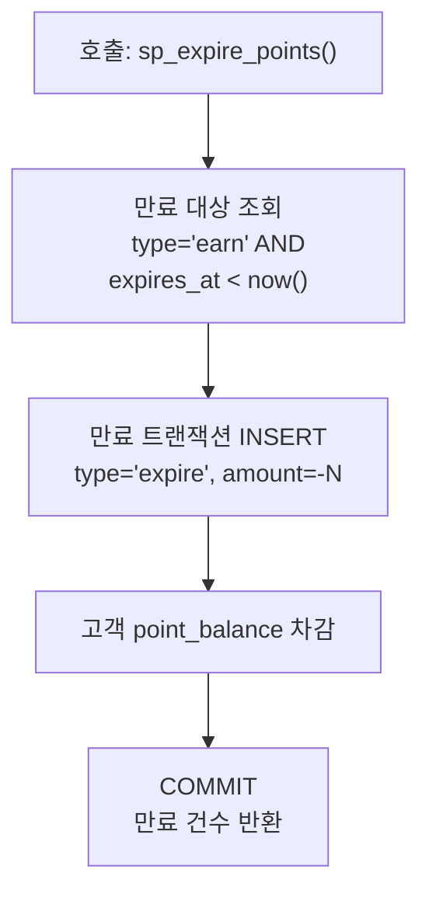

=== "MySQL"

    ```sql
    CREATE PROCEDURE sp_expire_points()
    BEGIN
        DECLARE v_now DATETIME DEFAULT NOW();
        DECLARE v_expired_count INT DEFAULT 0;
    
        DECLARE EXIT HANDLER FOR SQLEXCEPTION
        BEGIN
            ROLLBACK;
            RESIGNAL;
        END;
    
        START TRANSACTION;
    
        -- Find unexpired earn transactions past their expiry date
        -- and insert expiry records
        INSERT INTO point_transactions (customer_id, order_id, type, reason, amount, balance_after, expires_at, created_at)
        SELECT
            pt.customer_id,
            pt.order_id,
            'expire',
            'expiry',
            -pt.amount,
            c.point_balance - pt.amount,
            NULL,
            v_now
        FROM point_transactions pt
        JOIN customers c ON pt.customer_id = c.id
        WHERE pt.type = 'earn'
          AND pt.expires_at IS NOT NULL
          AND pt.expires_at < v_now
          AND NOT EXISTS (
              SELECT 1 FROM point_transactions e
              WHERE e.customer_id = pt.customer_id
                AND e.type = 'expire'
                AND e.order_id = pt.order_id
          );
    
        SET v_expired_count = ROW_COUNT();
    
        -- Update customer balances
        UPDATE customers c
        SET c.point_balance = GREATEST(0, c.point_balance - (
            SELECT COALESCE(SUM(pt.amount), 0)
            FROM point_transactions pt
            WHERE pt.customer_id = c.id
              AND pt.type = 'earn'
              AND pt.expires_at IS NOT NULL
              AND pt.expires_at < v_now
              AND NOT EXISTS (
                  SELECT 1 FROM point_transactions e
                  WHERE e.customer_id = pt.customer_id
                    AND e.type = 'expire'
                    AND e.order_id = pt.order_id
                    AND e.created_at < v_now
              )
        ))
        WHERE c.point_balance > 0;
    
        COMMIT;
    
        SELECT v_expired_count AS expired_transactions;
    END
    ```

=== "PostgreSQL"

    ```sql
    CREATE OR REPLACE FUNCTION sp_expire_points()
    RETURNS INT AS $$
    DECLARE
        v_now TIMESTAMP := NOW();
        v_expired_count INT := 0;
    BEGIN
        -- Insert expiry records for earn transactions past their expiry date
        WITH expired AS (
            INSERT INTO point_transactions (customer_id, order_id, type, reason, amount, balance_after, expires_at, created_at)
            SELECT
                pt.customer_id,
                pt.order_id,
                'expire',
                'expiry',
                -pt.amount,
                c.point_balance - pt.amount,
                NULL,
                v_now
            FROM point_transactions pt
            JOIN customers c ON pt.customer_id = c.id
            WHERE pt.type = 'earn'
              AND pt.expires_at IS NOT NULL
              AND pt.expires_at < v_now
              AND NOT EXISTS (
                  SELECT 1 FROM point_transactions e
                  WHERE e.customer_id = pt.customer_id
                    AND e.type = 'expire'
                    AND e.order_id = pt.order_id
              )
            RETURNING customer_id, amount
        )
        SELECT COUNT(*) INTO v_expired_count FROM expired;
    
        -- Update customer balances
        UPDATE customers c
        SET point_balance = GREATEST(0, c.point_balance - COALESCE(exp.total_expired, 0))
        FROM (
            SELECT pt.customer_id, SUM(pt.amount) AS total_expired
            FROM point_transactions pt
            WHERE pt.type = 'earn'
              AND pt.expires_at IS NOT NULL
              AND pt.expires_at < v_now
            GROUP BY pt.customer_id
        ) exp
        WHERE c.id = exp.customer_id AND c.point_balance > 0;
    
        RETURN v_expired_count;
    END;
    $$ LANGUAGE plpgsql;
    ```

### sp_monthly_settlement — 월별 정산 리포트

지정 연/월의 주문 요약(매출, 취소, 반품, 평균 주문액)을 반환합니다.

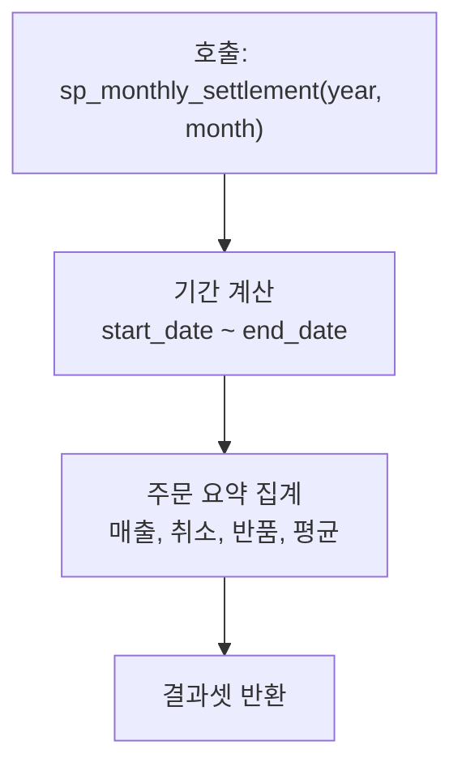

=== "MySQL"

    ```sql
    -- =============================================
    -- sp_monthly_settlement: Monthly sales summary report
    -- Parameters:
    --   p_year   - Report year
    --   p_month  - Report month
    -- =============================================
    CREATE PROCEDURE sp_monthly_settlement(
        IN p_year INT,
        IN p_month INT
    )
    BEGIN
        DECLARE v_start_date DATETIME;
        DECLARE v_end_date DATETIME;
    
        SET v_start_date = CONCAT(p_year, '-', LPAD(p_month, 2, '0'), '-01 00:00:00');
        SET v_end_date = DATE_ADD(v_start_date, INTERVAL 1 MONTH);
    
        -- Order summary
        SELECT
            COUNT(*) AS total_orders,
            COUNT(DISTINCT customer_id) AS unique_customers,
            SUM(CASE WHEN status NOT IN ('cancelled') THEN total_amount ELSE 0 END) AS gross_revenue,
            SUM(discount_amount) AS total_discounts,
            SUM(shipping_fee) AS total_shipping,
            SUM(CASE WHEN status = 'cancelled' THEN 1 ELSE 0 END) AS cancelled_orders,
            SUM(CASE WHEN status IN ('return_requested','returned') THEN 1 ELSE 0 END) AS returned_orders,
            ROUND(AVG(CASE WHEN status NOT IN ('cancelled') THEN total_amount END), 0) AS avg_order_value
        FROM orders
        WHERE ordered_at >= v_start_date AND ordered_at < v_end_date;
    
        -- Top 10 products by revenue
        SELECT
            p.id AS product_id,
            p.name AS product_name,
            p.brand,
            SUM(oi.quantity) AS total_qty,
            SUM(oi.subtotal) AS total_revenue
        FROM order_items oi
        JOIN orders o ON oi.order_id = o.id
        JOIN products p ON oi.product_id = p.id
        WHERE o.ordered_at >= v_start_date AND o.ordered_at < v_end_date
          AND o.status NOT IN ('cancelled')
        GROUP BY p.id
        ORDER BY total_revenue DESC
        LIMIT 10;
    
        -- Payment method breakdown
        SELECT
            pay.method,
            COUNT(*) AS count,
            SUM(pay.amount) AS total_amount,
            ROUND(COUNT(*) * 100.0 / (
                SELECT COUNT(*) FROM payments pay2
                JOIN orders o2 ON pay2.order_id = o2.id
                WHERE o2.ordered_at >= v_start_date AND o2.ordered_at < v_end_date
            ), 1) AS pct
        FROM payments pay
        JOIN orders o ON pay.order_id = o.id
        WHERE o.ordered_at >= v_start_date AND o.ordered_at < v_end_date
        GROUP BY pay.method
        ORDER BY total_amount DESC;
    END
    ```

=== "PostgreSQL"

    ```sql
    CREATE OR REPLACE FUNCTION sp_monthly_settlement(
        p_year INT,
        p_month INT
    ) RETURNS TABLE (
        total_orders BIGINT,
        unique_customers BIGINT,
        gross_revenue NUMERIC,
        total_discounts NUMERIC,
        total_shipping NUMERIC,
        cancelled_orders BIGINT,
        returned_orders BIGINT,
        avg_order_value NUMERIC
    ) AS $$
    DECLARE
        v_start_date TIMESTAMP;
        v_end_date TIMESTAMP;
    BEGIN
        v_start_date := make_timestamp(p_year, p_month, 1, 0, 0, 0);
        v_end_date := v_start_date + INTERVAL '1 month';
    
        RETURN QUERY
        SELECT
            COUNT(*)::BIGINT AS total_orders,
            COUNT(DISTINCT o.customer_id)::BIGINT AS unique_customers,
            SUM(CASE WHEN o.status != 'cancelled' THEN o.total_amount ELSE 0 END) AS gross_revenue,
            SUM(o.discount_amount) AS total_discounts,
            SUM(o.shipping_fee) AS total_shipping,
            SUM(CASE WHEN o.status = 'cancelled' THEN 1 ELSE 0 END)::BIGINT AS cancelled_orders,
            SUM(CASE WHEN o.status IN ('return_requested','returned') THEN 1 ELSE 0 END)::BIGINT AS returned_orders,
            ROUND(AVG(CASE WHEN o.status != 'cancelled' THEN o.total_amount END), 0) AS avg_order_value
        FROM orders o
        WHERE o.ordered_at >= v_start_date AND o.ordered_at < v_end_date;
    END;
    $$ LANGUAGE plpgsql;
    ```

### refresh_materialized_views — Materialized View 갱신

mv_monthly_sales, mv_product_performance를 CONCURRENTLY 갱신합니다.

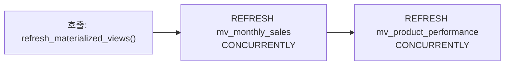

=== "PostgreSQL"

    ```sql
    CREATE OR REPLACE FUNCTION refresh_materialized_views()
    RETURNS VOID AS $$
    BEGIN
        REFRESH MATERIALIZED VIEW CONCURRENTLY mv_monthly_sales;
        REFRESH MATERIALIZED VIEW CONCURRENTLY mv_product_performance;
    END;
    $$ LANGUAGE plpgsql;
    ```


### sp_cancel_order — 주문 취소 및 재고 복원

주문을 취소하고 재고를 복원합니다. 결제 환불 처리, 사용된 포인트 반환, 주문 상태 전이를 트랜잭션으로 처리합니다.

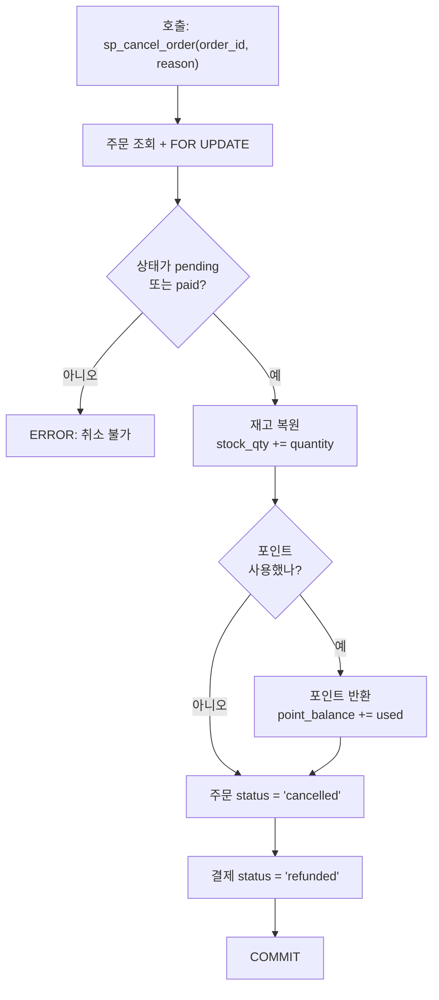

=== "MySQL"

    ```sql
    CREATE PROCEDURE sp_cancel_order(
        IN p_order_id INT,
        IN p_reason TEXT
    )
    BEGIN
        DECLARE v_status VARCHAR(30);
        DECLARE v_customer_id INT;
        DECLARE v_point_used INT;
        DECLARE v_now DATETIME DEFAULT NOW();
    
        DECLARE EXIT HANDLER FOR SQLEXCEPTION
        BEGIN
            ROLLBACK;
            RESIGNAL;
        END;
    
        START TRANSACTION;
    
        -- Verify order exists and is cancellable
        SELECT status, customer_id, point_used
        INTO v_status, v_customer_id, v_point_used
        FROM orders WHERE id = p_order_id FOR UPDATE;
    
        IF v_status IS NULL THEN
            SIGNAL SQLSTATE '45000' SET MESSAGE_TEXT = 'Order not found';
        END IF;
    
        IF v_status NOT IN ('pending', 'paid') THEN
            SIGNAL SQLSTATE '45000' SET MESSAGE_TEXT = 'Order cannot be cancelled in current status';
        END IF;
    
        -- Restore stock
        UPDATE products p
        JOIN order_items oi ON p.id = oi.product_id
        SET p.stock_qty = p.stock_qty + oi.quantity
        WHERE oi.order_id = p_order_id;
    
        -- Restore points if used
        IF v_point_used > 0 THEN
            UPDATE customers SET point_balance = point_balance + v_point_used
            WHERE id = v_customer_id;
    
            INSERT INTO point_transactions (customer_id, order_id, type, reason, amount, balance_after, created_at)
            SELECT v_customer_id, p_order_id, 'earn', 'purchase',
                   v_point_used,
                   point_balance,
                   v_now
            FROM customers WHERE id = v_customer_id;
        END IF;
    
        -- Update order status
        UPDATE orders
        SET status = 'cancelled', cancelled_at = v_now, updated_at = v_now,
            notes = CONCAT(COALESCE(notes, ''), '
    [Cancelled] ', p_reason)
        WHERE id = p_order_id;
    
        -- Refund payment
        UPDATE payments SET status = 'refunded', refunded_at = v_now
        WHERE order_id = p_order_id;
    
        COMMIT;
    
        SELECT p_order_id AS order_id, 'cancelled' AS new_status;
    END
    ```

=== "PostgreSQL"

    ```sql
    CREATE OR REPLACE FUNCTION sp_cancel_order(
        p_order_id INT,
        p_reason TEXT
    ) RETURNS TABLE (
        order_id INT,
        new_status VARCHAR
    ) AS $$
    DECLARE
        v_status VARCHAR(30);
        v_customer_id INT;
        v_point_used INT;
        v_now TIMESTAMP := NOW();
    BEGIN
        -- Verify order exists and is cancellable
        SELECT o.status, o.customer_id, o.point_used
        INTO v_status, v_customer_id, v_point_used
        FROM orders o WHERE o.id = p_order_id FOR UPDATE;
    
        IF v_status IS NULL THEN
            RAISE EXCEPTION 'Order not found';
        END IF;
    
        IF v_status NOT IN ('pending', 'paid') THEN
            RAISE EXCEPTION 'Order cannot be cancelled in current status: %', v_status;
        END IF;
    
        -- Restore stock
        UPDATE products pr
        SET stock_qty = pr.stock_qty + oi.quantity
        FROM order_items oi
        WHERE pr.id = oi.product_id AND oi.order_id = p_order_id;
    
        -- Restore points if used
        IF v_point_used > 0 THEN
            UPDATE customers SET point_balance = point_balance + v_point_used
            WHERE id = v_customer_id;
    
            INSERT INTO point_transactions (customer_id, order_id, type, reason, amount, balance_after, created_at)
            SELECT v_customer_id, p_order_id, 'earn', 'purchase',
                   v_point_used, cu.point_balance, v_now
            FROM customers cu WHERE cu.id = v_customer_id;
        END IF;
    
        -- Update order status
        UPDATE orders
        SET status = 'cancelled', cancelled_at = v_now, updated_at = v_now,
            notes = COALESCE(notes, '') || E'
    [Cancelled] ' || p_reason
        WHERE id = p_order_id;
    
        -- Refund payment
        UPDATE payments SET status = 'refunded', refunded_at = v_now
        WHERE payments.order_id = p_order_id;
    
        RETURN QUERY SELECT p_order_id, 'cancelled'::VARCHAR;
    END;
    $$ LANGUAGE plpgsql;
    ```

### sp_update_customer_grades — 고객 등급 재산정

최근 12개월 구매액 기준으로 고객 등급(BRONZE/SILVER/GOLD/VIP)을 재산정합니다. 변경된 등급은 `customer_grade_history`에 기록됩니다.

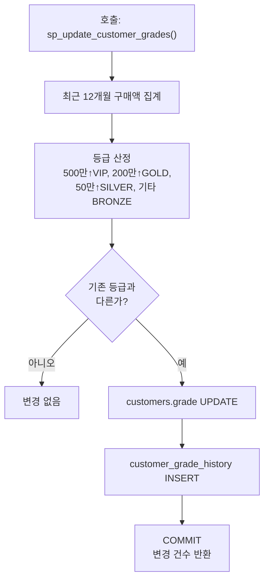

=== "MySQL"

    ```sql
    CREATE PROCEDURE sp_update_customer_grades()
    BEGIN
        DECLARE v_now DATETIME DEFAULT NOW();
        DECLARE v_updated INT DEFAULT 0;
    
        DECLARE EXIT HANDLER FOR SQLEXCEPTION
        BEGIN
            ROLLBACK;
            RESIGNAL;
        END;
    
        START TRANSACTION;
    
        -- Calculate new grade based on last 12 months spending
        CREATE TEMPORARY TABLE tmp_new_grades AS
        SELECT
            c.id AS customer_id,
            c.grade AS old_grade,
            CASE
                WHEN COALESCE(s.total_spent, 0) >= 5000000 THEN 'VIP'
                WHEN COALESCE(s.total_spent, 0) >= 2000000 THEN 'GOLD'
                WHEN COALESCE(s.total_spent, 0) >= 500000  THEN 'SILVER'
                ELSE 'BRONZE'
            END AS new_grade
        FROM customers c
        LEFT JOIN (
            SELECT customer_id, SUM(total_amount) AS total_spent
            FROM orders
            WHERE status NOT IN ('cancelled')
              AND ordered_at >= DATE_SUB(v_now, INTERVAL 12 MONTH)
            GROUP BY customer_id
        ) s ON c.id = s.customer_id
        WHERE c.is_active = TRUE;
    
        -- Update grades that changed
        UPDATE customers c
        JOIN tmp_new_grades t ON c.id = t.customer_id
        SET c.grade = t.new_grade, c.updated_at = v_now
        WHERE c.grade != t.new_grade;
    
        SET v_updated = ROW_COUNT();
    
        -- Record grade history
        INSERT INTO customer_grade_history (customer_id, old_grade, new_grade, changed_at, reason)
        SELECT customer_id, old_grade, new_grade, v_now, 'yearly_review'
        FROM tmp_new_grades
        WHERE old_grade != new_grade;
    
        DROP TEMPORARY TABLE tmp_new_grades;
    
        COMMIT;
    
        SELECT v_updated AS grades_updated;
    END
    ```

=== "PostgreSQL"

    ```sql
    CREATE OR REPLACE FUNCTION sp_update_customer_grades()
    RETURNS INT AS $$
    DECLARE
        v_now TIMESTAMP := NOW();
        v_updated INT := 0;
    BEGIN
        -- Update grades based on last 12 months spending
        WITH new_grades AS (
            SELECT
                c.id AS customer_id,
                c.grade AS old_grade,
                CASE
                    WHEN COALESCE(s.total_spent, 0) >= 5000000 THEN 'VIP'
                    WHEN COALESCE(s.total_spent, 0) >= 2000000 THEN 'GOLD'
                    WHEN COALESCE(s.total_spent, 0) >= 500000  THEN 'SILVER'
                    ELSE 'BRONZE'
                END AS new_grade
            FROM customers c
            LEFT JOIN (
                SELECT customer_id, SUM(total_amount) AS total_spent
                FROM orders
                WHERE status != 'cancelled'
                  AND ordered_at >= v_now - INTERVAL '12 months'
                GROUP BY customer_id
            ) s ON c.id = s.customer_id
            WHERE c.is_active = TRUE
        ),
        updated AS (
            UPDATE customers c
            SET grade = ng.new_grade::customer_grade, updated_at = v_now
            FROM new_grades ng
            WHERE c.id = ng.customer_id AND c.grade::TEXT != ng.new_grade
            RETURNING c.id, ng.old_grade, ng.new_grade
        ),
        history AS (
            INSERT INTO customer_grade_history (customer_id, old_grade, new_grade, changed_at, reason)
            SELECT id, old_grade::customer_grade, new_grade::customer_grade, v_now, 'yearly_review'
            FROM updated
            RETURNING 1
        )
        SELECT COUNT(*) INTO v_updated FROM updated;
    
        RETURN v_updated;
    END;
    $$ LANGUAGE plpgsql;
    ```

### sp_cleanup_abandoned_carts — 이탈 장바구니 정리

지정 일수보다 오래된 이탈(abandoned) 장바구니와 그 아이템을 삭제합니다. 정기 스케줄링용.

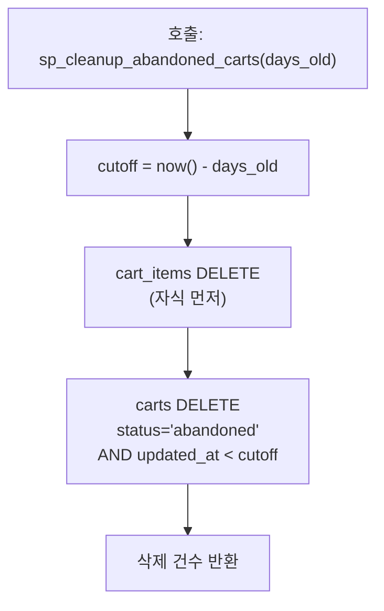

=== "MySQL"

    ```sql
    CREATE PROCEDURE sp_cleanup_abandoned_carts(
        IN p_days_old INT
    )
    BEGIN
        DECLARE v_deleted INT DEFAULT 0;
        DECLARE v_cutoff DATETIME;
    
        SET v_cutoff = DATE_SUB(NOW(), INTERVAL p_days_old DAY);
    
        -- Delete cart items first (FK)
        DELETE ci FROM cart_items ci
        JOIN carts c ON ci.cart_id = c.id
        WHERE c.status = 'abandoned' AND c.updated_at < v_cutoff;
    
        -- Delete abandoned carts
        DELETE FROM carts
        WHERE status = 'abandoned' AND updated_at < v_cutoff;
    
        SET v_deleted = ROW_COUNT();
    
        SELECT v_deleted AS carts_deleted, v_cutoff AS cutoff_date;
    END
    ```

=== "PostgreSQL"

    ```sql
    CREATE OR REPLACE FUNCTION sp_cleanup_abandoned_carts(
        p_days_old INT
    ) RETURNS TABLE (
        carts_deleted BIGINT,
        cutoff_date TIMESTAMP
    ) AS $$
    DECLARE
        v_cutoff TIMESTAMP := NOW() - (p_days_old || ' days')::INTERVAL;
        v_deleted BIGINT := 0;
    BEGIN
        -- Delete cart items first (FK)
        DELETE FROM cart_items ci
        USING carts c
        WHERE ci.cart_id = c.id
          AND c.status = 'abandoned' AND c.updated_at < v_cutoff;
    
        -- Delete abandoned carts
        WITH deleted AS (
            DELETE FROM carts
            WHERE status = 'abandoned' AND updated_at < v_cutoff
            RETURNING id
        )
        SELECT COUNT(*) INTO v_deleted FROM deleted;
    
        RETURN QUERY SELECT v_deleted, v_cutoff;
    END;
    $$ LANGUAGE plpgsql;
    ```

### sp_product_restock — 상품 입고 처리

상품 재고를 증가시키고 `inventory_transactions`에 입고 이력을 기록합니다. 수량 검증 포함.

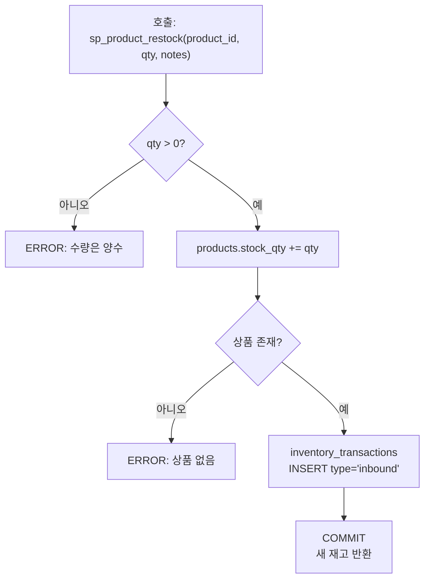

=== "MySQL"

    ```sql
    CREATE PROCEDURE sp_product_restock(
        IN p_product_id INT,
        IN p_quantity INT,
        IN p_notes VARCHAR(500)
    )
    BEGIN
        DECLARE v_now DATETIME DEFAULT NOW();
        DECLARE v_new_qty INT;
    
        DECLARE EXIT HANDLER FOR SQLEXCEPTION
        BEGIN
            ROLLBACK;
            RESIGNAL;
        END;
    
        IF p_quantity <= 0 THEN
            SIGNAL SQLSTATE '45000' SET MESSAGE_TEXT = 'Quantity must be positive';
        END IF;
    
        START TRANSACTION;
    
        -- Update stock
        UPDATE products
        SET stock_qty = stock_qty + p_quantity, updated_at = v_now
        WHERE id = p_product_id;
    
        IF ROW_COUNT() = 0 THEN
            SIGNAL SQLSTATE '45000' SET MESSAGE_TEXT = 'Product not found';
        END IF;
    
        SELECT stock_qty INTO v_new_qty FROM products WHERE id = p_product_id;
    
        -- Record inventory transaction
        INSERT INTO inventory_transactions (product_id, type, quantity, notes, created_at)
        VALUES (p_product_id, 'inbound', p_quantity, p_notes, v_now);
    
        COMMIT;
    
        SELECT p_product_id AS product_id, p_quantity AS added, v_new_qty AS new_stock_qty;
    END
    ```

=== "PostgreSQL"

    ```sql
    CREATE OR REPLACE FUNCTION sp_product_restock(
        p_product_id INT,
        p_quantity INT,
        p_notes VARCHAR DEFAULT NULL
    ) RETURNS TABLE (
        product_id INT,
        added INT,
        new_stock_qty INT
    ) AS $$
    DECLARE
        v_now TIMESTAMP := NOW();
        v_new_qty INT;
    BEGIN
        IF p_quantity <= 0 THEN
            RAISE EXCEPTION 'Quantity must be positive';
        END IF;
    
        -- Update stock
        UPDATE products
        SET stock_qty = stock_qty + p_quantity, updated_at = v_now
        WHERE id = p_product_id
        RETURNING products.stock_qty INTO v_new_qty;
    
        IF v_new_qty IS NULL THEN
            RAISE EXCEPTION 'Product not found';
        END IF;
    
        -- Record inventory transaction
        INSERT INTO inventory_transactions (product_id, type, quantity, notes, created_at)
        VALUES (p_product_id, 'inbound', p_quantity, p_notes, v_now);
    
        RETURN QUERY SELECT p_product_id, p_quantity, v_new_qty;
    END;
    $$ LANGUAGE plpgsql;
    ```

### sp_customer_statistics — 고객 통계 조회

특정 고객의 주문 수, 총 구매액, 평균 주문액, 마지막 주문 경과일을 반환합니다. MySQL은 OUT 파라미터, PostgreSQL은 RETURNS TABLE 패턴.

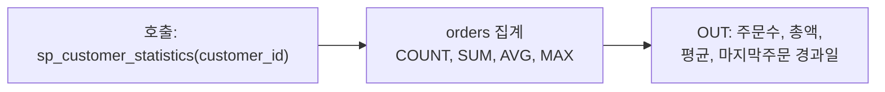

=== "MySQL"

    ```sql
    CREATE PROCEDURE sp_customer_statistics(
        IN  p_customer_id INT,
        OUT p_total_orders INT,
        OUT p_total_spent DECIMAL(12,2),
        OUT p_avg_order DECIMAL(12,2),
        OUT p_days_since_last INT
    )
    BEGIN
        SELECT
            COUNT(*),
            COALESCE(SUM(total_amount), 0),
            COALESCE(AVG(total_amount), 0),
            COALESCE(DATEDIFF(NOW(), MAX(ordered_at)), -1)
        INTO p_total_orders, p_total_spent, p_avg_order, p_days_since_last
        FROM orders
        WHERE customer_id = p_customer_id AND status != 'cancelled';
    END
    ```

=== "PostgreSQL"

    ```sql
    CREATE OR REPLACE FUNCTION sp_customer_statistics(
        p_customer_id INT
    ) RETURNS TABLE (
        total_orders BIGINT,
        total_spent NUMERIC,
        avg_order NUMERIC,
        days_since_last INT
    ) AS $$
    BEGIN
        RETURN QUERY
        SELECT
            COUNT(*)::BIGINT,
            COALESCE(SUM(o.total_amount), 0),
            COALESCE(AVG(o.total_amount), 0),
            COALESCE((NOW()::DATE - MAX(o.ordered_at)::DATE), -1)
        FROM orders o
        WHERE o.customer_id = p_customer_id AND o.status != 'cancelled';
    END;
    $$ LANGUAGE plpgsql;
    ```

### sp_daily_summary — 일별 KPI 요약

지정 날짜의 주문 요약(매출, 취소, 평균 주문액), 신규 고객 수, 리뷰 수를 반환합니다.

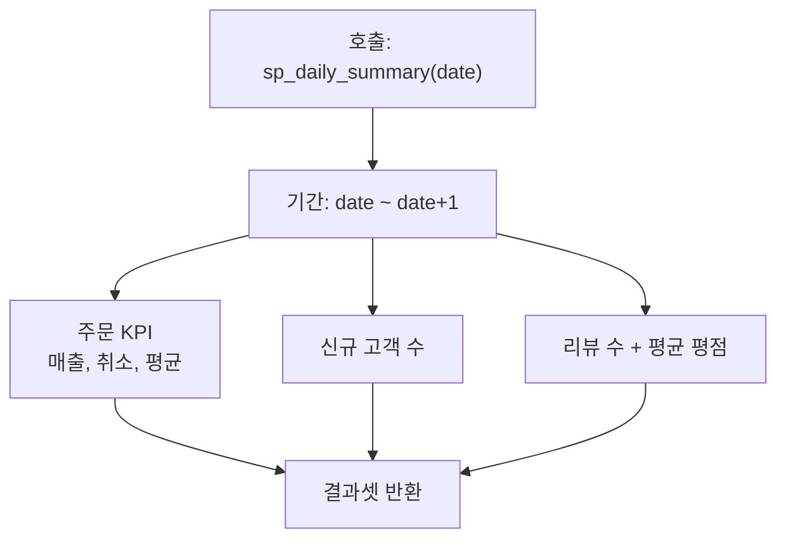

=== "MySQL"

    ```sql
    CREATE PROCEDURE sp_daily_summary(
        IN p_date DATE
    )
    BEGIN
        DECLARE v_start DATETIME;
        DECLARE v_end DATETIME;
    
        SET v_start = p_date;
        SET v_end = DATE_ADD(p_date, INTERVAL 1 DAY);
    
        -- Order KPIs
        SELECT
            p_date AS report_date,
            COUNT(*) AS total_orders,
            COUNT(DISTINCT customer_id) AS unique_customers,
            SUM(CASE WHEN status != 'cancelled' THEN total_amount ELSE 0 END) AS revenue,
            SUM(CASE WHEN status = 'cancelled' THEN 1 ELSE 0 END) AS cancellations,
            ROUND(AVG(CASE WHEN status != 'cancelled' THEN total_amount END), 0) AS avg_order_value
        FROM orders
        WHERE ordered_at >= v_start AND ordered_at < v_end;
    
        -- New signups
        SELECT COUNT(*) AS new_customers
        FROM customers
        WHERE created_at >= v_start AND created_at < v_end;
    
        -- Reviews posted
        SELECT COUNT(*) AS new_reviews, ROUND(AVG(rating), 1) AS avg_rating
        FROM reviews
        WHERE created_at >= v_start AND created_at < v_end;
    END
    ```

=== "PostgreSQL"

    ```sql
    CREATE OR REPLACE FUNCTION sp_daily_summary(
        p_date DATE
    ) RETURNS TABLE (
        report_date DATE,
        total_orders BIGINT,
        unique_customers BIGINT,
        revenue NUMERIC,
        cancellations BIGINT,
        avg_order_value NUMERIC,
        new_customers BIGINT,
        new_reviews BIGINT,
        avg_rating NUMERIC
    ) AS $$
    DECLARE
        v_start TIMESTAMP := p_date::TIMESTAMP;
        v_end TIMESTAMP := (p_date + 1)::TIMESTAMP;
    BEGIN
        RETURN QUERY
        SELECT
            p_date,
            (SELECT COUNT(*) FROM orders o WHERE o.ordered_at >= v_start AND o.ordered_at < v_end),
            (SELECT COUNT(DISTINCT o.customer_id) FROM orders o WHERE o.ordered_at >= v_start AND o.ordered_at < v_end),
            (SELECT COALESCE(SUM(CASE WHEN o.status != 'cancelled' THEN o.total_amount ELSE 0 END), 0) FROM orders o WHERE o.ordered_at >= v_start AND o.ordered_at < v_end),
            (SELECT COUNT(*) FROM orders o WHERE o.ordered_at >= v_start AND o.ordered_at < v_end AND o.status = 'cancelled'),
            (SELECT ROUND(COALESCE(AVG(CASE WHEN o.status != 'cancelled' THEN o.total_amount END), 0), 0) FROM orders o WHERE o.ordered_at >= v_start AND o.ordered_at < v_end),
            (SELECT COUNT(*) FROM customers cu WHERE cu.created_at >= v_start AND cu.created_at < v_end),
            (SELECT COUNT(*) FROM reviews rv WHERE rv.created_at >= v_start AND rv.created_at < v_end),
            (SELECT ROUND(COALESCE(AVG(rv.rating), 0), 1) FROM reviews rv WHERE rv.created_at >= v_start AND rv.created_at < v_end);
    END;
    $$ LANGUAGE plpgsql;
    ```


### sp_search_products — 상품 동적 검색

키워드, 카테고리, 가격 범위, 재고 여부 등 선택적 필터를 조합하여 상품을 검색합니다. 동적 SQL(PREPARE/EXECUTE)로 조건부 WHERE 절을 구성합니다.

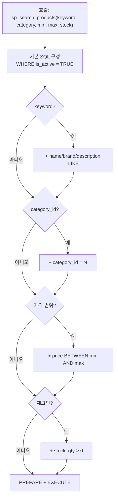

=== "MySQL"

    ```sql
    CREATE PROCEDURE sp_search_products(
        IN p_keyword VARCHAR(200),
        IN p_category_id INT,
        IN p_min_price DECIMAL(12,2),
        IN p_max_price DECIMAL(12,2),
        IN p_in_stock_only BOOLEAN
    )
    BEGIN
        SET @sql = 'SELECT p.id, p.name, p.brand, p.price, p.stock_qty, c.name AS category
                    FROM products p
                    JOIN categories c ON p.category_id = c.id
                    WHERE p.is_active = TRUE';
        SET @params = '';
    
        IF p_keyword IS NOT NULL AND p_keyword != '' THEN
            SET @sql = CONCAT(@sql, ' AND (p.name LIKE ? OR p.brand LIKE ? OR p.description LIKE ?)');
            SET @kw = CONCAT('%', p_keyword, '%');
        END IF;
    
        IF p_category_id IS NOT NULL THEN
            SET @sql = CONCAT(@sql, ' AND p.category_id = ', p_category_id);
        END IF;
    
        IF p_min_price IS NOT NULL THEN
            SET @sql = CONCAT(@sql, ' AND p.price >= ', p_min_price);
        END IF;
    
        IF p_max_price IS NOT NULL THEN
            SET @sql = CONCAT(@sql, ' AND p.price <= ', p_max_price);
        END IF;
    
        IF p_in_stock_only = TRUE THEN
            SET @sql = CONCAT(@sql, ' AND p.stock_qty > 0');
        END IF;
    
        SET @sql = CONCAT(@sql, ' ORDER BY p.name LIMIT 100');
    
        IF p_keyword IS NOT NULL AND p_keyword != '' THEN
            PREPARE stmt FROM @sql;
            EXECUTE stmt USING @kw, @kw, @kw;
            DEALLOCATE PREPARE stmt;
        ELSE
            PREPARE stmt FROM @sql;
            EXECUTE stmt;
            DEALLOCATE PREPARE stmt;
        END IF;
    END
    ```

=== "PostgreSQL"

    ```sql
    CREATE OR REPLACE FUNCTION sp_search_products(
        p_keyword VARCHAR DEFAULT NULL,
        p_category_id INT DEFAULT NULL,
        p_min_price NUMERIC DEFAULT NULL,
        p_max_price NUMERIC DEFAULT NULL,
        p_in_stock_only BOOLEAN DEFAULT FALSE
    ) RETURNS TABLE (
        id INT,
        name VARCHAR,
        brand VARCHAR,
        price NUMERIC,
        stock_qty INT,
        category VARCHAR
    ) AS $$
    DECLARE
        v_sql TEXT;
    BEGIN
        v_sql := 'SELECT p.id, p.name, p.brand, p.price, p.stock_qty, c.name AS category
                  FROM products p
                  JOIN categories c ON p.category_id = c.id
                  WHERE p.is_active = TRUE';
    
        IF p_keyword IS NOT NULL AND p_keyword != '' THEN
            v_sql := v_sql || ' AND (p.name ILIKE ''%' || replace(p_keyword, '''', '''''') || '%''
                               OR p.brand ILIKE ''%' || replace(p_keyword, '''', '''''') || '%''
                               OR p.description ILIKE ''%' || replace(p_keyword, '''', '''''') || '%'')';
        END IF;
    
        IF p_category_id IS NOT NULL THEN
            v_sql := v_sql || ' AND p.category_id = ' || p_category_id;
        END IF;
    
        IF p_min_price IS NOT NULL THEN
            v_sql := v_sql || ' AND p.price >= ' || p_min_price;
        END IF;
    
        IF p_max_price IS NOT NULL THEN
            v_sql := v_sql || ' AND p.price <= ' || p_max_price;
        END IF;
    
        IF p_in_stock_only THEN
            v_sql := v_sql || ' AND p.stock_qty > 0';
        END IF;
    
        v_sql := v_sql || ' ORDER BY p.name LIMIT 100';
    
        RETURN QUERY EXECUTE v_sql;
    END;
    $$ LANGUAGE plpgsql;
    ```

### sp_transfer_points — 포인트 이체

한 고객에서 다른 고객으로 포인트를 이체합니다. 동일 테이블의 두 행을 원자적으로 UPDATE하며, 데드락 방지를 위해 일관된 순서로 락을 획득합니다.

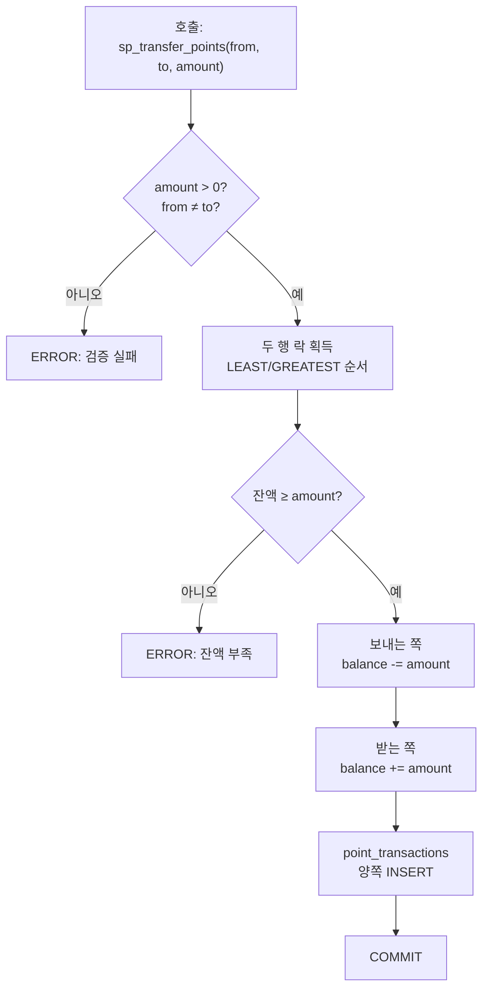

=== "MySQL"

    ```sql
    CREATE PROCEDURE sp_transfer_points(
        IN p_from_customer_id INT,
        IN p_to_customer_id INT,
        IN p_amount INT
    )
    BEGIN
        DECLARE v_from_balance INT;
        DECLARE v_to_balance INT;
        DECLARE v_now DATETIME DEFAULT NOW();
    
        DECLARE EXIT HANDLER FOR SQLEXCEPTION
        BEGIN
            ROLLBACK;
            RESIGNAL;
        END;
    
        IF p_amount <= 0 THEN
            SIGNAL SQLSTATE '45000' SET MESSAGE_TEXT = 'Transfer amount must be positive';
        END IF;
    
        IF p_from_customer_id = p_to_customer_id THEN
            SIGNAL SQLSTATE '45000' SET MESSAGE_TEXT = 'Cannot transfer to self';
        END IF;
    
        START TRANSACTION;
    
        -- Lock both rows in consistent order to prevent deadlock
        SELECT point_balance INTO v_from_balance
        FROM customers WHERE id = LEAST(p_from_customer_id, p_to_customer_id) FOR UPDATE;
        SELECT point_balance INTO v_to_balance
        FROM customers WHERE id = GREATEST(p_from_customer_id, p_to_customer_id) FOR UPDATE;
    
        -- Re-read actual balances
        SELECT point_balance INTO v_from_balance FROM customers WHERE id = p_from_customer_id;
    
        IF v_from_balance < p_amount THEN
            SIGNAL SQLSTATE '45000' SET MESSAGE_TEXT = 'Insufficient point balance';
        END IF;
    
        -- Deduct from sender
        UPDATE customers SET point_balance = point_balance - p_amount WHERE id = p_from_customer_id;
        INSERT INTO point_transactions (customer_id, type, reason, amount, balance_after, created_at)
        SELECT p_from_customer_id, 'use', 'purchase', -p_amount, point_balance, v_now
        FROM customers WHERE id = p_from_customer_id;
    
        -- Add to receiver
        UPDATE customers SET point_balance = point_balance + p_amount WHERE id = p_to_customer_id;
        INSERT INTO point_transactions (customer_id, type, reason, amount, balance_after, created_at)
        SELECT p_to_customer_id, 'earn', 'purchase', p_amount, point_balance, v_now
        FROM customers WHERE id = p_to_customer_id;
    
        COMMIT;
    
        SELECT p_from_customer_id AS from_id, p_to_customer_id AS to_id, p_amount AS transferred;
    END
    ```

=== "PostgreSQL"

    ```sql
    CREATE OR REPLACE FUNCTION sp_transfer_points(
        p_from_customer_id INT,
        p_to_customer_id INT,
        p_amount INT
    ) RETURNS TABLE (
        from_id INT,
        to_id INT,
        transferred INT
    ) AS $$
    DECLARE
        v_from_balance INT;
        v_now TIMESTAMP := NOW();
    BEGIN
        IF p_amount <= 0 THEN
            RAISE EXCEPTION 'Transfer amount must be positive';
        END IF;
    
        IF p_from_customer_id = p_to_customer_id THEN
            RAISE EXCEPTION 'Cannot transfer to self';
        END IF;
    
        -- Lock both rows in consistent order to prevent deadlock
        PERFORM 1 FROM customers WHERE id = LEAST(p_from_customer_id, p_to_customer_id) FOR UPDATE;
        PERFORM 1 FROM customers WHERE id = GREATEST(p_from_customer_id, p_to_customer_id) FOR UPDATE;
    
        SELECT point_balance INTO v_from_balance FROM customers WHERE id = p_from_customer_id;
    
        IF v_from_balance < p_amount THEN
            RAISE EXCEPTION 'Insufficient point balance: % < %', v_from_balance, p_amount;
        END IF;
    
        -- Deduct from sender
        UPDATE customers SET point_balance = point_balance - p_amount WHERE id = p_from_customer_id;
        INSERT INTO point_transactions (customer_id, type, reason, amount, balance_after, created_at)
        SELECT p_from_customer_id, 'use', 'purchase', -p_amount, cu.point_balance, v_now
        FROM customers cu WHERE cu.id = p_from_customer_id;
    
        -- Add to receiver
        UPDATE customers SET point_balance = point_balance + p_amount WHERE id = p_to_customer_id;
        INSERT INTO point_transactions (customer_id, type, reason, amount, balance_after, created_at)
        SELECT p_to_customer_id, 'earn', 'purchase', p_amount, cu.point_balance, v_now
        FROM customers cu WHERE cu.id = p_to_customer_id;
    
        RETURN QUERY SELECT p_from_customer_id, p_to_customer_id, p_amount;
    END;
    $$ LANGUAGE plpgsql;
    ```

### sp_generate_order_report — 주문 상세 리포트

커서(CURSOR)로 주문을 순회하며 건별 상세 정보(아이템 수, 최고가 상품)를 집계합니다. FETCH LOOP 패턴의 대표적 사용 사례입니다.

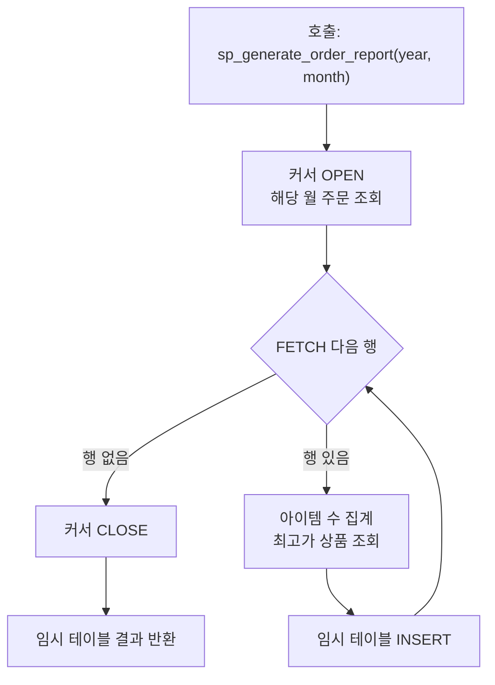

=== "MySQL"

    ```sql
    CREATE PROCEDURE sp_generate_order_report(
        IN p_year INT,
        IN p_month INT
    )
    BEGIN
        DECLARE v_order_id INT;
        DECLARE v_order_number VARCHAR(30);
        DECLARE v_total DECIMAL(12,2);
        DECLARE v_item_count INT;
        DECLARE v_done INT DEFAULT FALSE;
    
        DECLARE cur CURSOR FOR
            SELECT id, order_number, total_amount
            FROM orders
            WHERE YEAR(ordered_at) = p_year AND MONTH(ordered_at) = p_month
              AND status != 'cancelled'
            ORDER BY total_amount DESC;
    
        DECLARE CONTINUE HANDLER FOR NOT FOUND SET v_done = TRUE;
    
        -- Temp table for results
        DROP TEMPORARY TABLE IF EXISTS tmp_order_report;
        CREATE TEMPORARY TABLE tmp_order_report (
            order_number VARCHAR(30),
            total_amount DECIMAL(12,2),
            item_count INT,
            top_product VARCHAR(500)
        );
    
        OPEN cur;
    
        read_loop: LOOP
            FETCH cur INTO v_order_id, v_order_number, v_total;
            IF v_done THEN LEAVE read_loop; END IF;
    
            SELECT COUNT(*) INTO v_item_count FROM order_items WHERE order_id = v_order_id;
    
            INSERT INTO tmp_order_report
            SELECT v_order_number, v_total, v_item_count,
                   (SELECT p.name FROM order_items oi
                    JOIN products p ON oi.product_id = p.id
                    WHERE oi.order_id = v_order_id
                    ORDER BY oi.subtotal DESC LIMIT 1);
        END LOOP;
    
        CLOSE cur;
    
        SELECT * FROM tmp_order_report ORDER BY total_amount DESC;
        DROP TEMPORARY TABLE tmp_order_report;
    END
    ```

=== "PostgreSQL"

    ```sql
    CREATE OR REPLACE FUNCTION sp_generate_order_report(
        p_year INT,
        p_month INT
    ) RETURNS TABLE (
        order_number VARCHAR,
        total_amount NUMERIC,
        item_count BIGINT,
        top_product VARCHAR
    ) AS $$
    DECLARE
        v_rec RECORD;
        cur CURSOR FOR
            SELECT o.id, o.order_number, o.total_amount
            FROM orders o
            WHERE EXTRACT(YEAR FROM o.ordered_at) = p_year
              AND EXTRACT(MONTH FROM o.ordered_at) = p_month
              AND o.status != 'cancelled'
            ORDER BY o.total_amount DESC;
    BEGIN
        CREATE TEMP TABLE IF NOT EXISTS tmp_order_report (
            order_number VARCHAR(30),
            total_amount NUMERIC(12,2),
            item_count BIGINT,
            top_product VARCHAR(500)
        ) ON COMMIT DROP;
    
        TRUNCATE tmp_order_report;
    
        FOR v_rec IN cur LOOP
            INSERT INTO tmp_order_report
            SELECT v_rec.order_number, v_rec.total_amount,
                   (SELECT COUNT(*) FROM order_items oi WHERE oi.order_id = v_rec.id),
                   (SELECT p.name FROM order_items oi
                    JOIN products p ON oi.product_id = p.id
                    WHERE oi.order_id = v_rec.id
                    ORDER BY oi.subtotal DESC LIMIT 1);
        END LOOP;
    
        RETURN QUERY SELECT t.order_number, t.total_amount, t.item_count, t.top_product
        FROM tmp_order_report t ORDER BY t.total_amount DESC;
    END;
    $$ LANGUAGE plpgsql;
    ```

### sp_bulk_update_prices — 상품 가격 일괄 변경

JSON 배열로 여러 상품의 가격을 한 번에 변경합니다. MySQL은 `JSON_TABLE`, PostgreSQL은 `jsonb_to_recordset`을 사용합니다. 변경 전 가격은 이력 테이블에 자동 기록됩니다.

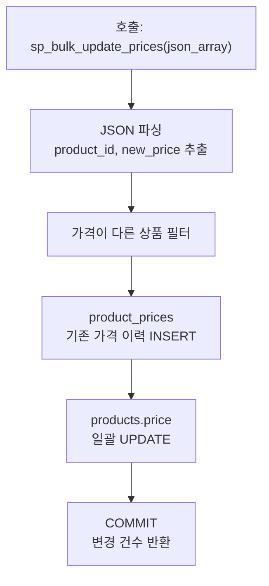

=== "MySQL"

    ```sql
    CREATE PROCEDURE sp_bulk_update_prices(
        IN p_price_json JSON
    )
    BEGIN
        DECLARE v_count INT DEFAULT 0;
        DECLARE v_now DATETIME DEFAULT NOW();
    
        DECLARE EXIT HANDLER FOR SQLEXCEPTION
        BEGIN
            ROLLBACK;
            RESIGNAL;
        END;
    
        START TRANSACTION;
    
        -- Record old prices in history
        INSERT INTO product_prices (product_id, price, started_at, ended_at, change_reason)
        SELECT p.id, p.price, p.updated_at, v_now, 'price_drop'
        FROM products p
        JOIN JSON_TABLE(p_price_json, '$[*]' COLUMNS (
            product_id INT PATH '$.product_id',
            new_price DECIMAL(12,2) PATH '$.new_price'
        )) j ON p.id = j.product_id
        WHERE p.price != j.new_price;
    
        -- Update prices
        UPDATE products p
        JOIN JSON_TABLE(p_price_json, '$[*]' COLUMNS (
            product_id INT PATH '$.product_id',
            new_price DECIMAL(12,2) PATH '$.new_price'
        )) j ON p.id = j.product_id
        SET p.price = j.new_price, p.updated_at = v_now
        WHERE p.price != j.new_price;
    
        SET v_count = ROW_COUNT();
    
        COMMIT;
    
        SELECT v_count AS products_updated;
    END
    ```

=== "PostgreSQL"

    ```sql
    CREATE OR REPLACE FUNCTION sp_bulk_update_prices(
        p_price_json JSONB
    ) RETURNS INT AS $$
    DECLARE
        v_count INT := 0;
        v_now TIMESTAMP := NOW();
    BEGIN
        -- Record old prices in history
        INSERT INTO product_prices (product_id, price, started_at, ended_at, change_reason)
        SELECT p.id, p.price, p.updated_at, v_now, 'price_drop'
        FROM products p
        JOIN jsonb_to_recordset(p_price_json) AS j(product_id INT, new_price NUMERIC)
          ON p.id = j.product_id
        WHERE p.price != j.new_price;
    
        -- Update prices
        UPDATE products p
        SET price = j.new_price, updated_at = v_now
        FROM jsonb_to_recordset(p_price_json) AS j(product_id INT, new_price NUMERIC)
        WHERE p.id = j.product_id AND p.price != j.new_price;
    
        GET DIAGNOSTICS v_count = ROW_COUNT;
        RETURN v_count;
    END;
    $$ LANGUAGE plpgsql;
    ```

### sp_archive_old_orders — 오래된 주문 아카이빙

지정 날짜 이전의 완료/반품 주문을 아카이빙합니다. 실무에서는 `INSERT INTO archive SELECT + DELETE` 패턴이지만, 튜토리얼에서는 노트 마킹으로 대체합니다.

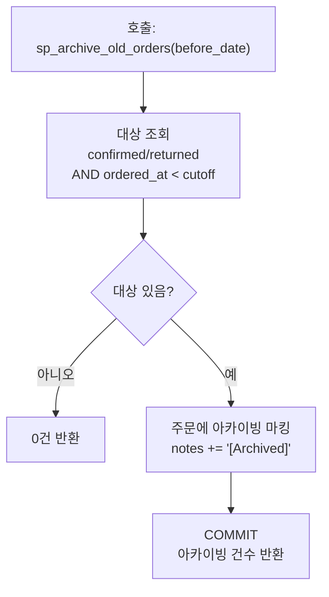

=== "MySQL"

    ```sql
    CREATE PROCEDURE sp_archive_old_orders(
        IN p_before_date DATE
    )
    BEGIN
        DECLARE v_archived INT DEFAULT 0;
        DECLARE v_now DATETIME DEFAULT NOW();
    
        DECLARE EXIT HANDLER FOR SQLEXCEPTION
        BEGIN
            ROLLBACK;
            RESIGNAL;
        END;
    
        START TRANSACTION;
    
        -- Count target orders
        SELECT COUNT(*) INTO v_archived
        FROM orders
        WHERE ordered_at < p_before_date
          AND status IN ('confirmed', 'returned');
    
        -- In a real system, INSERT INTO archive_orders SELECT ... would go here.
        -- For this tutorial, we mark them with a note instead of actually moving.
        UPDATE orders
        SET notes = CONCAT(COALESCE(notes, ''), '
    [Archived] ', v_now)
        WHERE ordered_at < p_before_date
          AND status IN ('confirmed', 'returned')
          AND (notes IS NULL OR notes NOT LIKE '%[Archived]%');
    
        SET v_archived = ROW_COUNT();
    
        COMMIT;
    
        SELECT v_archived AS orders_archived, p_before_date AS cutoff_date;
    END
    ```

=== "PostgreSQL"

    ```sql
    CREATE OR REPLACE FUNCTION sp_archive_old_orders(
        p_before_date DATE
    ) RETURNS TABLE (
        orders_archived BIGINT,
        cutoff_date DATE
    ) AS $$
    DECLARE
        v_archived BIGINT := 0;
        v_now TIMESTAMP := NOW();
    BEGIN
        -- In a real system, INSERT INTO archive_orders SELECT ... would go here.
        -- For this tutorial, we mark them with a note instead of actually moving.
        WITH archived AS (
            UPDATE orders
            SET notes = COALESCE(notes, '') || E'
    [Archived] ' || v_now::TEXT
            WHERE ordered_at < p_before_date
              AND status IN ('confirmed', 'returned')
              AND (notes IS NULL OR notes NOT LIKE '%[Archived]%')
            RETURNING id
        )
        SELECT COUNT(*) INTO v_archived FROM archived;
    
        RETURN QUERY SELECT v_archived, p_before_date;
    END;
    $$ LANGUAGE plpgsql;
    ```

