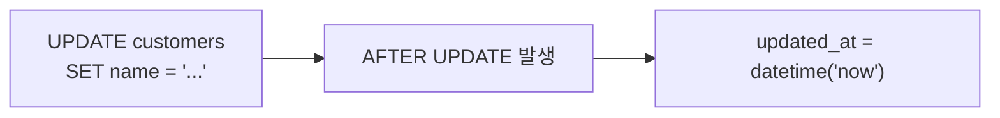
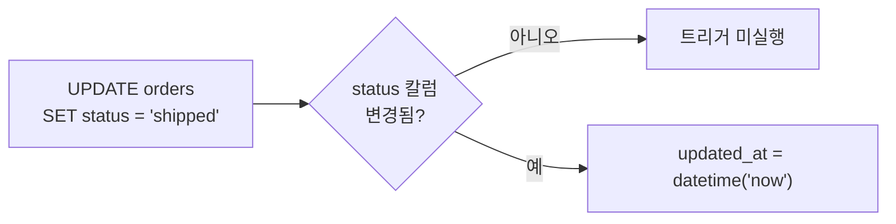
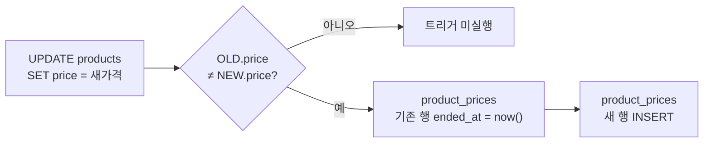
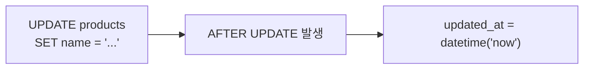
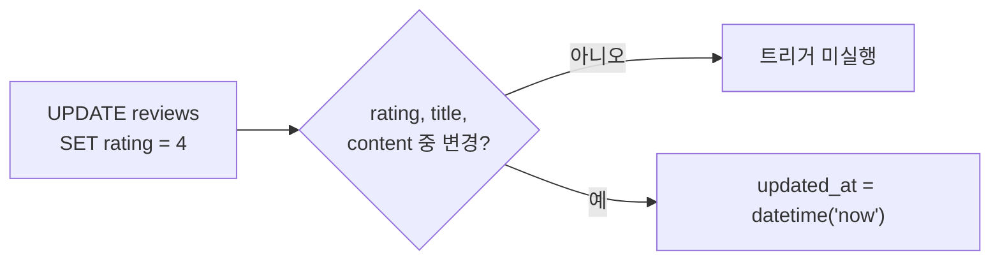

# 03. 트리거

## 트리거(Trigger)란?

트리거는 **데이터가 변경될 때 자동으로 실행되는 SQL 코드**입니다. INSERT, UPDATE, DELETE가 발생하면 미리 정의한 동작이 자동으로 수행됩니다. 사람이 직접 실행하지 않아도 됩니다.

**트리거를 사용하는 이유:**

- **자동화** — `updated_at` 타임스탬프를 매번 수동으로 갱신할 필요 없이, 데이터가 변경되면 자동으로 현재 시각이 기록됩니다
- **이력 관리** — 가격이 변경되면 이전 가격을 이력 테이블에 자동 저장하여, 가격 변동 추이를 추적할 수 있습니다
- **데이터 무결성** — 애플리케이션 코드에 의존하지 않고 DB 레벨에서 규칙을 강제합니다
- **투명성** — 어떤 경로로 데이터가 변경되든(SQL 도구, 애플리케이션, 스크립트) 동일한 규칙이 적용됩니다

트리거에 대한 상세 학습은 [23. 트리거](../advanced/23-triggers.md) 레슨에서 다룹니다.

## 트리거 목록

| 트리거 | 설명 |
|--------|------|
| trg_orders_updated_at | 주문 상태 변경 시 updated_at 자동 갱신 |
| trg_reviews_updated_at | 리뷰 수정 시 updated_at 자동 갱신 |
| trg_product_price_history | 상품 가격 변경 시 product_prices에 이력 자동 기록 |
| trg_products_updated_at | 상품 수정 시 updated_at 자동 갱신 |
| trg_customers_updated_at | 고객 정보 수정 시 updated_at 자동 갱신 |


!!! info "DB별 트리거 지원"
    이 튜토리얼의 트리거는 **SQLite에서만** 정의됩니다.

    MySQL과 PostgreSQL도 트리거 문법을 지원하지만, 이 프로젝트에서는 다음과 같은 이유로 포함하지 않았습니다:

    - **트리거 문법이 DB마다 크게 다름** — SQLite는 `BEGIN...END`, MySQL은 `DELIMITER` + `BEGIN...END`, PostgreSQL은 트리거 함수를 별도로 만든 뒤 `CREATE TRIGGER`에서 참조하는 구조. 동일한 로직이라도 코드가 완전히 달라짐
    - **데이터 생성기와의 충돌** — 트리거가 활성화된 상태에서 대량 INSERT를 하면 성능 저하와 의도치 않은 부작용(예: `updated_at` 덮어쓰기, 가격 이력 중복 삽입)이 발생
    - **애플리케이션/프로시저에서 명시적 처리** — MySQL/PostgreSQL에서는 `updated_at` 갱신이나 이력 기록을 트리거 대신 애플리케이션 코드나 저장 프로시저에서 직접 처리하는 것이 실무에서도 일반적. 이 프로젝트의 저장 프로시저(`sp_place_order` 등)는 트리거와 다른 비즈니스 로직(주문 생성, 포인트 만료 등)을 담당

    트리거 문법의 DB별 차이는 [23. 트리거](../advanced/23-triggers.md) 레슨에서 상세히 다룹니다.


### trg_customers_updated_at — 고객 updated_at 자동 갱신

고객 정보가 수정되면 `updated_at`을 현재 시각으로 자동 갱신합니다.



=== "SQLite"

    ```sql
    CREATE TRIGGER trg_customers_updated_at
    AFTER UPDATE ON customers
    BEGIN
        UPDATE customers SET updated_at = datetime('now') WHERE id = NEW.id;
    END
    ```

### trg_orders_updated_at — 주문 updated_at 자동 갱신

주문 상태(`status`)가 변경되면 `updated_at`을 현재 시각으로 자동 갱신합니다.



=== "SQLite"

    ```sql
    CREATE TRIGGER trg_orders_updated_at
    AFTER UPDATE OF status ON orders
    BEGIN
        UPDATE orders SET updated_at = datetime('now') WHERE id = NEW.id;
    END
    ```

### trg_product_price_history — 가격 변경 이력 자동 기록

상품 가격이 변경되면 기존 이력의 `ended_at`을 닫고, 새 가격을 `product_prices`에 자동 삽입합니다.



=== "SQLite"

    ```sql
    CREATE TRIGGER trg_product_price_history
    AFTER UPDATE OF price ON products
    WHEN OLD.price != NEW.price
    BEGIN
        -- Close existing history record
        UPDATE product_prices
        SET ended_at = datetime('now')
        WHERE product_id = NEW.id AND ended_at IS NULL;

        -- Insert new history record
        INSERT INTO product_prices (product_id, price, started_at, ended_at, change_reason)
        VALUES (NEW.id, NEW.price, datetime('now'), NULL, 'price_update');
    END
    ```

### trg_products_updated_at — 상품 updated_at 자동 갱신

상품 정보가 수정되면 `updated_at`을 현재 시각으로 자동 갱신합니다.



=== "SQLite"

    ```sql
    CREATE TRIGGER trg_products_updated_at
    AFTER UPDATE ON products
    BEGIN
        UPDATE products SET updated_at = datetime('now') WHERE id = NEW.id;
    END
    ```

### trg_reviews_updated_at — 리뷰 updated_at 자동 갱신

리뷰의 `rating`, `title`, `content`가 수정되면 `updated_at`을 현재 시각으로 자동 갱신합니다.



=== "SQLite"

    ```sql
    CREATE TRIGGER trg_reviews_updated_at
    AFTER UPDATE OF rating, title, content ON reviews
    BEGIN
        UPDATE reviews SET updated_at = datetime('now') WHERE id = NEW.id;
    END
    ```


