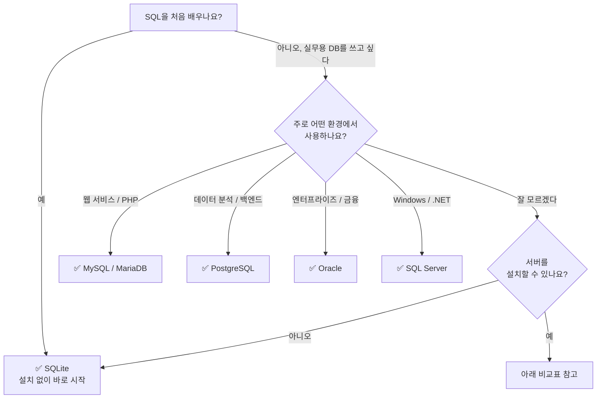

# 01. 데이터베이스 선택

이 튜토리얼은 **SQLite, MySQL, PostgreSQL, Oracle, SQL Server** 다섯 가지 데이터베이스를 지원합니다. 모든 레슨과 연습 문제에 DB별 탭이 제공되므로, 어떤 DB를 선택해도 동일한 내용을 학습할 수 있습니다.

**지금 당장 하나만 고르세요.** 나중에 다른 DB로 같은 쿼리를 실행해보면 DB별 차이를 자연스럽게 익힐 수 있습니다.

## 어떤 DB를 선택할까?

## 한눈에 비교

| | SQLite | MySQL / MariaDB | PostgreSQL | Oracle | SQL Server |
|-|--------|----------------|------------|--------|------------|
| **난이도** | 매우 쉬움 | 보통 | 보통 | 어려움 | 보통 |
| **설치** | 불필요 (파일 기반) | 서버 설치 필요 | 서버 설치 필요 | 서버 설치 필요 | 서버 설치 필요 |
| **적합한 용도** | 학습, 임베디드, 모바일 | 웹 서비스, CRUD 앱 | 분석, 복잡한 쿼리, GIS | 엔터프라이즈, 금융, 공공 | Windows, .NET, Azure |
| **SQL 표준** | 대부분 지원 | 일부 미지원 | 최고 수준 | 높음 (고유 확장 많음) | 높음 (T-SQL 확장) |
| **저장 프로시저** | 미지원 | 지원 | 지원 | PL/SQL | T-SQL |
| **JSON** | 기본 함수 | JSON 타입 | JSONB (고성능) | JSON (21c+) | JSON (2016+) |

각 DB의 상세한 장단점은 [교재 소개 > 지원 데이터베이스](../index.md#supported-databases)를 참고하세요.

## 추천 정리

| 상황 | 추천 DB | 이유 |
|------|:------:|------|
| SQL이 처음이다 | **SQLite** | 설치 없이 파일 하나로 바로 시작 |
| 웹 개발을 하고 있다 | **MySQL** | PHP, WordPress, 웹 호스팅 생태계 표준 |
| 데이터 분석·백엔드를 한다 | **PostgreSQL** | SQL 표준 최고 준수, JSONB, 윈도우 함수 |
| 엔터프라이즈·금융 시스템이다 | **Oracle** | PL/SQL, 대규모 트랜잭션, 고가용성 |
| Windows·.NET 환경이다 | **SQL Server** | SSMS, Azure 통합, T-SQL |
| 모바일·데스크톱 앱을 개발한다 | **SQLite** | 임베디드 DB의 사실상 표준 |
| 잘 모르겠다 | **SQLite** | 가장 쉽고, 나중에 확장하면 됨 |

[← 00. 프로젝트 다운로드](00-install.md){ .md-button }
[02. 데이터베이스 설치 →](02-database.md){ .md-button .md-button--primary }
